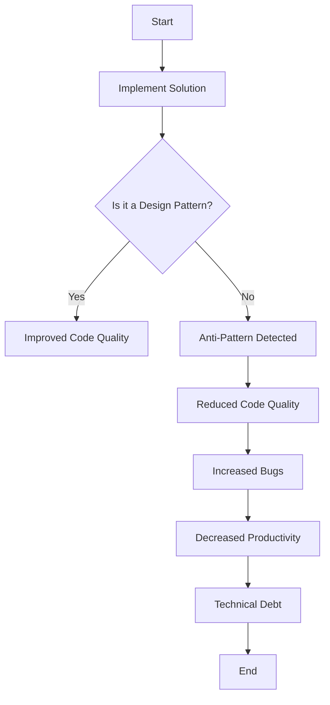

## 9.1 Understanding Anti-Patterns

In the realm of software development, the term "anti-pattern" is often used to describe a common response to a recurring problem that is usually ineffective and risks being highly counterproductive. While design patterns provide developers with proven solutions to common problems, anti-patterns represent the opposite—they are pitfalls that developers should strive to avoid. In this section, we will delve into the concept of anti-patterns, explore their origins, and understand their impact on software projects.

### What Are Anti-Patterns?

Anti-patterns are essentially poor solutions to recurring problems. They are the software development equivalent of bad habits—easy to fall into, difficult to break, and often leading to negative consequences. Unlike design patterns, which are established best practices, anti-patterns are recognized as ineffective or harmful practices that can lead to suboptimal or even disastrous outcomes.

#### Defining Anti-Patterns

An anti-pattern can be defined as a common but ineffective solution to a problem that often results in negative consequences. These patterns emerge when developers, perhaps due to lack of experience or understanding, implement solutions that seem reasonable at first but ultimately lead to more problems than they solve.

### How Anti-Patterns Differ from Design Patterns

While design patterns are like well-trodden paths that lead to effective solutions, anti-patterns are the misleading trails that seem promising but lead to dead ends. Here are some key differences:

- **Purpose**: Design patterns aim to provide reliable solutions to common problems, whereas anti-patterns are ineffective solutions that should be avoided.
- **Outcome**: Design patterns enhance code quality and maintainability, while anti-patterns degrade them.
- **Recognition**: Design patterns are widely recognized and documented as best practices, whereas anti-patterns are identified as practices to avoid.

### Why Do Anti-Patterns Emerge?

Anti-patterns often emerge due to a combination of factors, including:

- **Lack of Experience**: Inexperienced developers may not be aware of best practices and thus fall into anti-patterns.
- **Pressure and Deadlines**: Tight deadlines can lead to hasty decisions, resulting in quick fixes that become anti-patterns.
- **Miscommunication**: Poor communication within a team can lead to misunderstandings and the adoption of anti-patterns.
- **Complexity**: As software systems grow in complexity, developers may resort to anti-patterns as a means of managing that complexity, albeit ineffectively.

### Common Causes of Anti-Patterns

Understanding the root causes of anti-patterns can help developers avoid them. Some common causes include:

- **Overengineering**: Adding unnecessary complexity to a solution, often in an attempt to future-proof it.
- **Copy-Paste Programming**: Reusing code without understanding its context or implications.
- **Lack of Refactoring**: Allowing code to become cluttered and difficult to maintain over time.
- **Ignoring Feedback**: Failing to incorporate feedback from code reviews or testing can lead to entrenched anti-patterns.

### Consequences of Anti-Patterns

The presence of anti-patterns in a codebase can have several negative consequences:

- **Reduced Code Quality**: Anti-patterns often lead to code that is difficult to read, understand, and maintain.
- **Increased Bugs and Errors**: Poorly designed solutions are more prone to bugs and errors.
- **Decreased Productivity**: Developers may spend more time fixing issues caused by anti-patterns rather than building new features.
- **Technical Debt**: Anti-patterns contribute to technical debt, making future changes more costly and time-consuming.

### The Value of Recognizing and Avoiding Anti-Patterns

Recognizing and avoiding anti-patterns is crucial for maintaining a high-quality codebase. By understanding what constitutes an anti-pattern, developers can:

- **Improve Code Quality**: Avoiding anti-patterns leads to cleaner, more maintainable code.
- **Enhance Team Productivity**: Teams can work more efficiently when they are not bogged down by the consequences of anti-patterns.
- **Facilitate Better Communication**: A shared understanding of anti-patterns can improve communication and collaboration within a team.
- **Reduce Technical Debt**: By avoiding anti-patterns, teams can minimize technical debt and ensure that their codebase remains agile and adaptable.

### Code Examples of Common Anti-Patterns

Let's explore some common anti-patterns with code examples to illustrate their pitfalls.

#### 1. Spaghetti Code

Spaghetti code is characterized by a lack of structure and organization, making it difficult to understand and maintain.

```javascript
// Example of spaghetti code
function processOrder(order) {
    if (order.status === 'new') {
        // Process new order
        console.log('Processing new order');
        // ... more code ...
    } else if (order.status === 'pending') {
        // Process pending order
        console.log('Processing pending order');
        // ... more code ...
    } else if (order.status === 'completed') {
        // Process completed order
        console.log('Order already completed');
        // ... more code ...
    }
    // Additional logic scattered throughout
}
```

**Solution**: Refactor the code to use a more structured approach, such as the Strategy Pattern.

#### 2. God Object

A God Object is an object that knows too much or does too much, violating the Single Responsibility Principle.

```typescript
// Example of a God Object
class OrderManager {
    createOrder() { /* ... */ }
    updateOrder() { /* ... */ }
    deleteOrder() { /* ... */ }
    processPayment() { /* ... */ }
    sendNotification() { /* ... */ }
    generateReport() { /* ... */ }
}
```

**Solution**: Break down the God Object into smaller, more focused classes.

#### 3. Copy-Paste Programming

Copy-paste programming involves duplicating code without understanding its context, leading to redundancy and maintenance challenges.

```javascript
// Example of copy-paste programming
function calculateDiscount(price) {
    return price * 0.1;
}

function calculateTax(price) {
    return price * 0.2;
}

// Duplicated logic
function calculateTotal(price) {
    const discount = price * 0.1;
    const tax = price * 0.2;
    return price - discount + tax;
}
```

**Solution**: Extract common logic into reusable functions.

### Visualizing Anti-Patterns

To better understand the concept of anti-patterns, let's visualize how they can negatively impact a codebase.



**Diagram Description**: This flowchart illustrates the impact of implementing an anti-pattern versus a design pattern. While design patterns lead to improved code quality, anti-patterns result in reduced code quality, increased bugs, decreased productivity, and technical debt.

### Try It Yourself

To gain a deeper understanding of anti-patterns, try refactoring the code examples provided. Consider how you might apply design patterns to improve the code structure and readability. Experiment with different approaches and observe how they affect the overall quality of the code.

### References and Links

For further reading on anti-patterns and best practices in software development, consider exploring the following resources:

- [Refactoring: Improving the Design of Existing Code](https://martinfowler.com/books/refactoring.html) by Martin Fowler
- [Design Patterns: Elements of Reusable Object-Oriented Software](https://www.amazon.com/Design-Patterns-Elements-Reusable-Object-Oriented/dp/0201633612) by Erich Gamma et al.
- [MDN Web Docs on JavaScript](https://developer.mozilla.org/en-US/docs/Web/JavaScript)
- [TypeScript Handbook](https://www.typescriptlang.org/docs/handbook/intro.html)

### Knowledge Check

Before we conclude, let's pose a few questions to reinforce your understanding of anti-patterns:

1. What is an anti-pattern, and how does it differ from a design pattern?
2. Why do anti-patterns emerge in software development?
3. What are some common consequences of anti-patterns on a codebase?
4. How can recognizing and avoiding anti-patterns improve team productivity?
5. What are some strategies for refactoring code to eliminate anti-patterns?

### Embrace the Journey

Remember, understanding anti-patterns is just as important as knowing design patterns. By recognizing and avoiding these pitfalls, you can become a more effective developer and contribute to building high-quality, maintainable software. Keep learning, stay curious, and enjoy the journey of continuous improvement in your coding practices!

## Quiz Time!



### What is an anti-pattern?

- [x] A common but ineffective solution to a recurring problem
- [ ] A proven solution to a common problem
- [ ] A design pattern used in software development
- [ ] A type of algorithm

> **Explanation:** An anti-pattern is a common but ineffective solution to a recurring problem, often leading to negative consequences.

### How do anti-patterns differ from design patterns?

- [x] Anti-patterns are ineffective solutions, while design patterns are effective
- [ ] Anti-patterns are effective solutions, while design patterns are ineffective
- [ ] Both are effective solutions to common problems
- [ ] Both are ineffective solutions to common problems

> **Explanation:** Anti-patterns are ineffective solutions that should be avoided, whereas design patterns are effective solutions that enhance code quality.

### Why do anti-patterns emerge?

- [x] Lack of experience and tight deadlines
- [ ] Abundance of resources and time
- [ ] High levels of expertise and collaboration
- [ ] Effective communication within teams

> **Explanation:** Anti-patterns often emerge due to a lack of experience, tight deadlines, and miscommunication within teams.

### What is a common consequence of anti-patterns?

- [x] Reduced code quality
- [ ] Improved code quality
- [ ] Increased team productivity
- [ ] Decreased technical debt

> **Explanation:** Anti-patterns often lead to reduced code quality, increased bugs, and decreased productivity.

### How can recognizing anti-patterns improve team productivity?

- [x] By avoiding pitfalls that lead to inefficiencies
- [ ] By encouraging the use of ineffective solutions
- [ ] By increasing the complexity of the codebase
- [ ] By promoting the use of God Objects

> **Explanation:** Recognizing anti-patterns helps teams avoid pitfalls that lead to inefficiencies, thereby improving productivity.

### What is a God Object?

- [x] An object that knows too much or does too much
- [ ] An object with a single responsibility
- [ ] An object that follows the SOLID principles
- [ ] An object that enhances code quality

> **Explanation:** A God Object is an object that knows too much or does too much, violating the Single Responsibility Principle.

### How can you refactor spaghetti code?

- [x] By using a more structured approach, such as the Strategy Pattern
- [ ] By adding more conditional statements
- [ ] By increasing the complexity of the code
- [ ] By duplicating code across functions

> **Explanation:** Refactoring spaghetti code involves using a more structured approach, such as applying design patterns like the Strategy Pattern.

### What is copy-paste programming?

- [x] Duplicating code without understanding its context
- [ ] Writing code from scratch
- [ ] Using design patterns effectively
- [ ] Refactoring code for maintainability

> **Explanation:** Copy-paste programming involves duplicating code without understanding its context, leading to redundancy and maintenance challenges.

### What is the impact of anti-patterns on technical debt?

- [x] Anti-patterns increase technical debt
- [ ] Anti-patterns decrease technical debt
- [ ] Anti-patterns have no impact on technical debt
- [ ] Anti-patterns eliminate technical debt

> **Explanation:** Anti-patterns contribute to technical debt, making future changes more costly and time-consuming.

### True or False: Anti-patterns are recognized as best practices in software development.

- [ ] True
- [x] False

> **Explanation:** False. Anti-patterns are recognized as ineffective practices that should be avoided in software development.


