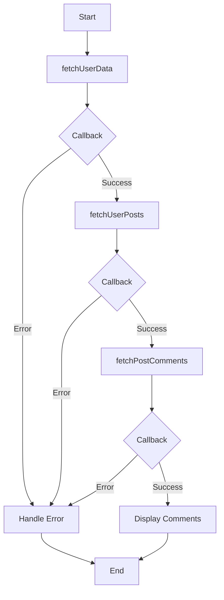

## 9.2.1 Callback Hell

In the world of JavaScript and TypeScript, asynchronous programming is a cornerstone for building responsive and efficient applications. However, managing asynchronous operations can sometimes lead to a notorious anti-pattern known as "Callback Hell." This section delves into what Callback Hell is, how it occurs, and the challenges it presents. We will also explore solutions such as Promises, async/await, and modularization to overcome this issue, along with refactored code examples to demonstrate these solutions.

### Understanding Callback Hell

Callback Hell, often humorously referred to as the "Pyramid of Doom," is a situation where multiple nested callback functions make the code difficult to read and maintain. It typically occurs when dealing with asynchronous operations that depend on the results of previous operations. As each asynchronous task is completed, the next task is executed within the callback of the previous one, leading to deeply nested and convoluted code structures.

#### How Callback Hell Occurs

Let's consider a simple example where we need to perform a series of asynchronous operations: fetching user data, retrieving user posts, and then fetching comments for each post. Using callbacks, the code might look something like this:

```javascript
function fetchUserData(userId, callback) {
    setTimeout(() => {
        console.log('User data fetched');
        callback(null, { userId, name: 'John Doe' });
    }, 1000);
}

function fetchUserPosts(userId, callback) {
    setTimeout(() => {
        console.log('User posts fetched');
        callback(null, [{ postId: 1, content: 'Hello World' }]);
    }, 1000);
}

function fetchPostComments(postId, callback) {
    setTimeout(() => {
        console.log('Post comments fetched');
        callback(null, [{ commentId: 1, text: 'Nice post!' }]);
    }, 1000);
}

fetchUserData(1, (err, user) => {
    if (err) return console.error(err);
    fetchUserPosts(user.userId, (err, posts) => {
        if (err) return console.error(err);
        fetchPostComments(posts[0].postId, (err, comments) => {
            if (err) return console.error(err);
            console.log('Comments:', comments);
        });
    });
});
```

In this example, each asynchronous function relies on the result of the previous one, leading to a nested structure that becomes increasingly difficult to manage as more operations are added.

### Challenges of Callback Hell

Callback Hell poses several challenges, including:

1. **Readability**: Deeply nested callbacks make it hard to follow the flow of the program, especially for new developers or when revisiting the code after some time.

2. **Maintainability**: Modifying or extending the code becomes cumbersome as each change might require restructuring the nested callbacks.

3. **Error Handling**: Managing errors in a callback-heavy codebase is complex, as each callback must handle potential errors, leading to repetitive and scattered error handling logic.

4. **Testing and Debugging**: Debugging nested callbacks is challenging due to the intertwined logic and the difficulty in tracing the execution flow.

### Solutions to Callback Hell

To address the issues posed by Callback Hell, several strategies can be employed:

#### 1. Promises

Promises provide a cleaner way to handle asynchronous operations by allowing chaining of operations and separating success and error handling. Here's how the previous example can be refactored using Promises:

```javascript
function fetchUserData(userId) {
    return new Promise((resolve, reject) => {
        setTimeout(() => {
            console.log('User data fetched');
            resolve({ userId, name: 'John Doe' });
        }, 1000);
    });
}

function fetchUserPosts(userId) {
    return new Promise((resolve, reject) => {
        setTimeout(() => {
            console.log('User posts fetched');
            resolve([{ postId: 1, content: 'Hello World' }]);
        }, 1000);
    });
}

function fetchPostComments(postId) {
    return new Promise((resolve, reject) => {
        setTimeout(() => {
            console.log('Post comments fetched');
            resolve([{ commentId: 1, text: 'Nice post!' }]);
        }, 1000);
    });
}

fetchUserData(1)
    .then(user => fetchUserPosts(user.userId))
    .then(posts => fetchPostComments(posts[0].postId))
    .then(comments => console.log('Comments:', comments))
    .catch(err => console.error(err));
```

In this refactored code, Promises allow us to chain operations, making the code more readable and maintainable. Error handling is centralized with the `.catch()` method.

#### 2. Async/Await

Async/await, introduced in ECMAScript 2017, further simplifies asynchronous code by allowing it to be written in a synchronous style. Here's how our example can be refactored using async/await:

```javascript
async function fetchData() {
    try {
        const user = await fetchUserData(1);
        const posts = await fetchUserPosts(user.userId);
        const comments = await fetchPostComments(posts[0].postId);
        console.log('Comments:', comments);
    } catch (err) {
        console.error(err);
    }
}

fetchData();
```

With async/await, the code becomes even more readable and resembles synchronous code, making it easier to follow and maintain. Error handling is streamlined using try/catch blocks.

#### 3. Modularization

Breaking down code into smaller, reusable modules can also help manage complexity. By organizing code into separate functions or modules, each handling a specific task, we can reduce nesting and improve maintainability.

### Visualizing Callback Hell

To better understand the structure of Callback Hell and how Promises and async/await improve it, let's visualize these concepts using a flowchart.



**Caption**: The flowchart illustrates the nested structure of Callback Hell, where each operation depends on the success of the previous one, leading to a complex and hard-to-manage codebase.

### Try It Yourself

Experiment with the provided code examples by modifying them to handle additional asynchronous operations, such as fetching user friends or likes. Notice how Promises and async/await simplify the process compared to nested callbacks.

### References and Links

- [MDN Web Docs: Promises](https://developer.mozilla.org/en-US/docs/Web/JavaScript/Guide/Using_promises)
- [MDN Web Docs: Async/Await](https://developer.mozilla.org/en-US/docs/Learn/JavaScript/Asynchronous/Async_await)
- [W3Schools: JavaScript Promises](https://www.w3schools.com/js/js_promise.asp)

### Knowledge Check

- What is Callback Hell, and why does it occur?
- How do Promises help mitigate Callback Hell?
- What are the benefits of using async/await over traditional callbacks?
- How does modularization contribute to solving Callback Hell?

### Embrace the Journey

Remember, mastering asynchronous programming is a journey. As you continue to explore JavaScript and TypeScript, keep experimenting with different patterns and techniques. Stay curious, and enjoy the process of building more maintainable and scalable applications!

## Quiz Time!



### What is Callback Hell?

- [x] A situation where multiple nested callbacks make code difficult to read and maintain.
- [ ] A design pattern for handling asynchronous operations.
- [ ] A method for optimizing synchronous code.
- [ ] A JavaScript library for managing callbacks.

> **Explanation:** Callback Hell refers to the deeply nested structure of callbacks that complicates code readability and maintainability.

### Which of the following is a solution to Callback Hell?

- [x] Promises
- [x] Async/Await
- [ ] Global Variables
- [ ] Callback Functions

> **Explanation:** Promises and async/await are solutions that help manage asynchronous operations without deep nesting.

### How do Promises improve code readability?

- [x] By allowing chaining of asynchronous operations.
- [ ] By using global variables.
- [ ] By increasing callback nesting.
- [ ] By using synchronous code.

> **Explanation:** Promises allow chaining, which flattens the structure of asynchronous code, improving readability.

### What is the main advantage of using async/await?

- [x] It allows writing asynchronous code in a synchronous style.
- [ ] It increases the complexity of error handling.
- [ ] It requires more callbacks.
- [ ] It is only available in TypeScript.

> **Explanation:** Async/await enables writing asynchronous code that looks and behaves like synchronous code, making it easier to read and maintain.

### What challenge does Callback Hell pose?

- [x] Difficult debugging and testing
- [x] Poor readability
- [ ] Enhanced performance
- [ ] Simplified error handling

> **Explanation:** Callback Hell leads to difficult debugging and testing due to poor readability and complex error handling.

### What is a benefit of modularization in solving Callback Hell?

- [x] Reduces nesting by organizing code into smaller modules.
- [ ] Increases the number of callbacks.
- [ ] Requires more error handling logic.
- [ ] Complicates code structure.

> **Explanation:** Modularization helps manage complexity by organizing code into smaller, reusable modules, reducing nesting.

### How does async/await handle errors?

- [x] Using try/catch blocks
- [ ] By ignoring errors
- [ ] By increasing callback nesting
- [ ] By using global variables

> **Explanation:** Async/await uses try/catch blocks for streamlined error handling, similar to synchronous code.

### What is a key feature of Promises?

- [x] They provide a way to handle asynchronous operations.
- [ ] They increase callback nesting.
- [ ] They are only available in TypeScript.
- [ ] They require synchronous code.

> **Explanation:** Promises are used to handle asynchronous operations, allowing chaining and centralized error handling.

### Which of the following is NOT a challenge of Callback Hell?

- [ ] Poor readability
- [ ] Difficult debugging
- [ ] Complex error handling
- [x] Improved performance

> **Explanation:** Callback Hell does not improve performance; it complicates code readability and maintainability.

### True or False: Async/await is a solution to Callback Hell.

- [x] True
- [ ] False

> **Explanation:** True. Async/await simplifies asynchronous code, reducing the need for deeply nested callbacks.




