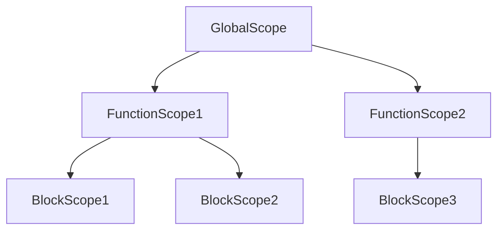
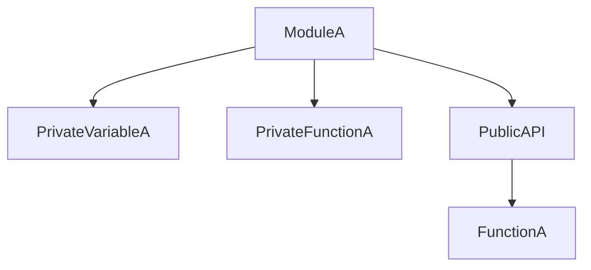

## 9.2.2 Global Variables

In the realm of software development, particularly in JavaScript and TypeScript, global variables are often cited as a common anti-pattern. While they might seem convenient for storing data that needs to be accessed across different parts of an application, their excessive use can lead to numerous problems, including code conflicts, unintended side effects, and maintenance challenges. In this section, we'll delve into why global variables are considered an anti-pattern, explore the issues they can cause, and discuss strategies to manage scope and encapsulation effectively. We'll also provide alternatives to global variables, such as module patterns, closures, and ES6 modules, with practical code examples to illustrate these concepts.

### Understanding Global Variables

Global variables are variables that are declared in the global scope, meaning they are accessible from anywhere in the code. In JavaScript, the global scope is the window object in browsers and the global object in Node.js. While global variables can be useful for storing data that needs to be accessed globally, they can also introduce several issues.

#### Why Global Variables Are an Anti-Pattern

1. **Namespace Pollution**: Global variables can lead to namespace pollution, where multiple variables with the same name exist in the global scope. This can cause conflicts and unexpected behavior in the code.

2. **Tight Coupling**: Relying on global variables can lead to tight coupling between different parts of the code, making it difficult to change one part of the code without affecting others.

3. **Unintended Side Effects**: Global variables can be modified from anywhere in the code, leading to unintended side effects and making it difficult to track changes.

4. **Testing and Maintenance Challenges**: Code that relies heavily on global variables can be difficult to test and maintain, as it is not clear which parts of the code are dependent on the global variables.

### Problems Caused by Global Variables

Let's explore some examples to understand how global variables can cause problems in codebases.

#### Example 1: Namespace Pollution

Consider the following code snippet:

```javascript
// File 1
var userName = "Alice";

// File 2
var userName = "Bob";

console.log(userName); // Output: "Bob"
```

In this example, both files declare a global variable `userName`. When the code is executed, the second declaration overwrites the first, leading to unexpected behavior.

#### Example 2: Unintended Side Effects

```javascript
var counter = 0;

function incrementCounter() {
  counter++;
}

function resetCounter() {
  counter = 0;
}

incrementCounter();
incrementCounter();
console.log(counter); // Output: 2

resetCounter();
console.log(counter); // Output: 0
```

Here, the `counter` variable is global and can be modified by any function. This can lead to unintended side effects, especially in larger codebases where the variable might be modified by multiple functions.

### Scope Management and Encapsulation

To avoid the pitfalls of global variables, it's essential to manage scope effectively and encapsulate data and functionality. This involves limiting the visibility of variables and functions to only where they are needed.

#### Block Scope with `let` and `const`

In ES6, `let` and `const` provide block scope, which can help prevent variables from being accessible globally.

```javascript
function exampleFunction() {
  let localVariable = "I'm local";
  console.log(localVariable); // Output: "I'm local"
}

exampleFunction();
console.log(localVariable); // ReferenceError: localVariable is not defined
```

In this example, `localVariable` is only accessible within the `exampleFunction` due to block scope.

#### Encapsulation with Closures

Closures can be used to encapsulate variables and functions, preventing them from being accessed globally.

```javascript
function createCounter() {
  let counter = 0;

  return {
    increment: function() {
      counter++;
      return counter;
    },
    reset: function() {
      counter = 0;
    }
  };
}

const myCounter = createCounter();
console.log(myCounter.increment()); // Output: 1
console.log(myCounter.increment()); // Output: 2
myCounter.reset();
console.log(myCounter.increment()); // Output: 1
```

In this example, `counter` is encapsulated within the `createCounter` function and cannot be accessed directly from outside.

### Alternatives to Global Variables

To reduce or eliminate the use of global variables, consider using module patterns, closures, and ES6 modules.

#### Module Pattern

The module pattern is a design pattern that uses closures to encapsulate variables and functions, exposing only the necessary parts through a public API.

```javascript
const myModule = (function() {
  let privateVariable = "I'm private";

  function privateFunction() {
    console.log(privateVariable);
  }

  return {
    publicMethod: function() {
      privateFunction();
    }
  };
})();

myModule.publicMethod(); // Output: "I'm private"
```

In this example, `privateVariable` and `privateFunction` are encapsulated within the module, and only `publicMethod` is exposed.

#### ES6 Modules

ES6 modules provide a built-in way to encapsulate code and manage dependencies. They allow you to export and import variables and functions, reducing the need for global variables.

```javascript
// myModule.js
export const myVariable = "I'm an exported variable";

export function myFunction() {
  console.log("I'm an exported function");
}

// main.js
import { myVariable, myFunction } from './myModule.js';

console.log(myVariable); // Output: "I'm an exported variable"
myFunction(); // Output: "I'm an exported function"
```

ES6 modules help organize code into separate files, each with its own scope, reducing the risk of global variable conflicts.

### Try It Yourself

To reinforce your understanding, try modifying the code examples provided. For instance, experiment with converting a codebase that uses global variables into one that uses the module pattern or ES6 modules. Observe how encapsulation and scope management improve the code's maintainability and reduce conflicts.

### Visualizing Scope and Encapsulation

To better understand how scope and encapsulation work, let's visualize these concepts using Mermaid.js diagrams.

#### Variable Scope Chain



*Description*: This diagram illustrates the scope chain in JavaScript, showing how variables are resolved from the innermost scope to the outermost scope.

#### Module Encapsulation



*Description*: This diagram represents the encapsulation within a module, where private variables and functions are hidden, and only the public API is exposed.

### References and Links

For further reading on global variables and scope management, consider the following resources:

- [MDN Web Docs: JavaScript Scoping](https://developer.mozilla.org/en-US/docs/Web/JavaScript/Guide/Grammar_and_types#scoping)
- [MDN Web Docs: Closures](https://developer.mozilla.org/en-US/docs/Web/JavaScript/Closures)
- [MDN Web Docs: Modules](https://developer.mozilla.org/en-US/docs/Web/JavaScript/Guide/Modules)

### Knowledge Check

Before we conclude, let's pose some questions to reinforce your understanding:

1. What are the main issues associated with using global variables?
2. How can block scope help prevent global variable conflicts?
3. What is the module pattern, and how does it help encapsulate code?
4. How do ES6 modules differ from the module pattern?

### Embrace the Journey

Remember, avoiding global variables is just one step towards writing clean, maintainable code. As you continue your journey in software development, keep exploring new patterns and techniques to improve your code. Stay curious, experiment with different approaches, and enjoy the process of learning and growing as a developer.

### Summary

In this section, we've explored the pitfalls of global variables and why they are considered an anti-pattern in JavaScript and TypeScript. We've discussed the importance of scope management and encapsulation, and provided alternatives such as module patterns, closures, and ES6 modules. By understanding and applying these concepts, you can write more maintainable and scalable code, reducing the risk of conflicts and unintended side effects.

## Quiz Time!



### What is a primary issue with global variables?

- [x] Namespace pollution
- [ ] Improved performance
- [ ] Enhanced security
- [ ] Simplified debugging

> **Explanation:** Global variables can lead to namespace pollution, where multiple variables with the same name exist in the global scope, causing conflicts.

### How can block scope help in JavaScript?

- [x] It limits the visibility of variables to a specific block.
- [ ] It makes all variables global.
- [ ] It enhances variable performance.
- [ ] It automatically optimizes code.

> **Explanation:** Block scope, provided by `let` and `const`, limits the visibility of variables to the block in which they are declared, preventing global scope pollution.

### What is the purpose of the module pattern?

- [x] To encapsulate variables and functions, exposing only necessary parts.
- [ ] To make all variables public.
- [ ] To increase execution speed.
- [ ] To simplify syntax.

> **Explanation:** The module pattern encapsulates variables and functions, exposing only the necessary parts through a public API, reducing global scope usage.

### How do ES6 modules help manage scope?

- [x] By allowing export and import of variables and functions.
- [ ] By making all variables global.
- [ ] By enhancing variable performance.
- [ ] By automatically optimizing code.

> **Explanation:** ES6 modules allow developers to export and import variables and functions, organizing code into separate files with their own scope.

### What is a closure in JavaScript?

- [x] A function that retains access to its lexical scope.
- [ ] A global variable.
- [ ] A syntax error.
- [ ] A type of loop.

> **Explanation:** A closure is a function that retains access to its lexical scope, allowing for encapsulation and data hiding.

### What is the result of namespace pollution?

- [x] Conflicts and unexpected behavior
- [ ] Improved readability
- [ ] Enhanced security
- [ ] Faster execution

> **Explanation:** Namespace pollution can lead to conflicts and unexpected behavior due to multiple variables with the same name in the global scope.

### How can you encapsulate code using closures?

- [x] By creating functions that retain access to their lexical scope.
- [ ] By declaring all variables globally.
- [ ] By using `var` instead of `let`.
- [ ] By avoiding functions altogether.

> **Explanation:** Closures allow encapsulation by creating functions that retain access to their lexical scope, hiding variables from the global scope.

### What is the benefit of using `let` and `const`?

- [x] They provide block scope.
- [ ] They make variables global.
- [ ] They enhance performance.
- [ ] They simplify syntax.

> **Explanation:** `let` and `const` provide block scope, limiting the visibility of variables to the block in which they are declared.

### How do ES6 modules differ from the module pattern?

- [x] ES6 modules are built-in, while the module pattern uses closures.
- [ ] ES6 modules make all variables global.
- [ ] ES6 modules enhance performance.
- [ ] ES6 modules simplify syntax.

> **Explanation:** ES6 modules are a built-in feature of JavaScript that allow for exporting and importing, while the module pattern uses closures for encapsulation.

### Is it true that global variables can lead to unintended side effects?

- [x] True
- [ ] False

> **Explanation:** Global variables can be modified from anywhere in the code, leading to unintended side effects and making it difficult to track changes.


