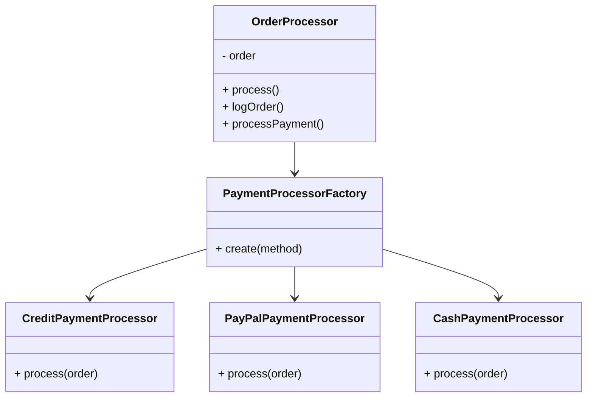

## 9.2.3 Spaghetti Code

In the world of software development, the term "Spaghetti Code" is often used to describe a particular anti-pattern that can plague projects, especially as they grow in complexity. This section will delve into what Spaghetti Code is, how it emerges, its negative impacts, and strategies for prevention and refactoring.

### Understanding Spaghetti Code

Spaghetti Code refers to a codebase that is tangled, unstructured, and difficult to maintain. Much like a bowl of spaghetti, where each strand is intertwined with others, Spaghetti Code lacks a clear structure, making it challenging to follow the flow of logic. This anti-pattern is characterized by:

- **Lack of Modularity**: Code is often written in large, monolithic blocks without clear separation of concerns.
- **High Coupling**: Components are tightly interwoven, making changes in one area likely to affect others.
- **Low Cohesion**: Functions and classes may perform multiple, unrelated tasks, leading to confusion.
- **Poor Readability**: The code is difficult to read and understand, often due to inconsistent naming conventions and lack of comments.
- **Ad-hoc Solutions**: Quick fixes and patches are applied without considering the overall architecture.

### How Spaghetti Code Emerges

Spaghetti Code often arises from a combination of factors, including:

- **Lack of Planning**: Jumping straight into coding without a clear design or architecture can lead to haphazard code structures.
- **Ad-hoc Coding**: Developers may add features or fix bugs without considering the broader impact on the codebase.
- **Time Constraints**: Under pressure to deliver quickly, developers might prioritize speed over quality, leading to shortcuts and technical debt.
- **Inexperience**: Novice developers may not be familiar with best practices and design principles, resulting in poorly structured code.
- **Evolving Requirements**: As project requirements change, the codebase may be modified repeatedly without refactoring, leading to a tangled mess.

### Negative Impact of Spaghetti Code

The presence of Spaghetti Code in a project can have several detrimental effects:

- **Reduced Readability**: When code is difficult to read, it becomes harder for developers to understand and modify it, leading to increased time and effort for maintenance.
- **Increased Bug Risk**: The lack of structure can make it easy to introduce bugs, as changes in one part of the code can have unintended consequences elsewhere.
- **Poor Scalability**: As the project grows, the tangled codebase can become a bottleneck, making it difficult to add new features or improve performance.
- **Decreased Team Collaboration**: When code is hard to understand, it can hinder collaboration among team members, as they may struggle to comprehend each other's work.
- **Higher Maintenance Costs**: The time and effort required to maintain Spaghetti Code can lead to increased costs over the life of the project.

### Strategies to Prevent Spaghetti Code

Preventing Spaghetti Code requires a proactive approach to software development. Here are some strategies to consider:

#### Proper Planning and Design

- **Define Clear Requirements**: Before coding begins, ensure that project requirements are well-defined and understood by all team members.
- **Adopt Design Patterns**: Use established design patterns to provide structure and organization to your code.
- **Create an Architecture**: Develop a high-level architecture that outlines the major components and their interactions.

#### Adherence to Design Principles

- **Follow SOLID Principles**: These principles help create a codebase that is modular, flexible, and easy to maintain.
- **Use DRY and KISS**: Avoid code duplication and keep solutions simple to enhance readability and maintainability.
- **Favor Composition Over Inheritance**: This approach can lead to more flexible and reusable code structures.

#### Code Reviews and Pair Programming

- **Conduct Regular Code Reviews**: Peer reviews can help identify potential issues early and ensure adherence to best practices.
- **Engage in Pair Programming**: Working in pairs can lead to better code quality and knowledge sharing among team members.

### Refactoring Techniques for Spaghetti Code

If you find yourself dealing with an existing codebase that resembles Spaghetti Code, refactoring can help improve its structure and maintainability. Here are some techniques to consider:

#### Break Down Monolithic Code

- **Extract Functions**: Identify blocks of code that perform specific tasks and extract them into separate functions or methods.
- **Modularize Code**: Divide the codebase into modules or components, each responsible for a specific part of the functionality.

#### Improve Naming and Documentation

- **Use Descriptive Names**: Ensure that variables, functions, and classes have meaningful names that convey their purpose.
- **Add Comments and Documentation**: Provide clear comments and documentation to explain complex logic and decisions.

#### Reduce Coupling and Increase Cohesion

- **Decouple Components**: Use interfaces and dependency injection to reduce dependencies between components.
- **Increase Cohesion**: Ensure that each function or class has a single, well-defined responsibility.

#### Implement Automated Testing

- **Write Unit Tests**: Develop unit tests to verify the behavior of individual components and ensure that refactoring does not introduce new bugs.
- **Use Test-Driven Development (TDD)**: Consider adopting TDD to guide the design and development process.

### Code Example: Refactoring Spaghetti Code

Let's look at an example of Spaghetti Code and how we can refactor it for better structure and readability.

**Original Spaghetti Code:**

```javascript
function processOrder(order) {
    if (order.type === 'online') {
        // Process online order
        console.log('Processing online order for', order.customerName);
        if (order.paymentMethod === 'credit') {
            console.log('Processing credit payment');
            // Credit payment logic
        } else if (order.paymentMethod === 'paypal') {
            console.log('Processing PayPal payment');
            // PayPal payment logic
        }
    } else if (order.type === 'in-store') {
        // Process in-store order
        console.log('Processing in-store order for', order.customerName);
        if (order.paymentMethod === 'cash') {
            console.log('Processing cash payment');
            // Cash payment logic
        } else if (order.paymentMethod === 'credit') {
            console.log('Processing credit payment');
            // Credit payment logic
        }
    }
    // More order processing logic
}
```

**Refactored Code:**

```javascript
class OrderProcessor {
    constructor(order) {
        this.order = order;
    }

    process() {
        this.logOrder();
        this.processPayment();
        // Additional processing logic
    }

    logOrder() {
        console.log(`Processing ${this.order.type} order for ${this.order.customerName}`);
    }

    processPayment() {
        const paymentProcessor = PaymentProcessorFactory.create(this.order.paymentMethod);
        paymentProcessor.process(this.order);
    }
}

class PaymentProcessorFactory {
    static create(method) {
        switch (method) {
            case 'credit':
                return new CreditPaymentProcessor();
            case 'paypal':
                return new PayPalPaymentProcessor();
            case 'cash':
                return new CashPaymentProcessor();
            default:
                throw new Error('Unsupported payment method');
        }
    }
}

class CreditPaymentProcessor {
    process(order) {
        console.log('Processing credit payment');
        // Credit payment logic
    }
}

class PayPalPaymentProcessor {
    process(order) {
        console.log('Processing PayPal payment');
        // PayPal payment logic
    }
}

class CashPaymentProcessor {
    process(order) {
        console.log('Processing cash payment');
        // Cash payment logic
    }
}

// Usage
const order = { type: 'online', customerName: 'John Doe', paymentMethod: 'credit' };
const processor = new OrderProcessor(order);
processor.process();
```

**Explanation:**

- **Modularization**: The refactored code is organized into classes, each with a clear responsibility.
- **Factory Pattern**: The `PaymentProcessorFactory` class is used to create payment processors based on the payment method.
- **Single Responsibility Principle**: Each class and method has a single responsibility, improving cohesion and readability.

### Visualizing Spaghetti Code Refactoring

To better understand the refactoring process, let's visualize the transformation from Spaghetti Code to a more structured design using a class diagram.



**Diagram Description:**

- The `OrderProcessor` class is responsible for processing orders and delegating payment processing to the appropriate processor.
- The `PaymentProcessorFactory` class creates instances of payment processors based on the payment method.
- Each payment processor class (`CreditPaymentProcessor`, `PayPalPaymentProcessor`, `CashPaymentProcessor`) handles a specific type of payment.

### Try It Yourself

To reinforce your understanding, try modifying the refactored code:

- **Add a new payment method**: Implement a new payment processor class for a different payment method, such as `BitcoinPaymentProcessor`.
- **Enhance logging**: Modify the `logOrder` method to include additional order details, such as the order total or items purchased.
- **Implement error handling**: Add error handling to the payment processing logic to manage potential issues, such as payment failures.

### References and Further Reading

For more information on Spaghetti Code and refactoring techniques, consider the following resources:

- [Refactoring: Improving the Design of Existing Code by Martin Fowler](https://martinfowler.com/books/refactoring.html)
- [MDN Web Docs: JavaScript Guide](https://developer.mozilla.org/en-US/docs/Web/JavaScript/Guide)
- [Clean Code: A Handbook of Agile Software Craftsmanship by Robert C. Martin](https://www.oreilly.com/library/view/clean-code/9780136083238/)

### Knowledge Check

As you progress through this section, consider the following questions to test your understanding:

- What are the key characteristics of Spaghetti Code?
- How can design patterns help prevent Spaghetti Code?
- What are some strategies for refactoring Spaghetti Code?
- How does modularization improve code maintainability?

### Embrace the Journey

Remember, refactoring Spaghetti Code is a journey, not a destination. As you continue to learn and apply best practices, you'll develop the skills needed to create clean, maintainable code. Keep experimenting, stay curious, and enjoy the process of transforming tangled code into a well-structured masterpiece.

## Quiz Time!



### What is a primary characteristic of Spaghetti Code?

- [x] Lack of modularity
- [ ] High cohesion
- [ ] Low coupling
- [ ] Well-documented

> **Explanation:** Spaghetti Code is often characterized by a lack of modularity, making it difficult to maintain and understand.

### Which factor often leads to the emergence of Spaghetti Code?

- [x] Lack of planning
- [ ] Use of design patterns
- [ ] High team collaboration
- [ ] Extensive documentation

> **Explanation:** Spaghetti Code often emerges from a lack of planning and ad-hoc coding practices.

### What is a negative impact of Spaghetti Code?

- [x] Reduced readability
- [ ] Improved scalability
- [ ] Enhanced team collaboration
- [ ] Increased cohesion

> **Explanation:** Spaghetti Code reduces readability, making it difficult for developers to understand and maintain the codebase.

### Which strategy can help prevent Spaghetti Code?

- [x] Adopting design patterns
- [ ] Ignoring code reviews
- [ ] Writing ad-hoc solutions
- [ ] Avoiding modularization

> **Explanation:** Adopting design patterns can provide structure and organization, helping to prevent Spaghetti Code.

### What is a refactoring technique for Spaghetti Code?

- [x] Extracting functions
- [ ] Increasing coupling
- [ ] Reducing documentation
- [ ] Ignoring unit tests

> **Explanation:** Extracting functions can help break down monolithic code into smaller, more manageable pieces.

### How can modularization improve code?

- [x] By dividing the codebase into components
- [ ] By increasing coupling
- [ ] By reducing readability
- [ ] By ignoring design principles

> **Explanation:** Modularization divides the codebase into components, each responsible for a specific part of the functionality.

### What is the role of the PaymentProcessorFactory in the refactored code example?

- [x] To create payment processors based on the payment method
- [ ] To process orders directly
- [ ] To log order details
- [ ] To handle errors

> **Explanation:** The PaymentProcessorFactory is responsible for creating instances of payment processors based on the payment method.

### Which principle helps ensure that each class has a single responsibility?

- [x] Single Responsibility Principle
- [ ] Open/Closed Principle
- [ ] Liskov Substitution Principle
- [ ] Interface Segregation Principle

> **Explanation:** The Single Responsibility Principle ensures that each class has a single, well-defined responsibility.

### What is a benefit of using descriptive names in code?

- [x] Improved readability
- [ ] Increased coupling
- [ ] Reduced cohesion
- [ ] Enhanced complexity

> **Explanation:** Descriptive names improve readability by conveying the purpose of variables, functions, and classes.

### True or False: Spaghetti Code is easy to maintain and understand.

- [ ] True
- [x] False

> **Explanation:** False. Spaghetti Code is difficult to maintain and understand due to its tangled and unstructured nature.


