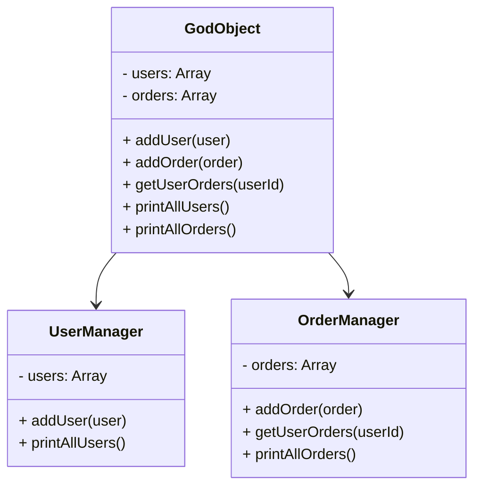

## 9.2.4 God Object

In the realm of software design, the term "God Object" refers to an anti-pattern where a single class or module becomes overly complex by taking on too many responsibilities. This phenomenon often results in a monolithic structure that knows too much or does too much, leading to a host of maintenance and scalability issues. In this section, we will delve into the intricacies of the God Object anti-pattern, explore its symptoms, understand the principles it violates, and learn how to refactor such objects into more manageable components.

### Understanding the God Object

The God Object is a design flaw where a single class or module accumulates excessive responsibilities, making it a central point of control in a system. This anti-pattern often emerges in codebases that lack clear boundaries between different functionalities, leading to a bloated and unwieldy structure.

#### Symptoms of a God Object

- **High Complexity**: The class or module contains a large amount of code, making it difficult to understand and maintain.
- **Numerous Responsibilities**: It handles multiple unrelated tasks, violating the Single Responsibility Principle (SRP).
- **Excessive Dependencies**: The object interacts with many other parts of the system, leading to tight coupling.
- **Difficult to Test**: Testing becomes challenging due to the intertwined nature of its responsibilities.
- **Frequent Changes**: Modifications in one part of the system often require changes to the God Object, increasing the risk of introducing bugs.

### Violations of Design Principles

The God Object anti-pattern directly contradicts several core principles of software design, particularly the Single Responsibility Principle and Separation of Concerns.

#### Single Responsibility Principle (SRP)

The SRP states that a class should have only one reason to change, meaning it should have a single responsibility or purpose. A God Object, by definition, violates this principle by taking on multiple responsibilities, making it susceptible to frequent changes and difficult to manage.

#### Separation of Concerns

Separation of Concerns is a design principle that advocates for dividing a program into distinct sections, each addressing a separate concern. A God Object merges these concerns into a single entity, leading to a lack of modularity and increased complexity.

### Problems Introduced by the God Object

The presence of a God Object in a codebase can lead to several detrimental effects:

- **Reduced Modularity**: The tightly coupled nature of a God Object makes it difficult to isolate and reuse components.
- **Poor Testability**: Testing becomes cumbersome as the object’s numerous responsibilities are intertwined, making it hard to isolate specific functionalities.
- **Limited Scalability**: As the system grows, the God Object becomes a bottleneck, hindering scalability and performance.
- **Increased Maintenance Costs**: The complexity and interdependencies of a God Object lead to higher maintenance efforts and costs.

### Refactoring the God Object

Refactoring a God Object involves breaking it down into smaller, focused components that adhere to the Single Responsibility Principle and Separation of Concerns. Here are the steps to achieve this:

#### Step 1: Identify Responsibilities

Begin by identifying the different responsibilities handled by the God Object. This involves analyzing the code to understand the various tasks it performs.

#### Step 2: Group Related Responsibilities

Once the responsibilities are identified, group them into related categories. This helps in determining the potential new classes or modules that can be created.

#### Step 3: Create New Classes or Modules

For each group of related responsibilities, create a new class or module that encapsulates those tasks. Ensure that each new component has a single responsibility.

#### Step 4: Refactor Code

Move the relevant code from the God Object to the newly created classes or modules. This involves updating method calls and dependencies to reflect the new structure.

#### Step 5: Test and Validate

After refactoring, thoroughly test the system to ensure that the functionality remains intact and that no new issues have been introduced.

### Code Example: Refactoring a God Object

Let's consider a simple example of a God Object in a JavaScript application. We'll demonstrate how to refactor it into smaller, more manageable components.

#### Before Refactoring

```javascript
class GodObject {
  constructor() {
    this.users = [];
    this.orders = [];
  }

  addUser(user) {
    this.users.push(user);
    console.log(`User ${user.name} added.`);
  }

  addOrder(order) {
    this.orders.push(order);
    console.log(`Order ${order.id} added.`);
  }

  getUserOrders(userId) {
    return this.orders.filter(order => order.userId === userId);
  }

  printAllUsers() {
    this.users.forEach(user => console.log(user.name));
  }

  printAllOrders() {
    this.orders.forEach(order => console.log(order.id));
  }
}
```

In this example, the `GodObject` class handles both user and order management, violating the Single Responsibility Principle.

#### After Refactoring

```javascript
class UserManager {
  constructor() {
    this.users = [];
  }

  addUser(user) {
    this.users.push(user);
    console.log(`User ${user.name} added.`);
  }

  printAllUsers() {
    this.users.forEach(user => console.log(user.name));
  }
}

class OrderManager {
  constructor() {
    this.orders = [];
  }

  addOrder(order) {
    this.orders.push(order);
    console.log(`Order ${order.id} added.`);
  }

  getUserOrders(userId) {
    return this.orders.filter(order => order.userId === userId);
  }

  printAllOrders() {
    this.orders.forEach(order => console.log(order.id));
  }
}
```

By refactoring, we have separated the responsibilities into two distinct classes: `UserManager` and `OrderManager`. Each class now adheres to the Single Responsibility Principle, making the codebase more modular and easier to maintain.

### Try It Yourself

To deepen your understanding, try modifying the refactored code:

- Add methods to update or delete users and orders.
- Implement error handling for invalid operations.
- Experiment with TypeScript by adding type annotations to the classes.

### Visualizing the Refactoring Process

To better understand the refactoring process, let's visualize the transformation from a God Object to a more modular structure using a class diagram.



In this diagram, we see the initial God Object with all its responsibilities. After refactoring, these responsibilities are distributed between `UserManager` and `OrderManager`, each focusing on a specific domain.

### References and Further Reading

For more insights into design patterns and anti-patterns, consider exploring the following resources:

- [MDN Web Docs on JavaScript Classes](https://developer.mozilla.org/en-US/docs/Web/JavaScript/Reference/Classes)
- [Refactoring Guru: God Object](https://refactoring.guru/smells/god-object)
- [SOLID Principles Explained](https://www.freecodecamp.org/news/solid-principles-explained-in-plain-english/)

### Knowledge Check

Before we conclude, let's reinforce what we've learned with a few questions:

- What are the symptoms of a God Object?
- How does a God Object violate the Single Responsibility Principle?
- What are the steps to refactor a God Object?
- Why is testability affected by the presence of a God Object?

### Embrace the Journey

Remember, refactoring a God Object is a journey towards cleaner, more maintainable code. As you continue to refine your skills, you'll find that breaking down complex structures into simpler components not only enhances code quality but also boosts your confidence as a developer. Keep experimenting, stay curious, and enjoy the process of continuous improvement!

## Quiz Time!



### What is a primary symptom of a God Object?

- [x] High complexity with numerous responsibilities
- [ ] Minimal dependencies
- [ ] High modularity
- [ ] Simple and easy to test

> **Explanation:** A God Object is characterized by high complexity and numerous responsibilities, making it difficult to manage and test.

### Which principle does the God Object violate?

- [x] Single Responsibility Principle
- [ ] Open/Closed Principle
- [ ] Liskov Substitution Principle
- [ ] Dependency Inversion Principle

> **Explanation:** The God Object violates the Single Responsibility Principle by taking on multiple responsibilities.

### What is the first step in refactoring a God Object?

- [x] Identify responsibilities
- [ ] Create new classes
- [ ] Test and validate
- [ ] Group related responsibilities

> **Explanation:** The first step in refactoring a God Object is to identify the different responsibilities it handles.

### How does a God Object affect testability?

- [x] Makes testing difficult due to intertwined responsibilities
- [ ] Enhances testability by centralizing logic
- [ ] Has no effect on testability
- [ ] Simplifies testing by reducing the number of classes

> **Explanation:** A God Object makes testing difficult because its intertwined responsibilities are hard to isolate.

### What is a benefit of refactoring a God Object?

- [x] Improved modularity and maintainability
- [ ] Increased complexity
- [ ] Reduced code readability
- [ ] More frequent changes required

> **Explanation:** Refactoring a God Object improves modularity and maintainability by distributing responsibilities across smaller, focused components.

### What does the Separation of Concerns principle advocate?

- [x] Dividing a program into distinct sections addressing separate concerns
- [ ] Merging all concerns into a single entity
- [ ] Centralizing all logic in one module
- [ ] Ignoring unrelated concerns

> **Explanation:** Separation of Concerns advocates for dividing a program into distinct sections, each addressing a separate concern.

### Which of the following is NOT a problem introduced by a God Object?

- [x] High modularity
- [ ] Poor testability
- [ ] Limited scalability
- [ ] Increased maintenance costs

> **Explanation:** High modularity is not a problem introduced by a God Object; rather, it is a lack of modularity that is problematic.

### What is a common result of frequent changes to a God Object?

- [x] Increased risk of introducing bugs
- [ ] Improved code quality
- [ ] Simplified code structure
- [ ] Enhanced performance

> **Explanation:** Frequent changes to a God Object increase the risk of introducing bugs due to its complexity and interdependencies.

### What is the role of the UserManager class after refactoring?

- [x] Manages user-related responsibilities
- [ ] Manages order-related responsibilities
- [ ] Handles both users and orders
- [ ] Acts as a central controller for the system

> **Explanation:** After refactoring, the UserManager class is responsible for managing user-related responsibilities.

### True or False: A God Object enhances code readability.

- [ ] True
- [x] False

> **Explanation:** A God Object does not enhance code readability; instead, it reduces readability due to its complexity and multiple responsibilities.


