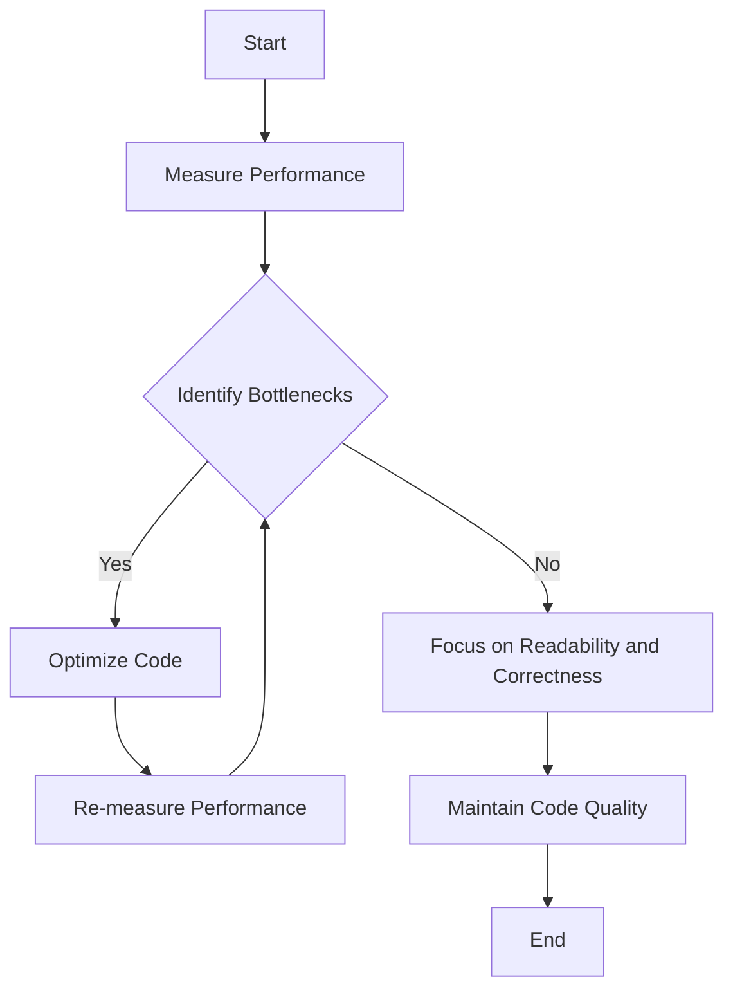

## 9.2.5 Premature Optimization

In the world of software development, the term "premature optimization" often surfaces in discussions about code quality and maintainability. Coined by Donald Knuth, the phrase "premature optimization is the root of all evil" serves as a cautionary reminder that optimizing code too early can lead to more harm than good. In this section, we will delve into the concept of premature optimization, explore its pitfalls, and provide guidance on how to approach optimization in a more measured and effective manner.

### Understanding Premature Optimization

Premature optimization refers to the practice of making code optimizations before a clear understanding of where performance bottlenecks exist. This often results in developers spending time and effort on areas of the code that do not significantly impact overall performance. The key issue with premature optimization is that it can lead to unnecessarily complex code, making it harder to read, understand, and maintain.

#### Why is Premature Optimization an Anti-Pattern?

1. **Complexity Overhead**: Optimizing code prematurely can introduce unnecessary complexity. Developers might use advanced techniques or data structures that are not needed, making the codebase harder to understand and maintain.

2. **Wasted Effort**: Without profiling and measuring, developers may optimize parts of the code that do not contribute significantly to performance issues, wasting valuable time and resources.

3. **Neglect of Code Correctness**: Focusing on optimization too early can divert attention from ensuring that the code is correct and meets the required functionality.

4. **Reduced Readability**: Optimized code is often less readable. Readability is crucial for collaboration and future maintenance, and premature optimization can obscure the logic of the code.

5. **Potential for Bugs**: Introducing optimizations can inadvertently introduce bugs, especially if the code is not thoroughly tested after changes.

### The Importance of Measuring Performance

Before diving into optimization, it's essential to measure the performance of your application. Profiling tools can help identify actual bottlenecks, allowing you to focus your efforts on areas that will have the most significant impact.

#### Tools for Profiling JavaScript and TypeScript

- **Chrome DevTools**: Provides a comprehensive suite of tools for profiling JavaScript performance in the browser.
- **Node.js Profiler**: Useful for profiling server-side JavaScript applications.
- **WebPageTest**: Offers insights into web application performance, including JavaScript execution times.
- **Lighthouse**: An open-source tool for improving the quality of web pages, including performance metrics.

### Focusing on Code Correctness and Readability

Before considering optimization, ensure that your code is correct and readable. Correctness ensures that the code behaves as expected, while readability makes it easier for others (and your future self) to understand and maintain the code.

#### Best Practices for Code Correctness and Readability

1. **Write Clear and Descriptive Code**: Use meaningful variable and function names that convey the purpose of the code.

2. **Follow Consistent Coding Standards**: Adhere to a coding style guide to maintain consistency across the codebase.

3. **Use Comments Wisely**: Provide comments where necessary to explain complex logic, but avoid over-commenting.

4. **Refactor Regularly**: Regularly review and refactor code to improve structure and readability.

5. **Test Thoroughly**: Implement a robust testing strategy to ensure code correctness.

### Examples of Premature Optimization

Let's explore some scenarios where premature optimization has negatively impacted projects:

#### Example 1: Over-Optimizing Loops

```javascript
// Prematurely optimized loop
for (let i = 0, len = array.length; i < len; i++) {
  // Process array[i]
}

// More readable version
for (let i = 0; i < array.length; i++) {
  // Process array[i]
}
```

In this example, the length of the array is stored in a variable `len` to avoid recalculating it on each iteration. While this might seem like a performance improvement, modern JavaScript engines are highly optimized, and such micro-optimizations are often unnecessary. The second version is more readable and should be preferred unless profiling indicates a significant performance gain.

#### Example 2: Complex Data Structures

```typescript
// Prematurely optimized with a complex data structure
class OptimizedCache {
  private cache: Map<string, any> = new Map();

  get(key: string): any {
    return this.cache.get(key);
  }

  set(key: string, value: any): void {
    this.cache.set(key, value);
  }
}

// Simpler version
class SimpleCache {
  private cache: { [key: string]: any } = {};

  get(key: string): any {
    return this.cache[key];
  }

  set(key: string, value: any): void {
    this.cache[key] = value;
  }
}
```

In this TypeScript example, a `Map` is used for caching, which might be overkill for simple use cases. The simpler object-based cache is easier to understand and maintain. Unless performance profiling shows a need for the `Map`'s features, the simpler approach is preferable.

### Visualizing the Impact of Premature Optimization

To better understand the impact of premature optimization, let's visualize the process of identifying and addressing performance bottlenecks.



**Figure 1: Process of Identifying and Addressing Performance Bottlenecks**

This flowchart illustrates the importance of measuring performance before optimizing. By focusing on readability and correctness first, you ensure that the code is maintainable and correct, only optimizing when necessary.

### Guidance for Effective Optimization

When it comes time to optimize, follow these guidelines to ensure your efforts are well-placed:

1. **Profile First**: Use profiling tools to identify actual performance bottlenecks.

2. **Focus on High-Impact Areas**: Concentrate on optimizing parts of the code that will have the most significant performance improvements.

3. **Iterate and Measure**: After making optimizations, re-measure performance to ensure the changes have the desired effect.

4. **Maintain Readability**: Strive to keep the code readable even after optimization. Use comments and documentation to explain complex optimizations.

5. **Avoid Over-Optimization**: Remember that not all code needs to be optimized. Focus on areas that truly impact performance.

### Try It Yourself: Experimenting with Optimization

To better understand the impact of optimization, try modifying the following code examples:

1. **Experiment with Loop Optimization**: Use different loop structures and measure their performance using Chrome DevTools.

2. **Test Different Data Structures**: Implement a simple cache using both an object and a `Map`, and compare their performance in various scenarios.

3. **Profile a Web Application**: Use Lighthouse to profile a web application and identify performance bottlenecks. Focus on optimizing the areas with the most significant impact.

### References and Further Reading

- [MDN Web Docs: Performance](https://developer.mozilla.org/en-US/docs/Web/Performance)
- [Google Chrome DevTools](https://developer.chrome.com/docs/devtools/)
- [Node.js Profiling Guide](https://nodejs.org/en/docs/guides/simple-profiling/)
- [WebPageTest](https://www.webpagetest.org/)
- [Lighthouse](https://developers.google.com/web/tools/lighthouse)

### Knowledge Check

To reinforce your understanding of premature optimization, consider the following questions:

1. What is the primary risk associated with premature optimization?
2. Why is it important to measure performance before optimizing code?
3. How can premature optimization affect code readability?
4. What tools can be used to profile JavaScript applications?
5. How can you ensure code correctness before optimizing?

### Embrace the Journey

Remember, the journey to writing efficient and maintainable code is ongoing. By focusing on code correctness and readability first, and optimizing only when necessary, you can create codebases that are both performant and easy to maintain. Keep experimenting, stay curious, and enjoy the process of continuous improvement!

## Quiz Time!



### What is a key danger of premature optimization?

- [x] It can lead to unnecessarily complex code.
- [ ] It always improves performance.
- [ ] It simplifies code maintenance.
- [ ] It ensures code correctness.

> **Explanation:** Premature optimization can lead to unnecessarily complex code, making it harder to read and maintain.

### Why should performance be measured before optimization?

- [x] To identify actual bottlenecks.
- [ ] To ensure all code is optimized.
- [ ] To avoid using profiling tools.
- [ ] To simplify the code structure.

> **Explanation:** Measuring performance helps identify actual bottlenecks, allowing developers to focus on areas that truly impact performance.

### What is a common consequence of premature optimization?

- [x] Reduced code readability.
- [ ] Improved code readability.
- [ ] Guaranteed performance improvement.
- [ ] Simplified code logic.

> **Explanation:** Premature optimization often reduces code readability, making it harder to understand and maintain.

### Which tool is useful for profiling JavaScript in the browser?

- [x] Chrome DevTools
- [ ] Node.js Profiler
- [ ] WebPageTest
- [ ] Lighthouse

> **Explanation:** Chrome DevTools provides a comprehensive suite of tools for profiling JavaScript performance in the browser.

### How can you ensure code correctness before optimizing?

- [x] Implement a robust testing strategy.
- [ ] Focus solely on optimization.
- [ ] Ignore code readability.
- [ ] Use complex data structures.

> **Explanation:** Implementing a robust testing strategy helps ensure code correctness before optimization.

### What should be prioritized before optimization?

- [x] Code correctness and readability.
- [ ] Code complexity.
- [ ] Advanced data structures.
- [ ] Micro-optimizations.

> **Explanation:** Prioritizing code correctness and readability ensures that the code is maintainable and functions as expected.

### What is the role of profiling tools in optimization?

- [x] Identifying performance bottlenecks.
- [ ] Simplifying code logic.
- [ ] Ensuring code correctness.
- [ ] Avoiding code refactoring.

> **Explanation:** Profiling tools help identify performance bottlenecks, allowing developers to focus optimization efforts effectively.

### What is a potential outcome of over-optimization?

- [x] Introduction of bugs.
- [ ] Guaranteed performance improvement.
- [ ] Simplified code structure.
- [ ] Improved code readability.

> **Explanation:** Over-optimization can introduce bugs, especially if the code is not thoroughly tested after changes.

### What is an example of premature optimization?

- [x] Using complex data structures unnecessarily.
- [ ] Writing clear and descriptive code.
- [ ] Following consistent coding standards.
- [ ] Implementing a robust testing strategy.

> **Explanation:** Using complex data structures unnecessarily is an example of premature optimization, adding complexity without significant performance benefits.

### True or False: All code should be optimized for performance.

- [ ] True
- [x] False

> **Explanation:** Not all code needs to be optimized for performance. Focus on areas that truly impact performance based on profiling results.




