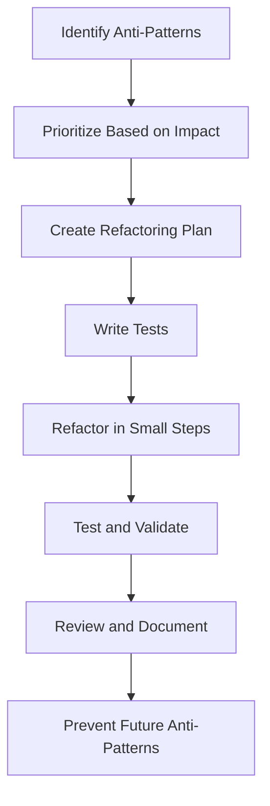

## 9.3 Refactoring Anti-Patterns

In the world of software development, anti-patterns are common pitfalls that can lead to inefficient, hard-to-maintain, and error-prone code. Recognizing and refactoring these anti-patterns is crucial for improving the quality of your JavaScript and TypeScript codebases. In this section, we'll explore strategies for identifying anti-patterns, tools and techniques for refactoring, and best practices to prevent them from reoccurring.

### Understanding Anti-Patterns

Before diving into refactoring, it's essential to understand what anti-patterns are. Anti-patterns are common responses to recurring problems that are ineffective and counterproductive. They often arise from a lack of experience or understanding of best practices. Some common anti-patterns in JavaScript and TypeScript include:

- **Callback Hell**: Nested callbacks leading to complex and unreadable code.
- **Global Variables**: Over-reliance on global state, causing unpredictable behavior.
- **Spaghetti Code**: Code with a complex and tangled control structure.
- **God Object**: An object that knows too much or does too much.
- **Premature Optimization**: Optimizing code before understanding its impact or necessity.

### Steps to Detect and Prioritize Anti-Patterns

#### 1. Code Review and Analysis

Conduct regular code reviews to identify potential anti-patterns. Use static analysis tools like ESLint for JavaScript and TSLint for TypeScript to automatically detect code smells and anti-patterns. These tools can help identify issues like unused variables, overly complex functions, and improper use of language features.

#### 2. Prioritize Based on Impact

Not all anti-patterns have the same impact on your codebase. Prioritize refactoring efforts based on factors such as:

- **Code Complexity**: More complex code is harder to maintain and understand.
- **Performance**: Anti-patterns that degrade performance should be addressed first.
- **Maintainability**: Code that is difficult to maintain or extend should be refactored.
- **Frequency of Use**: Focus on refactoring code that is frequently executed or modified.

#### 3. Create a Refactoring Plan

Once you've identified and prioritized anti-patterns, create a refactoring plan. This plan should include:

- **Goals**: Define what you want to achieve with refactoring.
- **Scope**: Determine which parts of the codebase will be refactored.
- **Timeline**: Set a realistic timeline for completing the refactoring process.
- **Testing Strategy**: Plan how you will test the refactored code to ensure it functions correctly.

### Tools and Techniques for Code Analysis and Refactoring

#### 1. Static Analysis Tools

Static analysis tools are invaluable for detecting anti-patterns and code smells. They analyze your code without executing it, providing insights into potential issues. Some popular tools include:

- **ESLint**: A widely-used tool for identifying and fixing problems in JavaScript code.
- **TSLint**: A static analysis tool for TypeScript, though it's being deprecated in favor of ESLint with TypeScript support.
- **SonarQube**: A platform for continuous inspection of code quality, supporting multiple languages including JavaScript and TypeScript.

#### 2. Code Refactoring Tools

Integrated Development Environments (IDEs) like Visual Studio Code and JetBrains WebStorm offer built-in refactoring tools. These tools can automate common refactoring tasks, such as renaming variables, extracting functions, and converting code to use modern language features.

#### 3. Automated Testing Frameworks

Automated tests are crucial for ensuring that refactoring doesn't introduce new bugs. Use frameworks like Jest for JavaScript and TypeScript to write unit tests that verify the behavior of your code. Test-driven development (TDD) can be particularly effective, as it encourages writing tests before implementing changes.

### Systematic Approach to Refactoring

#### 1. Identify and Isolate

Start by identifying the specific anti-pattern you want to refactor. Isolate the affected code to understand its dependencies and interactions with other parts of the codebase.

#### 2. Write Tests

Before making any changes, write tests that cover the current behavior of the code. This ensures that you have a baseline to compare against after refactoring. Focus on edge cases and critical paths to minimize the risk of introducing bugs.

#### 3. Refactor in Small Steps

Refactor the code in small, manageable steps. This approach makes it easier to identify and fix issues as they arise. Use version control systems like Git to track changes and revert if necessary.

#### 4. Test and Validate

After each refactoring step, run your tests to validate that the code still behaves as expected. If any tests fail, investigate and resolve the issues before proceeding.

#### 5. Review and Document

Once refactoring is complete, review the changes with your team to ensure they meet the project's standards. Document the refactoring process and any changes made to the codebase to aid future maintenance efforts.

### Best Practices for Preventing Anti-Patterns

#### 1. Follow Coding Standards

Adopt and enforce coding standards across your team to ensure consistency and prevent common anti-patterns. Use linters and formatters to automate this process and catch issues early.

#### 2. Encourage Continuous Learning

Promote a culture of continuous learning and improvement within your team. Encourage developers to stay updated with best practices and emerging trends in JavaScript and TypeScript development.

#### 3. Conduct Regular Code Reviews

Regular code reviews are essential for maintaining code quality and preventing anti-patterns. They provide an opportunity for developers to learn from each other and catch potential issues before they become problematic.

#### 4. Embrace Test-Driven Development

Test-driven development (TDD) encourages writing tests before implementing code. This approach helps prevent anti-patterns by ensuring that code is designed with testing and maintainability in mind.

#### 5. Use Design Patterns

Design patterns provide proven solutions to common problems and can help prevent anti-patterns from emerging. Familiarize your team with design patterns relevant to your projects and encourage their use.

### Case Studies: Successful Refactoring Efforts

#### Case Study 1: Refactoring Callback Hell

**Problem**: A legacy JavaScript application relied heavily on nested callbacks, leading to complex and unreadable code.

**Solution**: The team refactored the code to use Promises and async/await, significantly improving readability and maintainability.

**Outcome**: The refactored code was easier to understand and modify, reducing the time required for future enhancements.

#### Case Study 2: Eliminating Global Variables

**Problem**: A TypeScript project used global variables extensively, causing unpredictable behavior and making testing difficult.

**Solution**: The team refactored the code to use modules and dependency injection, encapsulating state and improving testability.

**Outcome**: The project became more modular and easier to test, leading to fewer bugs and faster development cycles.

#### Case Study 3: Simplifying Spaghetti Code

**Problem**: A complex JavaScript application had a tangled control structure, making it difficult to understand and maintain.

**Solution**: The team refactored the code to use design patterns like the Strategy and Observer patterns, simplifying the control flow and improving separation of concerns.

**Outcome**: The refactored code was more maintainable and easier to extend, allowing the team to add new features with confidence.

### Visualizing the Refactoring Process

To better understand the refactoring process, let's visualize it using a flowchart. This diagram illustrates the steps involved in identifying, prioritizing, and refactoring anti-patterns.

**Diagram Description**: This flowchart outlines the systematic approach to refactoring anti-patterns, from identification to prevention.

### Try It Yourself

Experiment with refactoring a small piece of code that contains an anti-pattern. For example, take a function with nested callbacks and refactor it to use Promises or async/await. Observe how the refactored code improves readability and maintainability.

### Knowledge Check

- **Question**: What is an anti-pattern, and why is it important to refactor them?
- **Exercise**: Identify an anti-pattern in your current project and outline a plan to refactor it.

### Embrace the Journey

Refactoring anti-patterns is an ongoing process that requires diligence and a commitment to continuous improvement. Remember, this is just the beginning. As you progress, you'll develop a deeper understanding of best practices and design patterns, enabling you to write more maintainable and scalable code. Keep experimenting, stay curious, and enjoy the journey!

## Quiz Time!



### What is an anti-pattern?

- [x] A common response to recurring problems that is ineffective and counterproductive.
- [ ] A design pattern that solves a specific problem.
- [ ] A type of algorithm used in software development.
- [ ] A tool for analyzing code quality.

> **Explanation:** An anti-pattern is a common response to recurring problems that is ineffective and counterproductive, often resulting from a lack of experience or understanding of best practices.

### Which tool is commonly used for static analysis in JavaScript?

- [x] ESLint
- [ ] Webpack
- [ ] Babel
- [ ] Node.js

> **Explanation:** ESLint is a widely-used tool for identifying and fixing problems in JavaScript code through static analysis.

### What is the first step in the systematic approach to refactoring?

- [x] Identify and isolate the anti-pattern.
- [ ] Write tests for the current behavior.
- [ ] Refactor in small steps.
- [ ] Review and document the changes.

> **Explanation:** The first step in the systematic approach to refactoring is to identify and isolate the anti-pattern to understand its dependencies and interactions.

### Why is it important to write tests before refactoring?

- [x] To ensure the current behavior is preserved.
- [ ] To speed up the refactoring process.
- [ ] To eliminate the need for code reviews.
- [ ] To automatically fix anti-patterns.

> **Explanation:** Writing tests before refactoring ensures that the current behavior is preserved, providing a baseline to compare against after changes are made.

### What is a benefit of using design patterns?

- [x] They provide proven solutions to common problems.
- [ ] They eliminate the need for testing.
- [ ] They automatically refactor code.
- [ ] They reduce the need for documentation.

> **Explanation:** Design patterns provide proven solutions to common problems, helping to prevent anti-patterns from emerging in the first place.

### Which of the following is a common anti-pattern in JavaScript?

- [x] Callback Hell
- [ ] Singleton Pattern
- [ ] Factory Method
- [ ] Observer Pattern

> **Explanation:** Callback Hell is a common anti-pattern in JavaScript, characterized by nested callbacks that lead to complex and unreadable code.

### How can global variables be eliminated in a TypeScript project?

- [x] By using modules and dependency injection.
- [ ] By converting them to constants.
- [ ] By using more global variables.
- [ ] By ignoring them during refactoring.

> **Explanation:** Global variables can be eliminated by using modules and dependency injection, which encapsulate state and improve testability.

### What is the purpose of a refactoring plan?

- [x] To define goals, scope, timeline, and testing strategy for refactoring.
- [ ] To eliminate the need for code reviews.
- [ ] To automatically refactor code.
- [ ] To speed up the development process.

> **Explanation:** A refactoring plan defines the goals, scope, timeline, and testing strategy for refactoring, ensuring a systematic and organized approach.

### What is the role of automated testing frameworks in refactoring?

- [x] To verify the behavior of the code after refactoring.
- [ ] To automatically refactor code.
- [ ] To eliminate the need for manual testing.
- [ ] To speed up the refactoring process.

> **Explanation:** Automated testing frameworks verify the behavior of the code after refactoring, ensuring that no new bugs are introduced.

### True or False: Refactoring should be done in large, comprehensive steps to ensure thoroughness.

- [ ] True
- [x] False

> **Explanation:** Refactoring should be done in small, manageable steps to make it easier to identify and fix issues as they arise.


