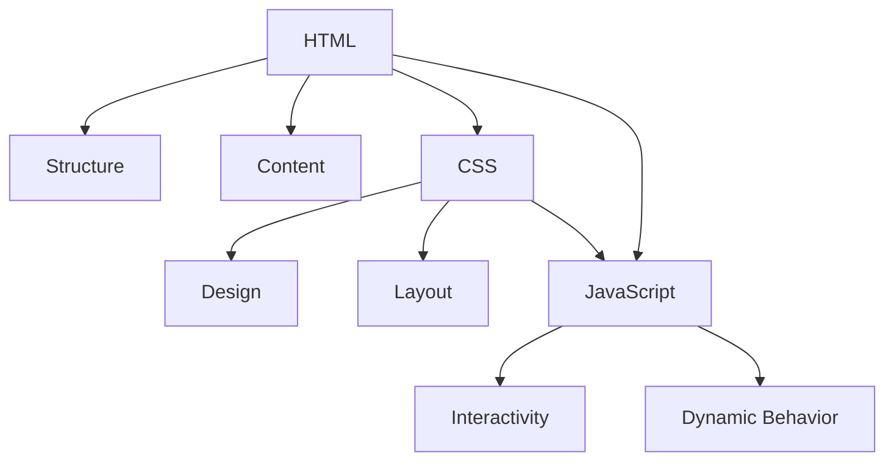

## 1.2 The Role of HTML, CSS, and JavaScript

In the world of web development, HTML, CSS, and JavaScript are the foundational technologies that bring web pages to life. Each plays a unique role, much like the components of a house: HTML forms the structure, CSS provides the design, and JavaScript adds functionality. Let's explore how these technologies work individually and together to create engaging web experiences.

### Understanding HTML: The Structure

HTML, or HyperText Markup Language, is the backbone of any web page. It defines the structure and layout of a web document by using a variety of tags and attributes. Think of HTML as the framework of a house, providing the basic structure upon which everything else is built. Just as a house needs walls, floors, and ceilings, a web page needs elements like headings, paragraphs, and images.

#### Key Concepts of HTML

- **Elements and Tags**: HTML uses tags to create elements. Tags are enclosed in angle brackets, such as `<h1>` for a heading or `<p>` for a paragraph.
- **Attributes**: These provide additional information about elements, such as `href` for links or `src` for images.
- **Nesting**: HTML elements can be nested within each other to create complex structures.

#### Simple HTML Example

```html
<!DOCTYPE html>
<html lang="en">
<head>
    <meta charset="UTF-8">
    <title>My First Web Page</title>
</head>
<body>
    <h1>Welcome to My Web Page</h1>
    <p>This is a paragraph of text on my web page.</p>
    
</body>
</html>
```

In this example, we see a basic HTML structure with a heading, a paragraph, and an image. The `<!DOCTYPE html>` declaration defines the document type, and the `<html>` tag wraps the entire content.

### CSS: The Design and Aesthetics

CSS, or Cascading Style Sheets, is responsible for the visual presentation of a web page. It controls the layout, colors, fonts, and overall style. If HTML is the structure of a house, CSS is the paint, wallpaper, and decor that make it visually appealing.

#### Key Concepts of CSS

- **Selectors**: These target HTML elements to apply styles. Common selectors include type selectors (e.g., `h1`), class selectors (e.g., `.class-name`), and ID selectors (e.g., `#id-name`).
- **Properties and Values**: CSS styles are defined by properties (e.g., `color`, `font-size`) and their corresponding values.
- **Cascading and Specificity**: CSS rules can cascade, meaning multiple rules can apply to the same element, with specificity determining which rule takes precedence.

#### Simple CSS Example

```css
body {
    background-color: #f0f0f0;
    font-family: Arial, sans-serif;
}

h1 {
    color: #333;
    text-align: center;
}

p {
    color: #666;
    line-height: 1.6;
}
```

This CSS snippet styles the body with a light gray background and a specific font. The heading is centered and colored dark gray, while the paragraph text is a lighter gray with increased line spacing.

### JavaScript: The Functionality

JavaScript is the programming language of the web, adding interactivity and dynamic behavior to web pages. It allows developers to create features like form validation, interactive maps, and dynamic content updates. In our house analogy, JavaScript is the plumbing and electrical systems that make the house functional.

#### Key Concepts of JavaScript

- **Variables and Data Types**: JavaScript uses variables to store data, which can be of different types such as strings, numbers, and booleans.
- **Functions**: These are reusable blocks of code that perform specific tasks.
- **Events**: JavaScript can respond to user actions, such as clicks or key presses, through event handling.

#### Simple JavaScript Example

```javascript
document.addEventListener('DOMContentLoaded', function() {
    const button = document.querySelector('button');
    button.addEventListener('click', function() {
        alert('Button clicked!');
    });
});
```

This JavaScript code waits for the document to load, then adds a click event listener to a button. When the button is clicked, an alert message is displayed.

### Integrating HTML, CSS, and JavaScript

To create a fully functional web page, we need to integrate HTML, CSS, and JavaScript. Each technology plays a crucial role, and together they form the complete package.

#### Example of Integration

Let's see how these technologies work together in a simple example:

```html
<!DOCTYPE html>
<html lang="en">
<head>
    <meta charset="UTF-8">
    <title>Interactive Web Page</title>
    <style>
        body {
            background-color: #f0f0f0;
            font-family: Arial, sans-serif;
        }
        h1 {
            color: #333;
            text-align: center;
        }
        button {
            display: block;
            margin: 20px auto;
            padding: 10px 20px;
            background-color: #007BFF;
            color: white;
            border: none;
            border-radius: 5px;
            cursor: pointer;
        }
    </style>
</head>
<body>
    <h1>Welcome to My Interactive Web Page</h1>
    <button>Click Me!</button>

    <script>
        document.querySelector('button').addEventListener('click', function() {
            alert('Hello, World!');
        });
    </script>
</body>
</html>
```

In this example, HTML provides the structure with a heading and a button. CSS styles the page, making the button visually appealing. JavaScript adds interactivity, displaying an alert when the button is clicked.

### The Necessity of All Three

Modern web development relies on the seamless integration of HTML, CSS, and JavaScript. Each technology complements the others, and omitting any one of them would result in a less effective web page.

- **HTML**: Without HTML, there would be no structure or content.
- **CSS**: Without CSS, the page would lack visual appeal and layout.
- **JavaScript**: Without JavaScript, the page would be static and unresponsive to user interactions.

### Visualizing the Relationship

To better understand the relationship between HTML, CSS, and JavaScript, let's use a visual aid:



**Diagram Description**: This diagram illustrates how HTML provides the structure and content, CSS adds design and layout, and JavaScript introduces interactivity and dynamic behavior. The arrows indicate the flow and integration of these technologies in web development.

### Try It Yourself

To reinforce your understanding, try modifying the example code above:

- Change the background color in the CSS to a different shade.
- Add a new paragraph in the HTML and style it with CSS.
- Modify the JavaScript to display a different message in the alert.

### Conclusion

HTML, CSS, and JavaScript are the essential building blocks of web development. By understanding their roles and how they work together, you can create dynamic, visually appealing, and interactive web pages. As you continue your journey in web development, these technologies will be your constant companions, enabling you to bring your ideas to life on the web.

## Quiz Time!



### What is the primary role of HTML in web development?

- [x] Structure and content
- [ ] Design and layout
- [ ] Interactivity and dynamic behavior
- [ ] Server-side processing

> **Explanation:** HTML provides the structure and content for web pages, acting as the backbone of any web document.

### What does CSS primarily control in a web page?

- [ ] Structure and content
- [x] Design and layout
- [ ] Interactivity and dynamic behavior
- [ ] Server-side processing

> **Explanation:** CSS is responsible for the visual presentation of a web page, including design and layout.

### What is the main function of JavaScript in web development?

- [ ] Structure and content
- [ ] Design and layout
- [x] Interactivity and dynamic behavior
- [ ] Server-side processing

> **Explanation:** JavaScript adds interactivity and dynamic behavior to web pages, allowing for user interaction and real-time updates.

### Which of the following is a key concept of HTML?

- [x] Elements and tags
- [ ] Selectors and specificity
- [ ] Variables and data types
- [ ] Functions and events

> **Explanation:** HTML uses elements and tags to define the structure and content of a web page.

### What is a CSS selector used for?

- [ ] Storing data
- [x] Targeting HTML elements to apply styles
- [ ] Handling user interactions
- [ ] Defining document structure

> **Explanation:** CSS selectors are used to target HTML elements and apply styles to them.

### In the house analogy, what does CSS represent?

- [ ] The framework
- [x] The paint and decor
- [ ] The plumbing and electrical systems
- [ ] The foundation

> **Explanation:** In the house analogy, CSS represents the paint and decor, providing the visual design of the web page.

### What does JavaScript use to respond to user actions?

- [ ] Attributes
- [ ] Selectors
- [x] Events
- [ ] Elements

> **Explanation:** JavaScript uses events to respond to user actions, such as clicks or key presses.

### Which technology is responsible for the structure of a web page?

- [x] HTML
- [ ] CSS
- [ ] JavaScript
- [ ] PHP

> **Explanation:** HTML is responsible for the structure of a web page, providing the framework for content.

### What is the purpose of the `<!DOCTYPE html>` declaration?

- [x] To define the document type and version of HTML
- [ ] To apply CSS styles
- [ ] To execute JavaScript code
- [ ] To create a new HTML element

> **Explanation:** The `<!DOCTYPE html>` declaration defines the document type and version of HTML being used.

### True or False: JavaScript can be used to change the style of HTML elements.

- [x] True
- [ ] False

> **Explanation:** JavaScript can be used to change the style of HTML elements by manipulating their CSS properties.


