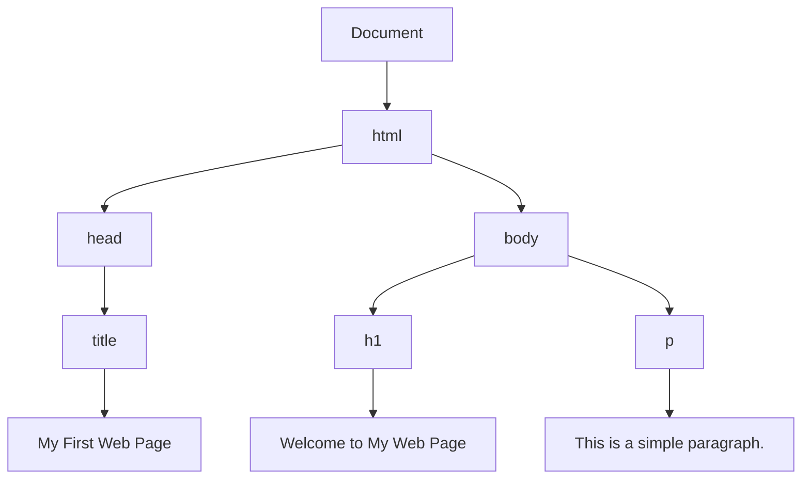
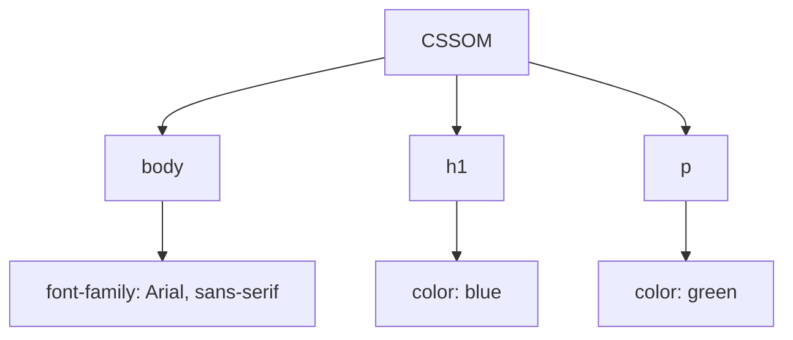
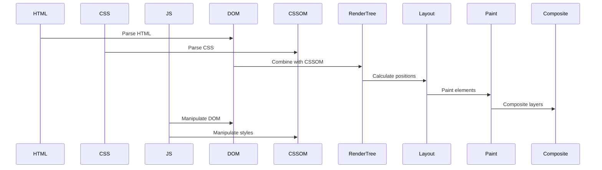

## 1.3 How Browsers Render Web Pages

Welcome to the fascinating world of web browsers and how they transform code into the visually engaging web pages we interact with daily. In this section, we will explore the journey from HTML, CSS, and JavaScript code to the rendered web page you see in your browser. We will break down the process into digestible steps, introduce key concepts like the Document Object Model (DOM), and discuss the role of the rendering engine. By the end of this chapter, you will have a solid understanding of how browsers work behind the scenes to bring web content to life.

### Understanding the Rendering Process

The rendering process in a web browser involves several key steps. Let's explore these steps in detail:

1. **Parsing HTML to Build the DOM Tree**
2. **Parsing CSS to Apply Styles**
3. **Executing JavaScript for Interactivity**

#### 1. Parsing HTML to Build the DOM Tree

When you load a web page, the browser begins by fetching the HTML document from the server. This document is then parsed to create a structured representation known as the Document Object Model (DOM). The DOM is a tree-like structure that represents the elements on the page.

##### What is the DOM?

The Document Object Model (DOM) is a programming interface for web documents. It represents the page so that programs can change the document structure, style, and content. The DOM represents the document as a tree of nodes, where each node is an object representing a part of the document.

Here's a simple example of how an HTML document is transformed into a DOM tree:

```html
<!DOCTYPE html>
<html>
  <head>
    <title>My First Web Page</title>
  </head>
  <body>
    <h1>Welcome to My Web Page</h1>
    <p>This is a simple paragraph.</p>
  </body>
</html>
```

The above HTML is parsed into the following DOM tree:



##### Building the DOM Tree

- **Start with the Document Node**: The root of the DOM tree is the document node, which represents the entire HTML document.
- **Parse HTML Elements**: As the browser reads the HTML, it creates nodes for each element (e.g., `<html>`, `<head>`, `<body>`).
- **Create Text Nodes**: Text within elements becomes text nodes, which are children of element nodes.
- **Establish Parent-Child Relationships**: Elements nested within other elements become child nodes of their parent elements.

#### 2. Parsing CSS to Apply Styles

Once the DOM tree is constructed, the browser processes the CSS to determine how the elements should be styled. This involves creating a CSS Object Model (CSSOM), which is similar to the DOM but specifically for styles.

##### Building the CSSOM

The CSSOM is a tree structure that represents the styles applied to the document. It is built by parsing the CSS rules and associating them with the corresponding elements in the DOM.

Here's an example of CSS that might be applied to our HTML document:

```css
body {
  font-family: Arial, sans-serif;
}

h1 {
  color: blue;
}

p {
  color: green;
}
```

The CSSOM for the above CSS might look like this:



##### Applying Styles

- **Match CSS Selectors**: The browser matches CSS selectors to elements in the DOM.
- **Calculate Styles**: The browser calculates the final styles for each element by considering the CSS rules, inheritance, and specificity.
- **Combine DOM and CSSOM**: The browser combines the DOM and CSSOM to create a Render Tree, which includes only the nodes that need to be displayed.

#### 3. Executing JavaScript for Interactivity

JavaScript adds interactivity to web pages. When the browser encounters a `<script>` tag, it pauses the rendering process to execute the JavaScript code. This can manipulate the DOM, change styles, and respond to user interactions.

##### JavaScript and the DOM

JavaScript can interact with the DOM to change the structure and content of the page. For example, you can use JavaScript to change the text of a paragraph:

```html
<!DOCTYPE html>
<html>
  <head>
    <title>Interactive Page</title>
    <script>
      function changeText() {
        document.getElementById("myParagraph").innerText = "Text changed!";
      }
    </script>
  </head>
  <body>
    <h1>Interactive Web Page</h1>
    <p id="myParagraph">This is a paragraph.</p>
    <button onclick="changeText()">Change Text</button>
  </body>
</html>
```

In this example, clicking the button changes the text of the paragraph by accessing the DOM and updating the `innerText` property.

### The Role of the Rendering Engine

The rendering engine is a critical component of the browser responsible for displaying the content on the screen. Different browsers use different rendering engines. For example, Chrome uses Blink, Firefox uses Gecko, and Safari uses WebKit.

#### Rendering Pipeline

The rendering pipeline is the sequence of steps the rendering engine follows to display content. Let's break down the rendering pipeline:

1. **Construct the DOM and CSSOM**: As discussed, the browser constructs the DOM and CSSOM from the HTML and CSS.
2. **Create the Render Tree**: The render tree is a visual representation of the content to be displayed. It includes only the visible elements and their styles.
3. **Layout**: The browser calculates the position and size of each element in the render tree.
4. **Paint**: The browser paints the pixels on the screen based on the layout and styles.
5. **Composite**: The browser combines layers to create the final image displayed on the screen.



### Try It Yourself

Now that we've covered the basics of how browsers render web pages, let's try a simple exercise. Modify the following HTML and CSS to see how changes affect the rendered page.

#### HTML

```html
<!DOCTYPE html>
<html>
  <head>
    <title>Experiment with Rendering</title>
    <style>
      body {
        font-family: Arial, sans-serif;
      }
      h1 {
        color: blue;
      }
      p {
        color: green;
      }
    </style>
  </head>
  <body>
    <h1>Experiment with Rendering</h1>
    <p>This is a paragraph. Try changing the styles!</p>
  </body>
</html>
```

#### CSS

Try changing the color of the `<h1>` element to red and the font size of the `<p>` element to 20px. Observe how these changes affect the rendered page.

### Key Takeaways

- **DOM and CSSOM**: The DOM represents the structure of the HTML document, while the CSSOM represents the styles.
- **Rendering Pipeline**: The rendering pipeline involves constructing the DOM and CSSOM, creating the render tree, layout, painting, and compositing.
- **JavaScript Interactivity**: JavaScript can manipulate the DOM and CSSOM to create dynamic and interactive web pages.
- **Rendering Engine**: The rendering engine is responsible for converting code into the visual representation seen on the screen.

### Further Reading

- [MDN Web Docs: Introduction to the DOM](https://developer.mozilla.org/en-US/docs/Web/API/Document_Object_Model/Introduction)
- [MDN Web Docs: How Browsers Work](https://developer.mozilla.org/en-US/docs/Web/Performance/How_browsers_work)
- [W3Schools: HTML DOM](https://www.w3schools.com/js/js_htmldom.asp)

---

## Quiz Time!



### What is the DOM?

- [x] A tree-like structure representing the HTML document
- [ ] A style sheet for the document
- [ ] A JavaScript function
- [ ] A rendering engine

> **Explanation:** The DOM (Document Object Model) is a tree-like structure that represents the HTML document, allowing programs to change the document structure, style, and content.

### What does the CSSOM represent?

- [x] The styles applied to the document
- [ ] The structure of the HTML document
- [ ] The JavaScript code
- [ ] The rendering engine

> **Explanation:** The CSSOM (CSS Object Model) is a tree structure that represents the styles applied to the document.

### What is the first step in the rendering pipeline?

- [x] Construct the DOM and CSSOM
- [ ] Create the render tree
- [ ] Layout
- [ ] Paint

> **Explanation:** The first step in the rendering pipeline is to construct the DOM and CSSOM from the HTML and CSS.

### Which component is responsible for displaying content on the screen?

- [x] Rendering engine
- [ ] JavaScript engine
- [ ] CSSOM
- [ ] DOM

> **Explanation:** The rendering engine is responsible for displaying content on the screen by converting code into the visual representation.

### How does JavaScript interact with the DOM?

- [x] By manipulating the DOM structure and content
- [ ] By creating new CSS rules
- [ ] By rendering the page
- [ ] By parsing HTML

> **Explanation:** JavaScript interacts with the DOM by manipulating the DOM structure and content, allowing for dynamic and interactive web pages.

### What is the purpose of the layout step in the rendering pipeline?

- [x] To calculate the position and size of each element
- [ ] To parse HTML and CSS
- [ ] To execute JavaScript
- [ ] To paint pixels on the screen

> **Explanation:** The layout step calculates the position and size of each element in the render tree.

### What happens during the paint step of the rendering pipeline?

- [x] Pixels are painted on the screen based on layout and styles
- [ ] The DOM is constructed
- [ ] JavaScript is executed
- [ ] The render tree is created

> **Explanation:** During the paint step, pixels are painted on the screen based on the layout and styles.

### What is the render tree?

- [x] A visual representation of the content to be displayed
- [ ] A JavaScript function
- [ ] A CSS rule
- [ ] A rendering engine

> **Explanation:** The render tree is a visual representation of the content to be displayed, including only the visible elements and their styles.

### Which browsers use the Blink rendering engine?

- [x] Chrome
- [ ] Firefox
- [ ] Safari
- [ ] Internet Explorer

> **Explanation:** Chrome uses the Blink rendering engine.

### True or False: The rendering engine executes JavaScript code.

- [ ] True
- [x] False

> **Explanation:** The rendering engine is responsible for displaying content on the screen, while the JavaScript engine executes JavaScript code.


