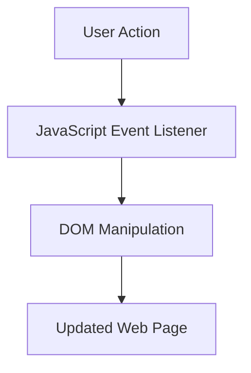

## 1.4 Importance of Interactive Websites

In today's digital age, the internet is an integral part of our daily lives, serving as a platform for communication, commerce, education, and entertainment. As the web continues to evolve, so do user expectations. Users now demand more than static pages with plain text and images; they seek engaging, dynamic, and interactive experiences. This is where interactive websites come into play, transforming the way we interact with online content.

### What Makes a Website Interactive?

An interactive website is one that responds to user actions, providing a dynamic experience that can include animations, real-time updates, and personalized content. Interactivity can be as simple as a button changing color when hovered over or as complex as a web application that processes user input and displays results instantly.

#### Key Features of Interactive Websites:

1. **Responsive Design**: Adjusts layout and content based on the user's device and screen size.
2. **Dynamic Content**: Updates in real-time without requiring a page reload.
3. **User Input Handling**: Processes forms, surveys, and other user inputs seamlessly.
4. **Animations and Transitions**: Enhances visual appeal and guides user attention.
5. **Interactive Elements**: Includes sliders, carousels, and modals that respond to user actions.

### Examples of Interactive Features

To better understand the concept of interactivity, let's explore some common interactive features that enhance user engagement:

#### 1. Sliders and Carousels

Sliders and carousels allow users to browse through images or content in a visually appealing manner. They are often used on homepages to showcase featured content or products.

```html
<div class="carousel">
  <div class="slide">Slide 1</div>
  <div class="slide">Slide 2</div>
  <div class="slide">Slide 3</div>
  <button class="prev">Previous</button>
  <button class="next">Next</button>
</div>
```

```javascript
const slides = document.querySelectorAll('.slide');
let currentIndex = 0;

document.querySelector('.next').addEventListener('click', () => {
  slides[currentIndex].classList.remove('active');
  currentIndex = (currentIndex + 1) % slides.length;
  slides[currentIndex].classList.add('active');
});

document.querySelector('.prev').addEventListener('click', () => {
  slides[currentIndex].classList.remove('active');
  currentIndex = (currentIndex - 1 + slides.length) % slides.length;
  slides[currentIndex].classList.add('active');
});
```

#### 2. Forms and Validation

Interactive forms provide immediate feedback to users, improving the data collection process. JavaScript can validate form inputs, ensuring data integrity before submission.

```html
<form id="contactForm">
  <input type="text" id="name" placeholder="Your Name" required>
  <input type="email" id="email" placeholder="Your Email" required>
  <button type="submit">Submit</button>
</form>
<div id="message"></div>
```

```javascript
document.getElementById('contactForm').addEventListener('submit', function(event) {
  event.preventDefault();
  const name = document.getElementById('name').value;
  const email = document.getElementById('email').value;
  if (name && email) {
    document.getElementById('message').innerText = 'Form submitted successfully!';
  } else {
    document.getElementById('message').innerText = 'Please fill out all fields.';
  }
});
```

#### 3. Modal Dialogs

Modals are pop-up elements that can display additional content or forms without navigating away from the current page. They are useful for alerts, confirmations, and user input.

```html
<div id="modal" class="modal">
  <div class="modal-content">
    <span class="close">&times;</span>
    <p>This is a modal dialog.</p>
  </div>
</div>
<button id="openModal">Open Modal</button>
```

```javascript
const modal = document.getElementById('modal');
const openModalButton = document.getElementById('openModal');
const closeModalButton = document.querySelector('.close');

openModalButton.addEventListener('click', () => {
  modal.style.display = 'block';
});

closeModalButton.addEventListener('click', () => {
  modal.style.display = 'none';
});

window.addEventListener('click', (event) => {
  if (event.target === modal) {
    modal.style.display = 'none';
  }
});
```

### Benefits of User Engagement and Retention

Interactive websites are not just about aesthetics; they play a crucial role in user engagement and retention. Let's explore how interactivity can benefit both users and website owners:

#### 1. Enhanced User Experience

Interactive elements make websites more engaging and enjoyable to use. They provide users with immediate feedback, making interactions feel more natural and intuitive. This leads to a more satisfying user experience, encouraging users to spend more time on the site.

#### 2. Increased User Retention

When users have a positive experience on a website, they are more likely to return. Interactive features can create a memorable experience that keeps users coming back for more. This is especially important for e-commerce sites, where repeat visits can lead to increased sales.

#### 3. Improved Accessibility

Interactive websites can be designed to be more accessible to users with disabilities. Features like keyboard navigation, screen reader compatibility, and adjustable text sizes can make a website more inclusive, broadening its audience.

#### 4. Better Conversion Rates

Interactivity can guide users through a conversion funnel, whether it's signing up for a newsletter, making a purchase, or filling out a contact form. By providing a smooth and engaging experience, interactive websites can increase conversion rates.

### How Interactivity Enhances User Experience

Interactivity is a key component of user experience (UX) design. It involves creating interfaces that are not only functional but also enjoyable to use. Let's delve into how interactivity enhances UX:

#### 1. Feedback and Responsiveness

Interactive websites provide immediate feedback to user actions. For example, when a user clicks a button, it might change color or display a loading animation. This responsiveness reassures users that their actions have been registered, reducing frustration and improving satisfaction.

#### 2. Personalization

Interactivity allows for personalized experiences. Websites can use data such as user preferences and browsing history to tailor content and recommendations. This makes users feel valued and understood, enhancing their overall experience.

#### 3. Intuitive Navigation

Interactive elements can simplify navigation, making it easier for users to find what they're looking for. Features like dropdown menus, search bars, and interactive maps guide users through the site efficiently.

#### 4. Engaging Storytelling

Interactivity can be used to tell a story or convey information in an engaging way. For example, interactive infographics and data visualizations can make complex information more digestible and interesting.

### JavaScript's Role in Enabling Interactivity

JavaScript is the backbone of interactive websites. It is a versatile programming language that enables developers to create dynamic and responsive web applications. Let's explore how JavaScript contributes to web interactivity:

#### 1. DOM Manipulation

JavaScript allows developers to manipulate the Document Object Model (DOM), which represents the structure of a web page. By changing the DOM, JavaScript can update content, styles, and attributes in real-time, creating a dynamic user experience.

```javascript
// Example of DOM manipulation
document.getElementById('myElement').innerText = 'Hello, World!';
```

#### 2. Event Handling

JavaScript can listen for and respond to user events such as clicks, keypresses, and mouse movements. This enables developers to create interactive elements that react to user input.

```javascript
// Example of event handling
document.getElementById('myButton').addEventListener('click', function() {
  alert('Button clicked!');
});
```

#### 3. Asynchronous Programming

JavaScript supports asynchronous programming, allowing developers to perform tasks like fetching data from a server without blocking the user interface. This is essential for creating smooth and responsive applications.

```javascript
// Example of asynchronous programming with fetch API
fetch('https://api.example.com/data')
  .then(response => response.json())
  .then(data => console.log(data))
  .catch(error => console.error('Error fetching data:', error));
```

#### 4. Libraries and Frameworks

JavaScript has a rich ecosystem of libraries and frameworks that simplify the development of interactive websites. Tools like jQuery, React, Angular, and Vue.js provide pre-built components and utilities for creating complex interactions with ease.

### Try It Yourself

To truly understand the power of interactivity, it's important to experiment with the concepts we've discussed. Here are a few exercises to get you started:

1. **Modify the Carousel**: Add more slides to the carousel example and customize the transition effects.
2. **Enhance the Form**: Implement additional validation rules for the form, such as checking for a valid email format.
3. **Create a New Modal**: Design a modal dialog that includes a form for user feedback and displays a thank-you message upon submission.

### Visual Aids

To help visualize the concepts discussed, let's look at a simple diagram of how JavaScript interacts with the DOM to create interactivity:



**Diagram Description**: This flowchart illustrates the process of interactivity on a web page. A user action triggers a JavaScript event listener, which manipulates the DOM to update the web page.

### References and Links

For further reading and exploration, consider the following resources:

- [MDN Web Docs: JavaScript Guide](https://developer.mozilla.org/en-US/docs/Web/JavaScript/Guide)
- [W3Schools: JavaScript Tutorial](https://www.w3schools.com/js/)
- [JavaScript.info: The Modern JavaScript Tutorial](https://javascript.info/)

### Engagement and Reinforcement

To reinforce your understanding of interactive websites, consider these questions and challenges:

- What are some other examples of interactive features you encounter on websites?
- How can you ensure that interactive elements are accessible to all users?
- Try building a simple interactive feature using JavaScript and share it with a friend for feedback.

### Key Takeaways

- Interactive websites provide a dynamic and engaging user experience.
- Common interactive features include sliders, forms, and modals.
- Interactivity enhances user engagement, retention, and conversion rates.
- JavaScript is essential for enabling interactivity through DOM manipulation, event handling, and asynchronous programming.
- Experimentation and practice are key to mastering the creation of interactive web experiences.

---

## Quiz Time!



### What is an interactive website?

- [x] A website that responds to user actions and provides a dynamic experience.
- [ ] A website with only static text and images.
- [ ] A website that requires no user input.
- [ ] A website that does not use JavaScript.

> **Explanation:** An interactive website responds to user actions, providing a dynamic experience through elements like animations, real-time updates, and personalized content.

### Which JavaScript feature allows for real-time updates without reloading the page?

- [x] DOM Manipulation
- [ ] CSS Styling
- [ ] HTML Markup
- [ ] Server-Side Rendering

> **Explanation:** JavaScript's ability to manipulate the DOM allows for real-time updates of web content without needing to reload the page.

### What is the role of event handling in interactive websites?

- [x] To listen for and respond to user actions.
- [ ] To style web pages.
- [ ] To create static content.
- [ ] To handle server-side requests.

> **Explanation:** Event handling in JavaScript involves listening for user actions like clicks and keypresses, allowing the website to respond interactively.

### How does interactivity improve user retention?

- [x] By providing a memorable and engaging experience.
- [ ] By increasing page load times.
- [ ] By reducing user input.
- [ ] By limiting content access.

> **Explanation:** Interactivity enhances user retention by creating a memorable and engaging experience, encouraging users to return to the website.

### Which of the following is a common interactive feature on websites?

- [x] Sliders
- [x] Forms
- [ ] Static Images
- [ ] Plain Text

> **Explanation:** Sliders and forms are common interactive features that enhance user engagement, while static images and plain text are non-interactive.

### What is the purpose of JavaScript libraries and frameworks?

- [x] To simplify the development of interactive websites.
- [ ] To create static HTML pages.
- [ ] To replace CSS styling.
- [ ] To handle server-side logic.

> **Explanation:** JavaScript libraries and frameworks provide pre-built components and utilities that simplify the development of interactive websites.

### How does JavaScript enhance accessibility on interactive websites?

- [x] By enabling features like keyboard navigation and screen reader compatibility.
- [ ] By increasing page load times.
- [ ] By limiting user input.
- [ ] By reducing content accessibility.

> **Explanation:** JavaScript can enhance accessibility by enabling features like keyboard navigation and screen reader compatibility, making websites more inclusive.

### Which of the following is an example of asynchronous programming in JavaScript?

- [x] Fetching data from a server without blocking the UI.
- [ ] Styling a webpage with CSS.
- [ ] Creating static HTML content.
- [ ] Writing server-side code.

> **Explanation:** Asynchronous programming in JavaScript allows tasks like fetching data from a server to be performed without blocking the user interface, ensuring a smooth experience.

### What is the benefit of using modals on a website?

- [x] To display additional content or forms without navigating away from the current page.
- [ ] To slow down page loading.
- [ ] To remove user input options.
- [ ] To create static content.

> **Explanation:** Modals are used to display additional content or forms without navigating away from the current page, enhancing user interaction.

### True or False: JavaScript is not necessary for creating interactive websites.

- [ ] True
- [x] False

> **Explanation:** False. JavaScript is essential for creating interactive websites as it enables dynamic content updates, event handling, and real-time user interactions.


