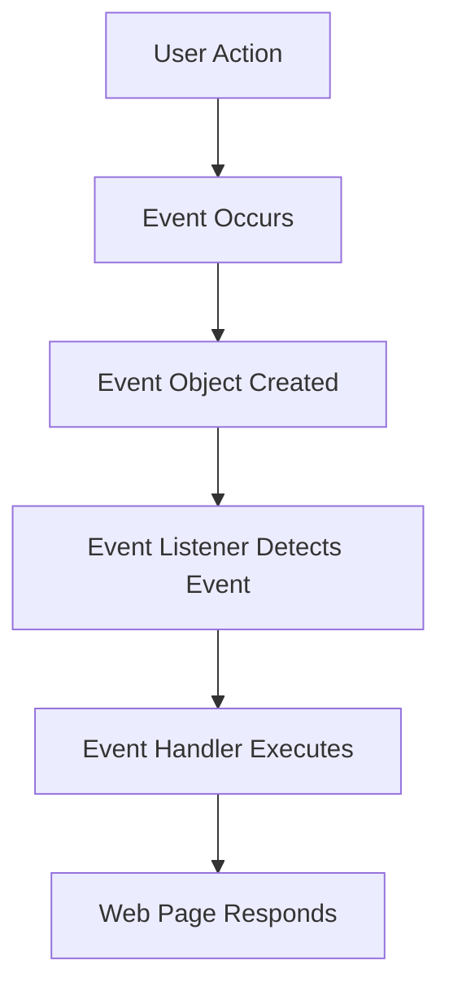

## 10.1 Understanding Events

In the world of web development, events are the heartbeat of interactivity. They are the signals that tell your web page something has happened, prompting it to respond. Whether it's a user clicking a button, submitting a form, or simply hovering over an element, events are the way your web page listens and reacts to these interactions. In this section, we'll delve into the concept of events, explore common types of events, and understand how they enable dynamic web experiences.

### What Are Events?

In the context of web development, an event is an action or occurrence that happens in the browser. These actions can be initiated by the user, like clicking a mouse button, pressing a key on the keyboard, or moving the mouse over an element. They can also be triggered by the browser itself, such as when a page finishes loading.

Events are the browser's way of communicating that something significant has occurred. They are the bridge between the user's actions and the web page's responses. By understanding and handling events, we can create web pages that are not only functional but also engaging and interactive.

### How Do Events Work?

When an event occurs, the browser creates an event object that contains information about the event. This object is then passed to the event handler, a function that is designed to respond to the event. The event handler can access the event object to determine details about the event, such as which element triggered it, what type of event it was, and any additional data associated with it.

Here's a simple analogy: Imagine you're at a concert, and the band finishes a song. The audience claps, which is the event. The band hears the clapping (the event listener) and responds by playing another song (the event handler). In this way, events allow web pages to listen to user actions and respond accordingly.

### Common Types of Events

There are numerous events that can occur in a web page, each representing a different type of interaction or occurrence. Let's explore some of the most common events you'll encounter in web development:

- **Click Event (`click`)**: Triggered when an element is clicked. This is one of the most frequently used events, as it allows users to interact with buttons, links, and other clickable elements.

- **Submit Event (`submit`)**: Occurs when a form is submitted. This event is crucial for handling form data and performing actions like sending information to a server.

- **Load Event (`load`)**: Fired when a page or an image has fully loaded. This event is useful for executing scripts that depend on the entire page being available.

- **Keydown Event (`keydown`)**: Triggered when a key is pressed down. This event is often used for keyboard shortcuts or capturing user input.

- **Mouseover Event (`mouseover`)**: Occurs when the mouse pointer enters an element. This event is commonly used for creating hover effects.

### Code Example: Handling a Click Event

Let's look at a simple example of handling a click event in JavaScript. We'll create a button that, when clicked, displays an alert message.

```html
<!DOCTYPE html>
<html lang="en">
<head>
    <meta charset="UTF-8">
    <meta name="viewport" content="width=device-width, initial-scale=1.0">
    <title>Click Event Example</title>
</head>
<body>
    <button id="myButton">Click Me!</button>

    <script>
        // Select the button element
        const button = document.getElementById('myButton');

        // Add a click event listener to the button
        button.addEventListener('click', function() {
            // Display an alert message when the button is clicked
            alert('Button was clicked!');
        });
    </script>
</body>
</html>
```

**Explanation**: In this example, we first select the button element using `document.getElementById()`. We then use `addEventListener()` to attach a click event listener to the button. When the button is clicked, the event handler function is executed, displaying an alert message.

### The Role of Events in Web Interactivity

Events are fundamental to creating interactive web experiences. They allow web pages to respond dynamically to user actions, making the experience more engaging and intuitive. Without events, web pages would be static and unresponsive, unable to adapt to the user's needs.

Consider a simple form on a web page. Without events, the form would just sit there, unable to process user input or provide feedback. By handling events like `submit` and `input`, we can validate the user's input, display error messages, and send the data to a server for processing.

### Visualizing Events with Mermaid.js

To better understand how events work, let's visualize the process using a flowchart. This diagram represents the flow of an event from occurrence to handling.



**Description**: This flowchart illustrates the lifecycle of an event. It starts with a user action, such as a click or key press, which triggers an event. The browser creates an event object and passes it to the event listener. The event listener detects the event and calls the event handler, which executes the appropriate response.

### Try It Yourself: Experiment with Events

Now that we've covered the basics of events, it's time to experiment on your own. Try modifying the code example above to handle different types of events. Here are a few ideas:

- Change the event type from `click` to `mouseover` and see how the behavior changes.
- Add a new button and attach a `dblclick` (double-click) event to it.
- Create an input field and handle the `keydown` event to display the key that was pressed.

### The Importance of Events in Interactive Web Design

Events are not just a technical concept; they are a crucial part of web design. They enable designers and developers to create experiences that are responsive, intuitive, and engaging. By understanding and leveraging events, we can build web pages that feel alive, responding to the user's every move.

Imagine a web page without events. It would be like a book that you can only read but never interact with. Events bring web pages to life, allowing users to engage with the content in meaningful ways.

### Summary

In this section, we've explored the concept of events in web development. We've learned that events are actions or occurrences detected by the browser, allowing web pages to respond dynamically to user interactions. We've covered common types of events, such as `click`, `submit`, `load`, `keydown`, and `mouseover`, and seen how they can be used to create interactive web experiences.

Events are the foundation of interactivity on the web. They enable web pages to listen and react to user actions, making the experience more engaging and intuitive. By understanding and handling events, we can create web pages that are not only functional but also enjoyable to use.

### Further Reading

To deepen your understanding of events, consider exploring the following resources:

- [MDN Web Docs: Introduction to Events](https://developer.mozilla.org/en-US/docs/Learn/JavaScript/Building_blocks/Events)
- [W3Schools: JavaScript Events](https://www.w3schools.com/js/js_events.asp)

These resources provide additional examples and explanations to help you master the concept of events in web development.

## Quiz Time!



### What is an event in the context of web development?

- [x] An action or occurrence detected by the browser
- [ ] A function that executes when a page loads
- [ ] A style applied to an HTML element
- [ ] A type of data stored in a database

> **Explanation:** An event is an action or occurrence detected by the browser, such as a click or key press.

### Which method is used to attach an event handler to an element?

- [x] `addEventListener()`
- [ ] `attachEvent()`
- [ ] `bindEvent()`
- [ ] `setEventHandler()`

> **Explanation:** `addEventListener()` is the method used to attach an event handler to an element in modern web development.

### What type of event is triggered when a form is submitted?

- [x] `submit`
- [ ] `click`
- [ ] `load`
- [ ] `keydown`

> **Explanation:** The `submit` event is triggered when a form is submitted.

### Which event occurs when the mouse pointer enters an element?

- [x] `mouseover`
- [ ] `mouseout`
- [ ] `mouseenter`
- [ ] `mouseleave`

> **Explanation:** The `mouseover` event occurs when the mouse pointer enters an element.

### What is the purpose of the event object in JavaScript?

- [x] To provide information about the event
- [ ] To store data in the browser
- [ ] To style HTML elements
- [ ] To create new HTML elements

> **Explanation:** The event object provides information about the event, such as the type of event and the element that triggered it.

### Which event is commonly used to create hover effects?

- [x] `mouseover`
- [ ] `click`
- [ ] `keydown`
- [ ] `load`

> **Explanation:** The `mouseover` event is commonly used to create hover effects.

### What happens when an event occurs in the browser?

- [x] An event object is created
- [ ] A new HTML element is added
- [ ] The page reloads
- [ ] A style is applied

> **Explanation:** When an event occurs, the browser creates an event object containing details about the event.

### Which event is triggered when a page or image has fully loaded?

- [x] `load`
- [ ] `click`
- [ ] `submit`
- [ ] `keydown`

> **Explanation:** The `load` event is triggered when a page or an image has fully loaded.

### What is the role of an event handler?

- [x] To execute a function in response to an event
- [ ] To style HTML elements
- [ ] To create new HTML elements
- [ ] To store data in the browser

> **Explanation:** An event handler executes a function in response to an event, allowing the web page to react to user actions.

### True or False: Events are only triggered by user actions.

- [ ] True
- [x] False

> **Explanation:** Events can be triggered by both user actions and browser occurrences, such as a page loading.


