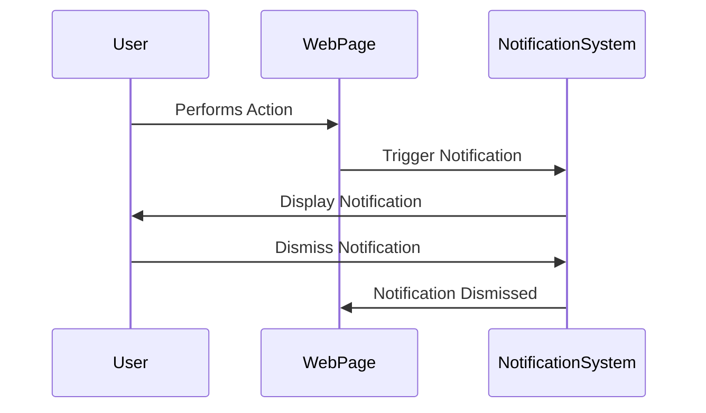

## 10.10 Enhancing User Experience with Feedback

In web development, providing feedback to users is crucial for creating an engaging and intuitive experience. Feedback mechanisms inform users about the results of their actions, guide them through processes, and alert them to errors or important information. In this section, we will explore how to use JavaScript to enhance user experience with feedback through alerts, confirmations, and custom notifications.

### Understanding Basic Dialog Functions

JavaScript provides built-in dialog functions that are simple yet effective for providing immediate feedback to users. These functions include `alert()`, `confirm()`, and `prompt()`. Let's explore each of these functions and understand their usage and limitations.

#### Alert Dialog

The `alert()` function is used to display a simple message to the user. It is often used to convey information or warnings. When an alert is triggered, it displays a dialog box with the specified message and an "OK" button.

```javascript
// Displaying an alert message
alert("This is an alert message!");
```

**Limitations of Alert:**
- Alerts are modal dialogs, meaning they block user interaction with the rest of the page until the dialog is closed.
- They are not customizable in terms of appearance or behavior.
- Overusing alerts can be disruptive and annoying to users.

#### Confirm Dialog

The `confirm()` function is used to display a dialog box with a message and two buttons: "OK" and "Cancel". It is typically used to confirm an action from the user.

```javascript
// Displaying a confirmation dialog
let userResponse = confirm("Do you wish to proceed?");
if (userResponse) {
    console.log("User chose to proceed.");
} else {
    console.log("User canceled the action.");
}
```

**Limitations of Confirm:**
- Like alerts, confirm dialogs are modal and block interaction with the page.
- They provide limited customization options.
- The binary choice of "OK" and "Cancel" may not suit all scenarios.

#### Prompt Dialog

The `prompt()` function is used to display a dialog box that prompts the user to input a value. It includes a text input field and "OK" and "Cancel" buttons.

```javascript
// Displaying a prompt dialog
let userName = prompt("Please enter your name:");
if (userName) {
    console.log(`Hello, ${userName}!`);
} else {
    console.log("User did not enter a name.");
}
```

**Limitations of Prompt:**
- Prompts are also modal dialogs.
- They offer minimal customization.
- User input is limited to a single text field.

### Creating Custom Notifications

While built-in dialog functions are useful for simple feedback, they lack flexibility and customization. To create a more engaging user experience, we can build custom notifications using HTML, CSS, and JavaScript. Custom notifications can be styled to match the design of your website and can include more complex interactions.

#### Building a Simple Notification

Let's create a simple notification system that displays messages to users in response to actions. We'll use HTML for the structure, CSS for styling, and JavaScript for functionality.

**HTML Structure:**

```html
<!-- Notification Container -->
<div id="notification" class="notification hidden">
    <span id="notification-message"></span>
    <button id="close-notification">Close</button>
</div>
```

**CSS Styling:**

```css
/* Notification Styles */
.notification {
    position: fixed;
    top: 20px;
    right: 20px;
    background-color: #333;
    color: #fff;
    padding: 15px;
    border-radius: 5px;
    box-shadow: 0 0 10px rgba(0, 0, 0, 0.1);
    display: flex;
    align-items: center;
    justify-content: space-between;
    transition: opacity 0.3s ease;
}

.hidden {
    opacity: 0;
    pointer-events: none;
}
```

**JavaScript Functionality:**

```javascript
// Function to show notification
function showNotification(message) {
    const notification = document.getElementById('notification');
    const notificationMessage = document.getElementById('notification-message');
    notificationMessage.textContent = message;
    notification.classList.remove('hidden');

    // Hide notification after 3 seconds
    setTimeout(() => {
        notification.classList.add('hidden');
    }, 3000);
}

// Close button functionality
document.getElementById('close-notification').addEventListener('click', () => {
    document.getElementById('notification').classList.add('hidden');
});

// Example usage
showNotification("This is a custom notification!");
```

**Try It Yourself:**
- Modify the CSS to change the background color and font style of the notification.
- Add an icon to the notification for visual enhancement.
- Experiment with different positions for the notification (e.g., bottom-left, center).

### Best Practices for User Feedback

When implementing feedback mechanisms, it's important to follow best practices to ensure a positive user experience. Here are some guidelines to consider:

#### Provide Clear and Helpful Feedback

- **Be Specific:** Ensure that messages are clear and specific to the action or event. Avoid vague or generic messages.
- **Use Positive Language:** Frame messages positively to encourage users. For example, instead of "Error: Invalid input," use "Please enter a valid input."
- **Guide the User:** Provide guidance on what the user should do next, especially in error messages.

#### Avoid Overwhelming the User

- **Limit Frequency:** Avoid bombarding users with too many messages in a short period. This can lead to frustration and message fatigue.
- **Prioritize Messages:** Determine which messages are most important and prioritize their display. Consider using different notification types for different levels of importance (e.g., info, warning, error).
- **Allow Dismissal:** Provide users with the option to dismiss notifications or alerts, giving them control over their experience.

#### Customize for Your Audience

- **Match Your Brand:** Customize the appearance of notifications to align with your brand's design and tone.
- **Consider Accessibility:** Ensure that feedback mechanisms are accessible to all users, including those with disabilities. Use ARIA roles and properties where necessary.

### Advanced Custom Notifications

For more advanced feedback mechanisms, consider using libraries or frameworks that offer pre-built components and animations. Libraries such as Toastify, SweetAlert, and Noty provide customizable and visually appealing notifications.

#### Example with SweetAlert

SweetAlert is a popular library for creating beautiful and customizable alerts. Here's a simple example of how to use SweetAlert for a confirmation dialog:

```html
<!-- Include SweetAlert library -->
<script src="https://cdn.jsdelivr.net/npm/sweetalert2@11"></script>
```

```javascript
// Using SweetAlert for a confirmation dialog
Swal.fire({
    title: 'Are you sure?',
    text: "You won't be able to revert this!",
    icon: 'warning',
    showCancelButton: true,
    confirmButtonColor: '#3085d6',
    cancelButtonColor: '#d33',
    confirmButtonText: 'Yes, delete it!'
}).then((result) => {
    if (result.isConfirmed) {
        Swal.fire(
            'Deleted!',
            'Your file has been deleted.',
            'success'
        );
    }
});
```

**Try It Yourself:**
- Experiment with different SweetAlert configurations, such as changing the icon or adding custom buttons.
- Integrate SweetAlert into a form submission process to confirm user actions.

### Visualizing Feedback Mechanisms

To better understand how feedback mechanisms fit into the user experience, let's visualize the flow of a simple feedback system using a sequence diagram.



**Diagram Description:**
- The user performs an action on the web page.
- The web page triggers the notification system to display feedback.
- The notification system displays the notification to the user.
- The user can dismiss the notification, and the system acknowledges the dismissal.

### Conclusion

Enhancing user experience with feedback is a vital aspect of web development. By using JavaScript to implement alerts, confirmations, and custom notifications, you can provide users with clear and helpful feedback that guides them through interactions on your web page. Remember to follow best practices to ensure that feedback mechanisms are effective and not overwhelming. With these tools and techniques, you can create a more engaging and user-friendly web experience.

## Quiz Time!



### What is the primary purpose of the `alert()` function in JavaScript?

- [x] To display a simple message to the user
- [ ] To confirm an action from the user
- [ ] To prompt the user for input
- [ ] To create custom notifications

> **Explanation:** The `alert()` function is used to display a simple message to the user in a modal dialog box.

### Which function is used to ask the user for confirmation in JavaScript?

- [ ] alert()
- [x] confirm()
- [ ] prompt()
- [ ] notify()

> **Explanation:** The `confirm()` function is used to display a dialog box with "OK" and "Cancel" buttons, asking the user for confirmation.

### What is a limitation of using built-in JavaScript dialog functions like `alert()`?

- [x] They block user interaction with the page
- [ ] They are highly customizable
- [ ] They can display complex HTML content
- [ ] They are asynchronous

> **Explanation:** Built-in dialog functions like `alert()` are modal and block user interaction with the rest of the page until the dialog is closed.

### How can you create a custom notification system using HTML, CSS, and JavaScript?

- [x] By using HTML for structure, CSS for styling, and JavaScript for functionality
- [ ] By using only JavaScript
- [ ] By using CSS animations only
- [ ] By using built-in browser dialogs

> **Explanation:** A custom notification system can be created using HTML for the structure, CSS for styling, and JavaScript for adding functionality.

### What is a best practice when providing feedback to users?

- [x] Provide clear and specific messages
- [ ] Overwhelm users with frequent messages
- [ ] Use vague language
- [ ] Avoid allowing users to dismiss notifications

> **Explanation:** Providing clear and specific messages helps users understand the feedback and what actions they need to take.

### Which library can be used to create beautiful and customizable alerts?

- [ ] Bootstrap
- [x] SweetAlert
- [ ] jQuery
- [ ] React

> **Explanation:** SweetAlert is a library that provides beautiful and customizable alert dialogs.

### What should you consider when designing feedback mechanisms for accessibility?

- [x] Use ARIA roles and properties
- [ ] Ignore color contrast
- [ ] Use only text-based notifications
- [ ] Avoid providing dismiss options

> **Explanation:** Using ARIA roles and properties ensures that feedback mechanisms are accessible to users with disabilities.

### What is the role of the `setTimeout()` function in custom notifications?

- [x] To hide the notification after a certain period
- [ ] To display the notification immediately
- [ ] To block user interaction
- [ ] To create a modal dialog

> **Explanation:** The `setTimeout()` function can be used to hide a notification after a specified period, enhancing user experience.

### Which of the following is NOT a limitation of the `prompt()` function?

- [ ] It is modal
- [ ] It blocks user interaction
- [ ] It offers minimal customization
- [x] It can display complex HTML content

> **Explanation:** The `prompt()` function is modal, blocks user interaction, and offers minimal customization, but it cannot display complex HTML content.

### True or False: Custom notifications can be styled to match the design of your website.

- [x] True
- [ ] False

> **Explanation:** Custom notifications can be styled using CSS to match the design and branding of your website.


