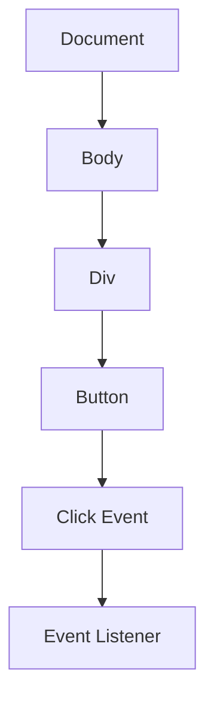

## 10.2 Event Listeners and Handlers

In the world of web development, creating static web pages is just the beginning. To make your web pages dynamic and interactive, you need to understand how to respond to user actions such as clicks, key presses, and mouse movements. This is where event listeners and handlers come into play. In this section, we will explore what event listeners and handlers are, how to use them effectively with JavaScript, and why they are essential for building interactive web applications.

### Understanding Events in JavaScript

Before diving into event listeners and handlers, let's first understand what an event is. In the context of web development, an event is an action or occurrence that happens in the browser, which the browser can detect. Examples of events include:

- Clicking a button
- Hovering over an element
- Submitting a form
- Pressing a key on the keyboard
- Loading a web page

Each of these actions can trigger a specific response in your web application, allowing you to create a more engaging user experience.

### What are Event Listeners and Handlers?

**Event Listeners** are functions that wait for a specific event to occur on a particular element. When the event occurs, the event listener executes a block of code, known as the **Event Handler**. The event handler is the function that contains the code you want to run in response to the event.

### Introducing the `addEventListener()` Method

The `addEventListener()` method is a powerful way to attach event listeners to HTML elements. It allows you to specify the type of event you want to listen for and the function that should be executed when that event occurs.

#### Syntax of `addEventListener()`

The basic syntax of the `addEventListener()` method is as follows:

```javascript
element.addEventListener(eventType, eventHandler, useCapture);
```

- **`element`**: The DOM element you want to attach the event listener to.
- **`eventType`**: A string representing the type of event to listen for (e.g., 'click', 'mouseover', 'keydown').
- **`eventHandler`**: The function that will be called when the event occurs.
- **`useCapture`** (optional): A boolean value indicating whether the event should be captured in the capturing phase (default is `false`).

### Basic Example of Attaching an Event Listener

Let's look at a simple example of how to attach an event listener to a button element. We'll create a button that, when clicked, displays an alert message.

```html
<!DOCTYPE html>
<html lang="en">
<head>
    <meta charset="UTF-8">
    <meta name="viewport" content="width=device-width, initial-scale=1.0">
    <title>Event Listener Example</title>
</head>
<body>
    <button id="myButton">Click Me!</button>

    <script>
        // Select the button element
        const button = document.getElementById('myButton');

        // Attach a click event listener to the button
        button.addEventListener('click', function(event) {
            alert('Button was clicked!');
        });
    </script>
</body>
</html>
```

**Explanation**: In this example, we first select the button element using `document.getElementById()`. We then use `addEventListener()` to attach a click event listener to the button. When the button is clicked, the event handler function is executed, displaying an alert message.

### Parameters of `addEventListener()`

Let's dive deeper into the parameters of the `addEventListener()` method:

1. **Event Type**: This is a string that specifies the type of event you want to listen for. Common event types include:
   - `'click'`: Triggered when an element is clicked.
   - `'mouseover'`: Triggered when the mouse pointer is over an element.
   - `'keydown'`: Triggered when a key is pressed down.
   - `'submit'`: Triggered when a form is submitted.

2. **Event Handler**: This is the function that will be executed when the event occurs. It can be an anonymous function, as shown in the example above, or a named function.

3. **Use Capture**: This optional boolean parameter determines whether the event should be captured during the capturing phase. By default, events are handled in the bubbling phase, meaning they propagate from the target element up to the root. Setting `useCapture` to `true` changes this behavior to capture the event from the root down to the target element.

### Inline Event Handlers vs. `addEventListener`

In the early days of JavaScript, event handlers were often defined inline within HTML elements using attributes like `onclick`, `onmouseover`, etc. Here's an example of an inline event handler:

```html
<button onclick="alert('Button was clicked!')">Click Me!</button>
```

While inline event handlers are simple to use, they have several drawbacks:

- **Mixing HTML and JavaScript**: Inline event handlers mix HTML and JavaScript code, making the code harder to read and maintain.
- **Limited to One Handler**: You can only attach one event handler per event type using inline attributes.
- **Lack of Flexibility**: Inline handlers are less flexible and harder to manage in larger applications.

Using `addEventListener()` offers several advantages:

- **Separation of Concerns**: By keeping HTML and JavaScript separate, your code becomes cleaner and easier to maintain.
- **Multiple Handlers**: You can attach multiple event listeners to a single element for the same event type.
- **Dynamic Attachment**: Event listeners can be added or removed dynamically, providing greater flexibility.

### Benefits of Using `addEventListener`

Using `addEventListener()` is considered a best practice in modern web development. Here are some of the benefits:

- **Cleaner Code**: Separating HTML and JavaScript code improves readability and maintainability.
- **Flexibility**: You can easily add or remove event listeners as needed.
- **Multiple Handlers**: Attach multiple event listeners to a single element without overwriting existing handlers.
- **Cross-Browser Compatibility**: `addEventListener()` is supported by all modern browsers, ensuring consistent behavior across different platforms.

### Encouraging Best Practices

As you begin to build more complex web applications, it's important to adopt best practices for writing clean and efficient code. Here are a few tips to keep in mind:

- **Use `addEventListener()`**: Avoid inline event handlers and use `addEventListener()` to attach event listeners.
- **Keep Functions Separate**: Define event handler functions separately from the `addEventListener()` call to improve readability.
- **Use Descriptive Names**: Give your event handler functions descriptive names that reflect their purpose.
- **Remove Unused Listeners**: If an event listener is no longer needed, remove it using `removeEventListener()` to improve performance.

### Try It Yourself

Now that you've learned the basics of event listeners and handlers, it's time to put your knowledge into practice. Try modifying the example code to add more interactivity:

- Change the alert message to display the current date and time.
- Add a second button that changes the background color of the page when clicked.
- Experiment with different event types, such as `'mouseover'` or `'keydown'`.

### Visualizing Event Flow

To better understand how events propagate through the DOM, let's visualize the event flow using a Mermaid.js diagram.



**Description**: This diagram represents the flow of a click event from the button element up through the DOM hierarchy to the document. The event listener is attached to the button, and the event is captured and handled at that level.

### Key Takeaways

- **Event Listeners**: Functions that wait for a specific event to occur on an element.
- **Event Handlers**: Functions that execute code in response to an event.
- **`addEventListener()`**: A method to attach event listeners to elements, providing a cleaner and more flexible approach than inline event handlers.
- **Separation of Concerns**: Keeping HTML and JavaScript separate improves code readability and maintainability.
- **Best Practices**: Use descriptive function names, keep functions separate, and remove unused listeners to write clean and efficient code.

By mastering event listeners and handlers, you can create interactive and engaging web applications that respond to user actions in real-time. Keep experimenting with different events and handlers to discover new ways to enhance your web pages.

## Quiz Time!



### What is an event listener in JavaScript?

- [x] A function that waits for a specific event to occur on an element
- [ ] A method that creates HTML elements
- [ ] A CSS property that styles elements
- [ ] A JavaScript object that stores data

> **Explanation:** An event listener is a function that waits for a specific event to occur on an element and then executes a block of code.

### What method is used to attach an event listener to an element?

- [x] `addEventListener()`
- [ ] `attachEvent()`
- [ ] `bindEvent()`
- [ ] `connectEvent()`

> **Explanation:** The `addEventListener()` method is used to attach an event listener to an element.

### What is the third parameter of the `addEventListener()` method?

- [ ] Event type
- [ ] Event handler
- [x] Use capture
- [ ] Event object

> **Explanation:** The third parameter of the `addEventListener()` method is `useCapture`, which determines whether the event should be captured during the capturing phase.

### What is the advantage of using `addEventListener()` over inline event handlers?

- [x] Allows multiple handlers for the same event type
- [ ] Requires less code
- [ ] Only works in modern browsers
- [ ] Is easier to write

> **Explanation:** `addEventListener()` allows multiple handlers for the same event type, providing more flexibility compared to inline event handlers.

### How can you remove an event listener?

- [x] Using `removeEventListener()`
- [ ] Using `detachEvent()`
- [ ] Using `unbindEvent()`
- [ ] Using `disconnectEvent()`

> **Explanation:** You can remove an event listener using the `removeEventListener()` method.

### Which of the following is NOT a common event type?

- [ ] 'click'
- [ ] 'mouseover'
- [ ] 'keydown'
- [x] 'hover'

> **Explanation:** 'hover' is not a common event type; 'mouseover' is used for hover actions.

### Why is it important to separate HTML and JavaScript code?

- [x] To improve readability and maintainability
- [ ] To make the code run faster
- [ ] To reduce file size
- [ ] To ensure browser compatibility

> **Explanation:** Separating HTML and JavaScript code improves readability and maintainability, making it easier to manage and update.

### What happens when you set `useCapture` to `true`?

- [x] The event is captured during the capturing phase
- [ ] The event is ignored
- [ ] The event is canceled
- [ ] The event is handled in the bubbling phase

> **Explanation:** Setting `useCapture` to `true` captures the event during the capturing phase, starting from the root down to the target element.

### What is the role of an event handler?

- [x] To execute code in response to an event
- [ ] To create new HTML elements
- [ ] To style elements with CSS
- [ ] To store data in JavaScript

> **Explanation:** An event handler is a function that executes code in response to an event.

### True or False: `addEventListener()` can only be used with click events.

- [ ] True
- [x] False

> **Explanation:** False. `addEventListener()` can be used with various event types, not just click events.


