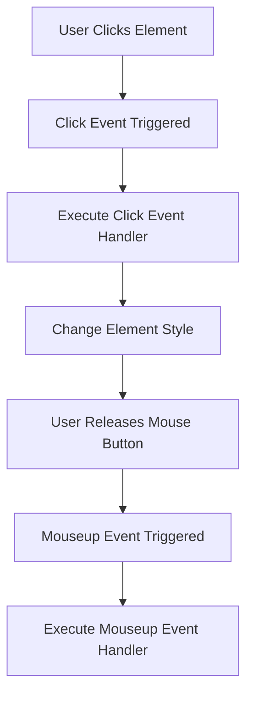

## 10.3 Mouse Events

In this section, we will delve into the fascinating world of mouse events in JavaScript. Mouse events are a crucial aspect of creating interactive web pages, allowing us to respond to user actions such as clicks, hovers, and drags. By the end of this chapter, you'll have a solid understanding of how to handle these events and enhance the user experience on your web pages.

### Understanding Mouse Events

Mouse events are actions triggered by the user's interaction with the mouse. These events can be captured and handled using JavaScript to create dynamic and responsive web pages. Let's explore some of the most common mouse events:

- **`click`**: Triggered when the user clicks on an element.
- **`dblclick`**: Triggered when the user double-clicks on an element.
- **`mousedown`**: Triggered when the mouse button is pressed down on an element.
- **`mouseup`**: Triggered when the mouse button is released over an element.
- **`mouseover`**: Triggered when the mouse pointer enters an element.
- **`mouseout`**: Triggered when the mouse pointer leaves an element.
- **`mousemove`**: Triggered when the mouse pointer moves within an element.

### Handling Mouse Events

To handle mouse events in JavaScript, we use the `addEventListener` method. This method allows us to attach an event handler function to an element, which will be executed when the specified event occurs. Let's look at some examples:

#### Example 1: Handling a Click Event

```javascript
// Select the element you want to attach the event to
const button = document.querySelector('#myButton');

// Add an event listener for the 'click' event
button.addEventListener('click', function(event) {
    alert('Button clicked!');
});
```

In this example, we select a button element with the ID `myButton` and attach a `click` event listener to it. When the button is clicked, an alert box will appear with the message "Button clicked!".

#### Example 2: Handling a Mouseover Event

```javascript
// Select the element you want to attach the event to
const box = document.querySelector('.hoverBox');

// Add an event listener for the 'mouseover' event
box.addEventListener('mouseover', function(event) {
    box.style.backgroundColor = 'lightblue';
});

// Add an event listener for the 'mouseout' event to revert the change
box.addEventListener('mouseout', function(event) {
    box.style.backgroundColor = '';
});
```

In this example, we change the background color of a box when the mouse hovers over it and revert the change when the mouse leaves the box.

### Practical Applications of Mouse Events

Mouse events can be used to create a variety of interactive features on a web page. Let's explore some practical applications:

#### Changing Styles on Hover

One common use of mouse events is to change the style of an element when the mouse hovers over it. This can be used to create interactive buttons, menus, and more.

```javascript
const menuItems = document.querySelectorAll('.menu-item');

menuItems.forEach(item => {
    item.addEventListener('mouseover', function() {
        item.style.color = 'red';
    });

    item.addEventListener('mouseout', function() {
        item.style.color = '';
    });
});
```

In this example, we change the text color of menu items to red when the mouse hovers over them and revert the color when the mouse leaves.

#### Implementing Drag-and-Drop

Mouse events can also be used to implement drag-and-drop functionality. This involves handling the `mousedown`, `mousemove`, and `mouseup` events to allow users to drag elements around the page.

```javascript
const draggable = document.querySelector('.draggable');

let isDragging = false;

draggable.addEventListener('mousedown', function(event) {
    isDragging = true;
    draggable.style.position = 'absolute';
});

document.addEventListener('mousemove', function(event) {
    if (isDragging) {
        draggable.style.left = event.clientX + 'px';
        draggable.style.top = event.clientY + 'px';
    }
});

document.addEventListener('mouseup', function() {
    isDragging = false;
});
```

In this example, we make an element draggable by updating its position based on the mouse's coordinates while the mouse button is held down.

### Exploring Mouse Event Properties

When handling mouse events, we can access various properties of the event object to get information about the event. Some useful properties include:

- **`event.clientX`**: The horizontal coordinate of the mouse pointer relative to the viewport.
- **`event.clientY`**: The vertical coordinate of the mouse pointer relative to the viewport.
- **`event.button`**: The button number that was pressed (0 for left button, 1 for middle button, 2 for right button).
- **`event.altKey`**, **`event.ctrlKey`**, **`event.shiftKey`**: Boolean values indicating whether the Alt, Ctrl, or Shift keys were pressed during the event.

#### Example: Using Mouse Event Properties

```javascript
document.addEventListener('click', function(event) {
    console.log('Mouse X: ' + event.clientX);
    console.log('Mouse Y: ' + event.clientY);
    console.log('Button: ' + event.button);
    console.log('Alt Key: ' + event.altKey);
});
```

In this example, we log the mouse coordinates, button number, and whether the Alt key was pressed when a click event occurs.

### Try It Yourself

To better understand mouse events, try experimenting with the examples provided. Modify the code to see how different events and properties affect the behavior of the elements. Here are some ideas to get you started:

- Change the background color of an element when the mouse is pressed down and revert it when the mouse is released.
- Create a simple drawing application where users can draw on a canvas by dragging the mouse.
- Implement a tooltip that appears when the mouse hovers over an element.

### Visualizing Mouse Events

To help visualize how mouse events work, let's look at a flowchart that represents the sequence of events when a user interacts with an element using the mouse.



This flowchart illustrates the sequence of events from clicking an element to executing the event handlers associated with the `click` and `mouseup` events.

### Key Takeaways

- Mouse events are triggered by user interactions with the mouse and can be handled using JavaScript.
- Common mouse events include `click`, `dblclick`, `mousedown`, `mouseup`, `mouseover`, `mouseout`, and `mousemove`.
- The `addEventListener` method is used to attach event handlers to elements.
- Mouse events can be used to create interactive features such as changing styles on hover and implementing drag-and-drop.
- The event object provides useful properties such as `event.clientX` and `event.clientY` to get information about the event.

### Further Reading

For more information on mouse events and event handling in JavaScript, check out the following resources:

- [MDN Web Docs: MouseEvent](https://developer.mozilla.org/en-US/docs/Web/API/MouseEvent)
- [W3Schools: JavaScript Events](https://www.w3schools.com/js/js_events.asp)

## Quiz Time!



### Which mouse event is triggered when the mouse pointer enters an element?

- [ ] click
- [ ] dblclick
- [x] mouseover
- [ ] mouseout

> **Explanation:** The `mouseover` event is triggered when the mouse pointer enters an element.

### What method is used to attach an event handler to an element?

- [ ] addHandler
- [x] addEventListener
- [ ] attachEvent
- [ ] bindEvent

> **Explanation:** The `addEventListener` method is used to attach an event handler to an element.

### Which property of the event object gives the horizontal coordinate of the mouse pointer?

- [x] event.clientX
- [ ] event.clientY
- [ ] event.pageX
- [ ] event.screenX

> **Explanation:** The `event.clientX` property gives the horizontal coordinate of the mouse pointer relative to the viewport.

### How can you change the background color of an element when the mouse hovers over it?

- [x] Use the `mouseover` event to change the background color.
- [ ] Use the `click` event to change the background color.
- [ ] Use the `dblclick` event to change the background color.
- [ ] Use the `mouseout` event to change the background color.

> **Explanation:** The `mouseover` event can be used to change the background color of an element when the mouse hovers over it.

### Which mouse event is triggered when the user double-clicks on an element?

- [ ] click
- [x] dblclick
- [ ] mousedown
- [ ] mouseup

> **Explanation:** The `dblclick` event is triggered when the user double-clicks on an element.

### What does the `event.button` property represent?

- [x] The button number that was pressed during the event.
- [ ] The number of times the button was clicked.
- [ ] The total number of buttons on the mouse.
- [ ] The button's label.

> **Explanation:** The `event.button` property represents the button number that was pressed during the event.

### Which event is triggered when the mouse button is released over an element?

- [ ] mousedown
- [ ] mouseover
- [ ] mousemove
- [x] mouseup

> **Explanation:** The `mouseup` event is triggered when the mouse button is released over an element.

### What is a practical application of mouse events?

- [x] Implementing drag-and-drop functionality.
- [ ] Creating static web pages.
- [ ] Writing server-side code.
- [ ] Designing database schemas.

> **Explanation:** Mouse events can be used to implement drag-and-drop functionality, among other interactive features.

### Which property indicates whether the Alt key was pressed during a mouse event?

- [ ] event.ctrlKey
- [x] event.altKey
- [ ] event.shiftKey
- [ ] event.metaKey

> **Explanation:** The `event.altKey` property indicates whether the Alt key was pressed during a mouse event.

### True or False: The `mousemove` event is triggered when the mouse pointer moves within an element.

- [x] True
- [ ] False

> **Explanation:** The `mousemove` event is indeed triggered when the mouse pointer moves within an element.


