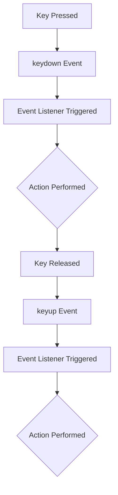

## 10.4 Keyboard Events

In this section, we delve into the fascinating world of keyboard events in JavaScript. Keyboard events allow us to respond to user input from the keyboard, enabling a wide range of interactive features on web pages. Whether you're building a form with real-time validation, implementing keyboard shortcuts for efficiency, or creating a game that relies on keyboard controls, understanding keyboard events is essential.

### Introduction to Keyboard Events

JavaScript provides three primary keyboard events that we can use to capture and respond to keyboard input:

- **`keydown`**: This event is triggered when a key is pressed down.
- **`keyup`**: This event occurs when a key is released.
- **`keypress`**: This event is fired when a key that produces a character value is pressed down.

Let's explore each of these events in detail and understand how they differ from one another.

### Keydown, Keyup, and Keypress: Understanding the Differences

#### Keydown

The `keydown` event is triggered as soon as a key is pressed down. It is one of the most commonly used keyboard events because it captures the initial press of a key, allowing you to respond immediately to user input.

- **Use Case**: Ideal for real-time applications like games, where you need to respond to the user's actions as soon as they press a key.

#### Keyup

The `keyup` event occurs when a key is released. This event is useful when you want to perform an action after the user has finished pressing a key.

- **Use Case**: Useful for scenarios where you want to trigger an action after the user has completed their input, such as form submission or input validation.

#### Keypress

The `keypress` event is fired when a key that produces a character value is pressed down. However, it's important to note that `keypress` is considered deprecated in modern web development and may not be supported in all browsers. It's generally recommended to use `keydown` and `keyup` for capturing keyboard input.

- **Use Case**: Historically used for capturing character input, but now largely replaced by `keydown` and `keyup`.

### Handling Keyboard Events: A Practical Example

Let's look at a simple example of handling a `keydown` event. We'll listen for when a key is pressed and log the key to the console.

```javascript
document.addEventListener('keydown', function(event) {
    // Code to execute when a key is pressed down
    console.log('Key pressed:', event.key);
});
```

In this example, we use `document.addEventListener()` to attach a `keydown` event listener to the entire document. Whenever a key is pressed, the event listener is triggered, and we log the key that was pressed using `event.key`.

### Accessing Event Properties

When handling keyboard events, you can access various properties of the event object to get more information about the key that was pressed. Here are some of the most commonly used properties:

- **`event.key`**: Returns the value of the key pressed. For example, pressing the "A" key will return "a".
- **`event.code`**: Provides the physical key on the keyboard that was pressed, regardless of the keyboard layout. For example, pressing the "A" key will return "KeyA".
- **`event.keyCode`**: Returns a numerical code representing the key pressed. Note that `keyCode` is deprecated and should be avoided in favor of `event.key` and `event.code`.

Here's an example that demonstrates how to use these properties:

```javascript
document.addEventListener('keydown', function(event) {
    console.log('Key:', event.key); // e.g., "a"
    console.log('Code:', event.code); // e.g., "KeyA"
    console.log('KeyCode:', event.keyCode); // e.g., 65
});
```

### Common Use Cases for Keyboard Events

Keyboard events are incredibly versatile and can be used in a variety of scenarios. Let's explore some common use cases:

#### Form Validation

Keyboard events can be used to validate form input in real-time. For example, you can listen for the `keyup` event on an input field and validate the input as the user types.

```javascript
const inputField = document.getElementById('username');

inputField.addEventListener('keyup', function(event) {
    const value = event.target.value;
    if (value.length < 5) {
        console.log('Username must be at least 5 characters long.');
    } else {
        console.log('Username is valid.');
    }
});
```

#### Implementing Keyboard Shortcuts

Keyboard shortcuts can enhance the user experience by allowing users to perform actions quickly. You can use the `keydown` event to implement custom keyboard shortcuts.

```javascript
document.addEventListener('keydown', function(event) {
    if (event.ctrlKey && event.key === 's') {
        event.preventDefault();
        console.log('Save shortcut triggered.');
        // Add your save functionality here
    }
});
```

In this example, we check if the `Ctrl` key and the `S` key are pressed simultaneously. If they are, we prevent the default browser action (which might be to save the page) and execute our custom save functionality.

#### Game Controls

Keyboard events are essential for implementing game controls. You can use the `keydown` and `keyup` events to move characters, control actions, and more.

```javascript
let isMovingLeft = false;
let isMovingRight = false;

document.addEventListener('keydown', function(event) {
    if (event.key === 'ArrowLeft') {
        isMovingLeft = true;
    }
    if (event.key === 'ArrowRight') {
        isMovingRight = true;
    }
});

document.addEventListener('keyup', function(event) {
    if (event.key === 'ArrowLeft') {
        isMovingLeft = false;
    }
    if (event.key === 'ArrowRight') {
        isMovingRight = false;
    }
});

// Game loop
function gameLoop() {
    if (isMovingLeft) {
        console.log('Moving left');
        // Move character left
    }
    if (isMovingRight) {
        console.log('Moving right');
        // Move character right
    }
    requestAnimationFrame(gameLoop);
}

gameLoop();
```

### Cross-Browser Compatibility Considerations

When working with keyboard events, it's important to consider cross-browser compatibility. While modern browsers generally support `keydown` and `keyup` consistently, there can be differences in how `event.key`, `event.code`, and `event.keyCode` are implemented.

- **`event.key`**: Generally consistent across modern browsers, but be aware of differences in older browsers.
- **`event.code`**: Provides a consistent way to identify keys based on their physical location on the keyboard.
- **`event.keyCode`**: Deprecated and not recommended for use in new projects.

For the best compatibility, use `event.key` and `event.code` and test your application in different browsers to ensure consistent behavior.

### Visualizing Keyboard Event Flow

To better understand how keyboard events flow, let's visualize the process using a flowchart. This will help you see the sequence of events when a key is pressed and released.



**Diagram Description**: This flowchart illustrates the sequence of events when a key is pressed and released. The `keydown` event is triggered first, followed by the `keyup` event when the key is released.

### Try It Yourself

Now that we've covered the basics of keyboard events, let's try a simple exercise. Modify the following code to create a simple typing game. The game should display a random letter on the screen, and the user must press the corresponding key on the keyboard. If the correct key is pressed, display a "Correct!" message; otherwise, display "Try again."

```javascript
const letters = 'abcdefghijklmnopqrstuvwxyz';
let currentLetter = '';

function displayRandomLetter() {
    const randomIndex = Math.floor(Math.random() * letters.length);
    currentLetter = letters[randomIndex];
    document.getElementById('letterDisplay').textContent = currentLetter;
}

document.addEventListener('keydown', function(event) {
    if (event.key === currentLetter) {
        console.log('Correct!');
        displayRandomLetter();
    } else {
        console.log('Try again.');
    }
});

// Initialize the game
displayRandomLetter();
```

### Key Takeaways

- **Keyboard Events**: `keydown`, `keyup`, and `keypress` are the primary keyboard events in JavaScript.
- **Event Properties**: Use `event.key` and `event.code` to access information about the key pressed.
- **Common Use Cases**: Form validation, keyboard shortcuts, and game controls are popular applications of keyboard events.
- **Cross-Browser Compatibility**: Focus on `event.key` and `event.code` for consistent behavior across browsers.

By mastering keyboard events, you can create more interactive and engaging web applications that respond to user input in real-time.

## Quiz Time!



### Which keyboard event is triggered when a key is pressed down?

- [x] keydown
- [ ] keyup
- [ ] keypress
- [ ] keyrelease

> **Explanation:** The `keydown` event is triggered when a key is pressed down.

### What is the recommended property to use for identifying keys in modern web development?

- [x] event.key
- [ ] event.keyCode
- [ ] event.charCode
- [ ] event.which

> **Explanation:** `event.key` is recommended for identifying keys in modern web development.

### Which keyboard event is deprecated and not recommended for use in new projects?

- [x] keypress
- [ ] keydown
- [ ] keyup
- [ ] keyrelease

> **Explanation:** The `keypress` event is deprecated and not recommended for use in new projects.

### What is the purpose of the `keyup` event?

- [x] It occurs when a key is released.
- [ ] It occurs when a key is pressed down.
- [ ] It occurs when a key produces a character value.
- [ ] It occurs when a key is held down.

> **Explanation:** The `keyup` event occurs when a key is released.

### How can you prevent the default action of a keyboard event?

- [x] event.preventDefault()
- [ ] event.stopPropagation()
- [ ] event.stopImmediatePropagation()
- [ ] event.prevent()

> **Explanation:** `event.preventDefault()` is used to prevent the default action of a keyboard event.

### Which property provides the physical key on the keyboard that was pressed?

- [x] event.code
- [ ] event.key
- [ ] event.keyCode
- [ ] event.which

> **Explanation:** `event.code` provides the physical key on the keyboard that was pressed.

### What is a common use case for the `keydown` event?

- [x] Implementing keyboard shortcuts
- [ ] Submitting a form
- [ ] Displaying a tooltip
- [ ] Changing the background color

> **Explanation:** The `keydown` event is commonly used for implementing keyboard shortcuts.

### Which event property is deprecated and should be avoided in new projects?

- [x] event.keyCode
- [ ] event.key
- [ ] event.code
- [ ] event.charCode

> **Explanation:** `event.keyCode` is deprecated and should be avoided in new projects.

### What is the purpose of the `event.key` property?

- [x] It returns the value of the key pressed.
- [ ] It returns the numerical code of the key pressed.
- [ ] It returns the physical key on the keyboard.
- [ ] It returns the character code of the key pressed.

> **Explanation:** `event.key` returns the value of the key pressed.

### Is the `keypress` event still recommended for use in modern web development?

- [ ] True
- [x] False

> **Explanation:** The `keypress` event is deprecated and not recommended for use in modern web development.


