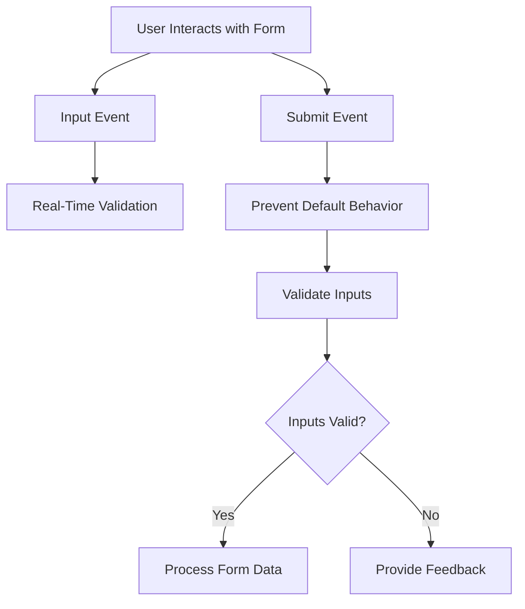

## 10.5 Form Events

In this section, we will delve into the world of form events in JavaScript, which are crucial for managing and validating user input. Forms are an integral part of web applications, allowing users to interact with your site by submitting data. Understanding how to handle form events is essential for creating dynamic and user-friendly web pages.

### Understanding Form Events

Form events in JavaScript are triggered when users interact with form elements. These events allow us to capture user input, validate it, and provide feedback. Let's explore some of the most common form events:

- **`submit`**: Triggered when a form is submitted.
- **`change`**: Triggered when the value of an input element changes.
- **`input`**: Triggered when the value of an input element is altered.
- **`focus`**: Triggered when an element gains focus.
- **`blur`**: Triggered when an element loses focus.

### Handling Form Submissions

The `submit` event is one of the most important events when dealing with forms. It is triggered when a user submits a form, either by clicking a submit button or pressing Enter. To handle this event, we can use the `addEventListener` method.

```javascript
// Select the form element
const form = document.querySelector('form');

// Add an event listener for the submit event
form.addEventListener('submit', function(event) {
    // Prevent the default form submission behavior
    event.preventDefault();

    // Code to process form data
    console.log('Form submitted!');
});
```

In the example above, we prevent the default form submission behavior using `event.preventDefault()`. This is crucial because it allows us to handle the form data with JavaScript instead of the browser's default action, which typically involves sending the data to a server and refreshing the page.

### Preventing Default Form Behavior

Preventing the default behavior of form submissions is essential for creating interactive web applications. By doing so, we can validate the form data on the client side before sending it to the server. This improves user experience by providing immediate feedback and reducing unnecessary server requests.

### Validating Form Inputs

Form validation is a critical aspect of handling user input. It ensures that the data submitted by users meets certain criteria before it is processed. Let's look at how we can validate form inputs using JavaScript.

#### Example: Validating a Simple Form

Consider a simple form with a text input for an email address:

```html
<form id="emailForm">
    <label for="email">Email:</label>
    <input type="email" id="email" name="email" required>
    <button type="submit">Submit</button>
</form>
```

We can validate the email input by adding an event listener to the form's `submit` event:

```javascript
// Select the form and email input elements
const emailForm = document.getElementById('emailForm');
const emailInput = document.getElementById('email');

// Add an event listener for the submit event
emailForm.addEventListener('submit', function(event) {
    // Prevent the default form submission behavior
    event.preventDefault();

    // Validate the email input
    if (emailInput.value === '') {
        alert('Please enter an email address.');
    } else if (!validateEmail(emailInput.value)) {
        alert('Please enter a valid email address.');
    } else {
        console.log('Email submitted:', emailInput.value);
    }
});

// Function to validate email format
function validateEmail(email) {
    const re = /^[^\s@]+@[^\s@]+\.[^\s@]+$/;
    return re.test(email);
}
```

In this example, we check if the email input is empty or if it doesn't match a regular expression pattern for valid email addresses. If the input is invalid, we display an alert message. Otherwise, we log the submitted email to the console.

### Real-Time Form Validation

Real-time validation provides immediate feedback to users as they fill out a form. This can be achieved using the `input` and `change` events.

- **`input` event**: Triggered whenever the value of an input element changes. This is useful for real-time validation as the user types.
- **`change` event**: Triggered when the user changes the value of an input element and then loses focus.

#### Example: Real-Time Validation

Let's enhance our email validation example with real-time feedback:

```javascript
// Add an event listener for the input event
emailInput.addEventListener('input', function() {
    if (validateEmail(emailInput.value)) {
        emailInput.style.borderColor = 'green';
    } else {
        emailInput.style.borderColor = 'red';
    }
});
```

In this example, we change the border color of the email input to green if the email is valid, and red if it is not. This provides immediate visual feedback to the user.

### Focus and Blur Events

The `focus` and `blur` events are useful for managing user interactions with form elements.

- **`focus` event**: Triggered when an element gains focus. This can be used to highlight the input field or display additional instructions.
- **`blur` event**: Triggered when an element loses focus. This can be used to validate the input or hide instructions.

#### Example: Focus and Blur Events

Let's add focus and blur event handlers to our email input:

```javascript
// Add an event listener for the focus event
emailInput.addEventListener('focus', function() {
    emailInput.style.backgroundColor = '#e0f7fa';
});

// Add an event listener for the blur event
emailInput.addEventListener('blur', function() {
    emailInput.style.backgroundColor = '';
});
```

In this example, we change the background color of the email input when it gains focus and revert it when it loses focus. This helps guide the user's attention to the active input field.

### Best Practices for User Feedback and Accessibility

When handling form events, it's important to consider user feedback and accessibility. Here are some best practices to keep in mind:

- **Provide Clear Feedback**: Use visual cues, such as color changes or icons, to indicate the validity of inputs. Provide error messages that clearly explain what needs to be corrected.
- **Ensure Accessibility**: Use semantic HTML elements and ARIA attributes to make forms accessible to users with disabilities. Ensure that all interactive elements are keyboard-navigable.
- **Avoid Overwhelming Users**: Provide feedback progressively, rather than all at once. For example, validate inputs individually as the user interacts with them, rather than displaying all errors upon submission.
- **Test Across Devices**: Ensure that your form interactions work consistently across different devices and browsers.

### Try It Yourself

Now that we've covered the basics of form events, it's time to experiment! Try modifying the code examples to add additional form fields, such as a password input, and implement validation for them. Consider adding custom error messages or styling to enhance the user experience.

### Visualizing Form Events

To help you understand the flow of form events, let's visualize the process using a flowchart:



This flowchart illustrates how form events are triggered and handled, from user interaction to validation and feedback.

### Summary

In this section, we've explored the essential form events in JavaScript and how they can be used to manage and validate user input. By understanding and utilizing these events, you can create interactive and user-friendly forms that enhance the overall user experience.

### Further Reading

For more information on form events and validation, check out the following resources:

- [MDN Web Docs: Form Events](https://developer.mozilla.org/en-US/docs/Web/Events)
- [W3Schools: HTML Form Events](https://www.w3schools.com/js/js_htmldom_eventlistener.asp)

## Quiz Time!



### What is the purpose of the `submit` event in a form?

- [x] To trigger when a form is submitted
- [ ] To validate form inputs
- [ ] To change the form's appearance
- [ ] To prevent form submission

> **Explanation:** The `submit` event is triggered when a form is submitted, allowing you to handle the form data.

### How can you prevent a form from submitting by default?

- [x] Using `event.preventDefault()`
- [ ] Using `event.stopPropagation()`
- [ ] Using `event.stopImmediatePropagation()`
- [ ] Using `event.preventSubmit()`

> **Explanation:** The `event.preventDefault()` method prevents the default action of the form submission.

### Which event is triggered when an input element's value changes?

- [ ] `submit`
- [x] `input`
- [ ] `focus`
- [ ] `blur`

> **Explanation:** The `input` event is triggered whenever the value of an input element changes.

### What is the purpose of the `focus` event?

- [ ] To validate input
- [x] To trigger when an element gains focus
- [ ] To change the form's appearance
- [ ] To prevent form submission

> **Explanation:** The `focus` event is triggered when an element gains focus, allowing you to manage user interactions.

### How can you provide real-time validation feedback?

- [x] Using the `input` event
- [ ] Using the `submit` event
- [ ] Using the `focus` event
- [ ] Using the `blur` event

> **Explanation:** The `input` event allows you to provide real-time feedback as the user types.

### What is the role of the `blur` event?

- [ ] To trigger when an element gains focus
- [ ] To validate input
- [x] To trigger when an element loses focus
- [ ] To prevent form submission

> **Explanation:** The `blur` event is triggered when an element loses focus, allowing you to validate input or hide instructions.

### Why is it important to provide clear feedback in forms?

- [x] To guide users and improve user experience
- [ ] To make the form look more complex
- [ ] To confuse users
- [ ] To prevent form submission

> **Explanation:** Clear feedback helps guide users and improves their experience by indicating the validity of inputs.

### What should you consider for accessibility in forms?

- [x] Use semantic HTML and ARIA attributes
- [ ] Use only visual cues
- [ ] Ignore keyboard navigation
- [ ] Provide no feedback

> **Explanation:** Ensuring accessibility involves using semantic HTML elements and ARIA attributes to make forms usable for all users.

### Which method is used to validate email format in JavaScript?

- [x] Regular expressions
- [ ] `validateEmail()`
- [ ] `checkEmail()`
- [ ] `emailValidation()`

> **Explanation:** Regular expressions are commonly used to validate email formats in JavaScript.

### True or False: The `change` event is triggered when an input element's value changes and loses focus.

- [x] True
- [ ] False

> **Explanation:** The `change` event is triggered when the user changes the value of an input element and then loses focus.


