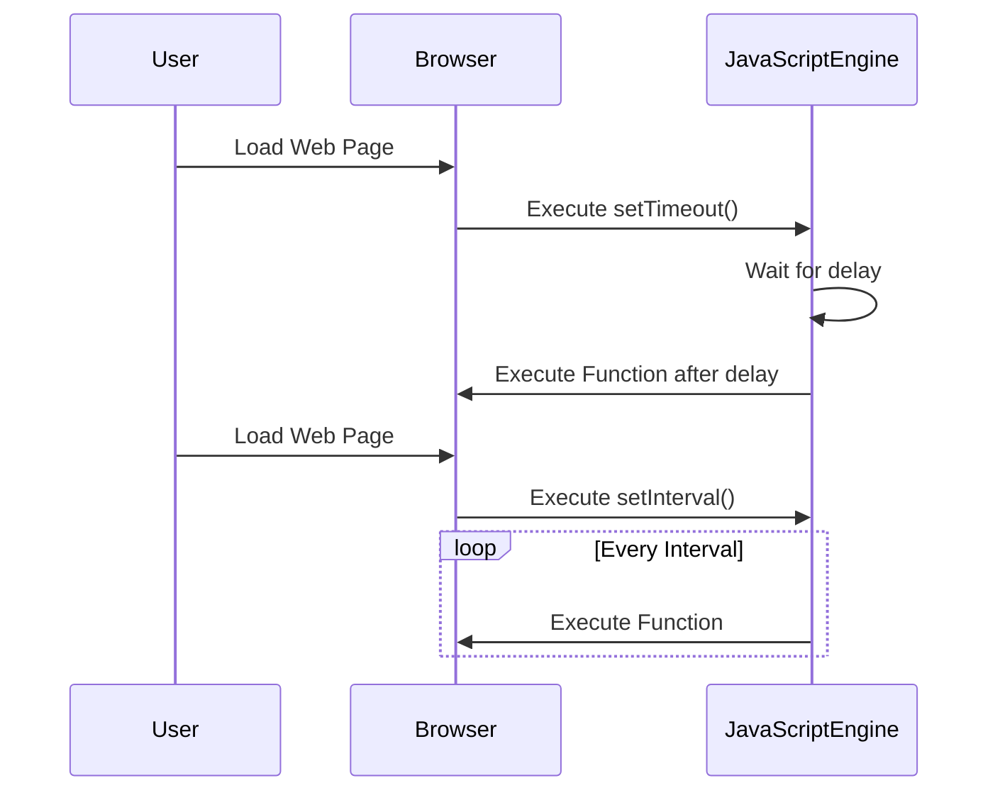

## 10.6 Timing Events with `setTimeout()` and `setInterval()`

In the world of web development, timing is everything. Whether you're creating a slideshow, a countdown timer, or simply delaying the execution of a function, understanding how to manage timing events in JavaScript is crucial. In this section, we'll dive into two essential JavaScript methods: `setTimeout()` and `setInterval()`. These methods allow us to execute code after a specified delay or at regular intervals, adding a dynamic layer of interactivity to our web pages.

### Understanding `setTimeout()`

The `setTimeout()` method is a powerful tool in JavaScript that allows you to delay the execution of a function. This can be particularly useful for creating effects that occur after a certain period, such as showing a popup message or changing the content of a page.

#### Syntax of `setTimeout()`

Let's start by looking at the basic syntax of `setTimeout()`:

```javascript
setTimeout(function() {
    // Code to execute after delay
}, delayInMilliseconds);
```

- **Function**: The first parameter is the function you want to execute after the delay.
- **Delay**: The second parameter is the delay in milliseconds (1 second = 1000 milliseconds).

#### Using `setTimeout()` to Delay Code Execution

Imagine you want to display a welcome message to users 3 seconds after they visit your page. Here's how you could achieve that using `setTimeout()`:

```javascript
setTimeout(function() {
    alert("Welcome to our website!");
}, 3000); // 3000 milliseconds = 3 seconds
```

In this example, the `alert()` function is called after a 3-second delay, providing a gentle introduction to your site.

#### Practical Example: Creating a Delayed Message

Let's create a simple example where a message appears on the webpage after a delay:

```html
<!DOCTYPE html>
<html lang="en">
<head>
    <meta charset="UTF-8">
    <meta name="viewport" content="width=device-width, initial-scale=1.0">
    <title>Delayed Message Example</title>
</head>
<body>
    <h1>Welcome to Our Site</h1>
    <p id="message"></p>

    <script>
        setTimeout(function() {
            document.getElementById('message').innerText = "Thanks for visiting!";
        }, 5000); // 5-second delay
    </script>
</body>
</html>
```

In this HTML page, a message saying "Thanks for visiting!" will appear 5 seconds after the page loads. This is achieved by selecting the paragraph element with `id="message"` and updating its `innerText`.

### Introducing `setInterval()`

While `setTimeout()` is great for executing code after a delay, `setInterval()` is used when you want to execute code repeatedly at regular intervals. This can be useful for tasks like updating a clock every second or cycling through images in a slideshow.

#### Syntax of `setInterval()`

Here's the basic syntax for `setInterval()`:

```javascript
setInterval(function() {
    // Code to execute repeatedly at intervals
}, intervalInMilliseconds);
```

- **Function**: The function to execute repeatedly.
- **Interval**: The time interval in milliseconds between each execution.

#### Using `setInterval()` for Repeated Execution

Suppose you want to update a digital clock on your webpage every second. You can use `setInterval()` to achieve this:

```javascript
setInterval(function() {
    let now = new Date();
    document.getElementById('clock').innerText = now.toLocaleTimeString();
}, 1000); // Update every 1000 milliseconds (1 second)
```

In this example, the current time is fetched using `new Date()` and displayed in an element with `id="clock"`. The time updates every second.

#### Practical Example: Creating a Simple Clock

Let's build a simple digital clock using `setInterval()`:

```html
<!DOCTYPE html>
<html lang="en">
<head>
    <meta charset="UTF-8">
    <meta name="viewport" content="width=device-width, initial-scale=1.0">
    <title>Simple Clock</title>
</head>
<body>
    <h1>Current Time</h1>
    <p id="clock"></p>

    <script>
        setInterval(function() {
            let now = new Date();
            document.getElementById('clock').innerText = now.toLocaleTimeString();
        }, 1000); // Update every second
    </script>
</body>
</html>
```

This code creates a clock that updates every second, displaying the current time in a human-readable format.

### Stopping Intervals with `clearInterval()`

While `setInterval()` is useful, there are times when you'll want to stop the repeated execution. This is where `clearInterval()` comes into play. To stop an interval, you first need to store its ID, which is returned by `setInterval()`.

#### Example: Stopping an Interval

Let's modify our clock example to include a button that stops the clock:

```html
<!DOCTYPE html>
<html lang="en">
<head>
    <meta charset="UTF-8">
    <meta name="viewport" content="width=device-width, initial-scale=1.0">
    <title>Stop the Clock</title>
</head>
<body>
    <h1>Current Time</h1>
    <p id="clock"></p>
    <button id="stopButton">Stop Clock</button>

    <script>
        let clockInterval = setInterval(function() {
            let now = new Date();
            document.getElementById('clock').innerText = now.toLocaleTimeString();
        }, 1000);

        document.getElementById('stopButton').addEventListener('click', function() {
            clearInterval(clockInterval);
        });
    </script>
</body>
</html>
```

In this example, clicking the "Stop Clock" button will stop the clock from updating. The `clearInterval()` function is called with the interval ID to stop the execution.

### Creating a Countdown Timer

Now that we understand the basics of `setTimeout()` and `setInterval()`, let's create a more complex example: a countdown timer. This will demonstrate how to use both methods together.

#### Countdown Timer Example

```html
<!DOCTYPE html>
<html lang="en">
<head>
    <meta charset="UTF-8">
    <meta name="viewport" content="width=device-width, initial-scale=1.0">
    <title>Countdown Timer</title>
</head>
<body>
    <h1>Countdown Timer</h1>
    <p id="timer"></p>

    <script>
        let countdown = 10; // 10 seconds countdown
        let timerElement = document.getElementById('timer');

        let countdownInterval = setInterval(function() {
            if (countdown > 0) {
                timerElement.innerText = countdown + " seconds remaining";
                countdown--;
            } else {
                timerElement.innerText = "Time's up!";
                clearInterval(countdownInterval);
            }
        }, 1000); // Update every second
    </script>
</body>
</html>
```

In this example, we start with a 10-second countdown. The timer updates every second, and when it reaches zero, it displays "Time's up!" and stops the interval.

### Creating a Slideshow

Another practical use of timing events is creating a slideshow that automatically transitions between images. We'll use `setInterval()` to change images at regular intervals.

#### Slideshow Example

```html
<!DOCTYPE html>
<html lang="en">
<head>
    <meta charset="UTF-8">
    <meta name="viewport" content="width=device-width, initial-scale=1.0">
    <title>Image Slideshow</title>
    <style>
        #slideshow {
            width: 300px;
            height: 200px;
            overflow: hidden;
            position: relative;
        }
        #slideshow img {
            width: 100%;
            height: auto;
            position: absolute;
            opacity: 0;
            transition: opacity 1s;
        }
        #slideshow img.active {
            opacity: 1;
        }
    </style>
</head>
<body>
    <div id="slideshow">
        
        
        
    </div>

    <script>
        let images = document.querySelectorAll('#slideshow img');
        let currentIndex = 0;

        setInterval(function() {
            images[currentIndex].classList.remove('active');
            currentIndex = (currentIndex + 1) % images.length;
            images[currentIndex].classList.add('active');
        }, 3000); // Change image every 3 seconds
    </script>
</body>
</html>
```

In this slideshow, images transition every 3 seconds. The `active` class controls which image is visible by changing its opacity.

### Potential Pitfalls with Timing Functions

While `setTimeout()` and `setInterval()` are powerful, they come with potential pitfalls:

- **Performance Considerations**: Frequent or poorly managed intervals can lead to performance issues, especially on resource-constrained devices. Always ensure intervals are necessary and optimized.
- **Accuracy**: JavaScript timing functions are not perfectly accurate due to the single-threaded nature of JavaScript and the event loop. Delays may be longer than specified, especially under heavy load.
- **Memory Leaks**: Failing to clear intervals can lead to memory leaks. Always use `clearInterval()` when an interval is no longer needed.

### Try It Yourself

Experiment with the examples provided:

1. **Modify the Countdown Timer**: Change the starting countdown value or the message displayed when time is up.
2. **Customize the Slideshow**: Add more images or change the transition interval.
3. **Create a New Example**: Use `setTimeout()` to create a delayed animation effect on a webpage element.

### Visualizing Timing Events

To better understand how `setTimeout()` and `setInterval()` work, let's visualize their operation using a sequence diagram.



In this diagram, we see how the browser interacts with the JavaScript engine to execute functions after a delay or at regular intervals.

### Key Takeaways

- **`setTimeout()`** is used to delay the execution of a function.
- **`setInterval()`** is used to execute a function repeatedly at specified intervals.
- **`clearInterval()`** stops a running interval.
- Timing functions can enhance interactivity but must be used judiciously to avoid performance issues.

### Further Reading

For more information on timing events, check out these resources:

- [MDN Web Docs on `setTimeout()`](https://developer.mozilla.org/en-US/docs/Web/API/WindowOrWorkerGlobalScope/setTimeout)
- [MDN Web Docs on `setInterval()`](https://developer.mozilla.org/en-US/docs/Web/API/WindowOrWorkerGlobalScope/setInterval)
- [W3Schools on JavaScript Timing Events](https://www.w3schools.com/js/js_timing.asp)

## Quiz Time!



### What is the primary purpose of `setTimeout()` in JavaScript?

- [x] To delay the execution of a function
- [ ] To execute a function repeatedly
- [ ] To stop a running interval
- [ ] To create a loop

> **Explanation:** `setTimeout()` is used to delay the execution of a function by a specified number of milliseconds.

### How do you stop a `setInterval()` from executing?

- [x] Using `clearInterval()`
- [ ] Using `clearTimeout()`
- [ ] Using `stopInterval()`
- [ ] Using `stopTimeout()`

> **Explanation:** `clearInterval()` is used to stop a running interval set by `setInterval()`.

### What does `setInterval()` do?

- [x] Executes a function repeatedly at specified intervals
- [ ] Delays the execution of a function
- [ ] Stops a running timeout
- [ ] Creates a new thread

> **Explanation:** `setInterval()` is used to execute a function repeatedly at specified intervals.

### Which method would you use to execute a function after a 5-second delay?

- [x] `setTimeout()`
- [ ] `setInterval()`
- [ ] `clearTimeout()`
- [ ] `clearInterval()`

> **Explanation:** `setTimeout()` is used to execute a function after a specified delay, in this case, 5 seconds.

### What is a potential pitfall of using `setInterval()`?

- [x] It can lead to performance issues if not managed properly
- [ ] It cannot execute functions repeatedly
- [ ] It does not work in modern browsers
- [ ] It automatically stops after a few iterations

> **Explanation:** `setInterval()` can lead to performance issues if intervals are too frequent or not cleared when no longer needed.

### What is the return value of `setTimeout()`?

- [x] A timeout ID
- [ ] A function
- [ ] A boolean
- [ ] A string

> **Explanation:** `setTimeout()` returns a timeout ID, which can be used to cancel the timeout with `clearTimeout()`.

### How can you ensure a function is executed every second?

- [x] Use `setInterval()` with a 1000 millisecond interval
- [ ] Use `setTimeout()` with a 1000 millisecond delay
- [ ] Use `clearInterval()` with a 1000 millisecond interval
- [ ] Use `clearTimeout()` with a 1000 millisecond delay

> **Explanation:** `setInterval()` with a 1000 millisecond interval will execute a function every second.

### What is the unit of time used in `setTimeout()` and `setInterval()`?

- [x] Milliseconds
- [ ] Seconds
- [ ] Minutes
- [ ] Hours

> **Explanation:** Both `setTimeout()` and `setInterval()` use milliseconds as the unit of time.

### Can `setTimeout()` be used to create a loop?

- [ ] Yes, directly
- [x] Yes, by calling `setTimeout()` recursively
- [ ] No, it cannot be used for loops
- [ ] No, it only works once

> **Explanation:** While `setTimeout()` is not designed for loops, it can be used recursively to create a loop-like behavior.

### True or False: `setInterval()` and `setTimeout()` are perfectly accurate in timing.

- [ ] True
- [x] False

> **Explanation:** Due to the single-threaded nature of JavaScript and the event loop, timing functions may not be perfectly accurate, especially under heavy load.


