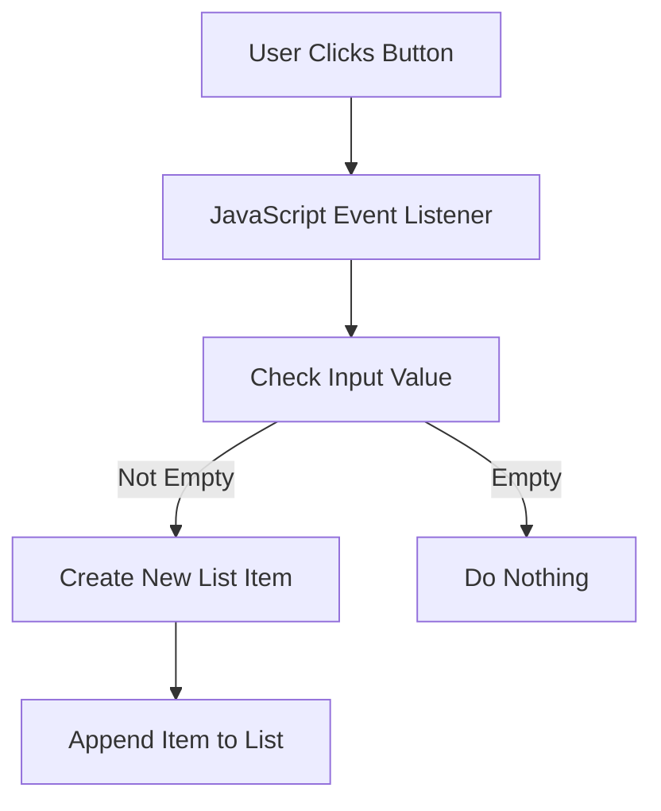

## 10.7 Changing Content Based on User Interaction

In the ever-evolving world of web development, creating an interactive and engaging user experience is paramount. One of the key aspects of achieving this is by dynamically changing content based on user interactions. This section will guide you through the process of using JavaScript to modify the Document Object Model (DOM) in response to various events, thereby enhancing the interactivity of your web pages.

### Understanding Dynamic Content Changes

Dynamic content changes refer to the ability of a web page to update its content without requiring a full page reload. This is achieved by manipulating the DOM using JavaScript. By responding to user interactions such as clicks, key presses, or form submissions, we can create a more responsive and engaging user experience.

#### Why Dynamic Content Matters

1. **Improved User Experience**: Users expect web pages to be responsive and interactive. Dynamic content changes can make your site feel more alive and engaging.

2. **Efficiency**: Instead of reloading the entire page, only the necessary parts are updated, leading to faster interactions.

3. **Feedback**: Providing immediate feedback to user actions enhances usability and satisfaction.

### Modifying the DOM in Response to Events

To change content dynamically, we need to understand how to manipulate the DOM. The DOM is a tree-like structure representing the HTML elements of a web page. JavaScript provides several methods to interact with this structure.

#### Common DOM Manipulation Methods

- **`getElementById()`**: Selects an element by its ID.
- **`getElementsByClassName()`**: Selects elements by their class name.
- **`getElementsByTagName()`**: Selects elements by their tag name.
- **`querySelector()`**: Selects the first element that matches a CSS selector.
- **`querySelectorAll()`**: Selects all elements that match a CSS selector.

Once elements are selected, we can modify their properties, attributes, or content.

#### Example: Showing and Hiding Elements

Let's start with a simple example: toggling the visibility of an element.

```html
<!DOCTYPE html>
<html lang="en">
<head>
    <meta charset="UTF-8">
    <meta name="viewport" content="width=device-width, initial-scale=1.0">
    <title>Toggle Visibility Example</title>
    <style>
        #content {
            display: none;
            margin-top: 10px;
            padding: 10px;
            border: 1px solid #ccc;
        }
    </style>
</head>
<body>
    <button id="toggleButton">Show Content</button>
    <div id="content">This is some hidden content!</div>

    <script>
        const toggleButton = document.getElementById('toggleButton');
        const content = document.getElementById('content');

        toggleButton.addEventListener('click', () => {
            if (content.style.display === 'none') {
                content.style.display = 'block';
                toggleButton.textContent = 'Hide Content';
            } else {
                content.style.display = 'none';
                toggleButton.textContent = 'Show Content';
            }
        });
    </script>
</body>
</html>
```

**Explanation**: In this example, we have a button and a div containing some hidden content. When the button is clicked, the `click` event listener toggles the display property of the content between `none` and `block`, effectively showing or hiding it. The button text is also updated to reflect the current state.

### Practical Example: Adding Items to a List

Let's create a more practical example by building a simple application where users can add items to a list.

#### HTML Structure

```html
<!DOCTYPE html>
<html lang="en">
<head>
    <meta charset="UTF-8">
    <meta name="viewport" content="width=device-width, initial-scale=1.0">
    <title>Dynamic List Example</title>
    <style>
        #itemList {
            margin-top: 10px;
            padding: 0;
            list-style-type: none;
        }
        #itemList li {
            padding: 5px;
            border: 1px solid #ccc;
            margin-bottom: 5px;
        }
    </style>
</head>
<body>
    <input type="text" id="itemInput" placeholder="Enter a new item">
    <button id="addItemButton">Add Item</button>
    <ul id="itemList"></ul>

    <script>
        const addItemButton = document.getElementById('addItemButton');
        const itemInput = document.getElementById('itemInput');
        const itemList = document.getElementById('itemList');

        addItemButton.addEventListener('click', () => {
            const newItemText = itemInput.value.trim();
            if (newItemText !== '') {
                const newItem = document.createElement('li');
                newItem.textContent = newItemText;
                itemList.appendChild(newItem);
                itemInput.value = ''; // Clear the input field
            }
        });
    </script>
</body>
</html>
```

**Explanation**: In this example, we have an input field for entering new items and a button to add them to a list. When the button is clicked, the `click` event listener checks if the input is not empty, creates a new list item (`<li>`), sets its text content to the input value, and appends it to the list. The input field is then cleared for the next entry.

### Encouraging User Experience and Responsiveness

When designing interactive web pages, it's crucial to consider the user experience. Here are some tips to keep in mind:

1. **Provide Immediate Feedback**: Users should receive immediate feedback when they interact with elements. For example, changing button text or color when clicked.

2. **Keep it Simple**: Avoid overwhelming users with too many interactive elements. Focus on the most important interactions.

3. **Ensure Accessibility**: Make sure your interactive elements are accessible to all users, including those using assistive technologies.

4. **Test Across Devices**: Ensure that your interactive features work well on both desktop and mobile devices.

### Importance of Feedback to the User

Feedback is a crucial aspect of user interaction. It informs users that their actions have been recognized and processed. This can be achieved through visual cues, such as changing colors, displaying messages, or updating content.

#### Example: Providing Feedback with Alerts

```html
<!DOCTYPE html>
<html lang="en">
<head>
    <meta charset="UTF-8">
    <meta name="viewport" content="width=device-width, initial-scale=1.0">
    <title>Feedback Example</title>
</head>
<body>
    <button id="alertButton">Click Me</button>

    <script>
        const alertButton = document.getElementById('alertButton');

        alertButton.addEventListener('click', () => {
            alert('Button clicked!');
        });
    </script>
</body>
</html>
```

**Explanation**: In this simple example, when the button is clicked, an alert box is displayed, providing immediate feedback to the user that their action has been registered.

### Try It Yourself

Now that we've covered the basics, it's time for you to experiment. Here are some suggestions:

- Modify the list example to allow users to remove items.
- Add a feature to edit existing list items.
- Implement a counter that updates every time a button is clicked.

### Visualizing the DOM Manipulation Process

To better understand how DOM manipulation works, let's visualize the process using a flowchart.



**Description**: This flowchart illustrates the process of adding a new item to a list. When the user clicks the button, the event listener checks the input value. If it's not empty, a new list item is created and appended to the list. If it's empty, no action is taken.

### Further Reading

For more information on DOM manipulation and event handling, check out these resources:

- [MDN Web Docs: Introduction to the DOM](https://developer.mozilla.org/en-US/docs/Web/API/Document_Object_Model/Introduction)
- [W3Schools: JavaScript HTML DOM](https://www.w3schools.com/js/js_htmldom.asp)

### Summary

In this section, we've explored how to dynamically change content based on user interactions using JavaScript. By understanding and manipulating the DOM, you can create more engaging and responsive web pages. Remember to always consider the user experience and provide feedback to ensure a seamless interaction.

## Quiz Time!



### What is the primary purpose of dynamic content changes?

- [x] To update web page content without reloading the page
- [ ] To make the web page load faster
- [ ] To increase the number of images on a page
- [ ] To reduce the amount of JavaScript code

> **Explanation:** Dynamic content changes allow web pages to update parts of the content without requiring a full page reload, enhancing user experience.

### Which method is used to select an element by its ID?

- [x] `getElementById()`
- [ ] `getElementsByClassName()`
- [ ] `querySelector()`
- [ ] `getElementsByTagName()`

> **Explanation:** `getElementById()` is used to select a single element with a specific ID.

### What does the `innerHTML` property do?

- [x] Changes the HTML content of an element
- [ ] Changes the style of an element
- [ ] Changes the ID of an element
- [ ] Changes the class of an element

> **Explanation:** The `innerHTML` property is used to get or set the HTML content inside an element.

### How can you toggle the visibility of an element?

- [x] By changing its `display` style property
- [ ] By changing its `color` style property
- [ ] By changing its `font-size` style property
- [ ] By changing its `border` style property

> **Explanation:** The `display` style property can be set to `none` or `block` to hide or show an element.

### What is the role of an event listener?

- [x] To execute code in response to user actions
- [ ] To style elements on a page
- [ ] To load external scripts
- [ ] To validate HTML syntax

> **Explanation:** Event listeners are used to run specific code when a particular event occurs, such as a click or key press.

### Which of the following is a benefit of providing feedback to users?

- [x] Enhances usability and satisfaction
- [ ] Increases the number of web pages
- [ ] Reduces server load
- [ ] Decreases the need for CSS

> **Explanation:** Feedback informs users that their actions have been recognized, improving usability and satisfaction.

### What is a common way to provide feedback for a button click?

- [x] Displaying an alert box
- [ ] Changing the page title
- [ ] Redirecting to another page
- [ ] Changing the browser's background color

> **Explanation:** An alert box is a simple way to provide immediate feedback for a button click.

### Which method is used to create a new HTML element?

- [x] `createElement()`
- [ ] `appendChild()`
- [ ] `removeChild()`
- [ ] `getElementById()`

> **Explanation:** `createElement()` is used to create a new HTML element that can be added to the DOM.

### What should you do after appending a new item to a list?

- [x] Clear the input field
- [ ] Change the page background
- [ ] Reload the page
- [ ] Close the browser

> **Explanation:** Clearing the input field after appending a new item prepares it for the next entry.

### True or False: Dynamic content changes can only be achieved with JavaScript.

- [x] True
- [ ] False

> **Explanation:** JavaScript is the primary language used for dynamic content changes on web pages.


