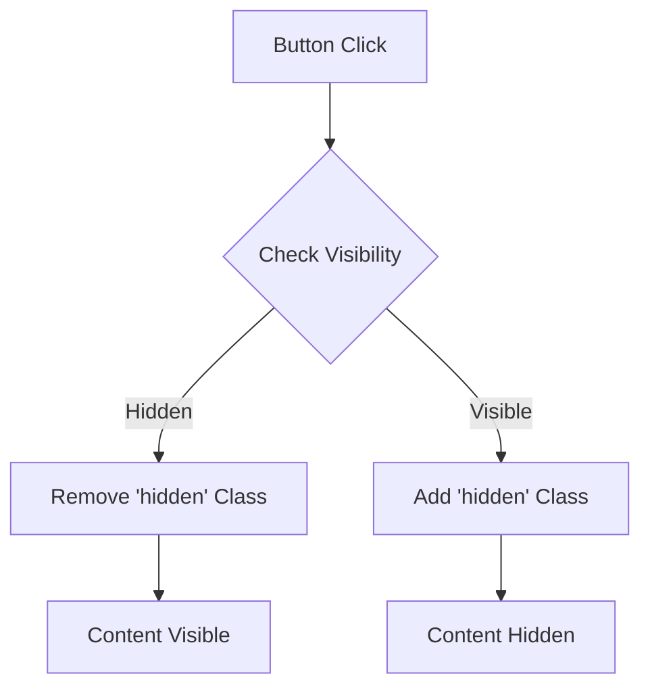

## 10.8 Implementing Show/Hide Functionality

In this section, we will delve into the exciting world of making your web pages interactive by implementing show/hide functionality. This feature is essential for creating dynamic user interfaces, such as dropdown menus, modals, and collapsible sections. By the end of this guide, you'll be equipped with the knowledge to enhance your web pages with intuitive and engaging interactions.

### Why Show/Hide Functionality?

Before we dive into the technical details, let's explore why show/hide functionality is crucial in web development:

- **Dropdown Menus**: These are common in navigation bars, allowing users to access more options without cluttering the interface.
- **Modals**: Pop-up windows that display additional content or forms without leaving the current page.
- **Collapsible Sections**: Useful for FAQs or content-heavy pages where users can expand or collapse sections as needed.
- **Improved User Experience**: By controlling what users see, you can create a cleaner and more focused interface.

### Using CSS Classes to Control Visibility

One of the most efficient ways to toggle visibility is by using CSS classes. Let's start by defining a simple CSS class that hides elements:

```css
.hidden {
    display: none;
}
```

This class will be the cornerstone of our show/hide functionality. By adding or removing this class from an element, we can control its visibility.

#### JavaScript Example: Toggling Visibility

To toggle the visibility of an element, we can use JavaScript to add or remove the `.hidden` class. Here's a basic example:

```html
<!DOCTYPE html>
<html lang="en">
<head>
    <meta charset="UTF-8">
    <meta name="viewport" content="width=device-width, initial-scale=1.0">
    <title>Show/Hide Example</title>
    <style>
        .hidden {
            display: none;
        }
    </style>
</head>
<body>
    <button id="toggleButton">Toggle Content</button>
    <div id="content" class="hidden">
        <p>This is the content to show or hide.</p>
    </div>

    <script>
        const toggleButton = document.getElementById('toggleButton');
        const content = document.getElementById('content');

        toggleButton.addEventListener('click', () => {
            content.classList.toggle('hidden');
        });
    </script>
</body>
</html>
```

**Explanation**:
- We define a button with the ID `toggleButton` and a `div` with the ID `content`.
- The `div` initially has the `hidden` class, making it invisible.
- When the button is clicked, the `classList.toggle('hidden')` method adds or removes the `hidden` class, effectively toggling the visibility of the `div`.

### Implementing a Simple Toggle Button

Let's break down the steps to create a simple toggle button that shows or hides content:

1. **Create the HTML Structure**: Define a button and the content you want to toggle.
2. **Style the Content**: Use CSS to hide the content by default.
3. **Add JavaScript**: Use an event listener to toggle the visibility.

#### Step-by-Step Implementation

1. **HTML Structure**:

```html
<button id="toggleButton">Show/Hide Content</button>
<div id="content" class="hidden">
    <p>Here is some hidden content!</p>
</div>
```

2. **CSS Styling**:

```css
.hidden {
    display: none;
}
```

3. **JavaScript Logic**:

```javascript
const toggleButton = document.getElementById('toggleButton');
const content = document.getElementById('content');

toggleButton.addEventListener('click', () => {
    content.classList.toggle('hidden');
});
```

### Alternative Methods: Manipulating `style.display` Property

While using CSS classes is a clean and maintainable approach, you can also directly manipulate the `style.display` property in JavaScript. This method provides more control over the display behavior.

#### Example: Using `style.display`

```javascript
const toggleButton = document.getElementById('toggleButton');
const content = document.getElementById('content');

toggleButton.addEventListener('click', () => {
    if (content.style.display === 'none' || content.style.display === '') {
        content.style.display = 'block'; // Show the content
    } else {
        content.style.display = 'none'; // Hide the content
    }
});
```

**Explanation**:
- We check the current `style.display` value. If it's `'none'` or an empty string (default), we set it to `'block'` to show the content.
- Otherwise, we set it to `'none'` to hide the content.

### Keeping the User Interface Intuitive

When implementing show/hide functionality, it's essential to maintain an intuitive user interface. Here are some best practices:

- **Clear Indicators**: Use icons or text to indicate the action (e.g., "Show More" or "Hide").
- **Smooth Transitions**: Consider adding CSS transitions for a smoother user experience.
- **Consistent Behavior**: Ensure that the toggle behavior is consistent across different elements and pages.

#### Adding Transitions for a Smooth Experience

To enhance the user experience, you can add CSS transitions to the visibility changes:

```css
.hidden {
    display: none;
    opacity: 0;
    transition: opacity 0.3s ease;
}

.visible {
    display: block;
    opacity: 1;
    transition: opacity 0.3s ease;
}
```

**JavaScript Update**:

```javascript
toggleButton.addEventListener('click', () => {
    if (content.classList.contains('hidden')) {
        content.classList.remove('hidden');
        content.classList.add('visible');
    } else {
        content.classList.remove('visible');
        content.classList.add('hidden');
    }
});
```

### Try It Yourself

Now that you've learned the basics, try experimenting with the code:

- **Modify the Content**: Change the text or add more elements to see how the toggle affects them.
- **Change the Animation**: Adjust the CSS transition duration or add other properties like `transform`.
- **Create a Dropdown Menu**: Use the same principles to build a simple dropdown navigation.

### Visualizing the DOM Manipulation

To better understand how the DOM is manipulated during the show/hide process, let's visualize it using a Mermaid.js diagram:



**Diagram Explanation**:
- The process starts with a button click.
- We check if the content is hidden or visible.
- Based on the visibility, we either remove or add the `hidden` class.
- The content's visibility is updated accordingly.

### References and Further Reading

For more in-depth information and advanced techniques, consider exploring the following resources:

- [MDN Web Docs: Element.classList](https://developer.mozilla.org/en-US/docs/Web/API/Element/classList)
- [W3Schools: JavaScript HTML DOM](https://www.w3schools.com/js/js_htmldom.asp)
- [CSS-Tricks: Transition](https://css-tricks.com/almanac/properties/t/transition/)

### Engagement and Reinforcement

To reinforce your learning, consider the following exercises:

- **Exercise 1**: Implement a FAQ section where each question can be clicked to reveal the answer.
- **Exercise 2**: Create a modal dialog that appears when a button is clicked and disappears when clicking outside the modal or on a close button.
- **Exercise 3**: Develop a simple image gallery where clicking on a thumbnail shows a larger version of the image.

### Key Takeaways

- Show/hide functionality is a fundamental aspect of creating interactive web pages.
- Using CSS classes is a clean and efficient way to manage visibility.
- Directly manipulating the `style.display` property offers more control but can be less maintainable.
- Always aim for an intuitive user interface with clear indicators and smooth transitions.

## Quiz Time!



### What is a common use case for show/hide functionality on a web page?

- [x] Dropdown menus
- [ ] Image resizing
- [ ] Font styling
- [ ] Page redirection

> **Explanation:** Dropdown menus are a common use case for show/hide functionality, allowing users to access more options without cluttering the interface.


### Which CSS property is used in the `.hidden` class to hide elements?

- [x] display: none;
- [ ] visibility: hidden;
- [ ] opacity: 0;
- [ ] position: absolute;

> **Explanation:** The `display: none;` property is used to hide elements completely, removing them from the document flow.


### What JavaScript method is used to toggle a CSS class on an element?

- [x] classList.toggle()
- [ ] style.display()
- [ ] addEventListener()
- [ ] querySelector()

> **Explanation:** The `classList.toggle()` method is used to add or remove a CSS class from an element, effectively toggling its visibility.


### How can you directly manipulate an element's visibility using JavaScript?

- [x] By changing the element's `style.display` property
- [ ] By altering the element's `innerHTML`
- [ ] By modifying the element's `className`
- [ ] By adjusting the element's `textContent`

> **Explanation:** You can directly manipulate an element's visibility by changing its `style.display` property to values like `'none'` or `'block'`.


### What is a best practice when implementing show/hide functionality?

- [x] Use clear indicators for user actions
- [ ] Always use inline styles
- [ ] Avoid using CSS transitions
- [ ] Use complex JavaScript logic

> **Explanation:** Using clear indicators such as icons or text helps users understand the actions they can perform, making the interface more intuitive.


### Which JavaScript event is commonly used to trigger show/hide functionality?

- [x] click
- [ ] mouseover
- [ ] keydown
- [ ] load

> **Explanation:** The `click` event is commonly used to trigger show/hide functionality, as it responds to user interactions with buttons or links.


### What is the purpose of adding CSS transitions to show/hide functionality?

- [x] To create a smoother user experience
- [ ] To increase page load time
- [ ] To complicate the code
- [ ] To hide errors

> **Explanation:** Adding CSS transitions creates a smoother user experience by animating the visibility changes, making them less abrupt.


### What is the effect of removing the `hidden` class from an element?

- [x] The element becomes visible
- [ ] The element is deleted
- [ ] The element changes color
- [ ] The element's text is altered

> **Explanation:** Removing the `hidden` class from an element makes it visible by removing the `display: none;` property.


### Which method is used to add an event listener to a button?

- [x] addEventListener()
- [ ] querySelector()
- [ ] getElementById()
- [ ] setAttribute()

> **Explanation:** The `addEventListener()` method is used to attach an event handler to a button, allowing it to respond to user interactions.


### True or False: Using CSS classes for show/hide functionality is less maintainable than using inline styles.

- [ ] True
- [x] False

> **Explanation:** Using CSS classes is more maintainable than inline styles because it separates style from content, making the code cleaner and easier to manage.


