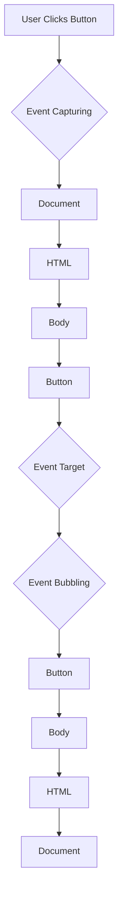

## 11.10 Best Practices in Event Handling

In the world of web development, making your web pages interactive and responsive to user actions is crucial. This is where event handling comes into play. As we dive into the best practices for event handling in JavaScript, we'll explore how to write efficient and maintainable code that enhances user experience without compromising performance. 

### Understanding Event Handling

Before we delve into best practices, let's briefly revisit what event handling is. In JavaScript, an event is an action or occurrence that happens in the browser, such as a click, a keypress, or a page load. Event handling refers to the process of capturing these events and executing code in response to them.

### Best Practices for Event Handling

#### 1. Use `addEventListener` Over Inline Event Handlers

One of the fundamental best practices is to use `addEventListener` instead of inline event handlers. Inline event handlers, such as `onclick` attributes in HTML, can clutter your HTML code and make it harder to maintain. 

**Example of Inline Event Handler:**

```html
<button onclick="alert('Button clicked!')">Click Me</button>
```

**Example Using `addEventListener`:**

```html
<button id="myButton">Click Me</button>

<script>
  const button = document.getElementById('myButton');
  button.addEventListener('click', function() {
    alert('Button clicked!');
  });
</script>
```

Using `addEventListener` separates your JavaScript from your HTML, making your code more organized and easier to manage. It also allows you to add multiple event listeners to a single element without overwriting existing ones.

#### 2. Remove Event Listeners When They're No Longer Needed

To prevent memory leaks and improve performance, it's essential to remove event listeners when they are no longer needed. This is particularly important in single-page applications where elements may be dynamically added and removed.

**Example of Removing an Event Listener:**

```javascript
function handleClick() {
  console.log('Button clicked!');
}

button.addEventListener('click', handleClick);

// Later, when the event listener is no longer needed
button.removeEventListener('click', handleClick);
```

By removing event listeners, you ensure that your application does not retain unnecessary references to DOM elements, which can lead to memory leaks.

#### 3. Avoid Excessive Event Listeners by Using Event Delegation

Event delegation is a technique that leverages the event bubbling mechanism to handle events at a higher level in the DOM. Instead of attaching an event listener to each child element, you attach it to a parent element and use logic within the handler to determine which child triggered the event.

**Example of Event Delegation:**

```html
<ul id="myList">
  <li>Item 1</li>
  <li>Item 2</li>
  <li>Item 3</li>
</ul>

<script>
  const list = document.getElementById('myList');

  list.addEventListener('click', function(event) {
    if (event.target.tagName === 'LI') {
      console.log('List item clicked:', event.target.textContent);
    }
  });
</script>
```

In this example, instead of adding a click event listener to each `<li>` element, we add one to the `<ul>` and determine which `<li>` was clicked using `event.target`.

#### 4. Keep Event Handlers Efficient to Prevent UI Lag

Event handlers should be efficient and perform minimal work to avoid causing UI lag. If an event handler performs a time-consuming task, it can make the user interface feel sluggish.

**Example of an Efficient Event Handler:**

```javascript
button.addEventListener('click', function() {
  // Perform minimal work here
  console.log('Button clicked!');
});
```

If you need to perform a complex operation, consider using `setTimeout` or `requestAnimationFrame` to defer the work and keep the UI responsive.

#### 5. Organize Event Handlers for Readability

Organizing your event handlers can significantly improve the readability and maintainability of your code. Consider grouping related event handlers together and using descriptive names for your functions.

**Example of Organized Event Handlers:**

```javascript
function initializeEventHandlers() {
  const button = document.getElementById('myButton');
  button.addEventListener('click', handleButtonClick);

  const list = document.getElementById('myList');
  list.addEventListener('click', handleListClick);
}

function handleButtonClick() {
  console.log('Button clicked!');
}

function handleListClick(event) {
  if (event.target.tagName === 'LI') {
    console.log('List item clicked:', event.target.textContent);
  }
}

initializeEventHandlers();
```

By organizing your code in this way, you make it easier for others (and yourself) to understand and maintain.

#### 6. Encourage Careful Naming of Event Handler Functions

Naming your event handler functions descriptively can make your code more understandable. A good naming convention is to use the format `handleElementEvent`, where `Element` is the element being interacted with, and `Event` is the type of event.

**Example of Descriptive Naming:**

```javascript
function handleButtonClick() {
  console.log('Button clicked!');
}
```

This naming convention makes it clear what the function does and where it is used.

#### 7. Emphasize Testing and Debugging Event-Driven Code

Testing and debugging are crucial aspects of developing reliable event-driven code. Use browser developer tools to inspect events, set breakpoints, and log information to the console.

**Example of Debugging with Console Logs:**

```javascript
button.addEventListener('click', function() {
  console.log('Button clicked!');
  // Additional debugging information
  console.log('Button ID:', this.id);
});
```

By logging relevant information, you can gain insights into how your event handlers are functioning and identify any issues.

### Visual Aids: Event Handling Flow

To better understand how events propagate through the DOM, let's visualize the event handling flow using a Mermaid.js diagram.



This diagram illustrates the process of event capturing and bubbling, highlighting how an event travels from the document root to the target element and back.

### Try It Yourself

Now that we've covered the best practices, let's put them into action. Try modifying the following code to add a new event listener, remove an existing one, or implement event delegation.

```html
<div id="container">
  <button id="addButton">Add Item</button>
  <ul id="itemList">
    <li>Item 1</li>
    <li>Item 2</li>
  </ul>
</div>

<script>
  const addButton = document.getElementById('addButton');
  const itemList = document.getElementById('itemList');

  addButton.addEventListener('click', function() {
    const newItem = document.createElement('li');
    newItem.textContent = `Item ${itemList.children.length + 1}`;
    itemList.appendChild(newItem);
  });

  itemList.addEventListener('click', function(event) {
    if (event.target.tagName === 'LI') {
      alert(`You clicked on ${event.target.textContent}`);
    }
  });
</script>
```

### Key Takeaways

- **Use `addEventListener`** to keep your HTML and JavaScript separate and maintainable.
- **Remove event listeners** when they are no longer needed to prevent memory leaks.
- **Leverage event delegation** to minimize the number of event listeners and improve performance.
- **Keep event handlers efficient** to avoid UI lag and ensure a smooth user experience.
- **Organize and name your event handlers** for readability and maintainability.
- **Test and debug your event-driven code** using browser developer tools and console logs.

By following these best practices, you'll be well on your way to mastering event handling in JavaScript, creating interactive and efficient web pages that delight users.

## Quiz Time!



### Which method is preferred for adding event listeners in JavaScript?

- [x] `addEventListener`
- [ ] Inline event handlers
- [ ] `attachEvent`
- [ ] `setEventListener`

> **Explanation:** `addEventListener` is preferred because it allows for multiple listeners on the same event and keeps JavaScript separate from HTML.

### What is one benefit of using event delegation?

- [x] Reduces the number of event listeners
- [ ] Increases the number of event listeners
- [ ] Makes code more complex
- [ ] Slows down event handling

> **Explanation:** Event delegation reduces the number of event listeners by handling events at a higher level in the DOM.

### Why should event listeners be removed when no longer needed?

- [x] To prevent memory leaks
- [ ] To increase memory usage
- [ ] To make code more complex
- [ ] To slow down the application

> **Explanation:** Removing event listeners when they are no longer needed prevents memory leaks and improves performance.

### What is a good naming convention for event handler functions?

- [x] `handleElementEvent`
- [ ] `eventElementHandle`
- [ ] `elementHandleEvent`
- [ ] `eventHandleElement`

> **Explanation:** The `handleElementEvent` naming convention clearly indicates the element and event type the function handles.

### How can you keep event handlers efficient?

- [x] Perform minimal work within the handler
- [ ] Perform complex calculations in the handler
- [ ] Use nested loops in the handler
- [ ] Avoid using functions in the handler

> **Explanation:** Keeping event handlers efficient involves performing minimal work to prevent UI lag.

### What tool can be used to debug event-driven code?

- [x] Browser developer tools
- [ ] Text editor
- [ ] Spreadsheet software
- [ ] Image editor

> **Explanation:** Browser developer tools provide features like breakpoints and console logs for debugging event-driven code.

### What does the `removeEventListener` method do?

- [x] Removes an event listener from an element
- [ ] Adds an event listener to an element
- [ ] Changes the event type of a listener
- [ ] Modifies the event target

> **Explanation:** `removeEventListener` is used to remove an event listener from an element when it's no longer needed.

### What is the purpose of using `setTimeout` in an event handler?

- [x] To defer complex operations and keep the UI responsive
- [ ] To immediately execute complex operations
- [ ] To slow down the event handler
- [ ] To prevent the event from firing

> **Explanation:** `setTimeout` can defer complex operations, keeping the UI responsive by allowing other tasks to execute first.

### Which of the following is a benefit of organizing event handlers?

- [x] Improves code readability
- [ ] Makes code harder to understand
- [ ] Increases code complexity
- [ ] Slows down event handling

> **Explanation:** Organizing event handlers improves code readability, making it easier to understand and maintain.

### True or False: Inline event handlers are the best practice for adding event listeners.

- [ ] True
- [x] False

> **Explanation:** Inline event handlers are not the best practice because they mix JavaScript with HTML, making the code harder to maintain.


