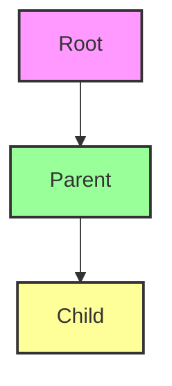
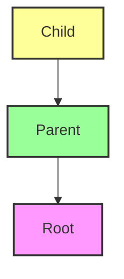

## 11.2 Event Propagation

In the world of web development, understanding how events work is crucial for creating dynamic and interactive web pages. One of the key concepts in JavaScript event handling is **event propagation**. This section will guide you through the intricacies of event propagation, including the phases of event flow, the difference between event bubbling and capturing, and practical applications like event delegation.

### What is Event Propagation?

Event propagation refers to the way events travel through the Document Object Model (DOM) hierarchy. When an event occurs on an element, such as a click, it doesn't just affect that element. Instead, the event can propagate through the DOM tree, allowing other elements to respond to it. This propagation occurs in three phases:

1. **Capturing Phase**: The event starts from the root of the DOM tree and travels down to the target element.
2. **Target Phase**: The event reaches the target element where it was originally triggered.
3. **Bubbling Phase**: The event bubbles back up from the target element to the root.

Understanding these phases is essential for effectively managing how your web page responds to user interactions.

### Event Bubbling and Capturing

Let's delve deeper into the two primary mechanisms of event propagation: **event bubbling** and **event capturing**.

#### Event Bubbling

Event bubbling is the default mode of event propagation in most browsers. When an event is triggered on an element, it first runs the event handlers on that element, then moves up the DOM tree, triggering event handlers on each ancestor element. This continues until it reaches the root of the document.

**Example of Event Bubbling:**

Consider the following HTML structure:

```html
<div id="parent">
  <button id="child">Click Me!</button>
</div>
```

We can add event listeners to both the parent `div` and the child `button`:

```javascript
document.getElementById('parent').addEventListener('click', function() {
  console.log('Parent clicked!');
});

document.getElementById('child').addEventListener('click', function() {
  console.log('Child clicked!');
});
```

When you click the button, you will see the following output in the console:

```
Child clicked!
Parent clicked!
```

This output demonstrates event bubbling: the event first triggers the handler on the child, then bubbles up to trigger the handler on the parent.

#### Event Capturing

Event capturing, also known as "trickling," is the opposite of bubbling. In this mode, the event starts from the root and travels down to the target element. Capturing is less commonly used but can be useful in certain scenarios.

To enable event capturing, you can use the third parameter of the `addEventListener()` method:

```javascript
document.getElementById('parent').addEventListener('click', function() {
  console.log('Parent clicked during capturing!');
}, true);

document.getElementById('child').addEventListener('click', function() {
  console.log('Child clicked!');
});
```

With the third parameter set to `true`, the event listener on the parent will be triggered during the capturing phase, before the event reaches the child.

### Phases of Event Propagation

Let's explore the phases of event propagation in more detail:

#### Capturing Phase

In the capturing phase, the event travels from the root of the DOM tree down to the target element. This phase allows you to intercept the event before it reaches its target. By default, most event listeners are not set to capture events, but you can enable capturing by passing `true` as the third argument to `addEventListener()`.

**Diagram: Capturing Phase**



#### Target Phase

The target phase is when the event reaches the element that originally triggered it. This is where the event is handled by default if no capturing or bubbling is specified.

#### Bubbling Phase

In the bubbling phase, the event travels back up the DOM tree from the target element to the root. This is the default behavior for most events in JavaScript.

**Diagram: Bubbling Phase**



### Practical Implications of Event Propagation

Understanding event propagation is crucial for effective event handling in JavaScript. Here are some practical implications:

#### Event Delegation

Event delegation is a powerful technique that leverages event propagation to manage events more efficiently. Instead of attaching event listeners to multiple child elements, you can attach a single event listener to a parent element. This listener can handle events triggered by any of its children, thanks to event bubbling.

**Example of Event Delegation:**

Consider a list of items:

```html
<ul id="itemList">
  <li>Item 1</li>
  <li>Item 2</li>
  <li>Item 3</li>
</ul>
```

Instead of adding a click event listener to each `li` element, you can add a single listener to the `ul`:

```javascript
document.getElementById('itemList').addEventListener('click', function(event) {
  if (event.target.tagName === 'LI') {
    console.log('Item clicked:', event.target.textContent);
  }
});
```

This approach reduces the number of event listeners and improves performance, especially for large lists.

#### Controlling Event Propagation

Sometimes, you may want to stop an event from propagating further. JavaScript provides methods to control event propagation:

- **`event.stopPropagation()`**: Stops the event from bubbling up or capturing down the DOM tree.
- **`event.stopImmediatePropagation()`**: Stops the event from propagating and prevents any other listeners of the same event from being called.

**Example:**

```javascript
document.getElementById('child').addEventListener('click', function(event) {
  console.log('Child clicked!');
  event.stopPropagation(); // Prevents the event from reaching the parent
});

document.getElementById('parent').addEventListener('click', function() {
  console.log('Parent clicked!');
});
```

In this example, clicking the child element will only log "Child clicked!" because `stopPropagation()` prevents the event from reaching the parent.

### Try It Yourself

Experiment with the following code to deepen your understanding of event propagation. Try modifying the HTML structure, adding more elements, and observing how events propagate through the DOM tree.

```html
<div id="outer">
  <div id="middle">
    <button id="inner">Click Me!</button>
  </div>
</div>

<script>
  document.getElementById('outer').addEventListener('click', function() {
    console.log('Outer div clicked!');
  });

  document.getElementById('middle').addEventListener('click', function() {
    console.log('Middle div clicked!');
  });

  document.getElementById('inner').addEventListener('click', function() {
    console.log('Button clicked!');
  });
</script>
```

### Key Takeaways

- **Event Propagation**: Events propagate through the DOM in three phases: capturing, target, and bubbling.
- **Event Bubbling**: The default mode where events bubble up from the target to the root.
- **Event Capturing**: Events can be captured from the root down to the target by setting the third parameter of `addEventListener()` to `true`.
- **Event Delegation**: A technique that uses event propagation to handle events efficiently by attaching a single listener to a parent element.
- **Controlling Propagation**: Use `stopPropagation()` and `stopImmediatePropagation()` to control event flow.

### Further Reading

For more information on event propagation and related topics, consider exploring the following resources:

- [MDN Web Docs: Event Propagation](https://developer.mozilla.org/en-US/docs/Web/API/Event/Event_propagation)
- [W3Schools: JavaScript Event Propagation](https://www.w3schools.com/js/js_htmldom_eventlistener.asp)

## Quiz Time!



### What is event propagation in JavaScript?

- [x] The way events travel through the DOM hierarchy
- [ ] The way JavaScript functions are executed
- [ ] The process of loading a web page
- [ ] The method of styling elements with CSS

> **Explanation:** Event propagation refers to the way events travel through the DOM hierarchy, allowing different elements to respond to the same event.

### Which phase of event propagation occurs first?

- [x] Capturing phase
- [ ] Target phase
- [ ] Bubbling phase
- [ ] None of the above

> **Explanation:** The capturing phase occurs first, where the event travels from the root to the target element.

### What is the default mode of event propagation in most browsers?

- [x] Event bubbling
- [ ] Event capturing
- [ ] Event trickling
- [ ] Event stopping

> **Explanation:** Event bubbling is the default mode, where events bubble up from the target to the root.

### How can you enable event capturing in JavaScript?

- [x] By setting the third parameter of `addEventListener()` to `true`
- [ ] By setting the third parameter of `addEventListener()` to `false`
- [ ] By using `event.stopPropagation()`
- [ ] By using `event.preventDefault()`

> **Explanation:** Event capturing can be enabled by setting the third parameter of `addEventListener()` to `true`.

### What does `event.stopPropagation()` do?

- [x] Stops the event from bubbling up or capturing down the DOM tree
- [ ] Prevents the default action of the event
- [ ] Stops the event from being triggered
- [ ] Logs the event to the console

> **Explanation:** `event.stopPropagation()` stops the event from propagating further up or down the DOM tree.

### What is event delegation?

- [x] A technique that uses event propagation to handle events efficiently
- [ ] A method of stopping events from propagating
- [ ] A way to prevent default actions of events
- [ ] A process of styling elements with CSS

> **Explanation:** Event delegation is a technique that leverages event propagation to manage events efficiently by attaching a single listener to a parent element.

### Which method stops the event from propagating and prevents any other listeners of the same event from being called?

- [x] `event.stopImmediatePropagation()`
- [ ] `event.stopPropagation()`
- [ ] `event.preventDefault()`
- [ ] `event.addEventListener()`

> **Explanation:** `event.stopImmediatePropagation()` stops the event from propagating and prevents any other listeners of the same event from being called.

### In which phase does the event reach the element that originally triggered it?

- [x] Target phase
- [ ] Capturing phase
- [ ] Bubbling phase
- [ ] None of the above

> **Explanation:** The target phase is when the event reaches the element that originally triggered it.

### What is the purpose of the third parameter in `addEventListener()`?

- [x] To control whether the event listener is in the capturing or bubbling phase
- [ ] To specify the event type
- [ ] To define the callback function
- [ ] To stop the event from propagating

> **Explanation:** The third parameter in `addEventListener()` is used to control whether the event listener is in the capturing or bubbling phase.

### True or False: Event propagation allows multiple elements to respond to the same event.

- [x] True
- [ ] False

> **Explanation:** True. Event propagation allows multiple elements in the DOM hierarchy to respond to the same event as it travels through the DOM.


