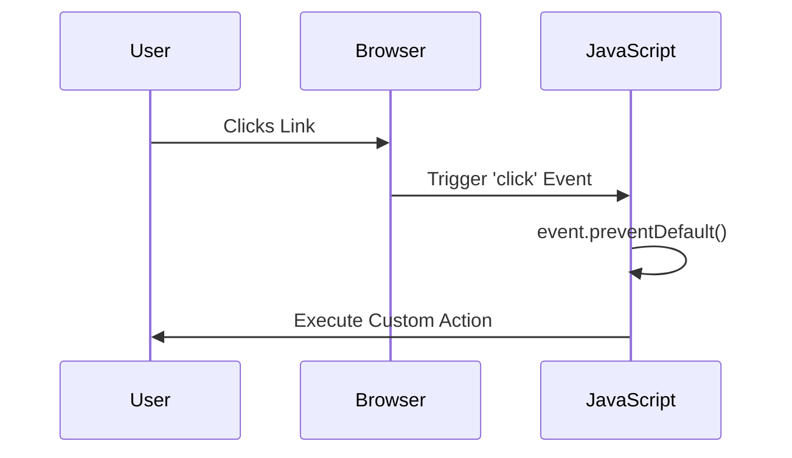

## 11.3 Preventing Default Behavior

In the world of web development, understanding how to control the behavior of web pages is crucial for creating interactive and user-friendly experiences. One of the essential tools for achieving this is the `event.preventDefault()` method in JavaScript. This method allows developers to prevent the default actions that are typically triggered by certain events, such as clicking a link or submitting a form. In this section, we will explore what default actions are, how to prevent them, and the implications of doing so in terms of usability and accessibility.

### Understanding Default Actions

Default actions are the pre-defined behaviors that occur when certain events are triggered in a web browser. For example:

- **Clicking a Link**: When a user clicks on a hyperlink (`<a>` element), the default action is to navigate to the URL specified in the `href` attribute.
- **Submitting a Form**: When a user submits a form (`<form>` element), the default action is to send the form data to the server specified in the `action` attribute.
- **Pressing a Key**: In some input fields, pressing the "Enter" key might trigger a form submission.

These default actions are designed to provide a consistent and predictable user experience. However, there are scenarios where you might want to override these actions to implement custom functionality.

### Using `event.preventDefault()`

The `event.preventDefault()` method is a powerful tool that allows you to stop the default action associated with an event. This method can be used within an event handler to prevent the browser from executing the default behavior. Here's a basic example:

```javascript
// Select the link element
const link = document.querySelector('a');

// Add an event listener for the 'click' event
link.addEventListener('click', function(event) {
    // Prevent the default action (navigation)
    event.preventDefault();
    // Custom action
    console.log('Link clicked, but not navigating!');
});
```

In this example, clicking the link will no longer navigate to the specified URL. Instead, it will log a message to the console. This is particularly useful when you want to handle the link click with JavaScript, such as opening a modal or performing an AJAX request.

### Practical Examples of Preventing Default Behavior

Let's explore some practical scenarios where preventing default behavior is beneficial:

#### Example 1: Custom Form Validation

Forms are a common element in web applications, and sometimes you need to perform custom validation before allowing a form to be submitted. Here's how you can use `event.preventDefault()` to achieve that:

```html
<form id="myForm">
    <input type="text" id="username" placeholder="Enter username" required>
    <button type="submit">Submit</button>
</form>

<script>
    const form = document.getElementById('myForm');

    form.addEventListener('submit', function(event) {
        // Prevent the default form submission
        event.preventDefault();

        // Perform custom validation
        const username = document.getElementById('username').value;
        if (username.trim() === '') {
            alert('Username cannot be empty!');
        } else {
            // Proceed with form submission (e.g., via AJAX)
            console.log('Form is valid, submitting...');
        }
    });
</script>
```

In this example, the form submission is prevented until the custom validation checks are passed. This allows you to provide immediate feedback to users and ensure data integrity.

#### Example 2: Single Page Applications (SPAs)

In Single Page Applications, navigation between different views is often handled by JavaScript without reloading the page. Preventing the default behavior of link clicks is crucial in such cases:

```html
<nav>
    <a href="#home" class="nav-link">Home</a>
    <a href="#about" class="nav-link">About</a>
    <a href="#contact" class="nav-link">Contact</a>
</nav>

<script>
    const navLinks = document.querySelectorAll('.nav-link');

    navLinks.forEach(link => {
        link.addEventListener('click', function(event) {
            event.preventDefault();
            const target = this.getAttribute('href').substring(1);
            // Load the corresponding content dynamically
            console.log(`Navigating to ${target} section`);
        });
    });
</script>
```

Here, the default navigation is prevented, and custom logic is used to load the content dynamically, providing a seamless user experience.

#### Example 3: Custom Context Menus

Sometimes, you might want to replace the browser's default context menu with a custom one:

```html
<div id="customMenu" style="display:none; position:absolute; background:#fff; border:1px solid #ccc;">
    <ul>
        <li>Option 1</li>
        <li>Option 2</li>
        <li>Option 3</li>
    </ul>
</div>

<script>
    const customMenu = document.getElementById('customMenu');

    document.addEventListener('contextmenu', function(event) {
        event.preventDefault();
        customMenu.style.top = `${event.pageY}px`;
        customMenu.style.left = `${event.pageX}px`;
        customMenu.style.display = 'block';
    });

    document.addEventListener('click', function() {
        customMenu.style.display = 'none';
    });
</script>
```

In this example, the default context menu is prevented, and a custom menu is displayed at the cursor's position.

### Considerations for Usability and Accessibility

While preventing default behavior can be powerful, it's essential to consider the implications for usability and accessibility:

- **Usability**: Users expect certain elements to behave in specific ways. For instance, links should navigate, and forms should submit. When you override these behaviors, ensure that your custom actions are intuitive and provide equivalent functionality.
  
- **Accessibility**: Ensure that your custom implementations are accessible to all users, including those using assistive technologies. For example, if you're replacing a form submission with AJAX, make sure to provide feedback to screen readers.

- **Progressive Enhancement**: Consider using progressive enhancement techniques to ensure that your web page remains functional even if JavaScript is disabled. This might involve providing fallback mechanisms for critical actions.

### Visualizing Event Handling

To better understand how event handling and default behavior prevention work, let's visualize the process using a sequence diagram:



This diagram illustrates the flow of events when a user clicks a link, and the default behavior is prevented using JavaScript.

### Try It Yourself

Now that we've explored the concept of preventing default behavior, it's time to try it yourself. Modify the examples provided to suit your needs. For instance, you could:

- Create a form with multiple input fields and implement custom validation for each field.
- Build a simple SPA with navigation links that load different content sections.
- Design a custom context menu with additional options.

Experimenting with these examples will help reinforce your understanding and improve your skills.

### Key Takeaways

- **Default actions** are pre-defined behaviors triggered by certain events, such as clicking a link or submitting a form.
- The `event.preventDefault()` method allows you to prevent these default actions and implement custom functionality.
- Preventing default behavior is useful in scenarios like custom form validation, SPAs, and custom context menus.
- Consider usability and accessibility when overriding default actions to ensure a positive user experience.
- Use progressive enhancement techniques to maintain functionality even if JavaScript is disabled.

By mastering the use of `event.preventDefault()`, you can create more interactive and user-friendly web pages that cater to the needs of your audience.

## Quiz Time!



### What is the purpose of `event.preventDefault()` in JavaScript?

- [x] To stop the default action associated with an event
- [ ] To trigger a default action
- [ ] To create a new event
- [ ] To remove an event listener

> **Explanation:** `event.preventDefault()` is used to stop the default action that is associated with an event, such as navigating to a link or submitting a form.

### Which of the following is a default action in a web browser?

- [x] Navigating to a URL when a link is clicked
- [ ] Logging a message to the console
- [ ] Changing the background color of an element
- [ ] Displaying an alert box

> **Explanation:** Navigating to a URL when a link is clicked is a default action in a web browser. The other options are actions that require custom JavaScript code.

### How can you prevent a form from being submitted using JavaScript?

- [x] Use `event.preventDefault()` in the form's submit event handler
- [ ] Use `console.log()` in the form's submit event handler
- [ ] Use `alert()` in the form's submit event handler
- [ ] Use `document.write()` in the form's submit event handler

> **Explanation:** To prevent a form from being submitted, you can use `event.preventDefault()` within the form's submit event handler.

### What should you consider when preventing default behavior in web development?

- [x] Usability and accessibility
- [ ] Only the color scheme
- [ ] The size of the images
- [ ] The font style

> **Explanation:** When preventing default behavior, it's important to consider usability and accessibility to ensure that your web page remains user-friendly and accessible to all users.

### Which method is used to add an event listener to an element?

- [x] `addEventListener()`
- [ ] `removeEventListener()`
- [ ] `getElementById()`
- [ ] `querySelector()`

> **Explanation:** The `addEventListener()` method is used to attach an event handler to an element.

### In a Single Page Application (SPA), why might you prevent the default action of link clicks?

- [x] To handle navigation with JavaScript without reloading the page
- [ ] To change the text color of the link
- [ ] To display an alert box
- [ ] To log a message to the console

> **Explanation:** In SPAs, preventing the default action of link clicks allows you to handle navigation with JavaScript, providing a seamless user experience without page reloads.

### What is a common use case for preventing default behavior in forms?

- [x] Custom form validation
- [ ] Changing the form's background color
- [ ] Displaying an alert box
- [ ] Logging a message to the console

> **Explanation:** Preventing default behavior in forms is commonly used for custom form validation, allowing you to check the form data before submission.

### Which of the following is NOT a default action in a web browser?

- [x] Logging a message to the console
- [ ] Submitting a form
- [ ] Navigating to a URL
- [ ] Opening a context menu

> **Explanation:** Logging a message to the console is not a default action in a web browser; it requires custom JavaScript code.

### How can you ensure accessibility when preventing default behavior?

- [x] Provide equivalent functionality and feedback for all users
- [ ] Only focus on desktop users
- [ ] Ignore screen readers
- [ ] Use only visual cues

> **Explanation:** Ensuring accessibility involves providing equivalent functionality and feedback for all users, including those using assistive technologies.

### True or False: `event.preventDefault()` can be used to create custom events.

- [ ] True
- [x] False

> **Explanation:** False. `event.preventDefault()` is used to stop default actions, not to create custom events.


