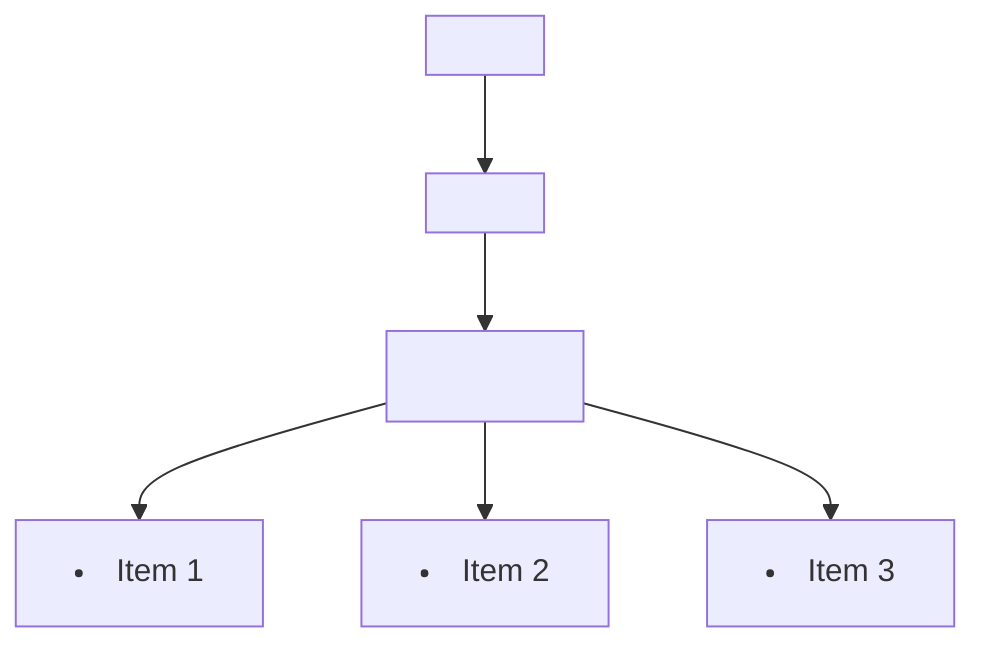

## 11.4 Event Delegation

In the world of web development, creating interactive and responsive web pages is crucial. As we build more complex applications, managing events efficiently becomes increasingly important. Event delegation is a powerful technique that helps us optimize event handling by listening to events at a higher level in the DOM hierarchy. In this section, we'll explore what event delegation is, how it works, and why it's beneficial. We'll also provide practical examples and discuss potential pitfalls and how to mitigate them.

### What is Event Delegation?

Event delegation is a technique in JavaScript that allows us to handle events at a higher level in the DOM tree rather than attaching event listeners to each individual element. This is achieved by taking advantage of event bubbling, a process where events propagate from the target element up through the DOM hierarchy to the root.

#### How Event Bubbling Works

When an event occurs on an element, it first triggers any event listeners on that element. Then, the event "bubbles up" to its parent element, triggering any event listeners there, and continues up the DOM tree until it reaches the root. This bubbling behavior allows us to listen for events on a parent element and handle them for its child elements.

#### Visualizing Event Bubbling

To better understand event bubbling, let's visualize it with a simple DOM structure:



In this diagram, if a click event occurs on `<li> Item 1>`, it will first trigger any event listeners on `<li> Item 1>`, then bubble up to `<ul>`, `<div>`, and finally `<body>`.

### Implementing Event Delegation

Now that we understand the concept of event bubbling, let's see how we can implement event delegation in practice.

#### Adding a Single Event Listener to a Parent Element

Instead of attaching an event listener to each `<li>` element, we can attach a single event listener to the `<ul>` element and handle the click events for all its child `<li>` elements. Here's how we can do it:

```html
<!DOCTYPE html>
<html lang="en">
<head>
    <meta charset="UTF-8">
    <meta name="viewport" content="width=device-width, initial-scale=1.0">
    <title>Event Delegation Example</title>
    <style>
        ul {
            list-style-type: none;
            padding: 0;
        }
        li {
            padding: 10px;
            background-color: #f0f0f0;
            margin: 5px 0;
            cursor: pointer;
        }
        li:hover {
            background-color: #e0e0e0;
        }
    </style>
</head>
<body>
    <ul id="itemList">
        <li>Item 1</li>
        <li>Item 2</li>
        <li>Item 3</li>
    </ul>

    <script>
        // Select the parent element
        const itemList = document.getElementById('itemList');

        // Attach a single event listener to the parent element
        itemList.addEventListener('click', function(event) {
            // Check if the clicked element is an <li>
            if (event.target && event.target.nodeName === 'LI') {
                console.log('List item clicked:', event.target.textContent);
            }
        });
    </script>
</body>
</html>
```

#### Explanation of the Code

- **Selecting the Parent Element**: We select the `<ul>` element using `document.getElementById('itemList')`.
- **Attaching the Event Listener**: We attach a `click` event listener to the `<ul>` element.
- **Checking the Event Target**: Inside the event handler, we check if the `event.target` is an `<li>` element before processing the event. This ensures that we only handle clicks on the list items.

### Benefits of Event Delegation

Event delegation offers several advantages, especially when dealing with a large number of elements:

1. **Performance Improvement**: By attaching a single event listener to a parent element, we reduce the number of event listeners in the DOM, which can improve performance, particularly in applications with many elements.

2. **Simplified Code**: Event delegation simplifies our code by reducing redundancy. Instead of attaching multiple event listeners, we manage events in one place.

3. **Dynamic Content Handling**: Event delegation is particularly useful when dealing with dynamic content. If new elements are added to the DOM, they automatically inherit the event handling logic without needing additional listeners.

### Potential Pitfalls and Mitigation

While event delegation is powerful, there are some potential pitfalls to be aware of:

#### 1. **Event Targeting**

When using event delegation, we must be careful to check the `event.target` to ensure we're handling the correct element. This can be mitigated by using conditional checks within the event handler.

#### 2. **Event Propagation**

In some cases, we may want to stop the event from propagating further up the DOM tree. We can use `event.stopPropagation()` to prevent further propagation if necessary.

#### 3. **Complexity with Nested Elements**

If we have nested elements with their own event listeners, event delegation can become complex. It's important to carefully manage event propagation and ensure that the correct events are being handled.

### Practical Example: Handling Clicks on List Items

Let's revisit our example and add some interactivity. We'll highlight the clicked list item by changing its background color.

```html
<!DOCTYPE html>
<html lang="en">
<head>
    <meta charset="UTF-8">
    <meta name="viewport" content="width=device-width, initial-scale=1.0">
    <title>Interactive List with Event Delegation</title>
    <style>
        ul {
            list-style-type: none;
            padding: 0;
        }
        li {
            padding: 10px;
            background-color: #f0f0f0;
            margin: 5px 0;
            cursor: pointer;
        }
        li.active {
            background-color: #c0c0c0;
        }
    </style>
</head>
<body>
    <ul id="itemList">
        <li>Item 1</li>
        <li>Item 2</li>
        <li>Item 3</li>
    </ul>

    <script>
        const itemList = document.getElementById('itemList');

        itemList.addEventListener('click', function(event) {
            if (event.target && event.target.nodeName === 'LI') {
                // Remove 'active' class from all list items
                const items = itemList.getElementsByTagName('li');
                for (let item of items) {
                    item.classList.remove('active');
                }

                // Add 'active' class to the clicked list item
                event.target.classList.add('active');
            }
        });
    </script>
</body>
</html>
```

#### Explanation of the Code

- **Adding an 'active' Class**: We define an `active` class in CSS to change the background color of the clicked list item.
- **Removing the 'active' Class**: Before adding the `active` class to the clicked item, we remove it from all list items to ensure only one item is highlighted at a time.
- **Applying the 'active' Class**: We add the `active` class to the clicked list item using `event.target.classList.add('active')`.

### Try It Yourself

Now that we've covered the basics of event delegation, try experimenting with the code. Here are some suggestions:

- **Add More List Items**: Add more `<li>` elements to the list and observe how the event delegation handles them seamlessly.
- **Change the Highlight Color**: Modify the CSS to change the highlight color of the active list item.
- **Add Nested Elements**: Try adding nested elements within the `<li>` items and see how event delegation behaves.

### Summary

Event delegation is a powerful technique that allows us to optimize event handling by leveraging event bubbling. By attaching a single event listener to a parent element, we can efficiently manage events for multiple child elements. This approach improves performance, simplifies code, and is particularly useful for handling dynamic content. However, it's important to be mindful of potential pitfalls, such as event targeting and propagation, and to implement checks and controls as needed.

### Further Reading

For more information on event delegation and related topics, consider exploring the following resources:

- [MDN Web Docs: Event Delegation](https://developer.mozilla.org/en-US/docs/Learn/JavaScript/Building_blocks/Events#event_delegation)
- [W3Schools: JavaScript Event Delegation](https://www.w3schools.com/js/js_event_delegation.asp)

By mastering event delegation, you'll be well-equipped to build efficient and responsive web applications. Keep experimenting and exploring to deepen your understanding of this powerful concept.

## Quiz Time!



### What is event delegation in JavaScript?

- [x] A technique to handle events at a higher level in the DOM tree.
- [ ] A method to prevent event bubbling.
- [ ] A way to attach multiple event listeners to a single element.
- [ ] A process to stop event propagation.

> **Explanation:** Event delegation is a technique that allows handling events at a higher level in the DOM tree, leveraging event bubbling.

### How does event bubbling work?

- [x] Events propagate from the target element up through the DOM hierarchy.
- [ ] Events propagate from the root element down to the target element.
- [ ] Events are handled only at the target element.
- [ ] Events are stopped immediately after triggering.

> **Explanation:** Event bubbling is the process where events propagate from the target element up through the DOM hierarchy.

### Which method is used to stop event propagation?

- [x] `event.stopPropagation()`
- [ ] `event.preventDefault()`
- [ ] `event.stopImmediatePropagation()`
- [ ] `event.cancelBubble()`

> **Explanation:** The `event.stopPropagation()` method is used to stop event propagation up the DOM tree.

### What is a potential benefit of event delegation?

- [x] Improved performance by reducing the number of event listeners.
- [ ] Increased complexity in event handling.
- [ ] Slower response time for events.
- [ ] More code redundancy.

> **Explanation:** Event delegation improves performance by reducing the number of event listeners, simplifying code, and handling dynamic content efficiently.

### What should you check in the event handler when using event delegation?

- [x] `event.target`
- [ ] `event.currentTarget`
- [ ] `event.type`
- [ ] `event.timeStamp`

> **Explanation:** When using event delegation, it's important to check `event.target` to ensure the correct element is being handled.

### Which HTML element is used in the example to demonstrate event delegation?

- [x] `<ul>`
- [ ] `<div>`
- [ ] `<span>`
- [ ] `<button>`

> **Explanation:** The example uses a `<ul>` element to demonstrate event delegation by handling clicks on its child `<li>` elements.

### What is the purpose of the 'active' class in the practical example?

- [x] To change the background color of the clicked list item.
- [ ] To add a border to the list item.
- [ ] To hide the list item.
- [ ] To increase the font size of the list item.

> **Explanation:** The 'active' class is used to change the background color of the clicked list item, highlighting it.

### How can you dynamically handle new elements added to the DOM with event delegation?

- [x] By attaching an event listener to a parent element.
- [ ] By attaching an event listener to each new element.
- [ ] By using `event.stopPropagation()`.
- [ ] By using `event.preventDefault()`.

> **Explanation:** Event delegation allows dynamically handling new elements by attaching an event listener to a parent element, so new elements inherit the event handling logic.

### What is a potential pitfall of event delegation?

- [x] Complexity with nested elements.
- [ ] Increased number of event listeners.
- [ ] Reduced performance.
- [ ] Inability to handle dynamic content.

> **Explanation:** A potential pitfall of event delegation is complexity with nested elements, which requires careful management of event propagation.

### True or False: Event delegation is only useful for handling click events.

- [ ] True
- [x] False

> **Explanation:** False. Event delegation can be used for various types of events, not just click events.


