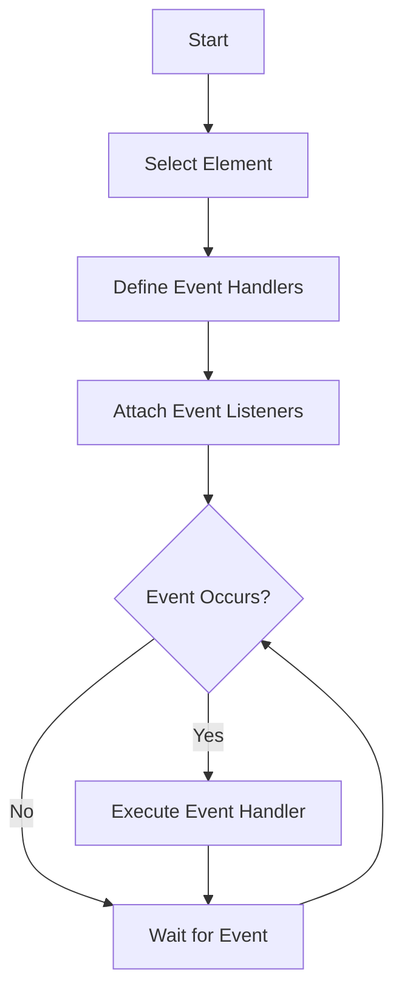

## 11.5 Handling Multiple Events

In the world of web development, creating interactive and dynamic web pages often involves handling multiple events. This section will guide you through the process of managing different event types on elements using JavaScript. By the end of this section, you'll understand how to attach multiple event listeners to an element, group related event handlers, and maintain your code for better readability and efficiency.

### Understanding Event Listeners

Before diving into handling multiple events, let's revisit the concept of event listeners. An event listener is a procedure in JavaScript that waits for an event to occur on a specified element. When the event occurs, the listener executes a function, known as an event handler.

### Attaching Multiple Event Listeners

In many scenarios, you may want to respond to more than one type of event on a single element. For example, you might want to change the appearance of a button when a user hovers over it and revert it when the mouse leaves. JavaScript allows you to attach multiple event listeners to a single element, each listening for a different event type.

#### Example: Mouse Enter and Leave Events

Let's consider a simple example where we change the background color of a button when the mouse enters and leaves it.

```html
<!DOCTYPE html>
<html lang="en">
<head>
    <meta charset="UTF-8">
    <meta name="viewport" content="width=device-width, initial-scale=1.0">
    <title>Multiple Event Listeners</title>
    <style>
        #myButton {
            padding: 10px 20px;
            background-color: lightblue;
            border: none;
            cursor: pointer;
        }
    </style>
</head>
<body>
    <button id="myButton">Hover over me!</button>

    <script>
        const button = document.getElementById('myButton');

        // Event handler for mouse enter
        function onMouseEnter() {
            button.style.backgroundColor = 'lightgreen';
        }

        // Event handler for mouse leave
        function onMouseLeave() {
            button.style.backgroundColor = 'lightblue';
        }

        // Attach event listeners
        button.addEventListener('mouseenter', onMouseEnter);
        button.addEventListener('mouseleave', onMouseLeave);
    </script>
</body>
</html>
```

In this example, we have a button with an ID of `myButton`. We attach two event listeners to this button:

- `mouseenter`: This event is triggered when the mouse pointer enters the button. The `onMouseEnter` function changes the button's background color to light green.
- `mouseleave`: This event is triggered when the mouse pointer leaves the button. The `onMouseLeave` function reverts the button's background color to light blue.

### Grouping Related Event Handlers

As your web application grows, you might find yourself handling numerous events. Grouping related event handlers can help keep your code organized and maintainable. You can achieve this by defining all related event handlers in one place and attaching them to the elements as needed.

#### Example: Grouping Handlers for a Navigation Menu

Consider a navigation menu where you want to highlight menu items when hovered over and revert them when the mouse leaves.

```html
<!DOCTYPE html>
<html lang="en">
<head>
    <meta charset="UTF-8">
    <meta name="viewport" content="width=device-width, initial-scale=1.0">
    <title>Grouped Event Handlers</title>
    <style>
        .menu-item {
            padding: 10px;
            display: inline-block;
            background-color: #f0f0f0;
            margin-right: 5px;
            cursor: pointer;
        }
    </style>
</head>
<body>
    <div class="menu-item">Home</div>
    <div class="menu-item">About</div>
    <div class="menu-item">Services</div>
    <div class="menu-item">Contact</div>

    <script>
        const menuItems = document.querySelectorAll('.menu-item');

        // Grouped event handlers
        function highlightItem(event) {
            event.target.style.backgroundColor = '#d3d3d3';
        }

        function resetItem(event) {
            event.target.style.backgroundColor = '#f0f0f0';
        }

        // Attach event listeners to each menu item
        menuItems.forEach(item => {
            item.addEventListener('mouseenter', highlightItem);
            item.addEventListener('mouseleave', resetItem);
        });
    </script>
</body>
</html>
```

In this example, we have a set of menu items. We define two event handlers, `highlightItem` and `resetItem`, to change the background color of a menu item when hovered over and revert it when the mouse leaves. We then attach these handlers to each menu item using a loop.

### Managing and Organizing Event Handlers

To ensure your code remains clean and maintainable, consider the following best practices when managing multiple event handlers:

1. **Use Descriptive Function Names**: Clearly name your event handler functions to indicate their purpose. This makes your code easier to understand and maintain.

2. **Keep Handlers Short and Focused**: Each event handler should perform a single, well-defined task. If a handler becomes too complex, consider breaking it into smaller functions.

3. **Avoid Inline Event Handlers**: While it's possible to define event handlers directly in HTML using attributes like `onclick`, it's generally better to keep JavaScript separate from HTML for better maintainability and separation of concerns.

4. **Use Event Delegation When Appropriate**: For elements that are dynamically added to the DOM, consider using event delegation to manage events efficiently. This involves attaching a single event listener to a parent element and using the event's target property to determine which child element triggered the event.

#### Example: Event Delegation

Event delegation is a powerful technique that allows you to handle events for multiple child elements with a single event listener on a parent element. This is particularly useful when dealing with dynamically generated content.

```html
<!DOCTYPE html>
<html lang="en">
<head>
    <meta charset="UTF-8">
    <meta name="viewport" content="width=device-width, initial-scale=1.0">
    <title>Event Delegation</title>
    <style>
        .list-item {
            padding: 10px;
            background-color: #e0e0e0;
            margin-bottom: 5px;
            cursor: pointer;
        }
    </style>
</head>
<body>
    <div id="listContainer">
        <div class="list-item">Item 1</div>
        <div class="list-item">Item 2</div>
        <div class="list-item">Item 3</div>
    </div>

    <script>
        const listContainer = document.getElementById('listContainer');

        // Event handler using delegation
        function handleItemClick(event) {
            if (event.target.classList.contains('list-item')) {
                alert(`You clicked on ${event.target.textContent}`);
            }
        }

        // Attach event listener to the parent container
        listContainer.addEventListener('click', handleItemClick);
    </script>
</body>
</html>
```

In this example, we attach a single `click` event listener to the `listContainer` element. The `handleItemClick` function checks if the clicked element has the `list-item` class and displays an alert with the item's text content. This approach is efficient and reduces the number of event listeners needed.

### Try It Yourself

Now that you've learned how to handle multiple events, try experimenting with the examples provided. Here are a few suggestions:

1. **Modify the Button Example**: Add a `click` event listener to the button that changes its text content when clicked.

2. **Enhance the Navigation Menu**: Add a `click` event listener to each menu item that logs the item's text to the console.

3. **Expand the Event Delegation Example**: Add more list items dynamically using JavaScript and verify that the event delegation still works.

### Visualizing Event Handling

To better understand how event listeners work, let's visualize the process using a flowchart. This flowchart illustrates the steps involved in attaching and handling multiple events on an element.



**Description**: This flowchart shows the process of handling multiple events. It starts with selecting an element, defining event handlers, and attaching event listeners. When an event occurs, the corresponding handler is executed.

### References and Further Reading

For more information on handling events in JavaScript, consider exploring the following resources:

- [MDN Web Docs: EventTarget.addEventListener()](https://developer.mozilla.org/en-US/docs/Web/API/EventTarget/addEventListener)
- [W3Schools: JavaScript Events](https://www.w3schools.com/js/js_events.asp)

### Key Takeaways

- You can attach multiple event listeners to a single element to handle different event types.
- Group related event handlers to keep your code organized and maintainable.
- Use event delegation to efficiently manage events for dynamically generated content.
- Follow best practices for naming, organizing, and maintaining event handlers.

By mastering the techniques covered in this section, you'll be well-equipped to create interactive and dynamic web pages that respond to user actions seamlessly.

## Quiz Time!



### What is an event listener in JavaScript?

- [x] A procedure that waits for an event to occur on an element.
- [ ] A function that changes the style of an element.
- [ ] A method to remove an element from the DOM.
- [ ] A tool for debugging JavaScript code.

> **Explanation:** An event listener is a procedure in JavaScript that waits for an event to occur on a specified element and executes a function when the event occurs.

### How can you attach multiple event listeners to a single element?

- [x] By using `addEventListener()` multiple times with different event types.
- [ ] By using `setAttribute()` with event types.
- [ ] By using `innerHTML` to add event handlers.
- [ ] By using `querySelectorAll()` to select multiple elements.

> **Explanation:** You can attach multiple event listeners to a single element by calling `addEventListener()` multiple times with different event types and handlers.

### What is the purpose of grouping related event handlers?

- [x] To keep the code organized and maintainable.
- [ ] To increase the execution speed of event handlers.
- [ ] To reduce the number of event listeners in the code.
- [ ] To ensure that only one event handler is executed at a time.

> **Explanation:** Grouping related event handlers helps keep the code organized and maintainable by defining all related handlers in one place.

### What is event delegation?

- [x] A technique to handle events for multiple child elements with a single listener on a parent element.
- [ ] A method to prevent default actions of events.
- [ ] A way to remove event listeners from elements.
- [ ] A tool for debugging event handlers.

> **Explanation:** Event delegation is a technique that allows you to handle events for multiple child elements by attaching a single event listener to a parent element.

### Which of the following is a best practice for managing event handlers?

- [x] Use descriptive function names.
- [ ] Define event handlers inline in HTML.
- [ ] Use `innerHTML` to attach event handlers.
- [ ] Avoid using event listeners for performance reasons.

> **Explanation:** Using descriptive function names is a best practice for managing event handlers as it makes the code easier to understand and maintain.

### What does the `mouseenter` event do?

- [x] It triggers when the mouse pointer enters an element.
- [ ] It triggers when the mouse pointer leaves an element.
- [ ] It triggers when an element is clicked.
- [ ] It triggers when an element is double-clicked.

> **Explanation:** The `mouseenter` event is triggered when the mouse pointer enters the boundaries of an element.

### How can you change the background color of an element using an event handler?

- [x] By modifying the `style.backgroundColor` property in the event handler.
- [ ] By using `innerHTML` to change the color.
- [ ] By using `setAttribute()` to set the color.
- [ ] By using `querySelector()` to select a color.

> **Explanation:** You can change the background color of an element by modifying the `style.backgroundColor` property within an event handler.

### What is the benefit of using event delegation?

- [x] It reduces the number of event listeners needed for child elements.
- [ ] It increases the speed of event handling.
- [ ] It prevents default actions of events.
- [ ] It ensures that only one event handler is executed at a time.

> **Explanation:** Event delegation reduces the number of event listeners needed by attaching a single listener to a parent element and handling events for multiple child elements.

### Which method is used to attach an event listener to an element?

- [x] `addEventListener()`
- [ ] `setAttribute()`
- [ ] `innerHTML`
- [ ] `querySelector()`

> **Explanation:** The `addEventListener()` method is used to attach an event listener to an element, specifying the event type and handler function.

### True or False: Inline event handlers are recommended for better maintainability.

- [ ] True
- [x] False

> **Explanation:** False. Inline event handlers are generally not recommended for better maintainability. It's better to keep JavaScript separate from HTML for better separation of concerns.


