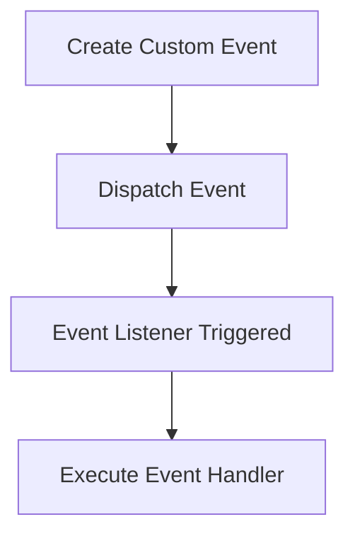

## 11.6 Custom Events

In the world of web development, events play a crucial role in making web pages interactive and dynamic. While JavaScript provides a plethora of built-in events like `click`, `mouseover`, and `keydown`, there are scenarios where you might need to create your own events to handle specific interactions or communications between different parts of your application. This is where custom events come into play.

### Introduction to Custom Events

Custom events allow developers to define and dispatch their own events, providing a powerful mechanism to facilitate communication between different components or parts of a web application. They are especially useful in complex applications where built-in events are not sufficient to handle specific interactions.

#### Why Use Custom Events?

- **Decoupling Components**: Custom events enable different parts of your application to communicate without being tightly coupled. This makes your code more modular and easier to maintain.
- **Enhanced Interactivity**: By creating custom events, you can design more interactive and responsive user interfaces.
- **Flexibility**: Custom events provide the flexibility to define specific behaviors that are not covered by standard events.

### Creating a Custom Event

Creating a custom event in JavaScript is straightforward, thanks to the `CustomEvent` constructor. This constructor allows you to define an event type and pass additional data to the event handler.

#### Using the `CustomEvent` Constructor

The `CustomEvent` constructor is used to create a new event with a specified name and optional details. Here's the basic syntax:

```javascript
let myEvent = new CustomEvent('myEvent', { detail: { key1: 'value1' } });
```

- **Event Name**: The first parameter is the name of the event. This is a string that identifies the event.
- **Event Details**: The second parameter is an options object where you can pass additional data using the `detail` property.

#### Example: Creating a Custom Event

Let's create a simple custom event named `userLoggedIn` that carries information about the user:

```javascript
let userLoggedInEvent = new CustomEvent('userLoggedIn', {
  detail: {
    username: 'JohnDoe',
    loginTime: new Date()
  }
});
```

In this example, the custom event `userLoggedIn` is created with details about the user's name and the login time.

### Dispatching a Custom Event

Once a custom event is created, the next step is to dispatch it. Dispatching an event means triggering it so that any event listeners attached to it can respond.

#### Using `dispatchEvent()`

The `dispatchEvent()` method is used to dispatch an event to a specified element. Here's how you can dispatch the `userLoggedIn` event:

```javascript
document.dispatchEvent(userLoggedInEvent);
```

In this example, the `userLoggedInEvent` is dispatched on the `document` object, but you can dispatch it on any DOM element.

### Listening for Custom Events

To respond to a custom event, you need to set up an event listener. This is done using the `addEventListener()` method, just like with built-in events.

#### Example: Listening for a Custom Event

Let's listen for the `userLoggedIn` event and log the details to the console:

```javascript
document.addEventListener('userLoggedIn', function(event) {
  console.log('User logged in:', event.detail.username);
  console.log('Login time:', event.detail.loginTime);
});
```

In this example, we attach an event listener to the `document` object that listens for the `userLoggedIn` event and logs the username and login time.

### Use Cases for Custom Events

Custom events are incredibly versatile and can be used in a variety of scenarios. Here are some common use cases:

#### 1. Component Communication

In complex web applications, different components often need to communicate with each other. Custom events provide a clean way to facilitate this communication. For example, a form component can dispatch a custom event when a user submits the form, and a parent component can listen for this event to update the UI.

#### 2. State Management

Custom events can be used to manage application state. For instance, you can dispatch a custom event whenever the application state changes, allowing different parts of the application to react accordingly.

#### 3. User Interaction

Custom events can enhance user interaction by triggering specific behaviors based on user actions. For example, you can create a custom event that fires when a user completes a tutorial, unlocking new features in the application.

### Advanced Concepts: Event Bubbling and Capturing

When working with events, it's important to understand the concepts of event bubbling and capturing. These concepts determine the order in which event handlers are executed.

#### Event Bubbling

Event bubbling is the process by which an event propagates from the target element up through the DOM tree to the root. By default, events bubble, meaning they are first captured and handled by the innermost element and then propagate outward to the parent elements.

#### Event Capturing

Event capturing, also known as the "capture phase," is the opposite of bubbling. In capturing, the event starts from the root and propagates down to the target element.

#### Custom Events and Propagation

Custom events can also bubble and be captured. When creating a custom event, you can specify whether it should bubble by setting the `bubbles` property in the options object:

```javascript
let myEvent = new CustomEvent('myEvent', { bubbles: true, detail: { key1: 'value1' } });
```

### Try It Yourself: Experimenting with Custom Events

Now that we've covered the basics of custom events, let's try creating and dispatching a custom event on your own. Follow these steps:

1. **Create an HTML file** with a button element:

    ```html
    <!DOCTYPE html>
    <html lang="en">
    <head>
        <meta charset="UTF-8">
        <meta name="viewport" content="width=device-width, initial-scale=1.0">
        <title>Custom Event Example</title>
    </head>
    <body>
        <button id="myButton">Click Me</button>
        <script src="script.js"></script>
    </body>
    </html>
    ```

2. **Create a JavaScript file** named `script.js` with the following code:

    ```javascript
    // Create a custom event
    let buttonClickedEvent = new CustomEvent('buttonClicked', {
      detail: {
        message: 'Button was clicked!'
      }
    });

    // Add event listener for the custom event
    document.addEventListener('buttonClicked', function(event) {
      alert(event.detail.message);
    });

    // Get the button element
    let button = document.getElementById('myButton');

    // Dispatch the custom event when the button is clicked
    button.addEventListener('click', function() {
      document.dispatchEvent(buttonClickedEvent);
    });
    ```

3. **Open the HTML file** in a web browser and click the button to see the custom event in action.

### Visualizing Custom Event Flow

To better understand how custom events work, let's visualize the process using a flowchart. This will help you see the steps involved in creating, dispatching, and listening for a custom event.



- **Create Custom Event**: Use the `CustomEvent` constructor to define the event.
- **Dispatch Event**: Use `dispatchEvent()` to trigger the event.
- **Event Listener Triggered**: The event listener responds to the event.
- **Execute Event Handler**: The event handler executes the desired actions.

### Summary

Custom events are a powerful tool in JavaScript that allow you to create more interactive and modular web applications. By understanding how to create, dispatch, and listen for custom events, you can enhance communication between components and improve the overall user experience. Remember to experiment with different scenarios and use cases to fully grasp the potential of custom events in your projects.

### Further Reading

For more information on custom events and event handling in JavaScript, check out these resources:

- [MDN Web Docs: CustomEvent](https://developer.mozilla.org/en-US/docs/Web/API/CustomEvent)
- [W3Schools: JavaScript Events](https://www.w3schools.com/js/js_events.asp)

## Quiz Time!



### What is a custom event in JavaScript?

- [x] An event created by developers to handle specific interactions
- [ ] A built-in event like `click` or `mouseover`
- [ ] An event that only occurs in the DOM
- [ ] An event that cannot be dispatched

> **Explanation:** Custom events are created by developers to handle specific interactions not covered by built-in events.

### How do you create a custom event in JavaScript?

- [x] Using the `CustomEvent` constructor
- [ ] Using the `createEvent` method
- [ ] Using the `new Event` syntax
- [ ] Using the `Event` constructor

> **Explanation:** The `CustomEvent` constructor is used to create custom events in JavaScript.

### What method is used to dispatch a custom event?

- [x] `dispatchEvent()`
- [ ] `triggerEvent()`
- [ ] `fireEvent()`
- [ ] `emitEvent()`

> **Explanation:** The `dispatchEvent()` method is used to trigger a custom event.

### What is the purpose of the `detail` property in a custom event?

- [x] To pass additional data to the event handler
- [ ] To specify the event type
- [ ] To determine if the event should bubble
- [ ] To set the event target

> **Explanation:** The `detail` property is used to pass additional data to the event handler.

### Can custom events bubble?

- [x] Yes, if specified in the options object
- [ ] No, custom events cannot bubble
- [ ] Yes, by default
- [ ] Only in specific browsers

> **Explanation:** Custom events can bubble if the `bubbles` property is set to `true` in the options object.

### What is the default value of the `bubbles` property in a custom event?

- [x] `false`
- [ ] `true`
- [ ] `null`
- [ ] `undefined`

> **Explanation:** The default value of the `bubbles` property in a custom event is `false`.

### Which method is used to listen for a custom event?

- [x] `addEventListener()`
- [ ] `onEvent()`
- [ ] `listenEvent()`
- [ ] `catchEvent()`

> **Explanation:** The `addEventListener()` method is used to listen for events, including custom events.

### What is event bubbling?

- [x] The process by which an event propagates from the target element up through the DOM tree
- [ ] The process by which an event propagates from the root element down to the target element
- [ ] The process of stopping an event from being dispatched
- [ ] The process of creating a new event

> **Explanation:** Event bubbling is the process by which an event propagates from the target element up through the DOM tree.

### What is event capturing?

- [x] The process by which an event propagates from the root element down to the target element
- [ ] The process by which an event propagates from the target element up through the DOM tree
- [ ] The process of stopping an event from being dispatched
- [ ] The process of creating a new event

> **Explanation:** Event capturing is the process by which an event propagates from the root element down to the target element.

### True or False: Custom events can be used to decouple components in a web application.

- [x] True
- [ ] False

> **Explanation:** Custom events can be used to decouple components, allowing them to communicate without being tightly coupled.


