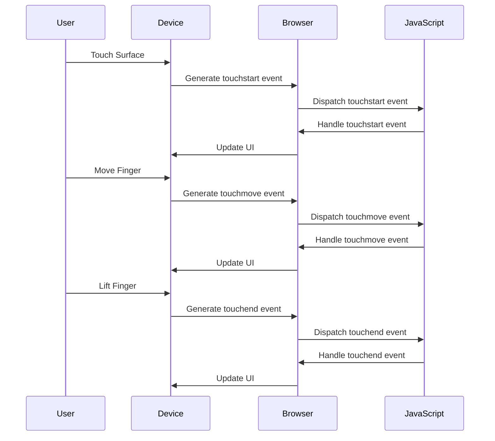

## 11.7 Touch and Gesture Events

As we continue to explore the world of web development, it becomes increasingly important to understand how users interact with web pages on various devices. With the rise of smartphones and tablets, touch interactions have become a crucial part of user experience design. In this section, we will delve into touch and gesture events, which allow us to respond to touch interactions on mobile devices.

### Introduction to Touch Events

Touch events are a set of events that are triggered when a user interacts with a touch-sensitive device. These events are essential for creating interactive and responsive web applications that work seamlessly on mobile devices. The primary touch events include:

- **`touchstart`**: Triggered when a touch point is placed on the touch surface.
- **`touchmove`**: Triggered when a touch point moves across the touch surface.
- **`touchend`**: Triggered when a touch point is removed from the touch surface.
- **`touchcancel`**: Triggered when a touch point is interrupted, such as when the device loses focus.

Let's explore each of these events in detail and understand how they differ from traditional mouse events.

### Differences Between Touch and Mouse Events

While touch and mouse events serve similar purposes, there are key differences between them:

1. **Multiple Touch Points**: Unlike mouse events, touch events can handle multiple touch points simultaneously. This is crucial for gestures like pinch-to-zoom or multi-finger swipes.

2. **Event Properties**: Touch events provide additional properties, such as `touches`, `targetTouches`, and `changedTouches`, which contain information about all touch points involved in the event.

3. **Device-Specific Behavior**: Touch events are designed for touch-sensitive devices, whereas mouse events are primarily for devices with a pointing device like a mouse or trackpad.

4. **Performance Considerations**: Touch events can be more performance-intensive due to the need to track multiple touch points and their movements.

### Handling Touch Events

To handle touch events, we use the `addEventListener` method to attach event listeners to DOM elements. Let's look at some examples of handling touch events in JavaScript.

#### Example: Handling `touchstart` Event

The `touchstart` event is triggered when a touch point is placed on the touch surface. Here's how you can handle this event:

```javascript
// Select the element you want to listen for touch events on
const element = document.getElementById('touchArea');

// Add an event listener for the 'touchstart' event
element.addEventListener('touchstart', function(event) {
    // Prevent the default behavior
    event.preventDefault();

    // Log the touch event
    console.log('Touch started:', event);

    // Access the touch points
    const touches = event.touches;
    console.log('Number of touch points:', touches.length);
});
```

In this example, we prevent the default behavior of the touch event to ensure that our custom logic takes precedence. We also log the number of touch points involved in the event.

#### Example: Handling `touchmove` Event

The `touchmove` event is triggered when a touch point moves across the touch surface. This event is useful for implementing drag-and-drop functionality or custom gestures.

```javascript
element.addEventListener('touchmove', function(event) {
    // Prevent the default behavior
    event.preventDefault();

    // Log the touch event
    console.log('Touch moved:', event);

    // Access the touch points
    const touches = event.touches;
    for (let i = 0; i < touches.length; i++) {
        const touch = touches[i];
        console.log(`Touch ${i}: (${touch.clientX}, ${touch.clientY})`);
    }
});
```

In this example, we iterate over the touch points and log their coordinates. This information can be used to track movements and implement custom interactions.

#### Example: Handling `touchend` Event

The `touchend` event is triggered when a touch point is removed from the touch surface. This event is useful for finalizing interactions, such as completing a drag-and-drop operation.

```javascript
element.addEventListener('touchend', function(event) {
    // Prevent the default behavior
    event.preventDefault();

    // Log the touch event
    console.log('Touch ended:', event);

    // Access the changed touch points
    const changedTouches = event.changedTouches;
    console.log('Number of changed touch points:', changedTouches.length);
});
```

In this example, we access the `changedTouches` property to determine which touch points have changed since the last event.

#### Example: Handling `touchcancel` Event

The `touchcancel` event is triggered when a touch point is interrupted, such as when the device loses focus. This event is less common but important for handling unexpected interruptions.

```javascript
element.addEventListener('touchcancel', function(event) {
    // Prevent the default behavior
    event.preventDefault();

    // Log the touch event
    console.log('Touch canceled:', event);
});
```

### Considerations for Touch Interactions

When designing touch interactions, it's important to consider the following:

1. **Responsiveness**: Ensure that your touch interactions are responsive and provide immediate feedback to the user. Delays can lead to a poor user experience.

2. **Gesture Recognition**: Consider implementing gesture recognition for common gestures like pinch-to-zoom, swipe, and tap. This can enhance the usability of your application.

3. **Testing on Devices**: Always test your touch interactions on actual devices to ensure they work as expected. Emulators and simulators may not accurately replicate the behavior of real devices.

4. **Accessibility**: Ensure that your touch interactions are accessible to all users, including those with disabilities. Consider providing alternative input methods for users who may have difficulty with touch interactions.

### Try It Yourself

Now that we've covered the basics of touch events, let's encourage you to experiment with the code examples provided. Try modifying the code to implement custom gestures or interactions. For example, you could create a simple drawing application that allows users to draw on a canvas using touch input.

### Visualizing Touch Events

To help you better understand how touch events work, let's visualize the flow of touch events using a Mermaid.js diagram.



This diagram illustrates the sequence of events that occur when a user interacts with a touch-sensitive device. Understanding this flow can help you design more effective touch interactions.

### References and Further Reading

To deepen your understanding of touch events and mobile interactions, consider exploring the following resources:

- [MDN Web Docs: Touch Events](https://developer.mozilla.org/en-US/docs/Web/API/Touch_events)
- [W3Schools: HTML DOM TouchEvent Object](https://www.w3schools.com/jsref/obj_touchevent.asp)
- [Google Developers: Touch Events](https://developers.google.com/web/fundamentals/design-and-ux/input/touch)

### Key Takeaways

- Touch events are essential for creating interactive web applications on mobile devices.
- The primary touch events are `touchstart`, `touchmove`, `touchend`, and `touchcancel`.
- Touch events differ from mouse events in their ability to handle multiple touch points and provide additional properties.
- When designing touch interactions, consider responsiveness, gesture recognition, testing on devices, and accessibility.

### Quiz Time!



### Which touch event is triggered when a touch point is placed on the touch surface?

- [x] `touchstart`
- [ ] `touchmove`
- [ ] `touchend`
- [ ] `touchcancel`

> **Explanation:** The `touchstart` event is triggered when a touch point is placed on the touch surface.

### What property of a touch event contains information about all touch points involved in the event?

- [x] `touches`
- [ ] `targetTouches`
- [ ] `changedTouches`
- [ ] `touchPoints`

> **Explanation:** The `touches` property contains information about all touch points involved in the event.

### Which touch event is triggered when a touch point moves across the touch surface?

- [ ] `touchstart`
- [x] `touchmove`
- [ ] `touchend`
- [ ] `touchcancel`

> **Explanation:** The `touchmove` event is triggered when a touch point moves across the touch surface.

### How can you prevent the default behavior of a touch event in JavaScript?

- [x] Use `event.preventDefault()`
- [ ] Use `event.stopPropagation()`
- [ ] Use `event.stopImmediatePropagation()`
- [ ] Use `event.cancel()`

> **Explanation:** You can prevent the default behavior of a touch event by using `event.preventDefault()`.

### Which event property provides information about touch points that have changed since the last event?

- [ ] `touches`
- [ ] `targetTouches`
- [x] `changedTouches`
- [ ] `touchPoints`

> **Explanation:** The `changedTouches` property provides information about touch points that have changed since the last event.

### What is a key difference between touch events and mouse events?

- [x] Touch events can handle multiple touch points simultaneously.
- [ ] Mouse events can handle multiple touch points simultaneously.
- [ ] Touch events are only for desktop devices.
- [ ] Mouse events are only for mobile devices.

> **Explanation:** Touch events can handle multiple touch points simultaneously, unlike mouse events.

### Which of the following is NOT a primary touch event?

- [ ] `touchstart`
- [ ] `touchmove`
- [ ] `touchend`
- [x] `touchdrag`

> **Explanation:** `touchdrag` is not a primary touch event. The primary touch events are `touchstart`, `touchmove`, `touchend`, and `touchcancel`.

### Why is it important to test touch interactions on actual devices?

- [x] Emulators may not accurately replicate real device behavior.
- [ ] It is not important to test on actual devices.
- [ ] Testing on devices is only necessary for desktop applications.
- [ ] Device testing is only for performance reasons.

> **Explanation:** Testing on actual devices is important because emulators may not accurately replicate the behavior of real devices.

### What should be considered when designing touch interactions?

- [x] Responsiveness and accessibility
- [ ] Only visual design
- [ ] Only performance
- [ ] Only desktop compatibility

> **Explanation:** When designing touch interactions, consider responsiveness, gesture recognition, testing on devices, and accessibility.

### True or False: Touch events can be more performance-intensive than mouse events.

- [x] True
- [ ] False

> **Explanation:** Touch events can be more performance-intensive due to the need to track multiple touch points and their movements.


