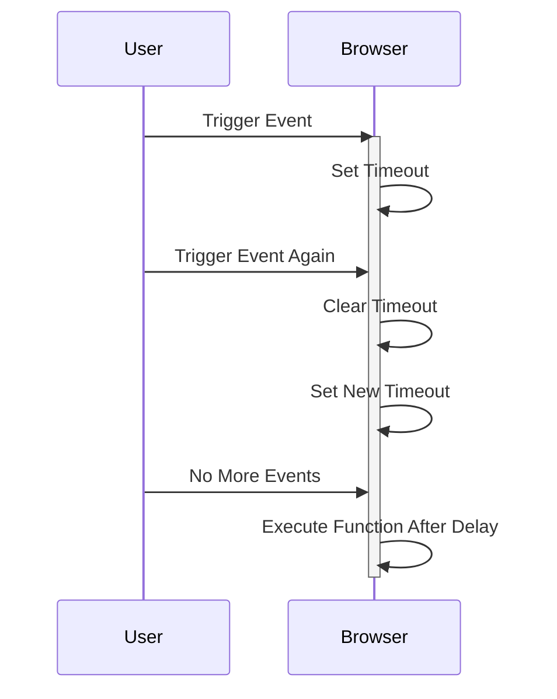
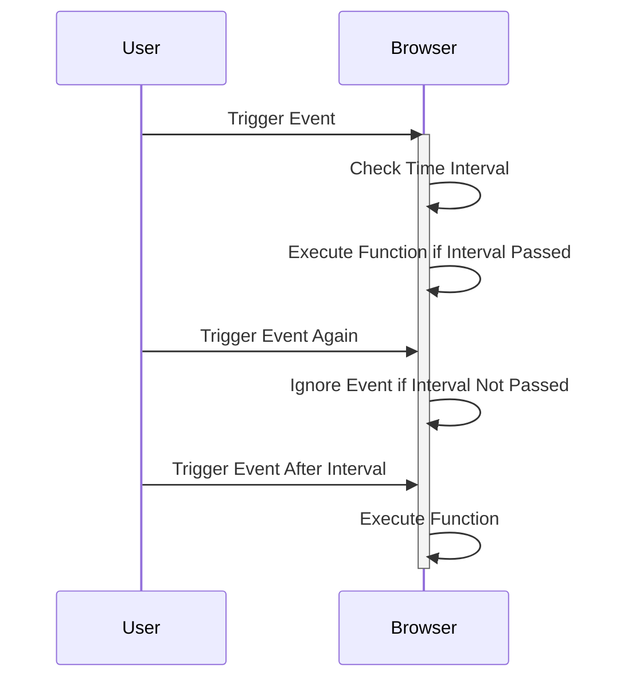

## 11.9 Debouncing and Throttling

In the world of web development, creating interactive web pages often involves handling a variety of user-generated events such as mouse movements, key presses, window resizing, and scrolling. While these events are crucial for creating dynamic and responsive user interfaces, they can also lead to performance issues if not managed properly. This is where debouncing and throttling come into play. These techniques help control the frequency of event handling, ensuring that your web applications remain efficient and responsive.

### Understanding the Problem

Before diving into solutions, let's first understand the problem. When events fire too frequently, such as during `scroll` or `resize` events, they can trigger a large number of function calls in a short period. This can lead to:

- **Performance Degradation**: The browser may struggle to keep up with the rapid succession of events, leading to laggy and unresponsive interfaces.
- **Increased Resource Usage**: Frequent event handling can consume significant CPU and memory resources, impacting the overall performance of the application.
- **Poor User Experience**: Users may experience delays or stuttering animations, which can detract from the overall usability of the web page.

To mitigate these issues, we can employ debouncing and throttling techniques.

### Debouncing: Definition and Implementation

**Debouncing** is a technique used to ensure that a function is only executed once after a specified delay period has passed since the last time it was invoked. This is particularly useful for events that fire continuously, such as `scroll` or `resize`.

#### How Debouncing Works

When an event is triggered, the debounce function delays the execution of the event handler until a certain amount of time has passed without the event being triggered again. If the event is triggered again before the delay period ends, the timer resets.

#### Implementing Debounce

Let's look at a simple implementation of a debounce function in JavaScript:

```javascript
function debounce(func, delay) {
    let timeoutId;
    return function(...args) {
        clearTimeout(timeoutId);
        timeoutId = setTimeout(() => func.apply(this, args), delay);
    };
}
```

**Explanation:**

- **`timeoutId`**: This variable holds the identifier of the timeout. It is used to clear the timeout if the function is called again before the delay period ends.
- **`clearTimeout(timeoutId)`**: This clears any existing timeout, ensuring that the function execution is delayed until the event stops firing for the specified delay period.
- **`setTimeout(() => func.apply(this, args), delay)`**: This sets a new timeout to execute the function after the delay period.

#### Using Debounced Functions in Event Listeners

Here's how you can use the debounce function in an event listener:

```javascript
const handleResize = () => {
    console.log('Window resized');
};

window.addEventListener('resize', debounce(handleResize, 300));
```

In this example, the `handleResize` function will only be executed once every 300 milliseconds, regardless of how often the `resize` event is fired. This reduces the number of times the function is called, improving performance.

#### Benefits of Debouncing

- **Improved Performance**: By limiting the number of times a function is executed, debouncing reduces the load on the browser, leading to smoother performance.
- **Enhanced User Experience**: Users experience less lag and more responsive interfaces, as the application can process events more efficiently.
- **Simplified Code**: Debouncing can simplify event handling logic by reducing the need to manually manage event timing.

### Throttling: Definition and Implementation

**Throttling** is another technique used to control the frequency of function execution. Unlike debouncing, throttling ensures that a function is executed at regular intervals, regardless of how many times the event is triggered.

#### How Throttling Works

When an event is triggered, the throttle function ensures that the event handler is only executed once every specified interval. This is useful for events that need to be handled continuously, but at a controlled rate.

#### Implementing Throttle

Here's a basic implementation of a throttle function in JavaScript:

```javascript
function throttle(func, interval) {
    let lastTime = 0;
    return function(...args) {
        const now = Date.now();
        if (now - lastTime >= interval) {
            lastTime = now;
            func.apply(this, args);
        }
    };
}
```

**Explanation:**

- **`lastTime`**: This variable keeps track of the last time the function was executed.
- **`Date.now()`**: This method returns the current timestamp, which is used to calculate the time elapsed since the last execution.
- **`if (now - lastTime >= interval)`**: This condition checks if the specified interval has passed since the last execution. If so, the function is executed.

#### Using Throttled Functions in Event Listeners

Here's how you can use the throttle function in an event listener:

```javascript
const handleScroll = () => {
    console.log('Scrolled');
};

window.addEventListener('scroll', throttle(handleScroll, 200));
```

In this example, the `handleScroll` function will be executed once every 200 milliseconds, regardless of how often the `scroll` event is fired. This ensures that the function is called at a consistent rate, improving performance.

#### Benefits of Throttling

- **Consistent Execution**: Throttling ensures that functions are executed at regular intervals, providing a consistent user experience.
- **Reduced Resource Usage**: By limiting the frequency of function execution, throttling reduces the load on the browser, leading to improved performance.
- **Improved Responsiveness**: Throttling helps maintain a responsive interface by preventing functions from being executed too frequently.

### Debouncing vs. Throttling: When to Use Each

While both debouncing and throttling are used to control the frequency of function execution, they are suited to different scenarios:

- **Debouncing** is ideal for events that should only trigger a function once after the event has stopped firing. Common use cases include search input fields, where you want to wait until the user has finished typing before executing a search query.

- **Throttling** is better suited for events that need to be handled continuously but at a controlled rate. Common use cases include scrolling, where you want to update the UI at regular intervals as the user scrolls.

### Using Utility Libraries

While it's useful to understand how to implement debouncing and throttling from scratch, many developers prefer to use utility libraries that provide these functions out of the box. One popular library is Lodash, which offers robust and well-tested implementations of both debouncing and throttling.

#### Using Lodash for Debouncing

Here's how you can use Lodash's debounce function:

```javascript
// Import the debounce function from Lodash
import debounce from 'lodash/debounce';

const handleInput = () => {
    console.log('Input changed');
};

// Use Lodash's debounce function
const debouncedHandleInput = debounce(handleInput, 300);

document.querySelector('input').addEventListener('input', debouncedHandleInput);
```

#### Using Lodash for Throttling

Similarly, here's how you can use Lodash's throttle function:

```javascript
// Import the throttle function from Lodash
import throttle from 'lodash/throttle';

const handleMouseMove = () => {
    console.log('Mouse moved');
};

// Use Lodash's throttle function
const throttledHandleMouseMove = throttle(handleMouseMove, 200);

document.addEventListener('mousemove', throttledHandleMouseMove);
```

### Visualizing Debouncing and Throttling

To better understand how debouncing and throttling work, let's visualize these concepts using diagrams.

#### Debouncing Diagram



**Description**: This diagram illustrates how debouncing works. The function is only executed once after the user stops triggering the event for a specified delay period.

#### Throttling Diagram



**Description**: This diagram illustrates how throttling works. The function is executed at regular intervals, regardless of how often the event is triggered.

### Try It Yourself

Now that we've covered the theory, it's time to put it into practice. Try modifying the debounce and throttle functions to see how they affect the behavior of event listeners. Experiment with different delay and interval values to observe their impact on performance and user experience.

### Key Takeaways

- **Debouncing and throttling are essential techniques** for optimizing event handling in JavaScript.
- **Debouncing** delays function execution until a specified delay period has passed without the event being triggered again.
- **Throttling** ensures that a function is executed at regular intervals, regardless of how often the event is triggered.
- **Utility libraries like Lodash** provide robust implementations of debouncing and throttling, simplifying their use in web applications.
- **Visual aids and diagrams** can help clarify how these techniques work and when to use them.

### Further Reading

For more information on debouncing and throttling, consider exploring the following resources:

- [MDN Web Docs on Debouncing and Throttling](https://developer.mozilla.org/en-US/docs/Web/Events)
- [Lodash Documentation](https://lodash.com/docs/4.17.15)
- [JavaScript.info on Event Throttling and Debouncing](https://javascript.info/event-delegation)

## Quiz Time!



### What problem do debouncing and throttling solve?

- [x] They control the frequency of event handling to improve performance.
- [ ] They increase the frequency of event handling for better responsiveness.
- [ ] They eliminate the need for event listeners.
- [ ] They prevent events from being triggered.

> **Explanation:** Debouncing and throttling are techniques used to control the frequency of event handling, thereby improving performance and user experience.

### How does debouncing work?

- [x] It delays function execution until a specified delay period has passed without the event being triggered again.
- [ ] It executes a function at regular intervals regardless of event frequency.
- [ ] It prevents a function from being executed more than once.
- [ ] It immediately executes a function when an event is triggered.

> **Explanation:** Debouncing delays function execution until a specified delay period has passed without the event being triggered again, reducing the number of times the function is called.

### How does throttling work?

- [x] It ensures that a function is executed at regular intervals, regardless of how often the event is triggered.
- [ ] It delays function execution until the event stops firing.
- [ ] It prevents a function from being executed more than once.
- [ ] It immediately executes a function when an event is triggered.

> **Explanation:** Throttling ensures that a function is executed at regular intervals, regardless of how often the event is triggered, providing consistent execution.

### When is debouncing most useful?

- [x] When you want to execute a function once after the event has stopped firing.
- [ ] When you need to execute a function continuously at a controlled rate.
- [ ] When you want to prevent a function from being executed.
- [ ] When you need to execute a function immediately.

> **Explanation:** Debouncing is most useful when you want to execute a function once after the event has stopped firing, such as in search input fields.

### When is throttling most useful?

- [x] When you need to handle events continuously at a controlled rate.
- [ ] When you want to execute a function once after the event has stopped firing.
- [ ] When you want to prevent a function from being executed.
- [ ] When you need to execute a function immediately.

> **Explanation:** Throttling is most useful when you need to handle events continuously at a controlled rate, such as during scrolling.

### What is a common use case for debouncing?

- [x] Search input fields where you want to wait until the user has finished typing.
- [ ] Continuous scrolling where updates are needed at regular intervals.
- [ ] Preventing a function from being executed.
- [ ] Immediate function execution.

> **Explanation:** A common use case for debouncing is search input fields where you want to wait until the user has finished typing before executing a search query.

### What is a common use case for throttling?

- [x] Scrolling, where you want to update the UI at regular intervals.
- [ ] Search input fields where you want to wait until the user has finished typing.
- [ ] Preventing a function from being executed.
- [ ] Immediate function execution.

> **Explanation:** A common use case for throttling is scrolling, where you want to update the UI at regular intervals as the user scrolls.

### Which utility library provides robust implementations of debouncing and throttling?

- [x] Lodash
- [ ] jQuery
- [ ] React
- [ ] Angular

> **Explanation:** Lodash is a popular utility library that provides robust and well-tested implementations of debouncing and throttling.

### True or False: Debouncing and throttling can both be used to improve performance by limiting the frequency of function execution.

- [x] True
- [ ] False

> **Explanation:** True. Both debouncing and throttling are used to improve performance by limiting the frequency of function execution, though they do so in different ways.

### True or False: Throttling delays function execution until the event stops firing.

- [ ] True
- [x] False

> **Explanation:** False. Throttling ensures that a function is executed at regular intervals, regardless of how often the event is triggered.


