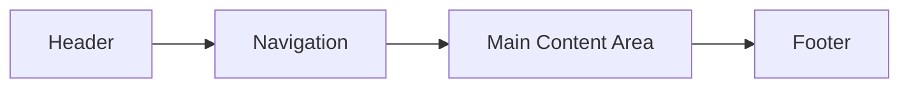

## 12.2 Designing the Layout

Designing the layout of your web page is a crucial step in the web development process. It involves planning the structure and appearance of your site to ensure it is both functional and aesthetically pleasing. In this section, we will guide you through the process of designing your first web page layout, from creating a rough sketch to understanding key design principles.

### Why Design Your Layout First?

Before diving into coding, it's essential to have a clear plan for your web page layout. Designing your layout first offers several benefits:

- **Clarity and Direction**: A well-thought-out layout provides a clear direction for your coding process, reducing confusion and errors.
- **Efficiency**: Planning your layout beforehand saves time by minimizing the need for revisions and adjustments during coding.
- **User Experience**: A thoughtfully designed layout enhances user experience by making your site easy to navigate and visually appealing.

### Creating a Rough Sketch or Wireframe

A wireframe is a simple visual guide that represents the skeletal framework of your web page. It serves as a blueprint for your design, helping you organize content and plan the structure of your site.

#### Steps to Create a Wireframe

1. **Identify the Purpose of Your Web Page**: Determine the main goal of your site. Is it to inform, entertain, or sell a product? Understanding the purpose will guide your design decisions.

2. **List Key Sections**: Identify the essential sections of your web page, such as the header, navigation, main content area, and footer. Consider any additional sections that may be necessary, such as a sidebar or call-to-action area.

3. **Sketch Your Layout**: Use pen and paper or design software to create a rough sketch of your layout. Focus on the placement of key sections and the overall structure of your page.

4. **Refine Your Wireframe**: Review your sketch and make adjustments as needed. Ensure that the layout supports the purpose of your site and provides a logical flow for users.

#### Tools for Wireframing

While pen and paper are a great starting point, several digital tools can help you create more detailed wireframes:

- **Figma**: A popular design tool that offers collaborative features and a wide range of design elements.
- **Adobe XD**: A powerful tool for creating wireframes and prototypes with interactive elements.
- **Balsamiq**: Known for its simplicity, Balsamiq is ideal for creating low-fidelity wireframes quickly.

### Identifying Key Sections

A well-structured web page typically includes several key sections. Let's explore each of these sections and their roles in your layout.

#### Header

The header is the top section of your web page and often contains the site's logo, title, and navigation links. It sets the tone for your site and provides users with a clear starting point.

#### Navigation

Navigation is crucial for guiding users through your site. It typically includes links to the main sections of your site, such as "Home," "About," "Services," and "Contact." Ensure that your navigation is easy to find and use.

#### Main Content Area

The main content area is where the bulk of your information is displayed. This section should be the focal point of your layout, drawing users' attention to the most important content.

#### Footer

The footer is located at the bottom of your web page and often contains additional navigation links, contact information, and copyright notices. It provides users with a sense of closure and offers a place for less critical information.

### Design Principles

Understanding design principles is essential for creating a visually appealing and functional layout. Let's explore some key principles to consider when designing your web page.

#### Visual Hierarchy

Visual hierarchy refers to the arrangement of elements in a way that indicates their importance. Use size, color, and placement to create a clear hierarchy, guiding users' attention to the most critical elements first.

#### Alignment

Alignment ensures that elements on your page are visually connected and organized. Use grids and guides to align elements consistently, creating a clean and professional appearance.

#### Consistency

Consistency in design helps users understand and navigate your site more easily. Use consistent colors, fonts, and styles throughout your layout to create a cohesive experience.

#### White Space

White space, or negative space, is the empty space around elements on your page. It helps reduce clutter and improves readability by giving elements room to breathe.

#### Contrast

Contrast is the difference between two or more elements, such as color or size. Use contrast to highlight important elements and create visual interest.

### Planning Before Coding

Planning your layout before coding is crucial for a successful web development process. Here are some tips to help you plan effectively:

- **Set Clear Goals**: Define the purpose and goals of your web page. What do you want users to do when they visit your site?
- **Research and Inspiration**: Look at other websites for inspiration and identify design elements that you like. Consider how these elements can be adapted to fit your site.
- **Create a Content Outline**: Outline the content you plan to include on your web page. This will help you determine the structure and layout of your site.
- **Consider User Experience**: Think about how users will interact with your site. Ensure that your layout supports a smooth and intuitive user experience.

### Try It Yourself

Now that you have a basic understanding of designing a web page layout, it's time to put your knowledge into practice. Try creating a wireframe for a simple web page, such as a personal blog or portfolio site. Use the steps and principles outlined in this section to guide your design process.

### Visual Aids

To help you visualize the concepts discussed in this section, let's look at a simple wireframe diagram of a basic web page layout:

**Diagram Description**: This diagram represents a basic web page layout with four key sections: Header, Navigation, Main Content Area, and Footer. The flow from top to bottom illustrates the typical structure of a web page.

### Summary

Designing the layout of your web page is a critical step in the web development process. By planning your layout first, you can create a clear and functional structure that enhances user experience. Remember to consider key design principles, such as visual hierarchy, alignment, and consistency, to create a visually appealing and effective layout.

### Further Reading

For more information on web design and layout planning, check out the following resources:

- [MDN Web Docs: HTML Layout](https://developer.mozilla.org/en-US/docs/Learn/CSS/CSS_layout/Introduction)
- [W3Schools: Web Layout](https://www.w3schools.com/css/css_website_layout.asp)

## Quiz Time!



### What is the primary purpose of creating a wireframe before coding a web page?

- [x] To plan the structure and layout of the web page
- [ ] To write the HTML code for the web page
- [ ] To design the color scheme of the web page
- [ ] To create animations for the web page

> **Explanation:** A wireframe is used to plan the structure and layout of a web page, serving as a blueprint for the design.

### Which section of a web page typically contains the site's logo and navigation links?

- [x] Header
- [ ] Footer
- [ ] Main Content Area
- [ ] Sidebar

> **Explanation:** The header is the top section of a web page and often contains the site's logo and navigation links.

### What design principle involves the arrangement of elements to indicate their importance?

- [x] Visual Hierarchy
- [ ] Alignment
- [ ] Consistency
- [ ] Contrast

> **Explanation:** Visual hierarchy refers to the arrangement of elements in a way that indicates their importance, guiding users' attention.

### Which tool is known for its simplicity and is ideal for creating low-fidelity wireframes quickly?

- [x] Balsamiq
- [ ] Figma
- [ ] Adobe XD
- [ ] Sketch

> **Explanation:** Balsamiq is known for its simplicity and is ideal for creating low-fidelity wireframes quickly.

### What is the role of white space in web design?

- [x] To reduce clutter and improve readability
- [ ] To fill empty areas with color
- [ ] To highlight important elements
- [ ] To create a consistent layout

> **Explanation:** White space, or negative space, reduces clutter and improves readability by giving elements room to breathe.

### Which section of a web page provides users with a sense of closure and often contains additional navigation links?

- [x] Footer
- [ ] Header
- [ ] Main Content Area
- [ ] Sidebar

> **Explanation:** The footer is located at the bottom of a web page and often contains additional navigation links, providing users with a sense of closure.

### What is the benefit of planning your layout before coding?

- [x] It saves time by minimizing revisions
- [ ] It allows you to write CSS code first
- [ ] It ensures all images are included
- [ ] It helps you choose a color scheme

> **Explanation:** Planning your layout before coding saves time by minimizing the need for revisions and adjustments during coding.

### Which design principle helps create a cohesive experience by using consistent colors, fonts, and styles?

- [x] Consistency
- [ ] Alignment
- [ ] Contrast
- [ ] Visual Hierarchy

> **Explanation:** Consistency in design helps create a cohesive experience by using consistent colors, fonts, and styles throughout the layout.

### What is the purpose of the main content area on a web page?

- [x] To display the bulk of the information
- [ ] To contain the site's logo and navigation links
- [ ] To provide additional navigation links
- [ ] To offer contact information

> **Explanation:** The main content area is where the bulk of the information is displayed, serving as the focal point of the layout.

### True or False: Visual hierarchy is achieved by using size, color, and placement to guide users' attention.

- [x] True
- [ ] False

> **Explanation:** Visual hierarchy is achieved by using size, color, and placement to create a clear hierarchy, guiding users' attention to the most critical elements first.


