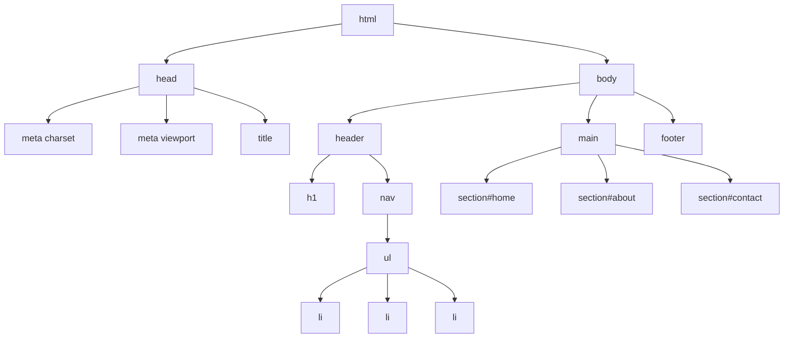

## 12.3 Creating the HTML Structure

In this section, we will embark on the exciting journey of creating the HTML structure for our first interactive web page. This foundational step is crucial as it sets the stage for everything else we will build upon. By the end of this guide, you will have a well-organized HTML document that serves as the backbone of your web page. Let's dive in!

### Understanding the Basics of HTML Structure

Before we begin coding, it's important to understand the basic structure of an HTML document. HTML, or HyperText Markup Language, is the standard language used to create web pages. It provides the structure and layout of a web page by using a variety of elements and tags.

An HTML document typically consists of the following main sections:

1. **`<!DOCTYPE html>`**: This declaration defines the document type and version of HTML. It helps the browser understand how to render the page correctly.
2. **`<html>`**: This is the root element that contains all other elements on the page.
3. **`<head>`**: This section contains meta-information about the document, such as the title, character set, and links to stylesheets.
4. **`<body>`**: This is where the content of the web page is placed, including text, images, links, and other media.

### Setting Up the HTML File

Let's start by creating a new HTML file. Open your text editor or IDE (Integrated Development Environment), and create a new file named `index.html`. This will be the main HTML file for your web page.

```html
<!DOCTYPE html>
<html lang="en">
<head>
    <meta charset="UTF-8">
    <meta name="viewport" content="width=device-width, initial-scale=1.0">
    <title>My First Interactive Web Page</title>
</head>
<body>
    <!-- Content will go here -->
</body>
</html>
```

#### Explanation:

- **`<!DOCTYPE html>`**: This line tells the browser to expect an HTML5 document.
- **`<html lang="en">`**: The `lang` attribute specifies the language of the document, which is English in this case.
- **`<meta charset="UTF-8">`**: This sets the character encoding for the document, ensuring that it can display a wide range of characters.
- **`<meta name="viewport" content="width=device-width, initial-scale=1.0">`**: This tag ensures that the page is responsive and scales correctly on different devices.
- **`<title>`**: The content within this tag is displayed in the browser's title bar or tab.

### Adding the Basic Layout

Now that we have our basic HTML structure, let's add some elements to create the layout of our web page. We'll use semantic HTML elements to ensure our page is well-structured and accessible.

```html
<body>
    <header>
        <h1>Welcome to My Interactive Web Page</h1>
        <nav>
            <ul>
                <li><a href="#home">Home</a></li>
                <li><a href="#about">About</a></li>
                <li><a href="#contact">Contact</a></li>
            </ul>
        </nav>
    </header>
    <main>
        <section id="home">
            <h2>Home</h2>
            <p>This is the home section of the page.</p>
        </section>
        <section id="about">
            <h2>About</h2>
            <p>Learn more about what this page offers.</p>
        </section>
        <section id="contact">
            <h2>Contact</h2>
            <p>Get in touch with us through this section.</p>
        </section>
    </main>
    <footer>
        <p>&copy; 2024 My Interactive Web Page</p>
    </footer>
</body>
```

#### Explanation:

- **`<header>`**: This element contains introductory content or navigational links. Here, it includes a heading and a navigation menu.
- **`<nav>`**: This is used for the navigation links. It contains an unordered list (`<ul>`) of links (`<a>`).
- **`<main>`**: This element contains the main content of the page. It is divided into sections for better organization.
- **`<section>`**: These elements are used to group related content. Each section has an `id` attribute for easy navigation.
- **`<footer>`**: This contains footer information, such as copyright details.

### Using Semantic HTML

Semantic HTML is the practice of using HTML elements that convey meaning about the content they contain. This makes the web page more accessible and easier to understand for both users and search engines.

In the example above, we used semantic elements like `<header>`, `<nav>`, `<main>`, `<section>`, and `<footer>`. These elements help define the different parts of the web page and improve its structure.

### Placeholder Content

For now, we've included placeholder content in each section. This content will be replaced with more detailed information as we continue to develop our web page. Placeholder content is useful for testing the layout and ensuring that the structure is correct.

### Validating Your HTML

It's important to ensure that your HTML is well-structured and free of errors. You can use the [W3C Markup Validation Service](https://validator.w3.org/) to check your HTML for any issues. Simply copy and paste your HTML code into the validator and review any warnings or errors.

### Try It Yourself

Now it's your turn! Try modifying the HTML structure to include additional sections or change the placeholder content. Experiment with different semantic elements to see how they affect the layout and structure of the page.

### Visualizing the HTML Structure

To better understand the structure of our HTML document, let's visualize it using a DOM tree diagram. The Document Object Model (DOM) represents the structure of an HTML document as a tree of nodes.



#### Diagram Explanation:

- The **`html`** node is the root of the tree, containing the **`head`** and **`body`** nodes.
- The **`head`** node includes meta tags and the title.
- The **`body`** node contains the main content, organized into sections like **`header`**, **`main`**, and **`footer`**.
- Each section is further divided into elements like headings, paragraphs, and lists.

### Key Takeaways

- **HTML Structure**: The foundation of any web page, consisting of the `<!DOCTYPE html>`, `<html>`, `<head>`, and `<body>` elements.
- **Semantic HTML**: Using elements that convey meaning about the content they contain, improving accessibility and structure.
- **Placeholder Content**: Temporary content used to test the layout and structure of a web page.
- **Validation**: Ensuring your HTML is well-structured and free of errors using tools like the W3C Markup Validation Service.

### Practice Exercise

To reinforce what you've learned, try creating a new HTML document with a different layout. Include at least three sections with headings and placeholder content. Validate your HTML using the W3C Markup Validation Service and make any necessary corrections.

### Conclusion

Congratulations! You've successfully created the HTML structure for your first interactive web page. This foundational step is crucial as it sets the stage for adding styles and interactivity in the upcoming sections. Keep experimenting with different layouts and semantic elements to enhance your understanding of HTML.

In the next section, we'll dive into styling the page with CSS, bringing our HTML structure to life with colors, fonts, and layouts. Stay tuned!

## Quiz Time!



### What is the purpose of the `<!DOCTYPE html>` declaration?

- [x] It defines the document type and version of HTML.
- [ ] It specifies the language of the document.
- [ ] It sets the character encoding for the document.
- [ ] It contains the main content of the page.

> **Explanation:** The `<!DOCTYPE html>` declaration tells the browser to expect an HTML5 document, ensuring it renders the page correctly.

### Which element is used to define the main content of a web page?

- [ ] `<header>`
- [ ] `<nav>`
- [x] `<main>`
- [ ] `<footer>`

> **Explanation:** The `<main>` element contains the main content of the page, distinct from headers, footers, and navigation.

### What is semantic HTML?

- [x] Using HTML elements that convey meaning about the content.
- [ ] Using HTML elements for styling purposes.
- [ ] Using HTML elements for scripting.
- [ ] Using HTML elements for linking external resources.

> **Explanation:** Semantic HTML involves using elements that provide meaning about the content they contain, improving accessibility and structure.

### What is the purpose of placeholder content?

- [x] To test the layout and structure of a web page.
- [ ] To provide final content for the web page.
- [ ] To add styling to the web page.
- [ ] To link external resources to the web page.

> **Explanation:** Placeholder content is temporary content used to test the layout and structure of a web page before adding final content.

### Which tool can be used to validate HTML for errors?

- [ ] Google Chrome
- [ ] Visual Studio Code
- [x] W3C Markup Validation Service
- [ ] GitHub

> **Explanation:** The W3C Markup Validation Service checks HTML for errors and ensures it is well-structured.

### What does the `<nav>` element contain?

- [ ] Main content of the page
- [x] Navigation links
- [ ] Footer information
- [ ] Header content

> **Explanation:** The `<nav>` element is used for navigation links, helping users move through different sections of the page.

### What attribute is used to specify the language of an HTML document?

- [ ] `charset`
- [x] `lang`
- [ ] `viewport`
- [ ] `title`

> **Explanation:** The `lang` attribute specifies the language of the HTML document, aiding accessibility and search engines.

### Which element is used to group related content in a web page?

- [ ] `<footer>`
- [ ] `<nav>`
- [x] `<section>`
- [ ] `<header>`

> **Explanation:** The `<section>` element is used to group related content, helping organize the structure of a web page.

### What is the purpose of the `<meta charset="UTF-8">` tag?

- [x] To set the character encoding for the document.
- [ ] To specify the language of the document.
- [ ] To define the document type.
- [ ] To include navigation links.

> **Explanation:** The `<meta charset="UTF-8">` tag sets the character encoding for the document, ensuring it can display a wide range of characters.

### Semantic HTML improves accessibility for users and search engines.

- [x] True
- [ ] False

> **Explanation:** Semantic HTML improves accessibility by providing meaningful elements that help users and search engines understand the content and structure of a web page.


