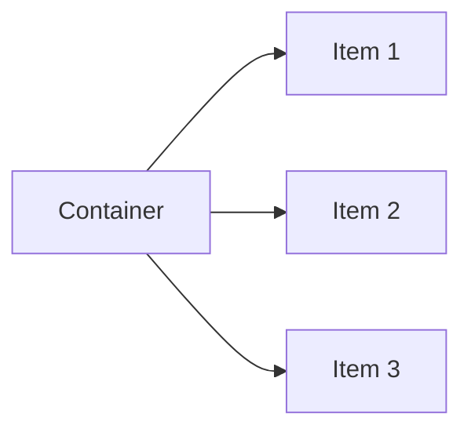

## 12.4 Styling with CSS

Welcome to the exciting world of CSS (Cascading Style Sheets), where we transform plain HTML into visually appealing web pages. In this section, we will learn how to link a CSS stylesheet to an HTML file, write CSS rules to style various page elements, and apply these styles to different sections of a web page, such as the header, navigation, content sections, and footer. We will also explore using Flexbox or Grid for layout and include media queries for responsive design.

### Linking the CSS Stylesheet to the HTML File

Before we can start styling our web page, we need to link a CSS stylesheet to our HTML file. This is done using the `<link>` tag inside the `<head>` section of your HTML document.

```html
<!DOCTYPE html>
<html lang="en">
<head>
    <meta charset="UTF-8">
    <meta name="viewport" content="width=device-width, initial-scale=1.0">
    <title>My First Styled Web Page</title>
    <link rel="stylesheet" href="styles.css">
</head>
<body>
    <!-- Your HTML content goes here -->
</body>
</html>
```

- **Explanation**: The `<link>` tag is used to link the CSS file (`styles.css`) to the HTML document. The `rel` attribute specifies the relationship between the current document and the linked resource, which is a stylesheet in this case.

### Writing CSS Rules to Style Page Elements

CSS rules consist of selectors and declarations. Selectors specify which HTML elements the styles apply to, and declarations define the styles themselves, consisting of properties and values.

#### Basic CSS Syntax

```css
selector {
    property: value;
    /* More properties and values */
}
```

- **Example**: Let's style a paragraph element.

```css
p {
    color: blue;
    font-size: 16px;
    line-height: 1.5;
}
```

- **Explanation**: This CSS rule applies to all `<p>` elements, setting their text color to blue, font size to 16 pixels, and line height to 1.5.

### Applying Styles to the Header, Navigation, Content Sections, and Footer

Now, let's apply styles to different sections of our web page.

#### Styling the Header

```css
header {
    background-color: #f8f9fa;
    padding: 20px;
    text-align: center;
    border-bottom: 2px solid #e9ecef;
}
```

- **Explanation**: The header is styled with a light gray background, padding for spacing, centered text, and a bottom border for separation.

#### Styling the Navigation

```css
nav {
    background-color: #343a40;
    color: white;
    padding: 10px;
}

nav ul {
    list-style-type: none;
    padding: 0;
}

nav ul li {
    display: inline;
    margin-right: 15px;
}

nav ul li a {
    color: white;
    text-decoration: none;
}
```

- **Explanation**: The navigation bar is styled with a dark background and white text. The list items are displayed inline to create a horizontal menu, and links are styled to remove the underline.

#### Styling the Content Sections

```css
main {
    padding: 20px;
    background-color: #ffffff;
    color: #333333;
}

section {
    margin-bottom: 20px;
}
```

- **Explanation**: The main content area has padding for spacing and a white background. Each section within the main content has a margin at the bottom to separate them visually.

#### Styling the Footer

```css
footer {
    background-color: #f8f9fa;
    padding: 10px;
    text-align: center;
    border-top: 2px solid #e9ecef;
}
```

- **Explanation**: The footer has a similar style to the header, with a light background, padding, centered text, and a top border.

### Using Flexbox for Layout

Flexbox is a powerful layout tool that allows us to create flexible and responsive layouts with ease.

#### Creating a Flexbox Layout

```css
.container {
    display: flex;
    justify-content: space-between;
    align-items: center;
    padding: 20px;
}

.item {
    flex: 1;
    margin: 10px;
    padding: 20px;
    background-color: #e9ecef;
    text-align: center;
}
```

- **Explanation**: The `.container` class uses Flexbox to distribute space between items and align them. Each `.item` within the container is given equal space and styled with a background color and padding.

### Using Grid for Layout

CSS Grid is another powerful layout system that allows us to create complex grid-based layouts.

#### Creating a Grid Layout

```css
.grid-container {
    display: grid;
    grid-template-columns: repeat(3, 1fr);
    gap: 20px;
}

.grid-item {
    background-color: #e9ecef;
    padding: 20px;
    text-align: center;
}
```

- **Explanation**: The `.grid-container` class creates a grid with three equal columns and a gap between items. Each `.grid-item` is styled with a background color and padding.

### Including Media Queries for Responsive Design

Media queries allow us to apply different styles based on the device's characteristics, such as screen size.

#### Example of a Media Query

```css
@media (max-width: 768px) {
    .container {
        flex-direction: column;
    }

    .grid-container {
        grid-template-columns: 1fr;
    }
}
```

- **Explanation**: This media query applies styles when the screen width is 768 pixels or less. The Flexbox container changes to a column layout, and the Grid container changes to a single column.

### Try It Yourself

Now that we've covered the basics of styling with CSS, it's time to experiment! Try modifying the styles in the examples above to see how they affect the appearance of your web page. Here are some ideas:

- Change the background colors and text colors to create a different color scheme.
- Adjust the padding and margins to see how they affect spacing.
- Experiment with different Flexbox and Grid layouts.
- Add more media queries to handle different screen sizes.

### Visual Aids

To help you visualize how CSS styles are applied, let's look at a simple diagram of a Flexbox layout:



- **Description**: This diagram shows a Flexbox container with three items. The items are arranged in a row, with equal space between them.

### References and Links

For further reading on CSS and styling techniques, check out the following resources:

- [MDN Web Docs: CSS](https://developer.mozilla.org/en-US/docs/Web/CSS)
- [W3Schools: CSS Tutorial](https://www.w3schools.com/css/)
- [CSS Tricks: A Complete Guide to Flexbox](https://css-tricks.com/snippets/css/a-guide-to-flexbox/)
- [CSS Tricks: A Complete Guide to Grid](https://css-tricks.com/snippets/css/complete-guide-grid/)

### Engagement and Reinforcement

To reinforce what you've learned, try answering these questions:

- What is the purpose of the `<link>` tag in HTML?
- How do you apply styles to a specific HTML element using CSS?
- What are Flexbox and Grid, and how do they differ?
- How can media queries be used to create responsive designs?

### Summary

In this section, we've learned how to style a web page using CSS. We've covered linking a CSS stylesheet to an HTML file, writing CSS rules, applying styles to different sections of a web page, using Flexbox and Grid for layout, and including media queries for responsive design. By experimenting with these techniques, you can create visually appealing and responsive web pages.

## Quiz Time!



### What is the purpose of the `<link>` tag in HTML?

- [x] To link a CSS stylesheet to an HTML document
- [ ] To create hyperlinks between web pages
- [ ] To define metadata for the HTML document
- [ ] To include JavaScript files in the HTML document

> **Explanation:** The `<link>` tag is used to link a CSS stylesheet to an HTML document, allowing you to apply styles to the web page.

### How do you apply styles to a specific HTML element using CSS?

- [x] By using a CSS selector that targets the element
- [ ] By adding inline styles directly to the element
- [ ] By using JavaScript to modify the element's styles
- [ ] By changing the element's attributes

> **Explanation:** CSS selectors are used to target specific HTML elements and apply styles to them.

### What is Flexbox used for in CSS?

- [x] Creating flexible and responsive layouts
- [ ] Styling text and fonts
- [ ] Adding animations and transitions
- [ ] Managing colors and backgrounds

> **Explanation:** Flexbox is a CSS layout model that allows you to create flexible and responsive layouts with ease.

### How do media queries help in responsive design?

- [x] By applying different styles based on the device's characteristics
- [ ] By optimizing images for faster loading
- [ ] By adding animations to enhance user experience
- [ ] By organizing CSS code for better readability

> **Explanation:** Media queries allow you to apply different styles based on the device's characteristics, such as screen size, making your web page responsive.

### What is the main difference between Flexbox and Grid?

- [x] Flexbox is one-dimensional, while Grid is two-dimensional
- [ ] Flexbox is used for animations, while Grid is used for layouts
- [ ] Flexbox is for styling text, while Grid is for styling images
- [ ] Flexbox is for responsive design, while Grid is for static design

> **Explanation:** Flexbox is a one-dimensional layout model (for rows or columns), while Grid is a two-dimensional layout model (for rows and columns).

### Which CSS property is used to change the text color of an element?

- [x] color
- [ ] background-color
- [ ] font-color
- [ ] text-color

> **Explanation:** The `color` property is used to change the text color of an element in CSS.

### How can you remove the underline from links using CSS?

- [x] By setting the `text-decoration` property to `none`
- [ ] By setting the `display` property to `block`
- [ ] By setting the `color` property to `transparent`
- [ ] By setting the `font-style` property to `italic`

> **Explanation:** The `text-decoration` property can be set to `none` to remove the underline from links.

### What does the `padding` property do in CSS?

- [x] Adds space inside an element, between the content and the border
- [ ] Adds space outside an element, between the border and the margin
- [ ] Changes the background color of an element
- [ ] Sets the width and height of an element

> **Explanation:** The `padding` property adds space inside an element, between the content and the border.

### How can you center text within an element using CSS?

- [x] By setting the `text-align` property to `center`
- [ ] By setting the `display` property to `flex`
- [ ] By setting the `margin` property to `auto`
- [ ] By setting the `position` property to `absolute`

> **Explanation:** The `text-align` property can be set to `center` to center text within an element.

### True or False: CSS Grid is a one-dimensional layout model.

- [ ] True
- [x] False

> **Explanation:** False. CSS Grid is a two-dimensional layout model, allowing for layout control in both rows and columns.


