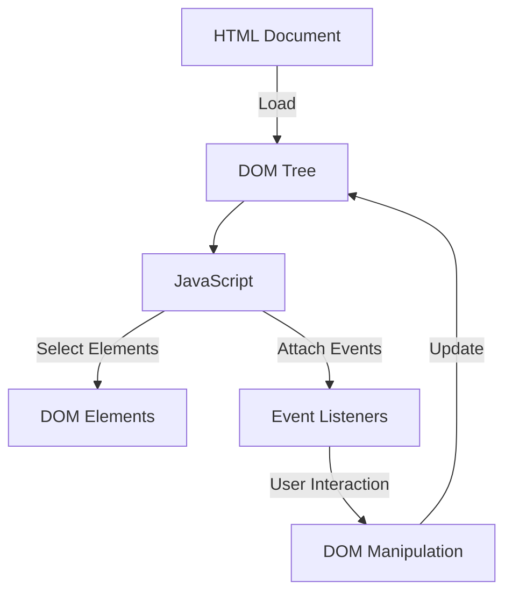

## 12.5 Adding Interactivity with JavaScript

In this section, we will explore how to add interactivity to your web pages using JavaScript. By the end of this guide, you will be able to implement dynamic features such as toggling menus, updating content, and responding to user actions. Let's dive into the world of interactive web design!

### Understanding Interactivity

Interactivity on a web page refers to the ability of the page to respond to user actions. This could include clicking a button, hovering over an image, or typing into a form. JavaScript is the programming language that allows us to create these interactive elements. It enables us to manipulate the Document Object Model (DOM) and respond to events triggered by the user.

### Identifying Interactive Features

Before we start coding, let's identify some common interactive features you might want to add to your web page:

1. **Toggling Menus**: Show or hide navigation menus when a button is clicked.
2. **Updating Content**: Change the text or images on the page based on user input.
3. **Form Validation**: Provide immediate feedback on form fields.
4. **Image Sliders**: Create a carousel of images that users can navigate through.
5. **Modal Dialogs**: Display pop-up windows for additional information or forms.

### Setting Up Your Environment

Ensure you have a basic HTML page set up with a linked JavaScript file. Here's a simple HTML structure to get started:

```html
<!DOCTYPE html>
<html lang="en">
<head>
    <meta charset="UTF-8">
    <meta name="viewport" content="width=device-width, initial-scale=1.0">
    <title>Interactive Web Page</title>
    <link rel="stylesheet" href="styles.css">
</head>
<body>
    <header>
        <nav>
            <button id="menu-toggle">Toggle Menu</button>
            <ul id="menu" class="hidden">
                <li><a href="#home">Home</a></li>
                <li><a href="#about">About</a></li>
                <li><a href="#contact">Contact</a></li>
            </ul>
        </nav>
    </header>
    <main>
        <section id="content">
            <h1>Welcome to Our Interactive Page</h1>
            <p>Click the button to change this text.</p>
            <button id="change-text">Change Text</button>
        </section>
    </main>
    <script src="script.js"></script>
</body>
</html>
```

### Toggling Menus

Let's start by adding functionality to toggle the visibility of a menu. We'll use JavaScript to listen for a button click and then show or hide the menu.

#### JavaScript Code

```javascript
// Select the menu toggle button and the menu
const menuToggle = document.getElementById('menu-toggle');
const menu = document.getElementById('menu');

// Add an event listener to the button
menuToggle.addEventListener('click', () => {
    // Toggle the 'hidden' class on the menu
    menu.classList.toggle('hidden');
});
```

#### Explanation

- **Selecting Elements**: We use `document.getElementById()` to select the button and menu elements by their IDs.
- **Event Listener**: We attach a `click` event listener to the button. When the button is clicked, the function inside the listener is executed.
- **Toggling Classes**: The `classList.toggle()` method is used to add or remove the `hidden` class from the menu. This class controls the menu's visibility.

#### CSS for Hidden Class

To make this work, we need to define the `hidden` class in our CSS:

```css
.hidden {
    display: none;
}
```

### Updating Content

Next, we'll add functionality to change the text content of a paragraph when a button is clicked.

#### JavaScript Code

```javascript
// Select the button and the paragraph
const changeTextButton = document.getElementById('change-text');
const contentParagraph = document.querySelector('#content p');

// Add an event listener to the button
changeTextButton.addEventListener('click', () => {
    // Update the text content of the paragraph
    contentParagraph.textContent = 'The text has been changed!';
});
```

#### Explanation

- **Selecting Elements**: We use `document.querySelector()` to select the paragraph within the `#content` section.
- **Updating Text**: The `textContent` property is used to change the text inside the paragraph.

### Form Validation

Form validation is crucial for ensuring that users provide the correct information. Let's add some basic validation to a form.

#### HTML Form

```html
<form id="contact-form">
    <label for="name">Name:</label>
    <input type="text" id="name" required>
    <label for="email">Email:</label>
    <input type="email" id="email" required>
    <button type="submit">Submit</button>
    <p id="form-feedback" class="hidden"></p>
</form>
```

#### JavaScript Code

```javascript
// Select the form and feedback paragraph
const form = document.getElementById('contact-form');
const feedback = document.getElementById('form-feedback');

// Add an event listener to the form
form.addEventListener('submit', (event) => {
    event.preventDefault(); // Prevent the form from submitting

    const name = form.elements['name'].value;
    const email = form.elements['email'].value;

    if (name && email) {
        feedback.textContent = 'Form submitted successfully!';
        feedback.classList.remove('hidden');
    } else {
        feedback.textContent = 'Please fill in all fields.';
        feedback.classList.remove('hidden');
    }
});
```

#### Explanation

- **Preventing Default Behavior**: The `event.preventDefault()` method stops the form from submitting, allowing us to handle the validation.
- **Accessing Form Values**: We use `form.elements['name'].value` to get the value of the input fields.
- **Displaying Feedback**: We update the feedback paragraph's text and remove the `hidden` class to show the message.

### Image Sliders

Image sliders are a popular way to display multiple images in a limited space. Let's create a simple image slider.

#### HTML Structure

```html
<div id="slider">
    
    <button id="prev">Previous</button>
    <button id="next">Next</button>
</div>
```

#### JavaScript Code

```javascript
// Image sources
const images = ['image1.jpg', 'image2.jpg', 'image3.jpg'];
let currentIndex = 0;

// Select the image and buttons
const slideImage = document.getElementById('slide');
const prevButton = document.getElementById('prev');
const nextButton = document.getElementById('next');

// Function to update the image
function updateImage(index) {
    slideImage.src = images[index];
}

// Add event listeners to buttons
prevButton.addEventListener('click', () => {
    currentIndex = (currentIndex > 0) ? currentIndex - 1 : images.length - 1;
    updateImage(currentIndex);
});

nextButton.addEventListener('click', () => {
    currentIndex = (currentIndex < images.length - 1) ? currentIndex + 1 : 0;
    updateImage(currentIndex);
});

// Initialize the slider
updateImage(currentIndex);
```

#### Explanation

- **Image Array**: We store the image paths in an array and use an index to track the current image.
- **Updating Images**: The `updateImage()` function changes the `src` attribute of the image element.
- **Button Navigation**: We use event listeners on the buttons to change the index and update the image.

### Modal Dialogs

Modal dialogs are used to display additional content without leaving the current page. Let's create a simple modal.

#### HTML Structure

```html
<div id="modal" class="hidden">
    <div class="modal-content">
        <span id="close-modal">&times;</span>
        <p>This is a modal dialog.</p>
    </div>
</div>
<button id="open-modal">Open Modal</button>
```

#### JavaScript Code

```javascript
// Select modal elements
const modal = document.getElementById('modal');
const openModalButton = document.getElementById('open-modal');
const closeModalButton = document.getElementById('close-modal');

// Function to open modal
function openModal() {
    modal.classList.remove('hidden');
}

// Function to close modal
function closeModal() {
    modal.classList.add('hidden');
}

// Add event listeners
openModalButton.addEventListener('click', openModal);
closeModalButton.addEventListener('click', closeModal);
```

#### Explanation

- **Opening and Closing Modals**: We define functions to add or remove the `hidden` class from the modal.
- **Event Listeners**: We attach click event listeners to the buttons to open and close the modal.

### Best Practices for JavaScript Interactivity

1. **Keep JavaScript Separate**: Use external JavaScript files to keep your HTML clean and organized.
2. **Use Descriptive Variable Names**: This makes your code easier to read and maintain.
3. **Comment Your Code**: Explain complex logic or important sections of your code.
4. **Test Across Browsers**: Ensure your interactive features work consistently across different browsers.
5. **Optimize for Performance**: Minimize DOM manipulation and use efficient algorithms.

### Try It Yourself

Now that you've seen how to add interactivity with JavaScript, try experimenting with the code examples. Here are some ideas:

- **Modify the Menu**: Add more items to the menu and style it with CSS.
- **Enhance the Form**: Add more validation rules, such as checking for a valid email format.
- **Customize the Slider**: Add more images and transition effects.
- **Style the Modal**: Change the appearance of the modal dialog with CSS.

### Visualizing the DOM Manipulation

To better understand how JavaScript interacts with the DOM, let's visualize the process using a diagram.



**Diagram Explanation**: This flowchart illustrates how an HTML document is loaded into a DOM tree, which JavaScript can then interact with by selecting elements, attaching events, and manipulating the DOM based on user interactions.

### Summary

In this section, we've covered how to add interactivity to your web pages using JavaScript. By understanding how to manipulate the DOM and respond to user events, you can create engaging and dynamic web experiences. Remember to follow best practices and test your code thoroughly to ensure a smooth user experience.

## Quiz Time!



### What is the primary role of JavaScript in web development?

- [x] To add interactivity to web pages
- [ ] To style web pages
- [ ] To structure web pages
- [ ] To store data on the server

> **Explanation:** JavaScript is primarily used to add interactivity to web pages, allowing them to respond to user actions.

### Which method is used to prevent a form from submitting in JavaScript?

- [ ] stopPropagation()
- [x] preventDefault()
- [ ] stopImmediatePropagation()
- [ ] preventSubmission()

> **Explanation:** The `preventDefault()` method is used to prevent the default action of an event, such as form submission.

### How do you select an element by its ID in JavaScript?

- [ ] document.querySelector()
- [x] document.getElementById()
- [ ] document.getElementsByClassName()
- [ ] document.getElementsByTagName()

> **Explanation:** The `document.getElementById()` method is used to select an element by its ID.

### What does the `classList.toggle()` method do?

- [ ] Adds a class to an element
- [x] Toggles a class on an element
- [ ] Removes a class from an element
- [ ] Checks if a class exists on an element

> **Explanation:** The `classList.toggle()` method adds or removes a class from an element, depending on whether it is already present.

### Which property is used to change the text content of an element in JavaScript?

- [ ] innerHTML
- [x] textContent
- [ ] outerHTML
- [ ] innerText

> **Explanation:** The `textContent` property is used to change the text content of an element.

### What is the purpose of event listeners in JavaScript?

- [x] To respond to user actions
- [ ] To style elements
- [ ] To store data
- [ ] To load images

> **Explanation:** Event listeners are used to respond to user actions, such as clicks or key presses.

### Which of the following is a common interactive feature on web pages?

- [x] Toggling menus
- [ ] Adding comments
- [ ] Creating databases
- [ ] Writing server-side code

> **Explanation:** Toggling menus is a common interactive feature that enhances user experience on web pages.

### What is the purpose of the `hidden` class in CSS?

- [ ] To change the color of an element
- [x] To hide an element
- [ ] To make an element bold
- [ ] To increase the size of an element

> **Explanation:** The `hidden` class is typically used to hide an element by setting its display property to `none`.

### Which method is used to attach an event listener to an element in JavaScript?

- [ ] addEvent()
- [x] addEventListener()
- [ ] attachEvent()
- [ ] bindEvent()

> **Explanation:** The `addEventListener()` method is used to attach an event listener to an element.

### True or False: JavaScript can only be used to manipulate the DOM.

- [ ] True
- [x] False

> **Explanation:** False. JavaScript can be used for a wide range of tasks beyond DOM manipulation, including handling events, making network requests, and more.


