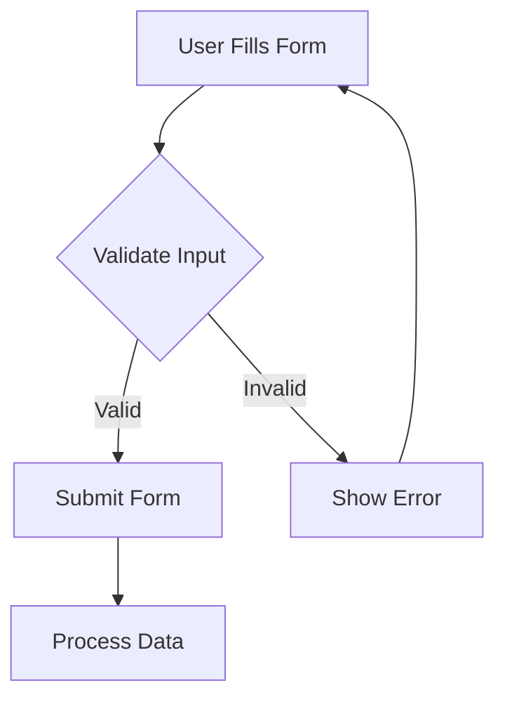

## 12.6 Working with Forms and User Input

Forms are a fundamental component of web pages, allowing users to input data that can be processed and stored. In this section, we'll explore how to create forms using HTML, handle form submissions with JavaScript, validate user input, and ensure security through input sanitization.

### Creating a Form in HTML

Let's start by creating a simple form. A form in HTML is defined using the `<form>` element, which can contain various input fields, labels, and a submit button.

Here's a basic example of a form:

```html
<!DOCTYPE html>
<html lang="en">
<head>
    <meta charset="UTF-8">
    <meta name="viewport" content="width=device-width, initial-scale=1.0">
    <title>Simple Form</title>
</head>
<body>
    <form id="userForm">
        <label for="name">Name:</label>
        <input type="text" id="name" name="name" required>
        
        <label for="email">Email:</label>
        <input type="email" id="email" name="email" required>
        
        <button type="submit">Submit</button>
    </form>
</body>
</html>
```

#### Explanation:

- **`<form id="userForm">`**: This is the container for our form elements. The `id` attribute is used to uniquely identify the form, which will be useful when handling form submissions with JavaScript.
- **`<label for="name">Name:</label>`**: The `<label>` element is used to provide a label for the input field. The `for` attribute should match the `id` of the corresponding input field.
- **`<input type="text" id="name" name="name" required>`**: This is a text input field for the user's name. The `required` attribute ensures that the field must be filled out before the form can be submitted.
- **`<input type="email" id="email" name="email" required>`**: This is an email input field that validates the input to ensure it is a valid email format.
- **`<button type="submit">Submit</button>`**: This button submits the form.

### Handling Form Submission with JavaScript

Once we have our form set up, we need to handle the form submission using JavaScript. This involves capturing the form data and processing it as needed.

Let's add a script to handle the form submission:

```html
<script>
    document.getElementById('userForm').addEventListener('submit', function(event) {
        event.preventDefault(); // Prevent the default form submission

        const name = document.getElementById('name').value;
        const email = document.getElementById('email').value;

        console.log('Name:', name);
        console.log('Email:', email);

        // Here you can add code to process the form data, such as sending it to a server
    });
</script>
```

#### Explanation:

- **`document.getElementById('userForm').addEventListener('submit', function(event) {...}`**: We add an event listener to the form that listens for the `submit` event.
- **`event.preventDefault();`**: This line prevents the default form submission, which would normally reload the page.
- **`const name = document.getElementById('name').value;`**: We capture the value of the name input field.
- **`console.log('Name:', name);`**: We log the captured data to the console for demonstration purposes.

### Validating User Input

Validation is crucial to ensure that the data submitted by users is correct and useful. HTML5 provides some basic validation attributes like `required`, `minlength`, `maxlength`, and `pattern`. However, for more complex validation, JavaScript is often used.

Let's enhance our form with JavaScript validation:

```html
<script>
    document.getElementById('userForm').addEventListener('submit', function(event) {
        event.preventDefault();

        const name = document.getElementById('name').value;
        const email = document.getElementById('email').value;

        if (name.trim() === '') {
            alert('Name is required.');
            return;
        }

        if (!validateEmail(email)) {
            alert('Please enter a valid email address.');
            return;
        }

        console.log('Name:', name);
        console.log('Email:', email);
    });

    function validateEmail(email) {
        const re = /^[^\s@]+@[^\s@]+\.[^\s@]+$/;
        return re.test(String(email).toLowerCase());
    }
</script>
```

#### Explanation:

- **`if (name.trim() === '') {...}`**: We check if the name field is empty after trimming whitespace. If it is, we alert the user and stop the form submission.
- **`validateEmail(email)`**: This function uses a regular expression to validate the email format. If the email is invalid, we alert the user.

### Providing Feedback to Users

Providing feedback to users helps them understand what they need to correct in their input. We can use JavaScript to display messages or highlight fields that need attention.

Let's modify our form to provide feedback:

```html
<style>
    .error {
        border-color: red;
    }
</style>

<script>
    document.getElementById('userForm').addEventListener('submit', function(event) {
        event.preventDefault();

        const nameField = document.getElementById('name');
        const emailField = document.getElementById('email');

        let valid = true;

        if (nameField.value.trim() === '') {
            nameField.classList.add('error');
            valid = false;
        } else {
            nameField.classList.remove('error');
        }

        if (!validateEmail(emailField.value)) {
            emailField.classList.add('error');
            valid = false;
        } else {
            emailField.classList.remove('error');
        }

        if (valid) {
            console.log('Name:', nameField.value);
            console.log('Email:', emailField.value);
        }
    });

    function validateEmail(email) {
        const re = /^[^\s@]+@[^\s@]+\.[^\s@]+$/;
        return re.test(String(email).toLowerCase());
    }
</script>
```

#### Explanation:

- **`.error { border-color: red; }`**: We define a CSS class to highlight fields with errors.
- **`nameField.classList.add('error');`**: If the name field is invalid, we add the `error` class to highlight it.
- **`nameField.classList.remove('error');`**: If the name field is valid, we remove the `error` class.

### Security Considerations: Input Sanitization

Security is a critical aspect of handling user input. Unsanitized input can lead to vulnerabilities like Cross-Site Scripting (XSS) and SQL Injection. To mitigate these risks, always sanitize and validate input on the server side, even if you perform client-side validation.

#### Basic Input Sanitization in JavaScript

While server-side sanitization is crucial, you can also perform some basic sanitization on the client side:

```javascript
function sanitizeInput(input) {
    const temp = document.createElement('div');
    temp.textContent = input;
    return temp.innerHTML;
}

const sanitizedInput = sanitizeInput(userInput);
```

#### Explanation:

- **`document.createElement('div')`**: We create a temporary `div` element.
- **`temp.textContent = input;`**: We set the `textContent` of the `div` to the input, which automatically escapes any HTML.
- **`return temp.innerHTML;`**: We return the sanitized input.

### Try It Yourself

Now that we've covered the basics, try modifying the form to include additional fields, such as a phone number or a message textarea. Implement validation for these new fields and test your form to ensure it handles various input scenarios.

### Visualizing the Form Submission Process

Here's a flowchart to visualize the form submission and validation process:



#### Description:

- **A**: User fills out the form.
- **B**: Input is validated.
- **C**: If valid, the form is submitted.
- **D**: If invalid, an error is shown, and the user can correct their input.
- **E**: Data is processed after successful submission.

### Key Takeaways

- Forms are essential for capturing user input on web pages.
- HTML provides the structure for forms, while JavaScript handles submission and validation.
- Always validate and sanitize user input to ensure security.
- Providing feedback to users improves their experience and helps them correct errors.

### Further Reading

For more information on forms and input handling, consider exploring the following resources:

- [MDN Web Docs: Form data validation](https://developer.mozilla.org/en-US/docs/Learn/Forms/Form_validation)
- [W3Schools: HTML Forms](https://www.w3schools.com/html/html_forms.asp)
- [OWASP: Cross-Site Scripting (XSS)](https://owasp.org/www-community/attacks/xss/)

## Quiz Time!



### What is the purpose of the `<form>` element in HTML?

- [x] To create a container for input fields and submit buttons
- [ ] To style input fields
- [ ] To validate input fields
- [ ] To display images

> **Explanation:** The `<form>` element is used to create a container for input fields, labels, and submit buttons, allowing users to input data.

### How can you prevent a form from submitting in JavaScript?

- [x] Use `event.preventDefault()`
- [ ] Use `return false`
- [ ] Use `stopPropagation()`
- [ ] Use `alert()`

> **Explanation:** `event.preventDefault()` is used to prevent the default action of an event, such as form submission.

### Which attribute is used to ensure an input field is filled out before submission?

- [x] `required`
- [ ] `minlength`
- [ ] `maxlength`
- [ ] `pattern`

> **Explanation:** The `required` attribute ensures that an input field must be filled out before the form can be submitted.

### What is the purpose of input validation?

- [x] To ensure the data submitted by users is correct and useful
- [ ] To style the input fields
- [ ] To prevent the form from being submitted
- [ ] To display images

> **Explanation:** Input validation ensures that the data submitted by users is correct and useful, preventing errors and security issues.

### What does the `validateEmail` function do in the provided code?

- [x] It checks if the email format is valid
- [ ] It checks if the email field is empty
- [ ] It submits the form
- [ ] It styles the email field

> **Explanation:** The `validateEmail` function uses a regular expression to check if the email format is valid.

### Why is input sanitization important?

- [x] To prevent security vulnerabilities like XSS
- [ ] To style input fields
- [ ] To validate input fields
- [ ] To display images

> **Explanation:** Input sanitization is important to prevent security vulnerabilities like Cross-Site Scripting (XSS) by ensuring that user input is safe.

### What is the role of the `error` class in the provided code?

- [x] To highlight fields with errors
- [ ] To submit the form
- [ ] To validate the input fields
- [ ] To display images

> **Explanation:** The `error` class is used to highlight fields with errors, providing visual feedback to users.

### How can you capture the value of an input field in JavaScript?

- [x] Use `document.getElementById('fieldId').value`
- [ ] Use `document.querySelector('fieldId').text`
- [ ] Use `document.getElementById('fieldId').textContent`
- [ ] Use `document.querySelector('fieldId').innerHTML`

> **Explanation:** `document.getElementById('fieldId').value` is used to capture the value of an input field in JavaScript.

### What is the purpose of the `addEventListener` method in JavaScript?

- [x] To attach a function to respond to user actions
- [ ] To style input fields
- [ ] To validate input fields
- [ ] To display images

> **Explanation:** The `addEventListener` method is used to attach a function to respond to user actions, such as form submissions.

### True or False: Server-side validation is not necessary if client-side validation is implemented.

- [ ] True
- [x] False

> **Explanation:** Server-side validation is necessary even if client-side validation is implemented to ensure security and data integrity.


