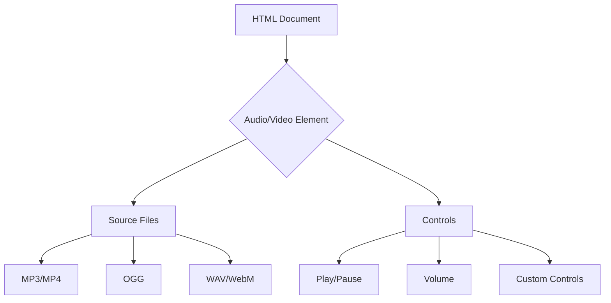

## 12.8 Incorporating Media Elements

Incorporating media elements such as audio and video into your web pages can significantly enhance user engagement and provide a richer experience. In this section, we will explore how to embed audio and video content using HTML, customize these elements with JavaScript, and optimize them for web delivery. By the end of this guide, you will be able to seamlessly integrate media into your web projects and ensure they are accessible and efficient.

### Understanding the Basics of Media Elements

Before we dive into the technical details, let's understand what media elements are and why they are important. Media elements refer to audio and video content that can be embedded into web pages to provide dynamic and interactive experiences. With the advent of HTML5, embedding media has become more straightforward, allowing developers to use native HTML tags without relying on external plugins like Flash.

#### Key Benefits of Using Media Elements

- **Enhanced User Engagement**: Media elements can capture users' attention and keep them engaged longer.
- **Improved Communication**: Videos and audio can convey information more effectively than text alone.
- **Accessibility**: Properly implemented media elements can make content more accessible to users with different needs.

### Embedding Audio with the `<audio>` Tag

The `<audio>` tag in HTML5 allows you to embed sound content into your web pages. It supports various audio formats and provides a simple way to add sound to your site.

#### Basic Structure of the `<audio>` Tag

Here's a basic example of how to use the `<audio>` tag:

```html
<audio controls>
  <source src="audio-file.mp3" type="audio/mpeg">
  <source src="audio-file.ogg" type="audio/ogg">
  Your browser does not support the audio element.
</audio>
```

- **`<audio>`**: The main tag used to embed audio content.
- **`controls`**: An attribute that adds play, pause, and volume controls to the audio player.
- **`<source>`**: Specifies the audio file and its format. You can include multiple `<source>` elements to provide different formats for browser compatibility.
- **Fallback Text**: Text that appears if the browser does not support the audio element.

#### Customizing Audio Playback with JavaScript

You can enhance the functionality of audio elements using JavaScript. For example, you can create custom controls or automate playback.

```html
<audio id="myAudio" src="audio-file.mp3"></audio>
<button onclick="playAudio()">Play</button>
<button onclick="pauseAudio()">Pause</button>

<script>
  var audio = document.getElementById("myAudio");

  function playAudio() {
    audio.play();
  }

  function pauseAudio() {
    audio.pause();
  }
</script>
```

- **`play()`**: A method to start audio playback.
- **`pause()`**: A method to pause audio playback.

### Embedding Video with the `<video>` Tag

The `<video>` tag is used to embed video content into web pages. Like the `<audio>` tag, it supports various formats and provides built-in controls.

#### Basic Structure of the `<video>` Tag

Here's how you can use the `<video>` tag:

```html
<video width="320" height="240" controls>
  <source src="video-file.mp4" type="video/mp4">
  <source src="video-file.ogg" type="video/ogg">
  Your browser does not support the video tag.
</video>
```

- **`<video>`**: The main tag used to embed video content.
- **`width` and `height`**: Attributes to set the dimensions of the video player.
- **`controls`**: Adds play, pause, and volume controls to the video player.
- **`<source>`**: Specifies the video file and its format.

#### Customizing Video Playback with JavaScript

JavaScript can be used to create custom video controls or automate video actions.

```html
<video id="myVideo" width="320" height="240">
  <source src="video-file.mp4" type="video/mp4">
</video>
<button onclick="playVideo()">Play</button>
<button onclick="pauseVideo()">Pause</button>

<script>
  var video = document.getElementById("myVideo");

  function playVideo() {
    video.play();
  }

  function pauseVideo() {
    video.pause();
  }
</script>
```

- **`play()`**: A method to start video playback.
- **`pause()`**: A method to pause video playback.

### Considerations for Different Browsers and File Formats

When incorporating media elements, it's essential to consider browser compatibility and file formats. Different browsers support different audio and video formats, so providing multiple formats ensures broader compatibility.

#### Common Audio Formats

- **MP3**: Widely supported and commonly used for audio files.
- **OGG**: Open-source format with good compression.
- **WAV**: Uncompressed format with high quality but larger file size.

#### Common Video Formats

- **MP4**: Highly compatible and widely used for video content.
- **WebM**: Open-source format with good compression.
- **OGG**: Less common but supported by some browsers.

### Optimizing Media for Web Delivery

Optimizing media files is crucial for ensuring fast loading times and a smooth user experience. Here are some tips for optimizing audio and video files:

#### Compression

- **Use Compression Tools**: Tools like HandBrake or FFmpeg can reduce file sizes without significant loss of quality.
- **Choose the Right Format**: Select formats that provide a good balance between quality and file size.

#### Lazy Loading

- **Implement Lazy Loading**: Load media files only when they are needed, reducing initial page load times.

#### Responsive Design

- **Use Responsive Players**: Ensure that audio and video players adapt to different screen sizes for a consistent user experience.

### Try It Yourself

Now that we've covered the basics, try incorporating an audio or video element into your web page. Experiment with different formats and customize the playback controls using JavaScript. Here's a simple challenge:

- **Challenge**: Create a web page with an embedded video that automatically plays when the page loads and pauses when a button is clicked. Use JavaScript to implement this functionality.

### Visual Aids

To better understand the structure and flow of media elements within a web page, let's visualize the process using a Mermaid.js diagram.



**Diagram Description**: This flowchart illustrates the relationship between the HTML document, audio/video elements, source files, and controls. It shows how different formats and controls interact within the media element.

### References and Links

For further reading and more in-depth information, consider visiting these resources:

- [MDN Web Docs on `<audio>`](https://developer.mozilla.org/en-US/docs/Web/HTML/Element/audio)
- [MDN Web Docs on `<video>`](https://developer.mozilla.org/en-US/docs/Web/HTML/Element/video)
- [W3Schools Audio and Video](https://www.w3schools.com/html/html5_audio.asp)

### Engagement and Reinforcement

To reinforce your understanding, consider these questions:

- What are the benefits of using the `<audio>` and `<video>` tags?
- How can JavaScript be used to enhance media elements?
- What are some common audio and video formats, and why is it important to provide multiple formats?

### Summary

In this section, we've explored how to incorporate audio and video elements into your web pages using HTML and JavaScript. We've discussed the importance of providing multiple formats for compatibility, customizing media elements with JavaScript, and optimizing media for web delivery. By following these guidelines, you can create engaging and interactive web experiences that captivate your audience.

## Quiz Time!



### What is the primary purpose of the `<audio>` tag in HTML5?

- [x] To embed sound content into web pages
- [ ] To create a hyperlink
- [ ] To display an image
- [ ] To format text

> **Explanation:** The `<audio>` tag is used to embed sound content into web pages, allowing users to play audio files directly from the browser.

### Which attribute is used to add play, pause, and volume controls to an audio or video element?

- [x] `controls`
- [ ] `autoplay`
- [ ] `loop`
- [ ] `muted`

> **Explanation:** The `controls` attribute adds play, pause, and volume controls to audio and video elements, providing users with basic playback functionality.

### What method is used in JavaScript to start audio playback?

- [x] `play()`
- [ ] `pause()`
- [ ] `stop()`
- [ ] `load()`

> **Explanation:** The `play()` method is used in JavaScript to start the playback of an audio or video element.

### Which of the following is a common video format supported by most browsers?

- [x] MP4
- [ ] DOCX
- [ ] PDF
- [ ] TXT

> **Explanation:** MP4 is a common video format supported by most browsers, making it a popular choice for web video content.

### What is the purpose of providing multiple `<source>` elements within an `<audio>` or `<video>` tag?

- [x] To ensure compatibility across different browsers
- [ ] To increase file size
- [x] To offer different audio or video qualities
- [ ] To add subtitles

> **Explanation:** Providing multiple `<source>` elements ensures compatibility across different browsers and allows offering different audio or video qualities.

### Which tool can be used to compress video files for web delivery?

- [x] HandBrake
- [ ] Microsoft Word
- [ ] Adobe Photoshop
- [ ] Notepad

> **Explanation:** HandBrake is a tool that can be used to compress video files, reducing their size for more efficient web delivery.

### What is lazy loading in the context of media elements?

- [x] Loading media files only when needed
- [ ] Loading all media files at once
- [x] Reducing initial page load times
- [ ] Increasing file size

> **Explanation:** Lazy loading involves loading media files only when needed, which helps reduce initial page load times and improve performance.

### Which JavaScript method is used to pause video playback?

- [x] `pause()`
- [ ] `play()`
- [ ] `stop()`
- [ ] `load()`

> **Explanation:** The `pause()` method is used in JavaScript to pause the playback of an audio or video element.

### What is the benefit of using responsive players for media elements?

- [x] Ensures media adapts to different screen sizes
- [ ] Increases file size
- [ ] Reduces compatibility
- [ ] Limits playback options

> **Explanation:** Responsive players ensure that media elements adapt to different screen sizes, providing a consistent user experience across devices.

### True or False: The `<audio>` and `<video>` tags require external plugins like Flash to function.

- [ ] True
- [x] False

> **Explanation:** False. The `<audio>` and `<video>` tags are native HTML5 elements that do not require external plugins like Flash to function.


