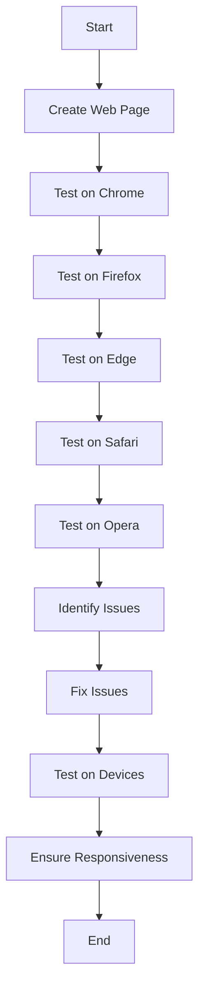

## 12.9 Testing Across Different Browsers

Building a web page is only the beginning of the journey. To ensure that your website is accessible and functional for all users, it's crucial to test it across different browsers and devices. This section will guide you through the importance of cross-browser testing, the major browsers to consider, tools and services that can assist you, and common issues you might encounter.

### Why Cross-Browser Testing is Important

Cross-browser testing ensures that your web page delivers a consistent user experience regardless of the browser or device being used. Different browsers interpret HTML, CSS, and JavaScript in slightly different ways, which can lead to inconsistencies in how your page is displayed or functions. By testing across multiple browsers, you can identify and fix these discrepancies, ensuring that all users have a seamless experience.

#### Key Reasons for Cross-Browser Testing:

- **User Experience Consistency**: Different browsers may render your web page differently. Ensuring consistency across browsers is crucial for maintaining a professional and user-friendly interface.
- **Accessibility**: Not all users have access to the same browser or device. Testing ensures that your site is accessible to a wider audience.
- **Performance Optimization**: Some browsers may handle resources differently, affecting load times and performance. Testing helps identify these issues.
- **SEO and Reach**: A site that works well across all browsers can improve search engine rankings and reach a broader audience.

### Major Browsers to Test

When testing your web page, it's important to consider the most popular browsers that users might be using. Here's a list of major browsers you should include in your testing process:

1. **Google Chrome**: As one of the most popular browsers, Chrome is a must-test. It is known for its speed and extensive developer tools.
2. **Mozilla Firefox**: Known for its strong privacy features and developer-friendly tools, Firefox is another essential browser for testing.
3. **Microsoft Edge**: The successor to Internet Explorer, Edge is built on the Chromium engine and is gaining popularity.
4. **Safari**: The default browser on Apple devices, Safari is crucial for testing, especially for users on macOS and iOS.
5. **Opera**: While not as widely used, Opera has a dedicated user base and offers unique features like a built-in VPN.

### Tools and Services for Cross-Browser Testing

Testing across multiple browsers manually can be time-consuming. Thankfully, there are several tools and services available that can help streamline the process:

#### BrowserStack

[BrowserStack](https://www.browserstack.com/) is a popular cloud-based testing platform that allows you to test your web pages on a wide range of browsers and devices without the need for physical hardware. It provides real-time testing and automated testing options.

#### Sauce Labs

[Sauce Labs](https://saucelabs.com/) offers a comprehensive testing platform with support for a wide array of browsers and devices. It integrates with various CI/CD tools, making it ideal for automated testing workflows.

#### CrossBrowserTesting

[CrossBrowserTesting](https://crossbrowsertesting.com/) provides live testing, automated testing, and visual testing capabilities. It supports a wide range of browsers and devices, making it a versatile option for cross-browser testing.

#### LambdaTest

[LambdaTest](https://www.lambdatest.com/) is another cloud-based platform that offers real-time and automated cross-browser testing. It supports a wide range of browsers and devices and provides detailed analytics.

### Testing on Different Devices and Screen Sizes

In addition to testing across different browsers, it's important to test your web page on various devices and screen sizes. This ensures that your site is responsive and provides a good user experience on both desktop and mobile devices.

#### Responsive Design Testing

Responsive design is crucial for ensuring that your web page looks good on all devices. Use tools like Chrome DevTools to simulate different screen sizes and test how your page responds.

#### Device Emulators and Simulators

Many browsers offer built-in emulators and simulators that allow you to test your web page on different devices. For example, Chrome DevTools provides a device toolbar that lets you simulate various screen sizes and resolutions.

### Common Issues and How to Address Them

Cross-browser testing can reveal a variety of issues that need to be addressed to ensure a consistent user experience. Here are some common issues and tips on how to fix them:

#### CSS Inconsistencies

Different browsers may interpret CSS differently, leading to layout and styling issues. Use CSS resets or normalize.css to ensure consistent styling across browsers.

#### JavaScript Compatibility

JavaScript features may not be supported in all browsers. Use polyfills or transpilers like Babel to ensure compatibility with older browsers.

#### HTML Rendering Differences

Some HTML elements may render differently in various browsers. Test your HTML thoroughly and use feature detection libraries like Modernizr to handle differences.

#### Performance Variations

Performance can vary across browsers due to differences in how they handle resources. Use performance testing tools to identify bottlenecks and optimize your code.

### Try It Yourself

To get hands-on experience with cross-browser testing, try the following exercise:

1. Create a simple web page with HTML, CSS, and JavaScript.
2. Use BrowserStack or a similar tool to test your page on different browsers and devices.
3. Identify any issues or inconsistencies and make the necessary adjustments to your code.
4. Test your page again to ensure that the issues have been resolved.

### Visual Aids

To help you understand the process of cross-browser testing, here is a flowchart that outlines the steps involved:

### References and Links

For more information on cross-browser testing, check out these resources:

- [MDN Web Docs: Cross-Browser Testing](https://developer.mozilla.org/en-US/docs/Learn/Tools_and_testing/Cross_browser_testing)
- [W3Schools: Browser Testing](https://www.w3schools.com/browsers/browsers_testing.asp)

### Engagement and Reinforcement

To reinforce your learning, consider the following questions:

- Why is cross-browser testing important for web development?
- What are some common issues you might encounter during cross-browser testing?
- How can tools like BrowserStack help streamline the testing process?

### Key Takeaways

- Cross-browser testing ensures a consistent user experience across different browsers and devices.
- Major browsers to test include Chrome, Firefox, Edge, Safari, and Opera.
- Tools like BrowserStack and Sauce Labs can help automate and streamline the testing process.
- Testing on different devices and screen sizes is crucial for responsive design.
- Common issues include CSS inconsistencies, JavaScript compatibility, and performance variations.

By following these guidelines, you can ensure that your web page works seamlessly across all browsers and devices, providing a positive experience for all users.

## Quiz Time!



### Why is cross-browser testing important?

- [x] To ensure a consistent user experience across different browsers
- [ ] To increase the loading speed of the website
- [ ] To enhance the visual design of the website
- [ ] To improve the SEO ranking

> **Explanation:** Cross-browser testing ensures that your website functions and appears consistently across different browsers, providing a seamless user experience.

### Which of the following is NOT a major browser to test?

- [ ] Google Chrome
- [ ] Mozilla Firefox
- [x] Internet Explorer
- [ ] Safari

> **Explanation:** Internet Explorer is largely deprecated and not considered a major browser for testing modern web pages.

### What tool can be used for cross-browser testing?

- [x] BrowserStack
- [ ] Photoshop
- [ ] Microsoft Word
- [ ] Excel

> **Explanation:** BrowserStack is a tool that allows you to test your web pages across different browsers and devices.

### What is a common issue encountered during cross-browser testing?

- [x] CSS inconsistencies
- [ ] Lack of images
- [ ] Too many colors
- [ ] Excessive text

> **Explanation:** CSS inconsistencies are common because different browsers may interpret CSS rules differently.

### What is the purpose of using a CSS reset?

- [x] To ensure consistent styling across browsers
- [ ] To remove all styles from the page
- [ ] To add animations to the page
- [ ] To change the font size

> **Explanation:** A CSS reset helps to standardize the default styling across different browsers, ensuring consistency.

### Which tool can simulate different screen sizes for testing?

- [x] Chrome DevTools
- [ ] Microsoft Word
- [ ] Adobe Illustrator
- [ ] PowerPoint

> **Explanation:** Chrome DevTools includes a device toolbar that allows you to simulate different screen sizes and resolutions.

### What is a polyfill used for?

- [x] To provide support for JavaScript features in older browsers
- [ ] To enhance the visual design of a website
- [ ] To increase the loading speed of a website
- [ ] To add new HTML elements

> **Explanation:** A polyfill is a piece of code used to provide modern functionality on older browsers that do not natively support it.

### Which of the following is a cloud-based testing platform?

- [x] Sauce Labs
- [ ] Microsoft Excel
- [ ] Adobe Photoshop
- [ ] Google Docs

> **Explanation:** Sauce Labs is a cloud-based platform that offers cross-browser testing services.

### What is the benefit of using BrowserStack?

- [x] It allows testing on a wide range of browsers and devices without physical hardware
- [ ] It increases the website's SEO ranking
- [ ] It enhances the visual design of a website
- [ ] It reduces the website's loading time

> **Explanation:** BrowserStack provides a cloud-based solution for testing on various browsers and devices without needing physical hardware.

### True or False: Cross-browser testing is only necessary for desktop browsers.

- [ ] True
- [x] False

> **Explanation:** Cross-browser testing is necessary for both desktop and mobile browsers to ensure a consistent experience across all devices.


