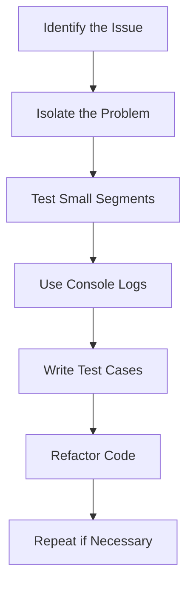

## 13.10 Best Practices for Efficient Debugging

Debugging is an essential skill for any developer, especially when building web pages with JavaScript. It involves identifying, isolating, and fixing bugs or errors in your code. In this section, we'll explore best practices for efficient debugging that will help you streamline the process and become a more effective problem solver.

### Understanding the Importance of Debugging

Before we dive into specific techniques, let's understand why debugging is crucial:

- **Ensures Functionality**: Debugging helps ensure that your web page functions as intended, providing a smooth user experience.
- **Improves Code Quality**: By identifying and fixing bugs, you improve the overall quality and reliability of your code.
- **Enhances Learning**: Debugging is a learning opportunity. It helps you understand how your code works and why certain issues arise.

### Isolating Issues by Testing Small Code Segments

One of the most effective ways to debug is by isolating issues. This means breaking down your code into smaller segments and testing each part individually. Here's how you can do it:

1. **Divide and Conquer**: Break your code into smaller, manageable pieces. Focus on one function or component at a time.
2. **Use Console Logs**: Insert `console.log()` statements to track variable values and program flow. This helps you pinpoint where things go wrong.

```javascript
// Example of using console.log() to debug
function calculateSum(a, b) {
    console.log("Inputs:", a, b); // Log inputs
    const sum = a + b;
    console.log("Sum:", sum); // Log result
    return sum;
}

calculateSum(5, 10);
```

3. **Comment Out Code**: Temporarily disable parts of your code to isolate the section causing the problem. Uncomment sections one by one to identify the issue.

```javascript
// Example of commenting out code
function processData(data) {
    // console.log("Processing data:", data);
    // Perform operations on data
    // return modifiedData;
}
```

### Writing Test Cases and Using Test-Driven Development (TDD)

Test-driven development (TDD) is a methodology where you write tests before writing the actual code. This approach helps you think through the requirements and edge cases, leading to more robust code.

1. **Write Test Cases**: Create test cases that cover different scenarios, including edge cases. Use testing frameworks like Jest or Mocha for JavaScript.

```javascript
// Example of a simple test case using Jest
test('adds 1 + 2 to equal 3', () => {
    expect(calculateSum(1, 2)).toBe(3);
});
```

2. **Follow the TDD Cycle**: The TDD cycle consists of three steps: write a failing test, write the minimum code to pass the test, and refactor the code.

3. **Automate Testing**: Use automated testing tools to run your test cases regularly. This ensures that new changes don't break existing functionality.

### Clear and Descriptive Naming Conventions

Using clear and descriptive naming conventions for variables, functions, and classes can significantly reduce confusion and make debugging easier.

1. **Use Meaningful Names**: Choose names that convey the purpose of the variable or function. Avoid single-letter names or abbreviations unless they are widely understood.

```javascript
// Example of clear naming conventions
let userAge = 25;
function calculateUserAgeInDays(age) {
    return age * 365;
}
```

2. **Consistent Naming Patterns**: Stick to a consistent naming pattern, such as camelCase for variables and functions, and PascalCase for classes.

3. **Avoid Overloading**: Avoid using the same name for different variables or functions in different scopes, as this can lead to confusion.

### Maintaining a Clean and Organized Codebase

A clean and organized codebase is easier to navigate and debug. Here are some tips to achieve this:

1. **Use Comments Wisely**: Write comments to explain complex logic or important sections of your code. Avoid over-commenting, as it can clutter the code.

```javascript
// Example of using comments
// Calculate the user's age in days
function calculateUserAgeInDays(age) {
    return age * 365; // Multiply age by the number of days in a year
}
```

2. **Follow a Consistent Style Guide**: Adhere to a style guide, such as Airbnb's JavaScript Style Guide, to maintain consistency in your code.

3. **Organize Files and Folders**: Structure your project files and folders logically. Group related files together and use meaningful names for directories.

### Staying Patient and Methodical During Debugging

Debugging can be frustrating, but staying patient and methodical can make the process more manageable.

1. **Take Breaks**: If you're stuck, take a break. Stepping away from the problem can provide fresh perspectives.

2. **Use a Systematic Approach**: Follow a systematic approach to debugging. Start by identifying the symptoms, formulating hypotheses, and testing them one by one.

3. **Document Your Findings**: Keep a record of the issues you encounter and how you resolved them. This documentation can be a valuable resource for future reference.

### Visual Aids: Debugging Workflow

To visualize the debugging process, let's use a flowchart to represent the steps involved in efficient debugging:



**Description**: This flowchart illustrates the debugging workflow, starting from identifying the issue to isolating the problem, testing small segments, using console logs, writing test cases, refactoring code, and repeating the process if necessary.

### Try It Yourself

Now that we've covered some best practices for efficient debugging, it's time to try them out. Here's a simple exercise:

1. **Create a Function**: Write a function that calculates the factorial of a number. Use console logs to debug any issues.

```javascript
// Example function to calculate factorial
function factorial(n) {
    if (n < 0) return -1; // Factorial of negative numbers is undefined
    if (n === 0) return 1; // Factorial of 0 is 1
    return n * factorial(n - 1); // Recursive call
}

console.log(factorial(5)); // Expected output: 120
```

2. **Write Test Cases**: Create test cases to verify the correctness of your function. Consider edge cases like negative numbers and zero.

3. **Refactor the Code**: Refactor your code to improve readability and performance. Use meaningful variable names and add comments where necessary.

### References and Further Reading

For more information on debugging and best practices, check out these resources:

- [MDN Web Docs: Debugging JavaScript](https://developer.mozilla.org/en-US/docs/Learn/JavaScript/First_steps/What_went_wrong)
- [W3Schools: JavaScript Debugging](https://www.w3schools.com/js/js_debugging.asp)
- [Airbnb JavaScript Style Guide](https://github.com/airbnb/javascript)

### Key Takeaways

- Efficient debugging is crucial for ensuring functionality and improving code quality.
- Isolate issues by testing small code segments and using console logs.
- Write test cases and consider using test-driven development (TDD) practices.
- Use clear and descriptive naming conventions to reduce confusion.
- Maintain a clean and organized codebase for easier navigation.
- Stay patient and methodical during the debugging process.

By following these best practices, you'll be well-equipped to tackle any debugging challenges that come your way.

## Quiz Time!



### What is the first step in the debugging workflow?

- [x] Identify the Issue
- [ ] Isolate the Problem
- [ ] Test Small Segments
- [ ] Refactor Code

> **Explanation:** The first step in the debugging workflow is to identify the issue, which involves recognizing the symptoms of the problem.

### Which method can be used to insert logs for debugging in JavaScript?

- [x] console.log()
- [ ] alert()
- [ ] document.write()
- [ ] prompt()

> **Explanation:** `console.log()` is commonly used to insert logs for debugging purposes in JavaScript.

### What is the purpose of writing test cases?

- [x] To verify the correctness of code
- [ ] To increase code complexity
- [ ] To make code run faster
- [ ] To reduce code readability

> **Explanation:** Writing test cases helps verify the correctness of code by covering different scenarios and edge cases.

### Which naming convention is recommended for variables in JavaScript?

- [x] camelCase
- [ ] snake_case
- [ ] kebab-case
- [ ] PascalCase

> **Explanation:** camelCase is the recommended naming convention for variables in JavaScript.

### What should you do if you're stuck while debugging?

- [x] Take a break
- [ ] Delete the code
- [ ] Ignore the issue
- [ ] Rewrite the entire code

> **Explanation:** Taking a break can provide fresh perspectives and help you approach the problem with a clear mind.

### What is the TDD cycle?

- [x] Write a failing test, write code to pass the test, refactor the code
- [ ] Write code, test it, deploy it
- [ ] Write code, refactor it, test it
- [ ] Test code, write code, deploy it

> **Explanation:** The TDD cycle involves writing a failing test, writing code to pass the test, and then refactoring the code.

### What is a benefit of maintaining a clean codebase?

- [x] Easier navigation and debugging
- [ ] Increased code complexity
- [ ] Reduced code readability
- [ ] Slower performance

> **Explanation:** A clean codebase is easier to navigate and debug, making it more manageable.

### Which tool can be used for automated testing in JavaScript?

- [x] Jest
- [ ] Photoshop
- [ ] Excel
- [ ] Word

> **Explanation:** Jest is a popular testing framework used for automated testing in JavaScript.

### What is the role of comments in code?

- [x] To explain complex logic
- [ ] To increase code size
- [ ] To make code run faster
- [ ] To reduce code readability

> **Explanation:** Comments are used to explain complex logic or important sections of code, improving readability.

### True or False: Debugging is only necessary for large projects.

- [ ] True
- [x] False

> **Explanation:** Debugging is necessary for projects of all sizes to ensure functionality and improve code quality.


