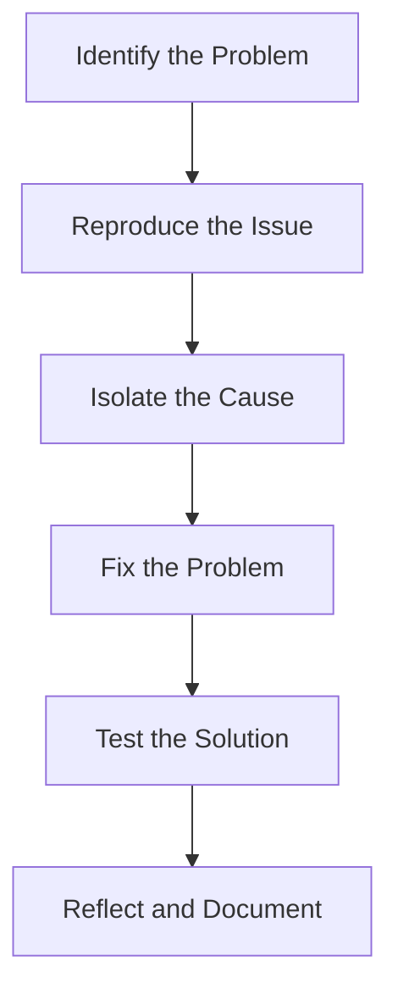
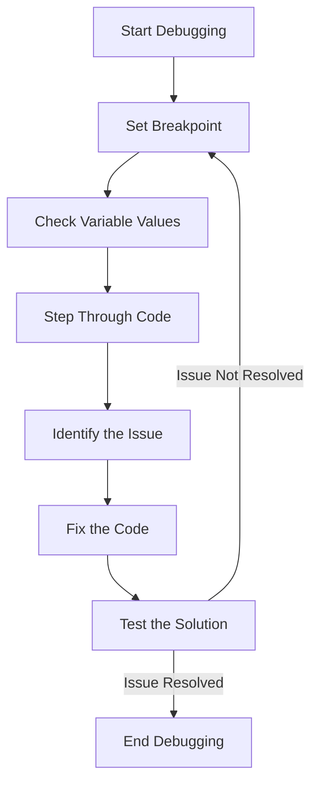

## 13.2 Debugging JavaScript Code

Debugging is an essential skill for any developer, especially when working with JavaScript. As you build your first web page, you'll inevitably encounter errors or unexpected behavior. This section will guide you through the process of identifying and fixing issues in your JavaScript code using various tools and techniques. By the end of this section, you'll be equipped with the knowledge to systematically troubleshoot and resolve common JavaScript problems.

### Understanding the Debugging Process

Before diving into specific tools and techniques, it's important to understand the debugging process itself. Debugging is the art of identifying, isolating, and fixing bugs or errors in your code. Here's a simplified flow of the debugging process:



1. **Identify the Problem**: Recognize that something is not working as expected.
2. **Reproduce the Issue**: Consistently trigger the problem to understand its nature.
3. **Isolate the Cause**: Narrow down the part of the code responsible for the issue.
4. **Fix the Problem**: Implement a solution to correct the error.
5. **Test the Solution**: Verify that the fix resolves the issue without introducing new ones.
6. **Reflect and Document**: Learn from the experience and document the solution for future reference.

### Setting Breakpoints in the Browser's Developer Tools

One of the most powerful features of modern browsers is their built-in developer tools, which allow you to set breakpoints in your JavaScript code. Breakpoints enable you to pause the execution of your code at specific points, allowing you to inspect the state of your application.

#### How to Set Breakpoints

1. **Open Developer Tools**: Press `F12` or right-click on your web page and select "Inspect" to open the developer tools.
2. **Navigate to the Sources Tab**: This tab allows you to view and debug your JavaScript files.
3. **Locate Your JavaScript File**: Find the file you want to debug in the file tree.
4. **Set a Breakpoint**: Click on the line number where you want to pause execution. A blue marker will appear, indicating a breakpoint.

#### Stepping Through Code

Once a breakpoint is hit, you can step through your code to observe how it executes:

- **Step Over (`F10`)**: Execute the current line and move to the next one.
- **Step Into (`F11`)**: Dive into a function call to see its execution.
- **Step Out (`Shift + F11`)**: Exit the current function and return to the calling code.
- **Resume Execution (`F8`)**: Continue running the code until the next breakpoint is hit.

### Observing Variable Values

While stepping through your code, you can inspect the values of variables at any point in time. This is crucial for understanding the state of your application and identifying where things go wrong.

- **Watch Expressions**: Add variables to the "Watch" panel to monitor their values as you step through the code.
- **Scope Variables**: View local, closure, and global variables in the "Scope" panel.
- **Hover Over Variables**: Simply hover your mouse over a variable in the code to see its current value.

### Using `console.log()` for Quick Checks

While breakpoints provide a deep level of inspection, sometimes you need a quick and simple way to check the value of a variable or the flow of execution. This is where `console.log()` comes in handy.

#### How to Use `console.log()`

- **Log Variable Values**: Print the value of variables to the console for inspection.
  
  ```javascript
  let userName = "Alice";
  console.log("User Name:", userName); // Output: User Name: Alice
  ```

- **Trace Execution Flow**: Insert `console.log()` statements at key points in your code to see which parts are executed.
  
  ```javascript
  function greetUser(name) {
      console.log("greetUser function called");
      return `Hello, ${name}!`;
  }
  ```

- **Debug Complex Objects**: Use `console.log()` to inspect objects and arrays.
  
  ```javascript
  let user = { name: "Alice", age: 25 };
  console.log("User Object:", user);
  ```

### Common Debugging Scenarios and Solutions

Let's explore some common scenarios you might encounter while debugging JavaScript code, along with strategies to address them.

#### Scenario 1: Syntax Errors

**Problem**: Your code fails to execute due to syntax errors.

**Solution**: Check the console for error messages. They often indicate the line number and nature of the syntax error. Correct the syntax and test again.

#### Scenario 2: Undefined Variables

**Problem**: You try to access a variable that hasn't been defined.

**Solution**: Ensure that the variable is declared and initialized before use. Use `console.log()` to verify its existence and value.

#### Scenario 3: Incorrect Logic

**Problem**: Your code executes without errors but produces incorrect results.

**Solution**: Use breakpoints and `console.log()` to trace the execution flow and inspect variable values. Adjust your logic as needed.

#### Scenario 4: Asynchronous Code Issues

**Problem**: Asynchronous operations (e.g., AJAX requests) don't complete as expected.

**Solution**: Use breakpoints and `console.log()` to monitor asynchronous operations. Ensure that callbacks or promises are correctly implemented.

### Systematic Troubleshooting

Effective debugging requires a systematic approach. Here are some tips to enhance your troubleshooting skills:

- **Break Down the Problem**: Divide complex issues into smaller, manageable parts.
- **Use a Process of Elimination**: Disable parts of your code to isolate the problematic section.
- **Reproduce the Issue Consistently**: Ensure you can trigger the problem reliably before attempting a fix.
- **Consult Documentation and Resources**: Leverage online resources like [MDN Web Docs](https://developer.mozilla.org/en-US/docs/Web/JavaScript) for guidance.
- **Stay Calm and Patient**: Debugging can be frustrating, but maintaining a calm and methodical approach will lead to better results.

### Try It Yourself

Let's put these debugging techniques into practice. Here's a simple JavaScript code snippet with an intentional error. Use the developer tools to identify and fix the issue.

```javascript
function calculateArea(width, height) {
    // Intentional error: misspelled variable name
    let area = widht * height;
    return area;
}

let result = calculateArea(5, 10);
console.log("Area:", result);
```

**Challenge**: Use breakpoints and `console.log()` to find and correct the error in the `calculateArea` function.

### Visualizing the Debugging Process

To further enhance your understanding, let's visualize a typical debugging session using a flowchart:



### Conclusion

Debugging is an invaluable skill that will serve you well throughout your journey as a developer. By mastering the use of breakpoints, `console.log()`, and systematic troubleshooting, you'll be well-equipped to tackle any JavaScript issues that come your way. Remember, practice makes perfect, so don't hesitate to experiment and refine your debugging techniques.

## Quiz Time!



### What is the first step in the debugging process?

- [x] Identify the Problem
- [ ] Fix the Problem
- [ ] Set Breakpoints
- [ ] Test the Solution

> **Explanation:** The first step in the debugging process is to identify that there is a problem or error in the code.

### Which tool allows you to pause JavaScript execution at a specific line?

- [x] Breakpoints
- [ ] Console
- [ ] Watch Expressions
- [ ] Network Tab

> **Explanation:** Breakpoints allow you to pause the execution of JavaScript code at specific lines to inspect the state of the application.

### What does the `console.log()` method do?

- [x] Prints messages to the console
- [ ] Sets breakpoints
- [ ] Steps through code
- [ ] Fixes syntax errors

> **Explanation:** The `console.log()` method is used to print messages to the console for debugging purposes.

### How can you observe the value of a variable while debugging?

- [x] Hover over the variable in the code
- [ ] Use the Network Tab
- [ ] Set a breakpoint
- [ ] Use the Elements Tab

> **Explanation:** You can hover over a variable in the code while debugging to see its current value.

### What is a common cause of "undefined variable" errors?

- [x] Using a variable before it is declared
- [ ] Incorrect syntax
- [ ] Network issues
- [ ] Browser compatibility

> **Explanation:** "Undefined variable" errors often occur when a variable is used before it is declared and initialized.

### Which method is used to step into a function call during debugging?

- [x] Step Into (`F11`)
- [ ] Step Over (`F10`)
- [ ] Resume Execution (`F8`)
- [ ] Step Out (`Shift + F11`)

> **Explanation:** The "Step Into" method (`F11`) allows you to dive into a function call to see its execution.

### What should you do if your code executes without errors but produces incorrect results?

- [x] Use breakpoints and `console.log()` to trace execution flow
- [ ] Ignore the issue
- [ ] Restart the browser
- [ ] Clear the cache

> **Explanation:** If your code produces incorrect results, use breakpoints and `console.log()` to trace the execution flow and inspect variable values.

### How can you monitor asynchronous operations in JavaScript?

- [x] Use breakpoints and `console.log()`
- [ ] Use the Elements Tab
- [ ] Use the Network Tab
- [ ] Use the Watch Expressions

> **Explanation:** You can monitor asynchronous operations by using breakpoints and `console.log()` to track their progress and results.

### What is the purpose of the "Watch" panel in developer tools?

- [x] To monitor specific variable values
- [ ] To set breakpoints
- [ ] To view network requests
- [ ] To inspect HTML elements

> **Explanation:** The "Watch" panel is used to monitor specific variable values as you step through the code.

### Debugging is an essential skill for developers.

- [x] True
- [ ] False

> **Explanation:** Debugging is indeed an essential skill for developers, as it allows them to identify and fix errors in their code effectively.


