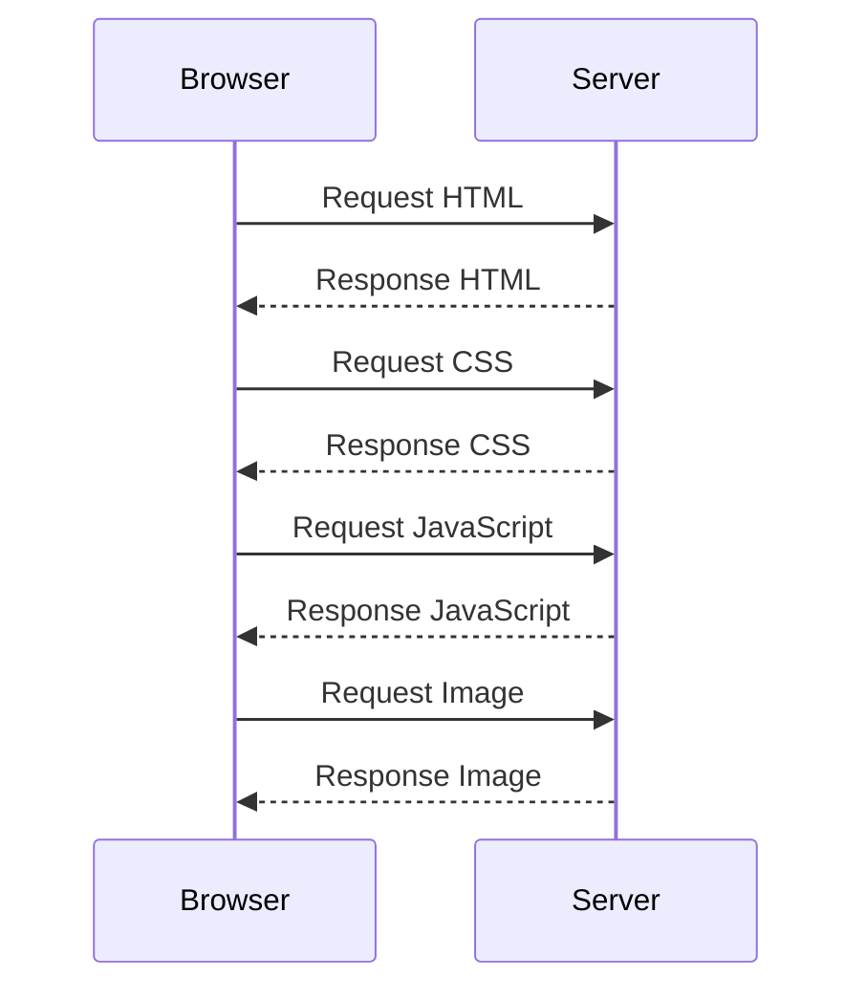

## 13.4 Analyzing Network Activity

In this section, we will delve into the crucial aspect of web development: analyzing network activity. Understanding how resources are loaded and how network requests are handled is essential for creating efficient and responsive web pages. We will explore the Network tab in browser developer tools, learn how to interpret the information it provides, and discuss strategies for optimizing network performance.

### Introduction to Network Activity

When you load a web page, your browser sends multiple requests to a server to fetch the resources needed to display the page. These resources can include HTML, CSS, JavaScript files, images, fonts, and more. Analyzing network activity helps you understand how these resources are loaded, identify any issues, and optimize the performance of your web page.

### Using the Network Tab in Developer Tools

Most modern browsers come equipped with developer tools that include a Network tab. This tab is a powerful tool for monitoring and analyzing network activity.

#### Accessing the Network Tab

To access the Network tab:

1. **Open Developer Tools**: Right-click on the web page and select "Inspect" or press `Ctrl+Shift+I` (Windows/Linux) or `Cmd+Option+I` (Mac).
2. **Navigate to the Network Tab**: Click on the "Network" tab at the top of the developer tools panel.

#### Overview of the Network Tab

The Network tab provides a detailed view of all network requests made by the browser. Here's what you can expect to see:

- **Request List**: A list of all network requests, including their URLs, methods (GET, POST, etc.), status codes, types (document, script, stylesheet, etc.), and sizes.
- **Timeline**: A visual representation of when each request was made and how long it took to complete.
- **Filters**: Options to filter requests by type, such as documents, stylesheets, scripts, images, etc.
- **Search**: A search bar to quickly find specific requests.

### Interpreting Network Information

Understanding the data displayed in the Network tab is key to diagnosing and resolving network-related issues.

#### Status Codes

HTTP status codes indicate the result of a network request:

- **200 OK**: The request was successful, and the resource was delivered.
- **301 Moved Permanently**: The resource has been moved to a new URL.
- **404 Not Found**: The requested resource could not be found.
- **500 Internal Server Error**: The server encountered an error.

#### Load Times

Load times are crucial for understanding the performance of your web page. The Network tab shows:

- **DNS Lookup**: Time taken to resolve the domain name.
- **Initial Connection**: Time taken to establish a connection with the server.
- **SSL/TLS**: Time taken for secure connection setup.
- **Time to First Byte (TTFB)**: Time taken for the server to send the first byte of the response.
- **Content Download**: Time taken to download the resource.

#### Identifying Failed Loads and Slow Requests

Failed resource loads and slow requests can significantly impact user experience. Here's how to identify them:

- **Failed Loads**: Look for requests with status codes like 404 or 500. These indicate that resources are missing or there are server issues.
- **Slow Requests**: Sort requests by load time to identify any that are taking longer than expected. Focus on optimizing these requests.

### Optimizing Network Performance

Optimizing network performance is crucial for creating fast and responsive web pages. Here are some strategies:

#### Using Caching

Caching allows browsers to store copies of resources locally, reducing the need to fetch them from the server on subsequent visits. Implement caching by setting appropriate HTTP headers, such as `Cache-Control` and `Expires`.

#### Optimizing Images

Images are often the largest resources on a web page. Optimize images by:

- **Compressing**: Use tools to reduce image file sizes without sacrificing quality.
- **Responsive Images**: Serve different image sizes based on the user's device.
- **Lazy Loading**: Load images only when they are about to enter the viewport.

#### Minifying and Concatenating Files

Reduce the size of CSS and JavaScript files by minifying them (removing whitespace and comments). Concatenate multiple files into a single file to reduce the number of requests.

#### Using Content Delivery Networks (CDNs)

CDNs distribute your content across multiple servers worldwide, reducing latency and improving load times for users in different locations.

#### Asynchronous Code and API Calls

Asynchronous code execution allows your web page to remain responsive while waiting for network requests to complete. Use JavaScript features like `async/await` and `Promises` to handle asynchronous operations efficiently.

### Practical Example: Analyzing Network Activity

Let's walk through a practical example of analyzing network activity using the Network tab.

```html
<!DOCTYPE html>
<html lang="en">
<head>
    <meta charset="UTF-8">
    <meta name="viewport" content="width=device-width, initial-scale=1.0">
    <title>Network Activity Example</title>
    <link rel="stylesheet" href="styles.css">
    <script src="script.js" defer></script>
</head>
<body>
    <h1>Welcome to My Web Page</h1>
    
    <p>This is a sample paragraph to demonstrate network activity.</p>
</body>
</html>
```

In this example, the HTML file references a CSS file, a JavaScript file, and an image. When you load this page, the browser makes network requests for each resource.

#### Steps to Analyze Network Activity

1. **Open the Network Tab**: Access the Network tab in developer tools.
2. **Reload the Page**: Refresh the page to capture network activity.
3. **Examine Requests**: Look at each request's status code, load time, and size.
4. **Identify Issues**: Check for any failed requests or slow load times.

### Try It Yourself

Experiment with the example above by:

- **Adding More Resources**: Include additional images or scripts and observe the changes in network activity.
- **Simulating Slow Network**: Use the Network tab's throttling feature to simulate slower network speeds and see how it affects load times.
- **Optimizing Resources**: Try compressing images or minifying CSS/JavaScript files and observe the impact on performance.

### Visualizing Network Activity

To better understand the flow of network requests, let's visualize it using a sequence diagram.



This diagram illustrates the sequence of requests and responses between the browser and server when loading a web page.

### Summary

Analyzing network activity is a vital skill for web developers. By understanding how resources are loaded and identifying potential issues, you can optimize your web page's performance and ensure a smooth user experience. Use the Network tab in developer tools to monitor requests, interpret status codes, and apply optimization strategies like caching, image compression, and asynchronous code execution.

### Further Reading

For more information on network activity and optimization, consider exploring the following resources:

- [MDN Web Docs: Network Monitor](https://developer.mozilla.org/en-US/docs/Tools/Network_Monitor)
- [Google Developers: Optimize Network Performance](https://developers.google.com/web/fundamentals/performance/optimizing-content-efficiency)
- [W3Schools: HTTP Status Codes](https://www.w3schools.com/tags/ref_httpmessages.asp)

## Quiz Time!



### What is the primary purpose of the Network tab in developer tools?

- [x] To monitor and analyze network requests and resource loading.
- [ ] To edit HTML and CSS directly in the browser.
- [ ] To debug JavaScript errors.
- [ ] To view the console log.

> **Explanation:** The Network tab is used to monitor and analyze network requests and resource loading, helping developers optimize performance.

### Which HTTP status code indicates a successful request?

- [x] 200 OK
- [ ] 404 Not Found
- [ ] 500 Internal Server Error
- [ ] 301 Moved Permanently

> **Explanation:** The 200 OK status code indicates that the request was successful and the resource was delivered.

### What does TTFB stand for?

- [x] Time to First Byte
- [ ] Total Time for Bytes
- [ ] Transfer Time for Bytes
- [ ] Time to Fetch Bytes

> **Explanation:** TTFB stands for Time to First Byte, which is the time taken for the server to send the first byte of the response.

### How can you optimize images for better network performance?

- [x] Compress images to reduce file size.
- [ ] Use larger image files for better quality.
- [ ] Load all images at once.
- [ ] Avoid using images on the web page.

> **Explanation:** Compressing images reduces file size, improving load times and network performance.

### What is the benefit of using a CDN?

- [x] Reduces latency by distributing content across multiple servers.
- [ ] Increases the number of network requests.
- [ ] Decreases the security of the website.
- [ ] Makes the website load slower.

> **Explanation:** A CDN reduces latency by distributing content across multiple servers, improving load times for users in different locations.

### Which tool can simulate slower network speeds in the Network tab?

- [x] Throttling feature
- [ ] Console log
- [ ] CSS editor
- [ ] JavaScript debugger

> **Explanation:** The throttling feature in the Network tab allows developers to simulate slower network speeds and test performance.

### What does minifying a file involve?

- [x] Removing whitespace and comments to reduce file size.
- [ ] Adding more comments for better readability.
- [ ] Increasing the file size for better quality.
- [ ] Splitting the file into multiple smaller files.

> **Explanation:** Minifying a file involves removing whitespace and comments to reduce file size, improving load times.

### Which HTTP header is used for caching?

- [x] Cache-Control
- [ ] Content-Type
- [ ] Accept-Language
- [ ] User-Agent

> **Explanation:** The Cache-Control header is used to specify caching policies for resources, helping to optimize performance.

### What is the role of asynchronous code in network requests?

- [x] Allows the web page to remain responsive while waiting for requests to complete.
- [ ] Blocks the web page until requests are completed.
- [ ] Increases the load time of the web page.
- [ ] Decreases the number of network requests.

> **Explanation:** Asynchronous code allows the web page to remain responsive while waiting for network requests to complete, improving user experience.

### True or False: The Network tab can only be used for analyzing image requests.

- [ ] True
- [x] False

> **Explanation:** False. The Network tab can be used to analyze all types of network requests, including HTML, CSS, JavaScript, images, and more.


