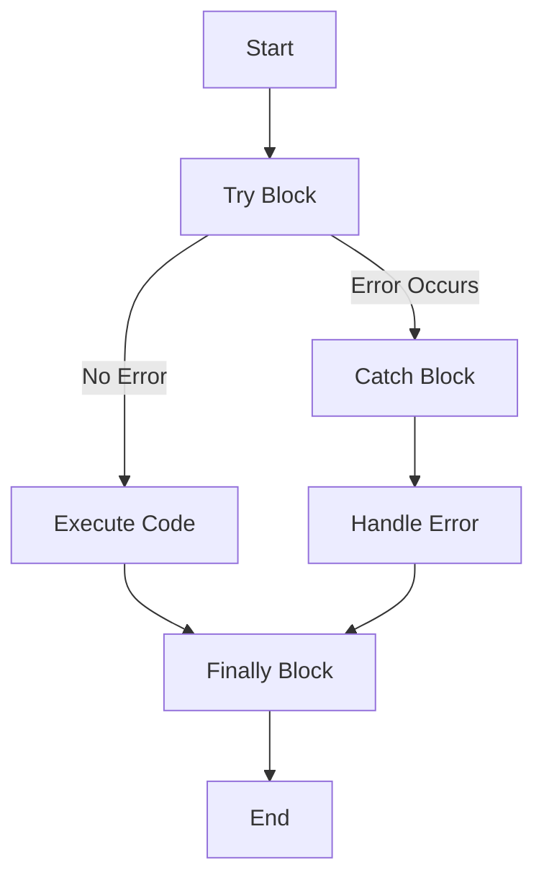

## 13.5 Error Handling in JavaScript

As we dive deeper into the world of JavaScript, it's crucial to understand how to handle errors effectively. Error handling is a fundamental skill for any developer, as it ensures that your applications run smoothly and can recover gracefully from unexpected situations. In this section, we'll explore the try-catch-finally construct, learn how to create custom error messages, and discuss best practices for managing exceptions in JavaScript.

### Understanding the try-catch-finally Construct

The try-catch-finally construct is a powerful tool in JavaScript that allows you to handle errors gracefully. Let's break down each part of this construct:

- **try**: The try block contains the code that may throw an error. This is where you place the code that you want to monitor for exceptions.

- **catch**: If an error occurs in the try block, the catch block is executed. This block receives an error object that contains information about the error. You can use this information to handle the error appropriately.

- **finally**: The finally block is optional and contains code that will run regardless of whether an error occurred. This is useful for cleanup tasks that need to be performed after the try and catch blocks.

Here's a simple example to illustrate how the try-catch-finally construct works:

```javascript
try {
    // Code that may throw an error
    let result = riskyOperation();
    console.log('Operation successful:', result);
} catch (error) {
    console.error('An error occurred:', error.message);
} finally {
    console.log('Cleanup tasks, if any, are performed here.');
}
```

In this example, `riskyOperation()` is a function that might throw an error. If an error occurs, the catch block logs the error message to the console. Regardless of whether an error occurred, the finally block executes, allowing you to perform any necessary cleanup.

### Handling Errors Gracefully

Handling errors gracefully means that your application can continue to function or fail in a controlled manner when an error occurs. Here are some strategies to achieve this:

1. **Log Errors Appropriately**: Use the console to log error messages for debugging purposes. This helps you understand what went wrong and where.

2. **Provide User-Friendly Messages**: Instead of displaying technical error messages to users, provide clear and concise messages that inform them of the issue without exposing sensitive information.

3. **Fallback Mechanisms**: Implement fallback mechanisms to ensure that your application can continue to operate even if a part of it fails. For example, if a network request fails, you might retry the request or provide cached data.

4. **Custom Error Handling**: Create custom error messages to provide more context about the error. This can be done by throwing new Error objects with descriptive messages.

Here's an example of creating a custom error message:

```javascript
function divide(a, b) {
    if (b === 0) {
        throw new Error('Division by zero is not allowed.');
    }
    return a / b;
}

try {
    let result = divide(10, 0);
    console.log('Result:', result);
} catch (error) {
    console.error('An error occurred:', error.message);
}
```

In this example, we define a `divide` function that throws a custom error if an attempt is made to divide by zero. The catch block then logs the custom error message.

### Importance of Not Exposing Sensitive Error Information

When handling errors, it's important to avoid exposing sensitive information to users. Error messages should be informative but not reveal details about the internal workings of your application. This is crucial for security reasons, as exposing too much information can make your application vulnerable to attacks.

To prevent this, follow these guidelines:

- **Sanitize Error Messages**: Ensure that error messages do not contain sensitive data such as file paths, database queries, or stack traces.

- **Use Generic Messages**: Provide generic error messages to users while logging detailed information for developers.

- **Validate User Input**: Always validate and sanitize user input to prevent errors caused by malicious data.

### Proactive Error Checking and Validation

Proactive error checking involves anticipating potential errors and implementing checks to prevent them. This approach can significantly reduce the number of runtime errors in your application. Here are some techniques for proactive error checking:

1. **Input Validation**: Validate user input to ensure it meets the expected format and constraints. This can prevent errors caused by invalid data.

2. **Type Checking**: Use type checking to ensure that variables and function arguments are of the expected type. This can prevent type-related errors.

3. **Boundary Checks**: Implement boundary checks to ensure that operations such as array indexing or mathematical calculations do not exceed valid limits.

4. **Error Handling in Promises**: When working with promises, use `.catch()` to handle errors. This ensures that any errors in asynchronous operations are caught and handled.

Here's an example of proactive error checking:

```javascript
function getUserAge(age) {
    if (typeof age !== 'number' || age < 0) {
        throw new Error('Invalid age. Age must be a non-negative number.');
    }
    return age;
}

try {
    let age = getUserAge('twenty');
    console.log('User age:', age);
} catch (error) {
    console.error('An error occurred:', error.message);
}
```

In this example, the `getUserAge` function checks if the input is a non-negative number. If not, it throws an error with a descriptive message.

### Visualizing Error Handling Flow

To better understand the flow of error handling in JavaScript, let's visualize it using a flowchart. This diagram will illustrate how the try-catch-finally construct works and how errors are handled.



**Diagram Description**: This flowchart represents the flow of the try-catch-finally construct. The process starts with the try block, where code is executed. If no error occurs, the code continues to the finally block. If an error occurs, the catch block handles the error before proceeding to the finally block. The finally block executes regardless of whether an error occurred.

### Encouraging Experimentation

Now that we've covered the basics of error handling in JavaScript, it's time to encourage you to experiment with the concepts we've discussed. Try modifying the code examples to see how different errors are handled. Here are some suggestions:

- Change the input values in the `divide` and `getUserAge` functions to trigger different errors.
- Add additional catch blocks to handle specific types of errors.
- Implement a retry mechanism for a network request that fails.

By experimenting with these concepts, you'll gain a deeper understanding of error handling and become more confident in writing robust JavaScript code.

### Key Takeaways

- The try-catch-finally construct is a powerful tool for handling errors in JavaScript.
- Graceful error handling involves logging errors, providing user-friendly messages, and implementing fallback mechanisms.
- Avoid exposing sensitive error information to users to enhance security.
- Proactive error checking and validation can prevent many runtime errors.
- Experimenting with error handling concepts will help reinforce your understanding and improve your coding skills.

### Further Reading

For more information on error handling in JavaScript, consider exploring the following resources:

- [MDN Web Docs: Error Handling](https://developer.mozilla.org/en-US/docs/Web/JavaScript/Guide/Control_flow_and_error_handling)
- [W3Schools: JavaScript Errors](https://www.w3schools.com/js/js_errors.asp)

## Quiz Time!



### What is the purpose of the try block in JavaScript?

- [x] To contain code that may throw an error
- [ ] To handle errors that occur
- [ ] To execute code regardless of errors
- [ ] To log error messages

> **Explanation:** The try block contains code that may throw an error, allowing you to monitor it for exceptions.

### What does the catch block do in error handling?

- [ ] It contains code that may throw an error
- [x] It handles errors that occur in the try block
- [ ] It executes code regardless of errors
- [ ] It logs error messages

> **Explanation:** The catch block handles errors that occur in the try block, allowing you to manage exceptions.

### What is the role of the finally block?

- [ ] To contain code that may throw an error
- [ ] To handle errors that occur
- [x] To execute code regardless of errors
- [ ] To log error messages

> **Explanation:** The finally block executes code regardless of whether an error occurred, making it useful for cleanup tasks.

### Why is it important to avoid exposing sensitive error information to users?

- [x] To enhance security and prevent vulnerabilities
- [ ] To make error messages more informative
- [ ] To simplify error handling
- [ ] To improve application performance

> **Explanation:** Avoiding exposure of sensitive error information enhances security by preventing potential vulnerabilities.

### What is proactive error checking?

- [x] Anticipating potential errors and implementing checks to prevent them
- [ ] Handling errors after they occur
- [ ] Logging error messages for debugging
- [ ] Providing user-friendly error messages

> **Explanation:** Proactive error checking involves anticipating potential errors and implementing checks to prevent them.

### How can you create a custom error message in JavaScript?

- [ ] By using the finally block
- [x] By throwing a new Error object with a descriptive message
- [ ] By logging the error to the console
- [ ] By catching the error in the catch block

> **Explanation:** You can create a custom error message by throwing a new Error object with a descriptive message.

### What is the benefit of providing user-friendly error messages?

- [x] To inform users of issues without exposing sensitive information
- [ ] To make error handling more complex
- [ ] To improve application performance
- [ ] To simplify error logging

> **Explanation:** User-friendly error messages inform users of issues without exposing sensitive information, enhancing security and user experience.

### What is the purpose of input validation?

- [x] To ensure user input meets expected format and constraints
- [ ] To handle errors after they occur
- [ ] To log error messages for debugging
- [ ] To provide user-friendly error messages

> **Explanation:** Input validation ensures user input meets expected format and constraints, preventing errors caused by invalid data.

### What should you do if a network request fails?

- [ ] Log the error and stop the application
- [x] Implement a retry mechanism or provide cached data
- [ ] Display a technical error message to the user
- [ ] Ignore the error and continue

> **Explanation:** Implementing a retry mechanism or providing cached data ensures the application can continue to operate even if a network request fails.

### True or False: The finally block is optional in the try-catch-finally construct.

- [x] True
- [ ] False

> **Explanation:** The finally block is optional in the try-catch-finally construct, and it executes code regardless of whether an error occurred.


