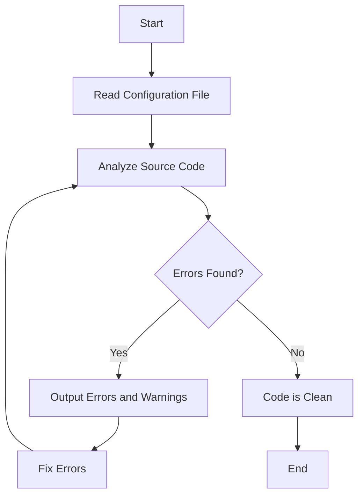

## 13.6 Validating Code with Linters

In the world of web development, writing clean and consistent code is crucial for maintaining and scaling projects. Linters are essential tools that help developers achieve this by automatically checking code for errors, enforcing coding standards, and improving overall code quality. In this section, we'll explore what linters are, how they work, and how you can integrate them into your development workflow to enhance your JavaScript and CSS projects.

### What is a Linter?

A linter is a static code analysis tool that examines your source code for potential errors, stylistic inconsistencies, and deviations from coding standards. Linters help developers catch bugs early, enforce best practices, and maintain a uniform code style across a project. By doing so, they make the codebase more readable and easier to maintain.

#### Why Use Linters?

- **Error Detection**: Linters can catch syntax errors and potential bugs that might be missed during manual code reviews.
- **Coding Standards**: They enforce consistent coding styles, making it easier for teams to collaborate on large projects.
- **Code Quality**: Linters promote best practices, leading to cleaner and more efficient code.
- **Time-Saving**: By automating code reviews, linters save time and reduce the need for manual checks.

### Introducing ESLint for JavaScript

ESLint is one of the most popular linters for JavaScript. It is highly configurable and can be tailored to enforce specific coding standards and practices. ESLint can be integrated into various development environments, making it a versatile tool for developers.

#### Setting Up ESLint

To start using ESLint, you'll need to install it in your project. Follow these steps to set up ESLint:

1. **Install ESLint**: Use npm (Node Package Manager) to install ESLint in your project directory.

   ```bash
   npm install eslint --save-dev
   ```

2. **Initialize ESLint**: Run the following command to create an ESLint configuration file.

   ```bash
   npx eslint --init
   ```

   This command will prompt you with a series of questions to set up your configuration file. You can choose to enforce popular style guides like Airbnb or Google, or create a custom configuration.

3. **Create a Configuration File**: ESLint uses a configuration file (e.g., `.eslintrc.json`) to define the rules and settings for your project. Here's an example configuration:

   ```json
   {
     "env": {
       "browser": true,
       "es2021": true
     },
     "extends": "eslint:recommended",
     "parserOptions": {
       "ecmaVersion": 12,
       "sourceType": "module"
     },
     "rules": {
       "indent": ["error", 2],
       "linebreak-style": ["error", "unix"],
       "quotes": ["error", "single"],
       "semi": ["error", "always"]
     }
   }
   ```

   - **env**: Specifies the environments your code is designed to run in (e.g., browser, Node.js).
   - **extends**: Allows you to extend existing configurations.
   - **parserOptions**: Defines the ECMAScript version and module type.
   - **rules**: Lists the specific rules you want to enforce.

#### Running ESLint

Once ESLint is configured, you can run it on your JavaScript files to check for errors and style issues.

```bash
npx eslint yourfile.js
```

ESLint will output any errors or warnings it finds, along with suggestions for fixing them.

#### Integrating ESLint into Your Workflow

To make the most of ESLint, integrate it into your development workflow. Here are some ways to do that:

- **Code Editor Integration**: Most modern code editors, like Visual Studio Code, have extensions for ESLint that provide real-time feedback as you write code.
- **Pre-commit Hooks**: Use tools like Husky to run ESLint checks before committing code to your version control system.
- **Continuous Integration**: Incorporate ESLint into your CI/CD pipeline to ensure code quality across all stages of development.

### Introducing Stylelint for CSS

For CSS, Stylelint is a powerful tool that helps maintain consistent styling and catch errors in your stylesheets. Like ESLint, Stylelint is highly configurable and can be tailored to suit your project's needs.

#### Setting Up Stylelint

To use Stylelint, you'll need to install it and create a configuration file:

1. **Install Stylelint**: Use npm to install Stylelint in your project directory.

   ```bash
   npm install stylelint --save-dev
   ```

2. **Create a Configuration File**: Stylelint uses a configuration file (e.g., `.stylelintrc.json`) to define the rules and settings for your project. Here's an example configuration:

   ```json
   {
     "extends": "stylelint-config-standard",
     "rules": {
       "indentation": 2,
       "string-quotes": "single",
       "color-hex-case": "lower"
     }
   }
   ```

   - **extends**: Allows you to use a pre-defined set of rules, such as `stylelint-config-standard`.
   - **rules**: Lists the specific rules you want to enforce.

#### Running Stylelint

To check your CSS files with Stylelint, run the following command:

```bash
npx stylelint "**/*.css"
```

Stylelint will output any errors or warnings it finds, along with suggestions for fixing them.

#### Integrating Stylelint into Your Workflow

Similar to ESLint, you can integrate Stylelint into your development workflow:

- **Code Editor Integration**: Use extensions for your code editor to get real-time feedback on your CSS.
- **Pre-commit Hooks**: Run Stylelint checks before committing code to ensure consistent styling.
- **Continuous Integration**: Add Stylelint to your CI/CD pipeline to enforce styling standards across all stages of development.

### Configuring Linters for Project-Specific Guidelines

Both ESLint and Stylelint are highly customizable, allowing you to tailor their rules to match your project's specific guidelines. This flexibility ensures that linters can adapt to different coding styles and practices.

#### Customizing ESLint Rules

To customize ESLint rules, modify the `rules` section of your configuration file. For example, if you want to enforce a specific indentation style or disallow the use of console statements, you can adjust the rules accordingly:

```json
"rules": {
  "indent": ["error", 4],
  "no-console": "warn"
}
```

- **indent**: Sets the number of spaces for indentation.
- **no-console**: Issues a warning when `console` statements are used.

#### Customizing Stylelint Rules

Similarly, you can customize Stylelint rules in the `rules` section of your configuration file. For example, if you want to enforce a specific color format or require a newline at the end of files, you can adjust the rules accordingly:

```json
"rules": {
  "color-hex-length": "short",
  "no-missing-end-of-source-newline": true
}
```

- **color-hex-length**: Enforces short or long hex color codes.
- **no-missing-end-of-source-newline**: Ensures a newline at the end of files.

### Encouraging the Adoption of Linters

Adopting linters in your development process can significantly improve code quality and consistency. Here are some tips to encourage their use:

- **Educate Your Team**: Provide training and resources to help your team understand the benefits of linters and how to use them effectively.
- **Automate Linting**: Integrate linters into your development tools and processes to make them an automatic part of your workflow.
- **Lead by Example**: Encourage team leaders and senior developers to use linters and promote their benefits.
- **Celebrate Success**: Acknowledge and reward team members who consistently produce high-quality, linted code.

### Try It Yourself

To get hands-on experience with linters, try setting up ESLint and Stylelint in a small project. Experiment with different configurations and see how they affect your code. Here are some suggestions:

- **Modify Rules**: Change some of the rules in your configuration files and observe how they impact your code.
- **Test Edge Cases**: Write code that intentionally breaks the rules and see how linters respond.
- **Integrate with Your Editor**: Install ESLint and Stylelint extensions in your code editor and experience real-time feedback.

### Visualizing the Linting Process

To better understand how linters work, let's visualize the linting process using a flowchart. This diagram illustrates the steps involved in linting a file and handling errors.



**Diagram Description**: The flowchart shows the process of linting a file, starting with reading the configuration file, analyzing the source code, checking for errors, and either outputting errors or confirming that the code is clean.

### References and Further Reading

To deepen your understanding of linters and their benefits, consider exploring the following resources:

- [ESLint Documentation](https://eslint.org/docs/user-guide/getting-started)
- [Stylelint Documentation](https://stylelint.io/user-guide/get-started)
- [MDN Web Docs on Linters](https://developer.mozilla.org/en-US/docs/MDN/Guidelines/Code_guidelines/Tools/Linters)

### Key Takeaways

- Linters are essential tools for maintaining code quality and consistency.
- ESLint and Stylelint are popular linters for JavaScript and CSS, respectively.
- Integrating linters into your workflow can save time and reduce errors.
- Customizing linter rules allows you to enforce project-specific guidelines.
- Encouraging the use of linters can lead to better code and more efficient development processes.

## Quiz Time!



### What is the primary purpose of a linter?

- [x] To catch syntax errors and enforce coding standards
- [ ] To compile code into machine language
- [ ] To execute code in a browser
- [ ] To manage project dependencies

> **Explanation:** Linters are used to catch syntax errors and enforce coding standards, ensuring code quality and consistency.

### Which tool is commonly used for linting JavaScript code?

- [x] ESLint
- [ ] Stylelint
- [ ] Prettier
- [ ] Babel

> **Explanation:** ESLint is a popular tool for linting JavaScript code, helping developers catch errors and enforce coding standards.

### How can you install ESLint in a project?

- [x] By running `npm install eslint --save-dev`
- [ ] By downloading a zip file from the ESLint website
- [ ] By using a browser extension
- [ ] By writing a custom script

> **Explanation:** ESLint can be installed in a project using npm with the command `npm install eslint --save-dev`.

### What is the purpose of the `.eslintrc.json` file?

- [x] To define the rules and settings for ESLint in a project
- [ ] To store project dependencies
- [ ] To compile JavaScript code
- [ ] To manage version control

> **Explanation:** The `.eslintrc.json` file is used to define the rules and settings for ESLint in a project.

### Which of the following is a rule you might configure in ESLint?

- [x] "indent": ["error", 2]
- [ ] "color-hex-case": "lower"
- [ ] "font-size": "16px"
- [ ] "background-color": "blue"

> **Explanation:** The rule `"indent": ["error", 2]` is an example of a rule you might configure in ESLint to enforce a specific indentation style.

### What command can you use to run ESLint on a JavaScript file?

- [x] `npx eslint yourfile.js`
- [ ] `node yourfile.js`
- [ ] `npm start`
- [ ] `git commit`

> **Explanation:** The command `npx eslint yourfile.js` is used to run ESLint on a JavaScript file and check for errors.

### Which tool is commonly used for linting CSS code?

- [x] Stylelint
- [ ] ESLint
- [ ] Prettier
- [ ] Babel

> **Explanation:** Stylelint is a popular tool for linting CSS code, helping developers catch errors and enforce styling standards.

### How can you integrate linters into your development workflow?

- [x] By using code editor extensions and pre-commit hooks
- [ ] By writing all code in a single file
- [ ] By avoiding the use of version control
- [ ] By manually reviewing code for errors

> **Explanation:** Integrating linters into your development workflow can be achieved by using code editor extensions and pre-commit hooks.

### What is the benefit of customizing linter rules?

- [x] To enforce project-specific coding guidelines
- [ ] To make code harder to read
- [ ] To reduce code performance
- [ ] To increase file size

> **Explanation:** Customizing linter rules allows you to enforce project-specific coding guidelines, ensuring consistency and quality.

### True or False: Linters can help improve code quality and consistency.

- [x] True
- [ ] False

> **Explanation:** Linters are designed to help improve code quality and consistency by catching errors and enforcing coding standards.


