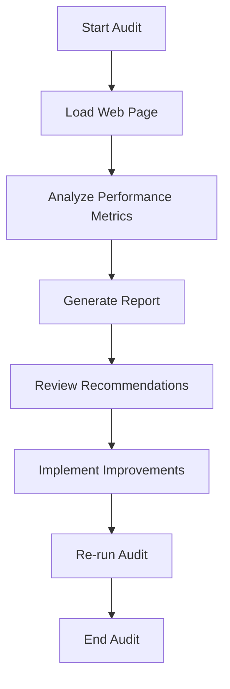

## 13.7 Performance Profiling

As we continue our journey into web development, it's essential to not only create functional and visually appealing web pages but also ensure they perform efficiently. Performance profiling is a critical skill that helps us measure and improve the speed and responsiveness of our web pages. In this section, we'll explore how to use developer tools for performance profiling, identify common bottlenecks, and apply optimization techniques to enhance the user experience.

### Understanding Performance Profiling

Performance profiling involves analyzing the behavior of a web page to identify areas that may cause slowdowns or inefficiencies. By understanding how our code executes and how resources are utilized, we can make informed decisions to optimize performance. Let's start by exploring the tools available for performance profiling.

### Using the Performance Tab in Developer Tools

Modern browsers come equipped with powerful developer tools that include a Performance tab. This tool allows us to record and analyze the performance of our web pages. Let's walk through the process of using the Performance tab.

#### Recording a Performance Profile

1. **Open Developer Tools**: In most browsers, you can open developer tools by pressing `F12` or right-clicking on the page and selecting "Inspect".

2. **Navigate to the Performance Tab**: Once the developer tools are open, click on the "Performance" tab.

3. **Start Recording**: Click the "Record" button to begin capturing a performance profile. This will start recording various metrics as you interact with the page.

4. **Interact with the Page**: Perform actions on the page that you want to analyze, such as clicking buttons, scrolling, or loading new content.

5. **Stop Recording**: Once you've completed the interactions, click the "Stop" button to end the recording.

6. **Analyze the Results**: The recorded profile will display a timeline of events, including scripting, rendering, and painting activities.

#### Analyzing Performance Profiles

The performance profile provides a wealth of information about how your page is performing. Here are some key areas to focus on:

- **Main Thread Activity**: This shows the time spent executing JavaScript, handling events, and performing layout calculations. Look for long-running scripts that may block the main thread.

- **Rendering and Painting**: These sections indicate how much time is spent rendering and painting elements on the screen. Frequent reflows and repaints can slow down the page.

- **Network Activity**: This displays the time taken to load resources such as images, scripts, and stylesheets. Large or numerous requests can impact load times.

- **Frames per Second (FPS)**: This metric indicates the smoothness of animations and interactions. Aim for a consistent 60 FPS for a smooth user experience.

### Identifying Common Performance Bottlenecks

Performance bottlenecks can arise from various sources. Let's explore some common issues and how to identify them using performance profiling.

#### Long-Running Scripts

Scripts that take a long time to execute can block the main thread, causing the page to become unresponsive. Look for functions or loops that consume significant CPU time. Consider breaking them into smaller tasks or using `setTimeout()` to defer execution.

```javascript
// Example of breaking a long-running loop into smaller tasks
function processLargeArray(array) {
  const batchSize = 100;
  let index = 0;

  function processBatch() {
    const end = Math.min(index + batchSize, array.length);
    for (; index < end; index++) {
      // Process each item
    }
    if (index < array.length) {
      setTimeout(processBatch, 0); // Defer next batch
    }
  }

  processBatch();
}
```

#### Layout Thrashing

Layout thrashing occurs when multiple DOM reads and writes are interleaved, causing excessive reflows. Minimize layout thrashing by batching DOM reads and writes together.

```javascript
// Example of minimizing layout thrashing
function updateElements() {
  const elements = document.querySelectorAll('.item');
  const heights = Array.from(elements).map(el => el.offsetHeight); // Batch read

  elements.forEach((el, index) => {
    el.style.height = `${heights[index] + 10}px`; // Batch write
  });
}
```

#### Large or Inefficient DOM

A large or complex DOM can slow down rendering and interactions. Use the Elements tab in developer tools to inspect the DOM structure and identify unnecessary elements.

#### Excessive Network Requests

Too many network requests or large resources can delay page load times. Use the Network tab to analyze requests and optimize by compressing files, using lazy loading, or combining resources.

### Tips for Optimizing Performance

Now that we've identified common bottlenecks, let's explore some strategies for optimizing web page performance.

#### Minimize Reflows and Repaints

- **Batch DOM Updates**: Group multiple DOM changes together to reduce reflows.
- **Use CSS Transitions**: Apply CSS transitions for smooth animations instead of JavaScript.
- **Avoid Layout-Triggering Properties**: Minimize the use of properties like `offsetWidth` and `offsetHeight` that trigger reflows.

#### Optimize JavaScript Execution

- **Debounce Events**: Use debouncing to limit the frequency of event handlers, such as scroll or resize events.

```javascript
// Example of debouncing a scroll event
function debounce(func, wait) {
  let timeout;
  return function(...args) {
    clearTimeout(timeout);
    timeout = setTimeout(() => func.apply(this, args), wait);
  };
}

window.addEventListener('scroll', debounce(() => {
  console.log('Scroll event debounced!');
}, 200));
```

- **Use Web Workers**: Offload heavy computations to Web Workers to keep the main thread responsive.

#### Optimize Network Performance

- **Compress Resources**: Use gzip or Brotli compression to reduce file sizes.
- **Implement Caching**: Leverage browser caching to store resources locally.
- **Use a Content Delivery Network (CDN)**: Distribute resources across multiple servers for faster delivery.

### Using Lighthouse for Performance Audits

Lighthouse is an open-source tool that provides automated performance audits for web pages. It evaluates various aspects of performance and provides actionable recommendations.

#### Running a Lighthouse Audit

1. **Open Developer Tools**: Access the developer tools in your browser.

2. **Navigate to the Lighthouse Tab**: Click on the "Lighthouse" tab.

3. **Configure the Audit**: Select the categories you want to audit, such as Performance, Accessibility, and SEO.

4. **Run the Audit**: Click the "Generate report" button to start the audit.

5. **Review the Results**: Lighthouse will provide a detailed report with scores and recommendations for improvement.

### Visualizing Performance with Diagrams

To better understand the concepts of performance profiling, let's use a diagram to visualize the flow of a performance audit using Lighthouse.



**Diagram Description**: This flowchart illustrates the process of conducting a performance audit using Lighthouse. It begins with starting the audit, loading the web page, analyzing performance metrics, generating a report, reviewing recommendations, implementing improvements, and re-running the audit for verification.

### Try It Yourself

Now that we've covered the basics of performance profiling, it's time to put your skills to the test. Try recording a performance profile of your web page using the developer tools and identify any bottlenecks. Experiment with the optimization techniques discussed in this section and observe the improvements.

### Key Takeaways

- Performance profiling helps identify and resolve bottlenecks in web pages.
- Use the Performance tab in developer tools to record and analyze profiles.
- Common bottlenecks include long-running scripts, layout thrashing, and excessive network requests.
- Optimize performance by minimizing reflows, debouncing events, and compressing resources.
- Lighthouse provides automated performance audits and recommendations.

### Further Reading

For more information on performance profiling and optimization, consider exploring the following resources:

- [MDN Web Docs: Performance](https://developer.mozilla.org/en-US/docs/Web/Performance)
- [Google Developers: Optimize Website Speed](https://developers.google.com/speed)
- [Web.dev: Performance](https://web.dev/performance/)

By mastering performance profiling, you'll be able to create web pages that are not only functional and visually appealing but also fast and responsive, providing an excellent user experience.

## Quiz Time!



### What is the primary purpose of performance profiling in web development?

- [x] To identify and resolve performance bottlenecks
- [ ] To add new features to a web page
- [ ] To improve the visual design of a web page
- [ ] To increase the number of visitors to a web page

> **Explanation:** Performance profiling is used to identify and resolve performance bottlenecks, ensuring web pages run efficiently.

### Which tool in developer tools is used for performance profiling?

- [ ] Network tab
- [x] Performance tab
- [ ] Elements tab
- [ ] Console tab

> **Explanation:** The Performance tab in developer tools is specifically designed for performance profiling.

### What is layout thrashing?

- [ ] A method to improve CSS styling
- [x] Excessive reflows caused by interleaved DOM reads and writes
- [ ] A technique for optimizing JavaScript execution
- [ ] A way to enhance network performance

> **Explanation:** Layout thrashing occurs when multiple DOM reads and writes are interleaved, causing excessive reflows.

### How can you minimize reflows and repaints?

- [x] Batch DOM updates together
- [ ] Use more JavaScript animations
- [ ] Increase the number of CSS properties
- [ ] Add more HTML elements

> **Explanation:** Batching DOM updates together reduces the number of reflows and repaints, improving performance.

### What is the purpose of debouncing events?

- [ ] To increase the frequency of event handlers
- [x] To limit the frequency of event handlers
- [ ] To add more events to a page
- [ ] To remove events from a page

> **Explanation:** Debouncing is used to limit the frequency of event handlers, preventing excessive execution.

### Which tool provides automated performance audits and recommendations?

- [ ] Console
- [ ] Network tab
- [ ] Elements tab
- [x] Lighthouse

> **Explanation:** Lighthouse is an open-source tool that provides automated performance audits and recommendations.

### What is the benefit of using a Content Delivery Network (CDN)?

- [x] Faster delivery of resources
- [ ] Increased file sizes
- [ ] More network requests
- [ ] Slower page load times

> **Explanation:** A CDN distributes resources across multiple servers, resulting in faster delivery and improved performance.

### What does FPS stand for in performance profiling?

- [ ] Frames per Script
- [x] Frames per Second
- [ ] Files per Second
- [ ] Functions per Script

> **Explanation:** FPS stands for Frames per Second, indicating the smoothness of animations and interactions.

### Which of the following is a common performance bottleneck?

- [ ] Small DOM size
- [ ] Minimal network requests
- [x] Long-running scripts
- [ ] Efficient CSS styling

> **Explanation:** Long-running scripts can block the main thread, causing performance bottlenecks.

### True or False: Performance profiling is only necessary for large web applications.

- [ ] True
- [x] False

> **Explanation:** Performance profiling is beneficial for all web pages, regardless of size, to ensure optimal performance.


