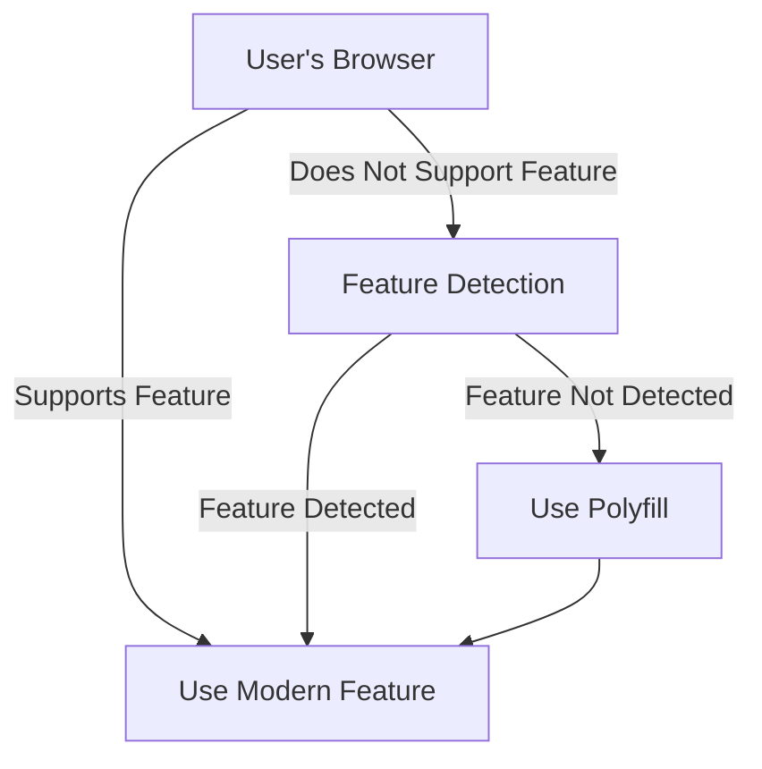

## 13.8 Resolving Compatibility Issues

As we venture into the world of web development, one of the crucial challenges we face is ensuring that our web pages work seamlessly across different browsers and devices. This section will guide you through understanding and resolving compatibility issues, ensuring that your web page looks and functions as intended for all users.

### Understanding Compatibility Issues

Compatibility issues arise when web pages do not display or function consistently across different web browsers or devices. This inconsistency can be due to various reasons, such as differences in how browsers interpret HTML, CSS, and JavaScript, or the lack of support for certain features in some browsers.

#### Common Compatibility Issues

1. **CSS Properties**: Some CSS properties may not be supported by all browsers, leading to differences in layout and styling.
2. **JavaScript Features**: New JavaScript features may not be available in older browsers, causing scripts to fail.
3. **HTML Elements**: Certain HTML5 elements might not be recognized by older browsers.
4. **Responsive Design**: Variations in screen sizes and resolutions can affect how a web page is displayed on different devices.

### Feature Detection and Polyfills

To tackle compatibility issues, we can use feature detection and polyfills. These techniques help ensure that our web pages work even if some features are not supported by a user's browser.

#### Feature Detection

Feature detection involves checking whether a browser supports a particular feature before using it. This can be done using simple JavaScript checks.

```javascript
// Check if the browser supports the 'fetch' API
if ('fetch' in window) {
    // Use fetch API
    fetch('/api/data')
        .then(response => response.json())
        .then(data => console.log(data));
} else {
    // Fallback code for older browsers
    console.log('Fetch API not supported, using XMLHttpRequest instead.');
}
```

#### Polyfills

Polyfills are scripts that replicate the functionality of modern features in older browsers that do not support them. They allow developers to use modern features without worrying about compatibility issues.

For example, if you want to use the `Promise` object in a browser that doesn't support it, you can include a polyfill like this:

```html
<script src="https://cdn.jsdelivr.net/npm/promise-polyfill@8/dist/polyfill.min.js"></script>
```

### Using Modernizr for Feature Detection

Modernizr is a popular JavaScript library that simplifies feature detection. It automatically tests for a wide range of features and adds classes to the `<html>` element, which you can use to apply different styles or scripts based on feature support.

#### Setting Up Modernizr

To use Modernizr, include it in your project:

```html
<script src="https://cdnjs.cloudflare.com/ajax/libs/modernizr/3.11.2/modernizr.min.js"></script>
```

#### Example: Using Modernizr

```javascript
// Check if the browser supports CSS Grid
if (Modernizr.cssgrid) {
    console.log('CSS Grid is supported!');
} else {
    console.log('CSS Grid is not supported. Applying fallback styles.');
}
```

### Vendor Prefixes in CSS

Vendor prefixes are a way to ensure that CSS properties work across different browsers. They are added to CSS properties to enable experimental features in specific browsers.

#### Common Vendor Prefixes

- `-webkit-`: Used for Chrome, Safari, and newer versions of Opera.
- `-moz-`: Used for Firefox.
- `-ms-`: Used for Internet Explorer and Edge.
- `-o-`: Used for older versions of Opera.

#### Example: Using Vendor Prefixes

```css
/* Using vendor prefixes for the 'transform' property */
.element {
    -webkit-transform: rotate(45deg);
    -moz-transform: rotate(45deg);
    -ms-transform: rotate(45deg);
    -o-transform: rotate(45deg);
    transform: rotate(45deg);
}
```

### Progressive Enhancement

Progressive enhancement is a development approach that focuses on building a basic level of user experience that works for everyone, and then enhancing it for those with more advanced browsers.

#### Steps for Progressive Enhancement

1. **Basic Content**: Start with a simple, semantic HTML structure that provides the core content and functionality.
2. **Basic Styling**: Add basic CSS to enhance the visual presentation.
3. **Advanced Features**: Use JavaScript and advanced CSS to add interactivity and enhance the user experience for capable browsers.

#### Example: Progressive Enhancement

```html
<!DOCTYPE html>
<html lang="en">
<head>
    <meta charset="UTF-8">
    <meta name="viewport" content="width=device-width, initial-scale=1.0">
    <title>Progressive Enhancement Example</title>
    <style>
        /* Basic styling */
        body {
            font-family: Arial, sans-serif;
            padding: 20px;
        }
        .enhanced {
            color: green;
        }
    </style>
</head>
<body>
    <h1>Welcome to My Web Page</h1>
    <p>This is a basic web page with progressive enhancement.</p>

    <script>
        // Enhance the page with JavaScript
        document.querySelector('p').classList.add('enhanced');
    </script>
</body>
</html>
```

### Try It Yourself

Experiment with the code examples provided. Try modifying the feature detection script to check for other features like `localStorage` or `Service Workers`. You can also practice using vendor prefixes by applying them to other CSS properties.

### Visualizing Compatibility Solutions

Let's use a diagram to illustrate how feature detection and polyfills work together to resolve compatibility issues.



**Diagram Description**: This flowchart shows the decision-making process for using modern features. If a browser supports the feature, it is used directly. If not, feature detection checks for support, and a polyfill is used if the feature is not detected.

### References and Further Reading

- [MDN Web Docs: Browser Compatibility](https://developer.mozilla.org/en-US/docs/Web/Guide/CSS/Cross_browser_compatibility)
- [Can I use...](https://caniuse.com/) - Check browser support for web technologies.
- [Modernizr Documentation](https://modernizr.com/docs)

### Engagement and Reinforcement

- **Question**: What is the difference between feature detection and polyfills?
- **Challenge**: Try creating your own feature detection script for a CSS property like `grid-template-columns`.
- **Exercise**: Use Modernizr to check for support of the `flexbox` layout in your browser and apply a fallback style if it's not supported.

### Key Takeaways

- **Feature Detection**: Always check if a feature is supported before using it.
- **Polyfills**: Use polyfills to add support for modern features in older browsers.
- **Vendor Prefixes**: Apply vendor prefixes to CSS properties to ensure cross-browser compatibility.
- **Progressive Enhancement**: Build a basic experience first and enhance it for more capable browsers.

By understanding and applying these techniques, you can create web pages that are accessible and functional for a wide range of users, regardless of their browser or device.

## Quiz Time!



### What is feature detection?

- [x] Checking if a browser supports a particular feature before using it.
- [ ] Using a script to add support for a feature in older browsers.
- [ ] Adding vendor prefixes to CSS properties.
- [ ] Building a basic level of user experience.

> **Explanation:** Feature detection involves checking if a browser supports a feature before using it, ensuring compatibility.

### What is a polyfill?

- [x] A script that replicates the functionality of modern features in older browsers.
- [ ] A method of checking for feature support.
- [ ] A CSS property with vendor prefixes.
- [ ] A development approach focusing on basic user experience.

> **Explanation:** Polyfills are scripts that provide modern feature functionality in browsers that do not support them.

### Which of the following is a vendor prefix for Firefox?

- [ ] -webkit-
- [x] -moz-
- [ ] -ms-
- [ ] -o-

> **Explanation:** The `-moz-` prefix is used for Firefox to enable experimental CSS features.

### What is the purpose of progressive enhancement?

- [x] To build a basic level of user experience and enhance it for advanced browsers.
- [ ] To ensure all features work in all browsers.
- [ ] To use only modern features in web development.
- [ ] To apply vendor prefixes to CSS properties.

> **Explanation:** Progressive enhancement focuses on providing a basic experience first, then enhancing it for more capable browsers.

### How can you check if a browser supports the `fetch` API?

- [x] Use `'fetch' in window`.
- [ ] Use `Modernizr.fetch`.
- [ ] Use a polyfill.
- [ ] Use vendor prefixes.

> **Explanation:** Checking `'fetch' in window` is a way to detect if the `fetch` API is supported.

### What is the role of Modernizr?

- [x] To simplify feature detection.
- [ ] To add vendor prefixes to CSS properties.
- [ ] To provide polyfills for unsupported features.
- [ ] To enhance user experience progressively.

> **Explanation:** Modernizr is a library that simplifies the process of feature detection.

### Which of the following is an example of a polyfill?

- [x] A script that adds `Promise` support in older browsers.
- [ ] A CSS property with vendor prefixes.
- [ ] A method of checking for feature support.
- [ ] A development approach focusing on basic user experience.

> **Explanation:** A polyfill is a script that provides modern feature functionality in browsers that do not support them.

### What is the purpose of vendor prefixes?

- [x] To enable experimental CSS features in specific browsers.
- [ ] To check if a browser supports a feature.
- [ ] To add support for modern features in older browsers.
- [ ] To build a basic level of user experience.

> **Explanation:** Vendor prefixes are used to enable experimental CSS features in specific browsers.

### What is the first step in progressive enhancement?

- [x] Start with a simple, semantic HTML structure.
- [ ] Add advanced JavaScript features.
- [ ] Use polyfills for unsupported features.
- [ ] Apply vendor prefixes to CSS properties.

> **Explanation:** The first step in progressive enhancement is to start with a simple, semantic HTML structure.

### True or False: Polyfills are used to check if a feature is supported by a browser.

- [ ] True
- [x] False

> **Explanation:** Polyfills are not used to check for feature support; they provide functionality for unsupported features.


