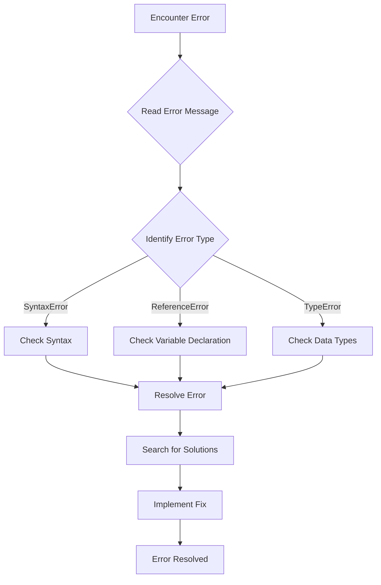

## 13.9 Reading Documentation and Error Messages

In the journey of building web pages with JavaScript, encountering errors is inevitable. However, these errors are not roadblocks but stepping stones to deeper understanding and mastery. In this section, we will explore how to effectively read documentation and interpret error messages to troubleshoot and solve problems efficiently.

### The Value of Official Documentation

Official documentation is an invaluable resource for any developer. It provides detailed information about programming languages, libraries, and frameworks. For JavaScript developers, the [MDN Web Docs](https://developer.mozilla.org/en-US/docs/Web/JavaScript) is a comprehensive and authoritative source.

#### Why Use Official Documentation?

1. **Accuracy and Reliability**: Official documentation is maintained by the creators or maintainers of the language or tool, ensuring the information is accurate and up-to-date.
2. **Comprehensive Coverage**: It covers all aspects of the language or tool, from basic syntax to advanced features.
3. **Examples and Use Cases**: Documentation often includes examples that demonstrate how to use various features effectively.

#### How to Navigate Documentation

- **Start with the Basics**: Begin by familiarizing yourself with the structure of the documentation. Look for sections like "Getting Started," "Tutorials," or "Guides."
- **Use the Search Function**: If you're looking for specific information, use the search bar to find relevant sections quickly.
- **Bookmark Important Pages**: As you explore, bookmark pages that you find particularly useful for easy access later.

### Interpreting Error Messages

Error messages are your first clue when something goes wrong in your code. Learning to read and understand these messages is crucial for debugging.

#### Common JavaScript Error Messages

1. **SyntaxError**: Indicates a mistake in the code's syntax.
   - Example: `SyntaxError: Unexpected token ;`
   - Solution: Check for missing or extra characters like semicolons or brackets.

2. **ReferenceError**: Occurs when trying to access a variable that hasn't been declared.
   - Example: `ReferenceError: myVariable is not defined`
   - Solution: Ensure the variable is declared before it's used.

3. **TypeError**: Happens when a value is not of the expected type.
   - Example: `TypeError: undefined is not a function`
   - Solution: Check if you're calling a function on a variable that isn't a function.

#### Steps to Interpret Error Messages

- **Read the Message Carefully**: Error messages usually contain the type of error, a brief description, and the line number where it occurred.
- **Identify the Error Type**: Knowing whether it's a SyntaxError, ReferenceError, or TypeError can guide your troubleshooting.
- **Locate the Error**: Use the line number provided to find the error in your code.
- **Understand the Context**: Consider what your code is trying to do at the point of the error.

#### Example: Debugging a TypeError

```javascript
let user = {
  name: "Alice",
  greet: function() {
    console.log("Hello, " + this.name);
  }
};

user.greet(); // Correct usage

let greetFunction = user.greet;
greetFunction(); // TypeError: Cannot read property 'name' of undefined
```

**Explanation**: The error occurs because `this` in `greetFunction` is not bound to `user`. To fix this, use `.bind()`:

```javascript
let greetFunction = user.greet.bind(user);
greetFunction(); // Outputs: Hello, Alice
```

### Searching for Solutions

When you encounter an error, searching for solutions online can provide quick answers. Use error messages as keywords in your search queries.

#### Effective Search Strategies

- **Use Specific Keywords**: Include the error type and a brief description in your search.
  - Example: `JavaScript TypeError undefined is not a function`
- **Look for Reputable Sources**: Prioritize results from reputable sites like Stack Overflow, MDN, or official documentation.
- **Read Multiple Solutions**: Different developers may have different approaches to solving the same problem. Reading multiple solutions can provide a broader perspective.

### Participating in Developer Forums and Communities

Developer forums and communities are excellent places to seek help and share knowledge. Engaging with these communities can enhance your learning and problem-solving skills.

#### Popular Developer Communities

- **Stack Overflow**: A Q&A platform where developers ask and answer technical questions.
- **Reddit**: Subreddits like r/javascript and r/webdev are great for discussions and advice.
- **GitHub**: Engage with open-source projects and their maintainers.

#### How to Participate Effectively

- **Ask Clear Questions**: When seeking help, provide clear and concise descriptions of your problem, including code snippets and error messages.
- **Contribute Answers**: Share your knowledge by answering questions from others.
- **Follow Community Guidelines**: Respect the rules and norms of each community.

### The Importance of Continuous Learning

The world of web development is constantly evolving. Staying updated with the latest trends, tools, and best practices is essential for growth and success.

#### Strategies for Continuous Learning

- **Follow Blogs and Newsletters**: Subscribe to web development blogs and newsletters to receive updates and insights.
- **Take Online Courses**: Platforms like Coursera, Udemy, and freeCodeCamp offer courses on various web development topics.
- **Attend Meetups and Conferences**: Participate in local or online events to network and learn from industry experts.

### Visual Aids: Understanding Error Messages

Below is a flowchart that visually represents the process of interpreting and resolving error messages:



**Description**: This flowchart outlines the steps to take when you encounter an error message, from reading the message to resolving the error.

### Try It Yourself: Experiment with Error Messages

To reinforce your understanding, try intentionally introducing errors into your code and practice interpreting the error messages. For example, remove a closing bracket or misspell a variable name, then observe the error message and resolve it.

### Summary

In this section, we've explored the importance of reading documentation and interpreting error messages in JavaScript development. By leveraging official documentation, understanding error messages, searching for solutions, and engaging with developer communities, you can effectively troubleshoot and solve problems. Remember, continuous learning is key to staying updated and improving your skills.

## Quiz Time!



### What is the primary benefit of using official documentation?

- [x] Accuracy and reliability
- [ ] Faster coding
- [ ] More colorful examples
- [ ] Less reading required

> **Explanation:** Official documentation is maintained by the creators or maintainers of the language or tool, ensuring the information is accurate and up-to-date.

### Which error message indicates a mistake in the code's syntax?

- [ ] ReferenceError
- [x] SyntaxError
- [ ] TypeError
- [ ] LogicError

> **Explanation:** SyntaxError indicates a mistake in the code's syntax.

### What should you do first when you encounter an error message?

- [ ] Panic and start over
- [x] Read the message carefully
- [ ] Ignore it and continue coding
- [ ] Ask a friend for help

> **Explanation:** Reading the error message carefully is the first step in understanding and resolving the issue.

### What is a common cause of a ReferenceError?

- [ ] Incorrect syntax
- [x] Accessing an undeclared variable
- [ ] Calling a non-function
- [ ] Infinite loops

> **Explanation:** A ReferenceError occurs when trying to access a variable that hasn't been declared.

### How can you effectively search for solutions to an error message?

- [x] Use specific keywords from the error message
- [ ] Search for unrelated topics
- [x] Look for reputable sources
- [ ] Only read the first result

> **Explanation:** Using specific keywords and looking for reputable sources helps in finding effective solutions.

### Which platform is known for Q&A on technical questions?

- [ ] Facebook
- [x] Stack Overflow
- [ ] Instagram
- [ ] LinkedIn

> **Explanation:** Stack Overflow is a popular Q&A platform for technical questions.

### What is the benefit of participating in developer communities?

- [x] Learning from others
- [ ] Getting free code
- [x] Sharing knowledge
- [ ] Avoiding documentation

> **Explanation:** Participating in developer communities allows you to learn from others and share your knowledge.

### What is a common strategy for continuous learning?

- [ ] Stop coding
- [x] Follow blogs and newsletters
- [ ] Avoid new technologies
- [ ] Ignore updates

> **Explanation:** Following blogs and newsletters helps you stay updated with the latest trends and insights.

### What does a TypeError usually indicate?

- [ ] Missing semicolon
- [ ] Undeclared variable
- [x] Incorrect data type
- [ ] Infinite loop

> **Explanation:** A TypeError occurs when a value is not of the expected type.

### True or False: Error messages are roadblocks in coding.

- [ ] True
- [x] False

> **Explanation:** Error messages are not roadblocks but clues that help in understanding and resolving issues.




