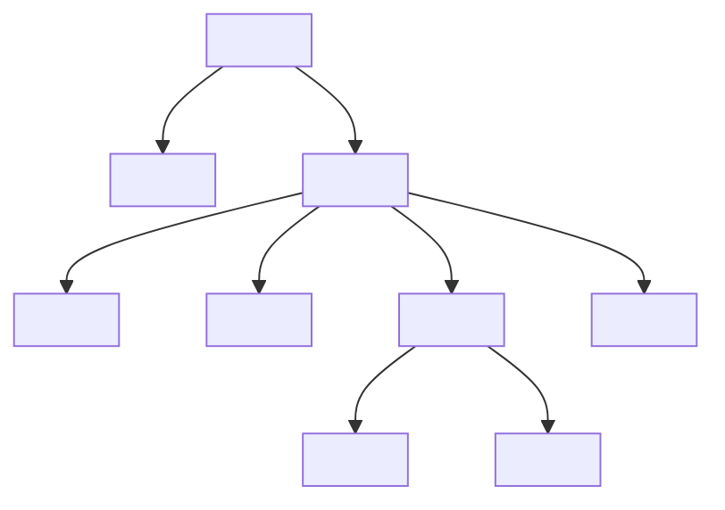

## 14.1 Writing Semantic HTML

In the world of web development, creating a website that is both user-friendly and accessible is paramount. One of the foundational practices to achieve this is writing semantic HTML. Semantic HTML not only enhances the structure of your web pages but also improves accessibility and search engine optimization (SEO). In this section, we'll explore the importance of semantic HTML, introduce key semantic elements, and demonstrate how they can be used effectively.

### Understanding Semantic HTML

Semantic HTML refers to the use of HTML elements that convey meaning about the content they enclose. These elements provide context to both browsers and developers, making it easier to understand the structure and purpose of the content. For example, using a `<header>` element for the top section of a page or an `<article>` element for a blog post.

#### Why Use Semantic HTML?

1. **Improved Accessibility**: Semantic HTML helps assistive technologies, like screen readers, to interpret content more accurately. This is crucial for users with disabilities who rely on these technologies to navigate the web.

2. **Better SEO**: Search engines use semantic HTML to understand the content of a page. By using the correct elements, you can help search engines index your content more effectively, potentially improving your site's ranking.

3. **Enhanced Code Readability**: Semantic HTML makes your code more readable and maintainable. It provides a clear structure that other developers can easily understand and work with.

4. **Future-Proofing**: As web standards evolve, semantic HTML ensures that your pages remain compatible with new technologies and practices.

### Key Semantic HTML Elements

Let's explore some of the most commonly used semantic HTML elements and how they contribute to a well-structured web page.

#### `<header>`

The `<header>` element represents introductory content or a set of navigational links. It typically contains headings, logos, or other introductory information.

```html
<header>
  <h1>Welcome to My Website</h1>
  <nav>
    <ul>
      <li><a href="#home">Home</a></li>
      <li><a href="#about">About</a></li>
      <li><a href="#contact">Contact</a></li>
    </ul>
  </nav>
</header>
```

#### `<footer>`

The `<footer>` element represents the footer of a section or page. It usually contains information about the author, copyright details, or links to related documents.

```html
<footer>
  <p>&copy; 2024 My Website. All rights reserved.</p>
  <nav>
    <ul>
      <li><a href="#privacy">Privacy Policy</a></li>
      <li><a href="#terms">Terms of Service</a></li>
    </ul>
  </nav>
</footer>
```

#### `<main>`

The `<main>` element is used to encapsulate the dominant content of the `<body>` of a document. It should be unique to the document and not contain content that is repeated across pages, like sidebars or navigation links.

```html
<main>
  <h2>About Us</h2>
  <p>We are a company dedicated to providing the best services to our customers.</p>
</main>
```

#### `<article>`

The `<article>` element represents a self-contained composition in a document, page, application, or site, which is intended to be independently distributable or reusable.

```html
<article>
  <h2>Latest News</h2>
  <p>Our company has just launched a new product...</p>
</article>
```

#### `<section>`

The `<section>` element defines sections in a document, such as chapters, headers, footers, or any other sections of the document.

```html
<section>
  <h3>Our Services</h3>
  <p>We offer a wide range of services to meet your needs...</p>
</section>
```

#### `<nav>`

The `<nav>` element is used to define a set of navigation links.

```html
<nav>
  <ul>
    <li><a href="#home">Home</a></li>
    <li><a href="#services">Services</a></li>
    <li><a href="#contact">Contact</a></li>
  </ul>
</nav>
```

### Benefits of Semantic HTML for Accessibility

Semantic HTML plays a crucial role in making web content accessible to all users, including those with disabilities. Here's how it helps:

1. **Screen Readers**: Semantic elements provide screen readers with the necessary context to interpret and vocalize content accurately. For example, a screen reader can announce a `<nav>` element as a navigation section, helping users understand its purpose.

2. **Keyboard Navigation**: Semantic HTML enhances keyboard navigation by allowing users to jump between sections using assistive technology shortcuts.

3. **ARIA Roles**: While semantic HTML provides inherent meaning, ARIA (Accessible Rich Internet Applications) roles can be used to enhance accessibility further. However, it's best to rely on native HTML semantics whenever possible.

### Semantic HTML and SEO

Search engines use semantic HTML to understand the structure and content of a web page. By using semantic elements, you can help search engines index your content more effectively, potentially improving your site's ranking. Here's how:

1. **Content Hierarchy**: Semantic elements like `<header>`, `<main>`, and `<footer>` help define the hierarchy of your content, making it easier for search engines to understand the importance of each section.

2. **Rich Snippets**: Using semantic HTML can lead to rich snippets in search results, providing users with more information about your content directly from the search page.

3. **Improved Indexing**: Semantic HTML helps search engines index your content more accurately, which can lead to better visibility in search results.

### Reviewing Code for Semantic Accuracy

To ensure your HTML code is semantically accurate, consider the following steps:

1. **Use the Right Elements**: Always use the most appropriate semantic elements for your content. Avoid using generic elements like `<div>` and `<span>` when a semantic alternative is available.

2. **Validate Your HTML**: Use online validators like the [W3C Markup Validation Service](https://validator.w3.org/) to check your HTML for errors and ensure it adheres to web standards.

3. **Test with Screen Readers**: Use screen readers to test your web pages and ensure they are accessible to all users.

4. **Review and Refactor**: Regularly review your code to identify areas where semantic HTML can be improved. Refactoring your code to use semantic elements can enhance both accessibility and SEO.

### Try It Yourself

To reinforce your understanding of semantic HTML, try modifying the following code example. Add a `<header>`, `<main>`, and `<footer>` to structure the page semantically.

```html
<!DOCTYPE html>
<html lang="en">
<head>
  <meta charset="UTF-8">
  <meta name="viewport" content="width=device-width, initial-scale=1.0">
  <title>Semantic HTML Example</title>
</head>
<body>
  <!-- Add your semantic elements here -->
</body>
</html>
```

### Visualizing Semantic HTML

To better understand how semantic HTML elements fit together, let's visualize a simple web page structure using a diagram.



**Diagram Description**: This diagram represents the hierarchical structure of a web page using semantic HTML elements. The `<html>` element contains the `<head>` and `<body>`. The `<body>` includes a `<header>`, `<nav>`, `<main>`, and `<footer>`. The `<main>` contains an `<article>` and a `<section>`.

### Summary

Writing semantic HTML is a fundamental practice in web development that enhances the structure, accessibility, and SEO of your web pages. By using semantic elements, you can create web pages that are easier to understand, navigate, and maintain. Remember to review your code regularly for semantic accuracy and test your pages with assistive technologies to ensure they are accessible to all users.

## Quiz Time!



### What is the primary purpose of semantic HTML?

- [x] To provide meaning and context to web content
- [ ] To make web pages load faster
- [ ] To add more colors to a web page
- [ ] To increase the number of images on a page

> **Explanation:** Semantic HTML provides meaning and context to web content, which helps both browsers and developers understand the structure and purpose of the content.

### Which HTML element is used to define the main content of a document?

- [ ] `<header>`
- [ ] `<footer>`
- [x] `<main>`
- [ ] `<nav>`

> **Explanation:** The `<main>` element is used to encapsulate the dominant content of the `<body>` of a document.

### How does semantic HTML benefit screen readers?

- [x] It provides context to interpret content accurately
- [ ] It makes images load faster
- [ ] It reduces the number of HTML tags
- [ ] It increases the font size

> **Explanation:** Semantic HTML provides context to screen readers, allowing them to interpret and vocalize content accurately for users with disabilities.

### Which element should be used for a self-contained composition in a document?

- [ ] `<section>`
- [x] `<article>`
- [ ] `<div>`
- [ ] `<span>`

> **Explanation:** The `<article>` element represents a self-contained composition in a document, intended to be independently distributable or reusable.

### What is the role of the `<nav>` element?

- [x] To define a set of navigation links
- [ ] To display images
- [ ] To create a form
- [ ] To style text

> **Explanation:** The `<nav>` element is used to define a set of navigation links, helping users navigate through the website.

### Why is semantic HTML important for SEO?

- [x] It helps search engines understand the content structure
- [ ] It makes the website load faster
- [ ] It reduces the number of HTML files
- [ ] It increases the number of visitors

> **Explanation:** Semantic HTML helps search engines understand the content structure, which can lead to better indexing and potentially improved search rankings.

### Which element is typically used for introductory content or navigational links?

- [x] `<header>`
- [ ] `<footer>`
- [ ] `<main>`
- [ ] `<section>`

> **Explanation:** The `<header>` element is typically used for introductory content or a set of navigational links.

### How can you verify the semantic accuracy of your HTML code?

- [x] Use an online HTML validator
- [ ] Add more CSS styles
- [ ] Increase the number of `<div>` tags
- [ ] Use more JavaScript

> **Explanation:** An online HTML validator can check your HTML for errors and ensure it adheres to web standards, verifying semantic accuracy.

### What is a benefit of using semantic HTML for code readability?

- [x] It makes the code more understandable and maintainable
- [ ] It reduces the number of lines of code
- [ ] It increases the number of functions
- [ ] It adds more colors to the code

> **Explanation:** Semantic HTML makes the code more understandable and maintainable by providing a clear structure that other developers can easily follow.

### Semantic HTML is crucial for future-proofing web pages. True or False?

- [x] True
- [ ] False

> **Explanation:** True. Semantic HTML ensures that web pages remain compatible with evolving web standards and technologies.


