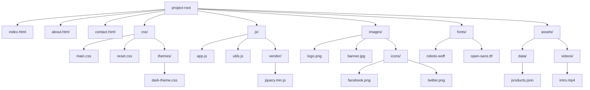

## 14.2 Organizing Files and Folders

Creating a well-organized file and folder structure is crucial for any web development project. Not only does it help you keep track of your work, but it also simplifies collaboration with other developers and makes scaling your project easier. In this section, we'll explore how to set up your project directories logically and efficiently.

### Why Organize Your Files and Folders?

Before diving into the specifics, let's discuss why organizing your files and folders is essential:

1. **Maintainability**: A clear structure makes it easier to find and update files, reducing the time spent on maintenance tasks.
2. **Collaboration**: When working in a team, a standardized structure ensures everyone knows where to find and place files, reducing confusion.
3. **Scalability**: As projects grow, a well-organized structure can accommodate new files and features without becoming chaotic.
4. **Efficiency**: A logical structure can speed up development by minimizing the time spent searching for files.

### Suggested Project Structure

A typical web development project might include HTML, CSS, JavaScript, images, and other assets. Here's a suggested directory structure:

```plaintext
project-root/
│
├── index.html
├── about.html
├── contact.html
│
├── css/
│   ├── main.css
│   ├── reset.css
│   └── themes/
│       └── dark-theme.css
│
├── js/
│   ├── app.js
│   ├── utils.js
│   └── vendor/
│       └── jquery.min.js
│
├── images/
│   ├── logo.png
│   ├── banner.jpg
│   └── icons/
│       ├── facebook.png
│       └── twitter.png
│
├── fonts/
│   ├── roboto.woff
│   └── open-sans.ttf
│
└── assets/
    ├── data/
    │   └── products.json
    └── videos/
        └── intro.mp4
```

#### Explanation of the Structure

- **Root Directory**: Contains the main HTML files. These are the entry points of your website.
- **`css/`**: Stores all CSS files. You can further organize this directory by creating subfolders for themes or specific components.
- **`js/`**: Contains JavaScript files. Separate your custom scripts from third-party libraries by using a `vendor/` folder.
- **`images/`**: Holds all image files. Use subfolders to categorize images, such as icons or banners.
- **`fonts/`**: Keeps custom font files, ensuring your typography is consistent across the site.
- **`assets/`**: A general folder for other resources like data files or videos.

### Using Relative vs. Absolute Paths

When linking files in your project, you can use relative or absolute paths. Understanding the difference is crucial for maintaining a clean and functional project.

#### Relative Paths

Relative paths are based on the current location of the file you're working in. They are useful for linking files within the same project.

Example:
```html
<link rel="stylesheet" href="css/main.css">
<script src="js/app.js"></script>
```

#### Absolute Paths

Absolute paths start from the root directory of your server. They are less flexible than relative paths because they depend on the server's structure.

Example:
```html
<link rel="stylesheet" href="/css/main.css">
<script src="/js/app.js"></script>
```

**Tip**: Use relative paths for local development to ensure your project remains portable and easy to move between different environments.

### Consistent Naming Conventions

Consistent naming conventions are vital for readability and maintainability. Here are some best practices:

- **Use lowercase letters**: This avoids issues on case-sensitive file systems.
- **Separate words with hyphens**: For example, `main-style.css` instead of `mainstyle.css`.
- **Be descriptive**: Use meaningful names that describe the file's purpose, like `contact-form.js` for a script handling a contact form.

### Simplifying Collaboration and Scaling

A well-organized project structure simplifies collaboration and scaling in several ways:

- **Onboarding**: New team members can quickly understand the project layout.
- **Version Control**: Tools like Git work more efficiently with a consistent structure.
- **Modular Development**: Easier to add new features without disrupting existing code.

### Try It Yourself

To practice organizing your files and folders, try setting up a simple project with the following structure:

1. Create a new directory called `my-website`.
2. Inside `my-website`, create the following folders: `css`, `js`, `images`.
3. Add a file named `index.html` in the root directory.
4. Create a CSS file named `style.css` inside the `css` folder.
5. Add a JavaScript file named `script.js` inside the `js` folder.
6. Place an image file (e.g., `logo.png`) inside the `images` folder.

Experiment by adding more files and folders, and practice linking them using relative paths.

### Visualizing the Project Structure

Let's visualize the suggested project structure using a diagram:



### Key Takeaways

- **Organize your files and folders** to improve maintainability, collaboration, and scalability.
- **Use a logical directory structure** to categorize different types of files.
- **Prefer relative paths** for linking files within your project.
- **Adopt consistent naming conventions** to enhance readability.
- **Visualize your project structure** to better understand and communicate it.

### Further Reading

For more detailed information on file organization and best practices, consider visiting the following resources:

- [MDN Web Docs: File Paths](https://developer.mozilla.org/en-US/docs/Learn/Getting_started_with_the_web/Dealing_with_files)
- [W3Schools: HTML File Paths](https://www.w3schools.com/html/html_filepaths.asp)

By following these guidelines, you'll be well on your way to creating a clean, efficient, and scalable web development project.

## Quiz Time!



### What is the primary benefit of organizing files and folders in a web development project?

- [x] Maintainability
- [ ] Aesthetic appeal
- [ ] Faster internet speed
- [ ] Increased file size

> **Explanation:** Organizing files and folders improves maintainability by making it easier to find and update files.

### Which of the following is a suggested folder in a web project structure?

- [x] css/
- [ ] scripts/
- [ ] docs/
- [ ] temp/

> **Explanation:** The `css/` folder is commonly used to store all CSS files in a web project.

### What is the difference between relative and absolute paths?

- [x] Relative paths are based on the current file location, while absolute paths start from the server's root directory.
- [ ] Relative paths are longer than absolute paths.
- [ ] Absolute paths are more secure than relative paths.
- [ ] Relative paths are used only for images.

> **Explanation:** Relative paths are based on the current file location, making them flexible for local development, while absolute paths start from the server's root directory.

### Why is it important to use consistent naming conventions?

- [x] To enhance readability and maintainability
- [ ] To increase file size
- [ ] To make files invisible
- [ ] To slow down development

> **Explanation:** Consistent naming conventions enhance readability and maintainability by making it easier to understand the purpose of each file.

### What is a benefit of using relative paths in a project?

- [x] Portability
- [ ] Increased file size
- [ ] Faster loading times
- [ ] Better security

> **Explanation:** Relative paths enhance portability, allowing the project to be moved between different environments without breaking links.

### Which folder would you typically find third-party libraries in?

- [x] js/vendor/
- [ ] css/
- [ ] images/
- [ ] fonts/

> **Explanation:** Third-party libraries are often stored in a `vendor/` subfolder within the `js/` directory.

### What is the purpose of the `assets/` folder?

- [x] To store general resources like data files or videos
- [ ] To hold HTML files
- [ ] To increase project complexity
- [ ] To store error logs

> **Explanation:** The `assets/` folder is used to store general resources, such as data files or videos, that don't fit into other specific categories.

### How does a well-organized project structure simplify collaboration?

- [x] By ensuring everyone knows where to find and place files
- [ ] By making files harder to access
- [ ] By increasing the number of files
- [ ] By slowing down development

> **Explanation:** A well-organized project structure ensures everyone knows where to find and place files, reducing confusion and simplifying collaboration.

### What is the advantage of using a `themes/` subfolder in the `css/` directory?

- [x] To organize different themes or styles
- [ ] To store JavaScript files
- [ ] To increase file size
- [ ] To make files invisible

> **Explanation:** A `themes/` subfolder in the `css/` directory helps organize different themes or styles, making it easier to manage and switch between them.

### True or False: Absolute paths are more flexible than relative paths.

- [ ] True
- [x] False

> **Explanation:** Relative paths are more flexible than absolute paths because they are based on the current file location and can adapt to different environments.


