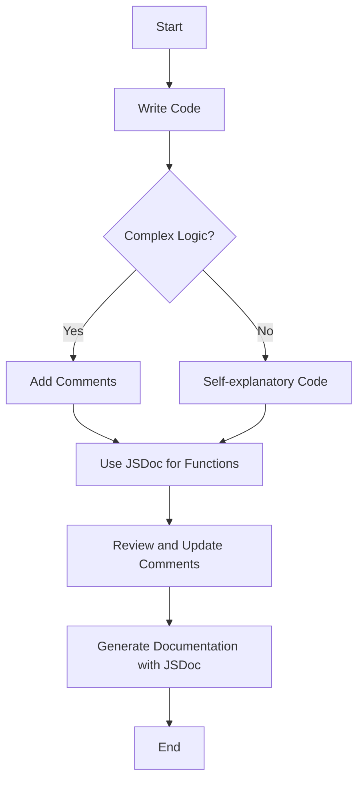

## 14.3 Commenting and Documentation

In the journey of building web pages with JavaScript, one of the most crucial skills you'll develop is the ability to write code that is not only functional but also understandable and maintainable. This is where commenting and documentation come into play. As you progress from writing simple scripts to developing complex applications, the importance of clear and meaningful comments cannot be overstated. In this section, we will explore the purpose of comments, guidelines for writing them effectively, and how to document your code using tools like JSDoc.

### The Purpose of Comments

Comments are annotations in the source code that are ignored by the JavaScript engine but serve as notes for anyone reading the code. They are essential for several reasons:

- **Clarification**: Comments help explain complex logic or algorithms, making it easier for others (or your future self) to understand the code.
- **Maintenance**: Well-commented code is easier to maintain, as it provides context and insights into the developer's thought process.
- **Collaboration**: In team environments, comments facilitate collaboration by providing a common understanding of the code's purpose and functionality.
- **Debugging**: Comments can be used to temporarily disable code during debugging without deleting it.

### Types of Comments in JavaScript

JavaScript supports two types of comments:

1. **Single-line Comments**: These are used for brief explanations or notes. They start with `//` and continue to the end of the line.

    ```javascript
    // This is a single-line comment
    let x = 10; // Initialize x with 10
    ```

2. **Multi-line Comments**: These are used for longer explanations or to comment out blocks of code. They start with `/*` and end with `*/`.

    ```javascript
    /*
     * This is a multi-line comment
     * It can span multiple lines
     */
    let y = 20;
    ```

### Guidelines for Writing Clear and Meaningful Comments

Writing effective comments is an art. Here are some guidelines to help you master it:

- **Be Concise and Relevant**: Comments should be brief and to the point. Avoid stating the obvious. For example, instead of commenting `// Increment x by 1` for `x++`, focus on explaining why the increment is necessary if it's not immediately clear.

- **Use Proper Grammar and Spelling**: Well-written comments reflect professionalism and make your code easier to read.

- **Keep Comments Updated**: As your code evolves, ensure that your comments remain accurate. Outdated comments can be more misleading than no comments at all.

- **Avoid Redundancy**: Don't comment on every line of code. Instead, focus on explaining complex logic, assumptions, or decisions.

- **Use Comments to Explain 'Why', Not 'What'**: The code itself should be self-explanatory regarding what it does. Use comments to explain why certain decisions were made.

### Documenting Functions with Descriptions, Parameters, and Return Values

Documenting your functions is crucial for understanding how they work and how they should be used. Here’s how you can do it effectively:

- **Function Description**: Provide a brief overview of what the function does.

- **Parameters**: List and describe each parameter, including its type and purpose.

- **Return Values**: Describe what the function returns, including the type and any conditions that affect the return value.

Here’s an example of a well-documented function:

```javascript
/**
 * Calculates the area of a rectangle.
 *
 * @param {number} width - The width of the rectangle.
 * @param {number} height - The height of the rectangle.
 * @returns {number} The area of the rectangle.
 */
function calculateRectangleArea(width, height) {
    return width * height;
}
```

### Introduction to Documentation Tools and Standards

To streamline the process of documenting your code, you can use tools like JSDoc. JSDoc is a popular documentation generator for JavaScript that allows you to create HTML documentation from comments in your code.

#### Getting Started with JSDoc

1. **Install JSDoc**: You can install JSDoc globally using npm:

    ```bash
    npm install -g jsdoc
    ```

2. **Add JSDoc Comments**: Use JSDoc syntax to comment your code. The example above demonstrates the basic structure.

3. **Generate Documentation**: Run JSDoc to generate HTML documentation:

    ```bash
    jsdoc yourfile.js
    ```

This will create a `docs` folder containing the HTML documentation.

### Balancing Comments: Too Many vs. Too Few

Finding the right balance between too many and too few comments is crucial. Here are some tips:

- **Avoid Over-commenting**: Excessive comments can clutter your code and make it harder to read. Focus on adding comments where they add value.

- **Ensure Sufficient Commenting**: On the flip side, too few comments can leave readers confused. Make sure to comment on complex logic, assumptions, and important decisions.

- **Review and Refactor**: Regularly review your comments as part of your code refactoring process. This ensures they remain relevant and helpful.

### Try It Yourself

Let's put these concepts into practice. Below is a simple JavaScript function. Try adding comments to explain what the code does and why certain decisions were made.

```javascript
function findMax(numbers) {
    let max = numbers[0];
    for (let i = 1; i < numbers.length; i++) {
        if (numbers[i] > max) {
            max = numbers[i];
        }
    }
    return max;
}
```

**Challenge**: Add comments to the function above, explaining its purpose, parameters, and logic. Then, use JSDoc to document it.

### Visual Aids: Commenting and Documentation Flow

To better understand the flow of commenting and documentation, let's visualize it using a flowchart.



**Description**: This flowchart illustrates the process of writing code, determining the need for comments, using JSDoc for functions, and generating documentation.

### References and Links

For further reading on commenting and documentation, consider the following resources:

- [MDN Web Docs: Comments](https://developer.mozilla.org/en-US/docs/Web/JavaScript/Guide/Grammar_and_types#Comments)
- [JSDoc Official Website](https://jsdoc.app/)
- [W3Schools: JavaScript Comments](https://www.w3schools.com/js/js_comments.asp)

### Engagement and Reinforcement

To reinforce your learning, consider these questions:

- What is the primary purpose of comments in code?
- How can you ensure your comments remain relevant as your code evolves?
- Why is it important to document functions with descriptions, parameters, and return values?

### Exercises

1. **Exercise 1**: Take a piece of your own code and add comments to explain its logic and purpose.

2. **Exercise 2**: Use JSDoc to document a function in your codebase and generate the documentation.

3. **Exercise 3**: Review a peer's code and provide feedback on their commenting style. Suggest improvements if necessary.

### Key Takeaways

- Comments are essential for making your code understandable and maintainable.
- Write clear and concise comments that explain the 'why' behind your code.
- Use JSDoc to document functions and generate professional documentation.
- Balance the amount of commenting to avoid clutter while ensuring clarity.

By mastering the art of commenting and documentation, you'll be well-equipped to write code that is not only functional but also easy to understand and maintain.

## Quiz Time!



### What is the primary purpose of comments in code?

- [x] To clarify complex logic and facilitate maintenance
- [ ] To increase the file size
- [ ] To make the code run faster
- [ ] To confuse other developers

> **Explanation:** Comments are used to clarify complex logic and facilitate maintenance by providing context and insights into the developer's thought process.

### Which type of comment is used for brief explanations or notes?

- [x] Single-line comments
- [ ] Multi-line comments
- [ ] Block comments
- [ ] Inline comments

> **Explanation:** Single-line comments, which start with `//`, are used for brief explanations or notes.

### What should comments focus on explaining?

- [x] Why certain decisions were made
- [ ] Every single line of code
- [ ] The obvious functionality of the code
- [ ] The history of JavaScript

> **Explanation:** Comments should focus on explaining why certain decisions were made, rather than what the code does, which should be self-explanatory.

### What is JSDoc used for?

- [x] Generating documentation from comments in JavaScript code
- [ ] Running JavaScript code faster
- [ ] Debugging JavaScript code
- [ ] Compiling JavaScript code

> **Explanation:** JSDoc is a tool used to generate documentation from comments in JavaScript code.

### What should be included in a function's documentation?

- [x] Description, parameters, and return values
- [ ] Only the function name
- [ ] The author's name and date
- [ ] The entire code of the function

> **Explanation:** A function's documentation should include a description, parameters, and return values to provide a comprehensive understanding of its purpose and usage.

### What is the risk of having too many comments?

- [x] Cluttering the code and making it harder to read
- [ ] Making the code run slower
- [ ] Increasing the file size
- [ ] Confusing the JavaScript engine

> **Explanation:** Having too many comments can clutter the code and make it harder to read, which is why it's important to balance the amount of commenting.

### How can you ensure comments remain relevant?

- [x] Regularly review and update them as part of code refactoring
- [ ] Write them in a different language
- [ ] Use complex vocabulary
- [ ] Avoid writing comments altogether

> **Explanation:** Regularly reviewing and updating comments as part of code refactoring ensures they remain relevant and helpful.

### What is the benefit of using JSDoc for functions?

- [x] It creates professional documentation that is easy to read and understand
- [ ] It makes the code run faster
- [ ] It reduces the file size
- [ ] It hides the code from other developers

> **Explanation:** Using JSDoc for functions creates professional documentation that is easy to read and understand, aiding in code maintenance and collaboration.

### What should you do if a comment becomes outdated?

- [x] Update it to reflect the current state of the code
- [ ] Delete it immediately
- [ ] Ignore it
- [ ] Add more comments to clarify

> **Explanation:** If a comment becomes outdated, it should be updated to reflect the current state of the code to avoid confusion.

### True or False: Comments can be used to temporarily disable code during debugging.

- [x] True
- [ ] False

> **Explanation:** True. Comments can be used to temporarily disable code during debugging without deleting it, allowing developers to test different parts of the code.


