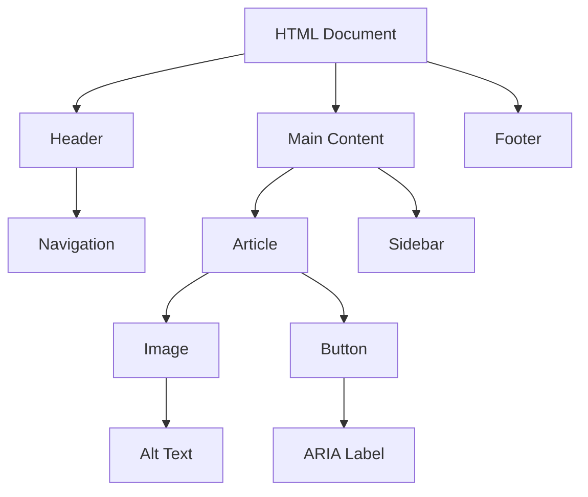

## 14.4 Enhancing Accessibility

In today's digital age, creating accessible web content is not just a best practice—it's a necessity. Accessibility ensures that everyone, including people with disabilities, can use and benefit from your website. In this section, we'll explore the principles of web accessibility, introduce the Web Content Accessibility Guidelines (WCAG), and provide practical tips for making your web pages more inclusive.

### Understanding Web Accessibility

Web accessibility means designing and developing websites and web applications that people with disabilities can perceive, understand, navigate, and interact with. Disabilities can be visual, auditory, physical, speech-related, cognitive, or neurological. By enhancing accessibility, we ensure that our web content is usable by a wider audience, including those who rely on assistive technologies.

### Introducing the Web Content Accessibility Guidelines (WCAG)

The Web Content Accessibility Guidelines (WCAG) are a set of recommendations developed by the World Wide Web Consortium (W3C) to make web content more accessible. WCAG is organized around four principles, often remembered by the acronym POUR:

- **Perceivable**: Information and user interface components must be presentable to users in ways they can perceive.
- **Operable**: User interface components and navigation must be operable.
- **Understandable**: Information and the operation of the user interface must be understandable.
- **Robust**: Content must be robust enough that it can be interpreted reliably by a wide variety of user agents, including assistive technologies.

Each principle is divided into guidelines, which are further broken down into testable success criteria. WCAG has three levels of conformance: A, AA, and AAA, with AAA being the highest level of accessibility.

### Practical Tips for Enhancing Accessibility

Let's dive into some practical tips to make your web pages more accessible:

#### Using Alt Attributes in Images

The `alt` attribute provides alternative text for images, which is crucial for users who rely on screen readers. It describes the image's content and function, allowing visually impaired users to understand what the image represents.

```html

```

- **Tip**: Use descriptive text that conveys the purpose of the image. If the image is purely decorative, an empty `alt` attribute (`alt=""`) is appropriate.

#### Ensuring Sufficient Color Contrast

Color contrast is essential for users with visual impairments, such as color blindness. WCAG recommends a contrast ratio of at least 4.5:1 for normal text and 3:1 for large text.

- **Tip**: Use tools like the [WebAIM Contrast Checker](https://webaim.org/resources/contrastchecker/) to ensure your color choices meet these guidelines.

#### Designing for Keyboard Navigation

Many users rely on keyboard navigation instead of a mouse. Ensure that all interactive elements, such as links, buttons, and form controls, are accessible via the keyboard.

- **Tip**: Test your site by navigating with the `Tab` key. Ensure that you can access all interactive elements and that the focus order is logical.

#### Providing Clear Focus Indicators

Focus indicators highlight the currently focused element, helping keyboard users understand where they are on the page. By default, browsers provide focus indicators, but you can enhance them with CSS for better visibility.

```css
button:focus, a:focus {
    outline: 2px solid #005fcc;
    outline-offset: 2px;
}
```

- **Tip**: Ensure that your focus indicators are visible and distinct from other styles.

#### The Importance of ARIA Roles and Labels

Accessible Rich Internet Applications (ARIA) is a set of attributes that define ways to make web content and applications more accessible. ARIA roles and labels help screen readers convey information about elements that are not natively accessible.

- **Role**: Defines the type of element, such as `button`, `navigation`, or `dialog`.
- **Label**: Provides a text description for an element.

```html
<button aria-label="Close menu">X</button>
```

- **Tip**: Use ARIA attributes to enhance accessibility, but do not rely on them to fix poorly structured HTML.

### Testing with Accessibility Tools and Screen Readers

Testing your website with accessibility tools and screen readers is crucial for identifying and fixing accessibility issues. Here are some tools to consider:

- **Screen Readers**: NVDA (Windows), VoiceOver (macOS), and JAWS (Windows) are popular screen readers.
- **Browser Extensions**: Tools like Axe, WAVE, and Lighthouse can help identify accessibility issues.
- **Manual Testing**: Navigate your site using only a keyboard and a screen reader to experience it as a user with disabilities would.

### Visual Aids

To better understand the relationship between HTML elements and their accessibility attributes, let's look at a simple diagram representing the DOM structure and how ARIA roles fit in:



**Diagram Description**: This diagram shows a basic HTML document structure with a header, main content, and footer. The main content includes an article with an image and a button, highlighting the use of alt text and ARIA labels for accessibility.

### Engagement and Reinforcement

To reinforce your understanding of web accessibility, try the following exercises:

1. **Exercise**: Identify and fix accessibility issues on a sample web page. Use tools like WAVE or Axe to guide your improvements.
2. **Challenge**: Create a simple web page with images, links, and buttons. Ensure that all elements are accessible via keyboard navigation and have appropriate alt text and ARIA attributes.

### Summary of Key Takeaways

- Web accessibility ensures that all users, including those with disabilities, can access and interact with your website.
- Follow the WCAG guidelines to make your content perceivable, operable, understandable, and robust.
- Use alt attributes for images, ensure sufficient color contrast, design for keyboard navigation, and provide clear focus indicators.
- Implement ARIA roles and labels to enhance accessibility, but prioritize semantic HTML.
- Test your website with accessibility tools and screen readers to identify and fix issues.

By incorporating these practices into your web development process, you'll create more inclusive and accessible web experiences for all users.

## Quiz Time!



### What does the acronym POUR stand for in the context of WCAG?

- [x] Perceivable, Operable, Understandable, Robust
- [ ] Practical, Organized, Usable, Reliable
- [ ] Perceptive, Open, User-friendly, Responsive
- [ ] Precise, Optimized, Unified, Resilient

> **Explanation:** POUR stands for Perceivable, Operable, Understandable, and Robust, which are the four principles of the Web Content Accessibility Guidelines (WCAG).

### Which attribute is used to provide alternative text for images?

- [x] alt
- [ ] title
- [ ] src
- [ ] aria-label

> **Explanation:** The `alt` attribute is used to provide alternative text for images, which is essential for accessibility.

### What is the recommended minimum contrast ratio for normal text according to WCAG?

- [x] 4.5:1
- [ ] 3:1
- [ ] 2:1
- [ ] 5:1

> **Explanation:** WCAG recommends a minimum contrast ratio of 4.5:1 for normal text to ensure readability for users with visual impairments.

### How can you test your website's keyboard navigation?

- [x] By using the Tab key to navigate through interactive elements
- [ ] By using a mouse to click on elements
- [ ] By using a touchscreen device
- [ ] By using voice commands

> **Explanation:** Testing keyboard navigation involves using the Tab key to move through interactive elements, ensuring they are accessible without a mouse.

### What CSS property can be used to enhance focus indicators?

- [x] outline
- [ ] border
- [ ] background
- [ ] display

> **Explanation:** The `outline` property can be used to enhance focus indicators, making them more visible for keyboard users.

### What does ARIA stand for?

- [x] Accessible Rich Internet Applications
- [ ] Advanced Responsive Interface Attributes
- [ ] Automated Resource Integration Access
- [ ] Adaptive Real-time Interactive Applications

> **Explanation:** ARIA stands for Accessible Rich Internet Applications, which is a set of attributes to improve web accessibility.

### Which ARIA attribute provides a text description for an element?

- [x] aria-label
- [ ] aria-role
- [ ] aria-hidden
- [ ] aria-expanded

> **Explanation:** The `aria-label` attribute provides a text description for an element, enhancing accessibility for screen readers.

### Which tool can be used to check color contrast ratios?

- [x] WebAIM Contrast Checker
- [ ] Google Analytics
- [ ] Adobe Photoshop
- [ ] Microsoft Word

> **Explanation:** The WebAIM Contrast Checker is a tool that helps ensure color contrast ratios meet accessibility standards.

### What is the purpose of using ARIA roles?

- [x] To define the type of element for assistive technologies
- [ ] To style elements with CSS
- [ ] To improve SEO rankings
- [ ] To enhance page loading speed

> **Explanation:** ARIA roles define the type of element for assistive technologies, helping screen readers convey information about the element.

### True or False: ARIA attributes can fix poorly structured HTML.

- [ ] True
- [x] False

> **Explanation:** False. ARIA attributes should not be used to fix poorly structured HTML. They are meant to enhance accessibility, not replace semantic HTML.


