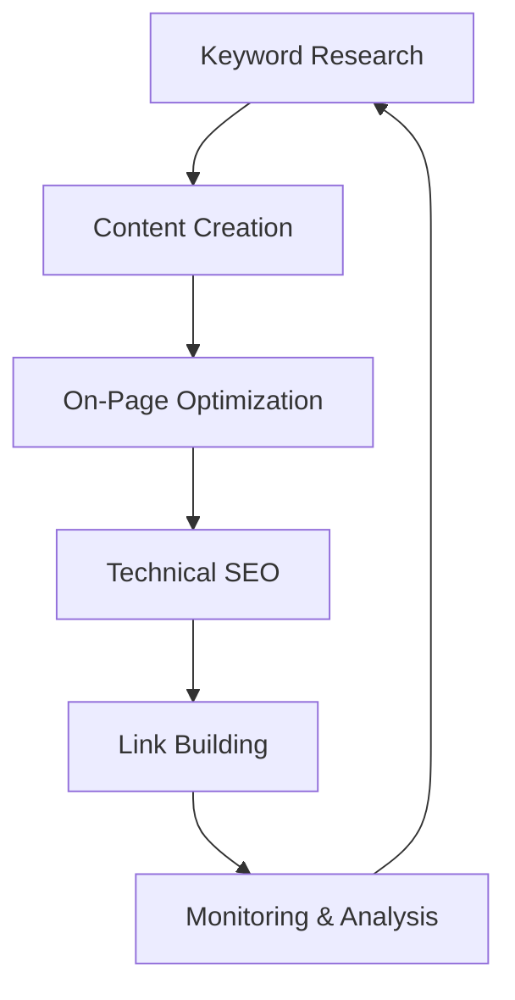
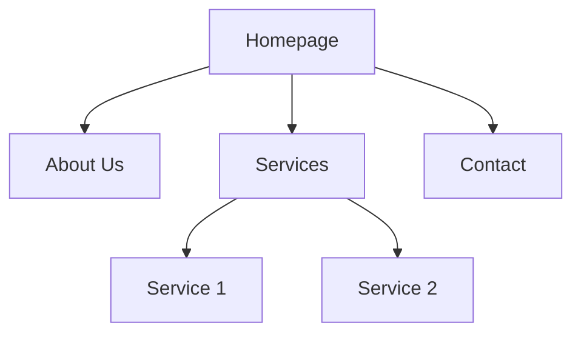

## 14.5 SEO Fundamentals

In today's digital age, having a web page is not enough. To ensure your website reaches its intended audience, you need to optimize it for search engines. This process, known as Search Engine Optimization (SEO), involves various strategies to improve your site's visibility on search engine results pages (SERPs). In this section, we'll explore key SEO concepts and techniques that will help you build a strong foundation for your web page's online presence.

### Understanding SEO Basics

SEO is the practice of enhancing your website to increase its visibility when people search for products or services related to your business in search engines like Google, Bing, and Yahoo. The better visibility your pages have in search results, the more likely you are to garner attention and attract prospective and existing customers to your business.

#### Key SEO Concepts

1. **Keywords**: Keywords are the terms and phrases that users type into search engines. Identifying and using the right keywords in your content is crucial for SEO. They help search engines understand what your page is about and match it with relevant search queries.

2. **Meta Tags**: Meta tags provide information about your web page to search engines and website visitors. They include meta titles and meta descriptions, which are displayed in search engine results.

3. **Content Quality**: High-quality content is informative, engaging, and relevant to your audience. It should provide value and answer the questions your audience is searching for.

4. **Headings and Structured Content**: Using headings (H1, H2, H3, etc.) helps organize your content and makes it easier for search engines to understand the structure of your page.

5. **Sitemaps and Robots.txt**: A sitemap is a file where you provide information about the pages, videos, and other files on your site, and the relationships between them. The robots.txt file tells search engines which pages they can or cannot crawl.

6. **User Experience (UX)**: A positive user experience encourages visitors to stay longer on your site, reducing bounce rates and improving SEO.

### Keywords: The Foundation of SEO

Keywords are the backbone of SEO. They are the words and phrases that potential visitors use to find information online. By strategically placing these keywords throughout your content, you can help search engines understand what your page is about and improve your chances of ranking higher in search results.

#### How to Choose Keywords

1. **Research**: Use tools like Google Keyword Planner, SEMrush, or Ahrefs to find relevant keywords for your niche. Look for keywords with high search volume and low competition.

2. **Relevance**: Ensure that the keywords you choose are relevant to your content and audience. Irrelevant keywords can lead to a high bounce rate, negatively impacting your SEO.

3. **Long-Tail Keywords**: These are longer and more specific keyword phrases that visitors are more likely to use when they're closer to making a purchase or finding specific information. They often have lower competition and can be easier to rank for.

#### Implementing Keywords

- **Title Tags**: Include your primary keyword in the title tag of your page. This is one of the most important places to use your keyword.

- **Headings**: Use keywords in your headings to help search engines understand the structure and main topics of your content.

- **Content**: Naturally incorporate keywords throughout your content. Avoid keyword stuffing, which can lead to penalties from search engines.

- **URLs**: Include keywords in your URLs to give both users and search engines a clear idea of what the page is about.

### Meta Tags: Communicating with Search Engines

Meta tags are snippets of text that describe a page's content. They don't appear on the page itself but only in the page's code. Meta tags are crucial for SEO because they help search engines understand the content of your page.

#### Writing Effective Meta Titles and Descriptions

- **Meta Title**: This is the title that appears in search engine results. It should be concise, descriptive, and include your primary keyword. Aim for 50-60 characters.

- **Meta Description**: This is a brief summary of your page's content. It should be compelling and include your primary keyword. Aim for 150-160 characters.

Here's an example of how to write a meta title and description:

```html
<!-- Meta Title -->
<title>Learn JavaScript: Beginner's Guide to Web Development</title>

<!-- Meta Description -->
<meta name="description" content="Discover the basics of JavaScript and start building dynamic web pages with our beginner-friendly guide. Perfect for aspiring web developers.">
```

### Content Quality: Engaging and Informative

Content is king in the world of SEO. High-quality content not only attracts visitors but also encourages them to stay longer on your site, reducing bounce rates and improving your search rankings.

#### Tips for Creating Quality Content

1. **Understand Your Audience**: Know who your audience is and what they're looking for. Create content that addresses their needs and interests.

2. **Provide Value**: Offer valuable information that answers your audience's questions and solves their problems.

3. **Be Original**: Avoid duplicate content. Search engines prioritize unique content that provides new insights or perspectives.

4. **Use Visuals**: Incorporate images, videos, and infographics to make your content more engaging and easier to understand.

5. **Keep It Updated**: Regularly update your content to ensure it remains relevant and accurate.

### Headings and Structured Content

Headings help organize your content and make it easier for both users and search engines to understand. They also improve the readability of your content, which can enhance user experience.

#### Using Headings Effectively

- **H1 Tag**: Use the H1 tag for the main title of your page. It should include your primary keyword and clearly convey the topic of your page.

- **H2 and H3 Tags**: Use these for subheadings to break down your content into sections. This helps search engines understand the hierarchy of your content.

- **Consistency**: Maintain a consistent heading structure throughout your page to ensure clarity and coherence.

Here's an example of how to structure your content with headings:

```html
<h1>Introduction to JavaScript</h1>
<p>JavaScript is a versatile programming language used for web development...</p>

<h2>What is JavaScript?</h2>
<p>JavaScript is a scripting language that enables you to create dynamically updating content...</p>

<h3>History of JavaScript</h3>
<p>JavaScript was created in 1995 by Brendan Eich while he was working at Netscape...</p>
```

### Sitemaps and Robots.txt: Guiding Search Engines

Sitemaps and robots.txt files play a crucial role in SEO by guiding search engines on how to crawl and index your site.

#### Sitemaps

A sitemap is a file that lists all the pages on your website. It helps search engines find and index your content more efficiently.

- **XML Sitemap**: This is the most common type of sitemap used for SEO. It provides search engines with a list of URLs on your site and additional information about each URL, such as when it was last updated.

- **HTML Sitemap**: This is a page on your website that lists all the pages on your site. It's primarily for users to help them navigate your site.

Here's an example of a simple XML sitemap:

```xml
<?xml version="1.0" encoding="UTF-8"?>
<urlset xmlns="http://www.sitemaps.org/schemas/sitemap/0.9">
  <url>
    <loc>https://www.example.com/</loc>
    <lastmod>2024-10-25</lastmod>
    <priority>1.00</priority>
  </url>
  <url>
    <loc>https://www.example.com/about</loc>
    <lastmod>2024-10-20</lastmod>
    <priority>0.80</priority>
  </url>
</urlset>
```

#### Robots.txt

The robots.txt file tells search engines which pages on your site they can or cannot crawl. It's a simple text file placed in the root directory of your website.

Here's an example of a basic robots.txt file:

```plaintext
User-agent: *
Disallow: /private/
Allow: /public/
```

### User Experience: A Key SEO Factor

User experience (UX) is a critical factor in SEO. A positive UX can lead to longer visit durations, lower bounce rates, and higher conversion rates, all of which can improve your search rankings.

#### Enhancing User Experience

1. **Mobile-Friendly Design**: Ensure your website is responsive and looks good on all devices. Use media queries and flexible layouts to achieve this.

2. **Fast Loading Times**: Optimize images, use browser caching, and minimize HTTP requests to improve page load times.

3. **Easy Navigation**: Use clear and intuitive navigation menus to help users find what they're looking for quickly.

4. **Readable Content**: Use a legible font size, line spacing, and contrast to make your content easy to read.

5. **Engaging Visuals**: Use images and videos to break up text and make your content more engaging.

### Writing Accessible and User-Focused Content

Accessibility is an essential aspect of SEO. By making your content accessible to all users, including those with disabilities, you can improve your site's usability and reach a wider audience.

#### Tips for Writing Accessible Content

1. **Use Alt Text for Images**: Provide descriptive alt text for all images to help visually impaired users understand the content.

2. **Use Descriptive Link Text**: Avoid using generic link text like "click here." Instead, use descriptive text that tells users where the link will take them.

3. **Provide Transcripts for Videos**: Offer transcripts for video content to make it accessible to users with hearing impairments.

4. **Use Semantic HTML**: Use HTML elements according to their intended purpose to improve accessibility and SEO.

5. **Ensure Keyboard Accessibility**: Make sure all interactive elements can be accessed and used with a keyboard.

### Try It Yourself

Now that we've covered the fundamentals of SEO, it's time to put your knowledge into practice. Here are a few exercises to help you get started:

1. **Keyword Research**: Use a keyword research tool to find relevant keywords for your website. Create a list of primary and secondary keywords for your content.

2. **Write Meta Tags**: Write a meta title and description for one of your web pages. Ensure they are concise, descriptive, and include your primary keyword.

3. **Create a Sitemap**: Generate an XML sitemap for your website and submit it to Google Search Console.

4. **Optimize for Mobile**: Test your website's mobile-friendliness using Google's Mobile-Friendly Test tool. Make any necessary adjustments to improve the mobile experience.

5. **Improve Accessibility**: Review your website's accessibility using a tool like WAVE. Implement any recommended changes to enhance accessibility.

### Visual Aids

To help you better understand the concepts discussed in this section, here are some visual aids:

#### SEO Process Flowchart



*Description: This flowchart illustrates the cyclical process of SEO, starting with keyword research and ending with monitoring and analysis.*

#### Sitemap Structure



*Description: This diagram shows a simple sitemap structure for a website, with the homepage linking to various sections.*

### References and Links

For further reading and to deepen your understanding of SEO, check out these resources:

- [Google Search Central](https://developers.google.com/search/docs) - Official documentation and resources from Google.
- [Moz Beginner's Guide to SEO](https://moz.com/beginners-guide-to-seo) - A comprehensive guide to SEO for beginners.
- [Ahrefs SEO Blog](https://ahrefs.com/blog/) - Articles and tutorials on SEO and digital marketing.
- [W3Schools SEO Tutorial](https://www.w3schools.com/seo/) - A beginner-friendly tutorial on SEO basics.

### Engagement and Reinforcement

To reinforce your learning, consider these questions and challenges:

- What are the main components of a meta tag, and why are they important for SEO?
- How can you use headings to improve the structure and readability of your content?
- What steps can you take to enhance the accessibility of your website?

### Summary

In this section, we've explored the fundamentals of SEO, including keywords, meta tags, content quality, and more. By implementing these strategies, you can improve your website's visibility in search engine results and attract more visitors. Remember, SEO is an ongoing process that requires continuous monitoring and optimization. Keep learning and experimenting to stay ahead in the ever-evolving world of SEO.

## Quiz Time!



### What is the primary purpose of SEO?

- [x] To increase a website's visibility in search engine results
- [ ] To improve website design aesthetics
- [ ] To enhance website security
- [ ] To increase website loading speed

> **Explanation:** SEO aims to increase a website's visibility in search engine results, making it easier for users to find the site.

### Which of the following is NOT a key SEO concept?

- [ ] Keywords
- [ ] Meta Tags
- [ ] Content Quality
- [x] Website Hosting

> **Explanation:** While website hosting is important for a site's performance, it is not a direct SEO concept like keywords, meta tags, and content quality.

### What is the purpose of a sitemap?

- [x] To provide search engines with a list of all the pages on a website
- [ ] To improve the visual design of a website
- [ ] To enhance website security
- [ ] To increase website loading speed

> **Explanation:** A sitemap provides search engines with a list of all the pages on a website, helping them crawl and index the site more efficiently.

### What is a long-tail keyword?

- [x] A longer and more specific keyword phrase
- [ ] A keyword with high search volume and competition
- [ ] A keyword used in the meta description
- [ ] A keyword that appears in the URL

> **Explanation:** Long-tail keywords are longer and more specific phrases that often have lower competition and are easier to rank for.

### Which file tells search engines which pages they can or cannot crawl?

- [x] robots.txt
- [ ] sitemap.xml
- [ ] index.html
- [ ] styles.css

> **Explanation:** The robots.txt file tells search engines which pages they can or cannot crawl on a website.

### What is the role of alt text in images?

- [x] To provide a text description of the image for accessibility
- [ ] To improve image loading speed
- [ ] To enhance image quality
- [ ] To increase image size

> **Explanation:** Alt text provides a text description of an image, making it accessible to visually impaired users and improving SEO.

### How can you enhance the accessibility of your website?

- [x] Use semantic HTML
- [x] Provide transcripts for videos
- [ ] Use generic link text like "click here"
- [ ] Avoid using alt text for images

> **Explanation:** Using semantic HTML and providing transcripts for videos enhance accessibility, while generic link text and lack of alt text do not.

### What is the recommended length for a meta description?

- [x] 150-160 characters
- [ ] 50-60 characters
- [ ] 200-250 characters
- [ ] 300-350 characters

> **Explanation:** The recommended length for a meta description is 150-160 characters to ensure it displays properly in search engine results.

### Why is user experience important for SEO?

- [x] It can lead to longer visit durations and lower bounce rates
- [ ] It improves website design aesthetics
- [ ] It enhances website security
- [ ] It increases website loading speed

> **Explanation:** A positive user experience can lead to longer visit durations and lower bounce rates, which are beneficial for SEO.

### True or False: Keyword stuffing is a recommended SEO practice.

- [ ] True
- [x] False

> **Explanation:** Keyword stuffing is not recommended as it can lead to penalties from search engines and negatively impact SEO.


