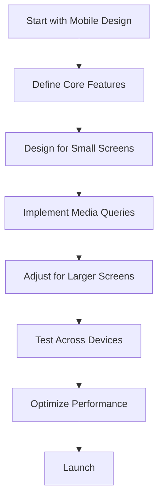

## 14.6 Responsive and Mobile-First Design

In today's digital landscape, users access websites from a myriad of devices, ranging from large desktop monitors to small mobile screens. As a result, creating a web page that looks great and functions well on all devices is crucial. This is where responsive and mobile-first design comes into play. In this section, we will explore the principles of mobile-first design, the effective use of media queries, optimizing resources for mobile, simplifying navigation, and ensuring touch-friendly elements.

### Understanding Mobile-First Design

Mobile-first design is a strategy where the design process begins with the smallest screen size and then scales up to larger screens. This approach ensures that the most critical features and content are prioritized for mobile users, who often make up a significant portion of web traffic.

#### Why Mobile-First?

1. **Growing Mobile Usage**: With the increasing number of users accessing the web via mobile devices, it's essential to cater to their needs first.
2. **Performance Optimization**: Designing for mobile first often leads to a leaner, more efficient website, as it forces developers to focus on essential features.
3. **Improved User Experience**: By prioritizing mobile users, you ensure that the core functionalities are accessible and user-friendly on smaller screens.

### Implementing Mobile-First Design

To implement a mobile-first design, start by designing your web page for the smallest screen size, typically around 320px wide. Once the mobile layout is complete, use CSS media queries to adjust the design for larger screens.

### Using Media Queries Effectively

Media queries are a cornerstone of responsive design. They allow you to apply different styles based on the characteristics of the user's device, such as screen width, height, orientation, and resolution.

#### Basic Syntax of Media Queries

Here's a simple example of a media query:

```css
/* Default styles for mobile */
body {
  font-size: 16px;
  background-color: #f0f0f0;
}

/* Styles for devices wider than 768px */
@media (min-width: 768px) {
  body {
    font-size: 18px;
    background-color: #ffffff;
  }
}
```

In this example, the default styles apply to all devices, but when the screen width is 768px or wider, the styles within the media query take effect.

#### Common Breakpoints

While there are no strict rules for breakpoints, the following are commonly used:

- **320px**: Small mobile devices
- **480px**: Larger mobile devices
- **768px**: Tablets
- **1024px**: Small desktops and laptops
- **1200px and above**: Large desktops

#### Tips for Using Media Queries

- **Start with Mobile Styles**: Define your default styles for the smallest screen size and use media queries to adjust for larger screens.
- **Use Relative Units**: Use relative units like `em` or `rem` for font sizes and `percentages` for widths to ensure scalability.
- **Test Across Devices**: Regularly test your design on different devices to ensure it looks and functions as intended.

### Optimizing Images and Resources for Mobile

Images and other media can significantly impact the performance of your website, especially on mobile devices with limited bandwidth. Here are some strategies to optimize them:

#### Use Responsive Images

Responsive images automatically adjust their size based on the device's screen size and resolution. The `srcset` attribute in the `` tag allows you to specify different image sources for different screen sizes.

```html

```

In this example, the browser will choose the most appropriate image based on the device's screen width.

#### Compress Images

Use tools like [TinyPNG](https://tinypng.com/) or [ImageOptim](https://imageoptim.com/) to compress images without losing quality. This reduces file sizes and improves loading times.

#### Lazy Load Images

Lazy loading defers the loading of images until they are needed, such as when the user scrolls to them. This can be achieved with JavaScript or the `loading="lazy"` attribute in the `` tag.

```html

```

#### Minimize Resource Requests

Reduce the number of HTTP requests by combining CSS and JavaScript files, using CSS sprites for icons, and leveraging browser caching.

### Simplifying Navigation and Layout for Smaller Screens

Navigation and layout are critical components of a responsive design. Here are some tips to simplify them for mobile users:

#### Use a Hamburger Menu

A hamburger menu is a popular solution for mobile navigation. It hides the menu items behind a button, saving space and reducing clutter.

```html
<!-- Hamburger Menu Icon -->
<div class="hamburger-menu">
  <span></span>
  <span></span>
  <span></span>
</div>

<!-- Navigation Menu -->
<nav class="mobile-nav">
  <ul>
    <li><a href="#">Home</a></li>
    <li><a href="#">About</a></li>
    <li><a href="#">Services</a></li>
    <li><a href="#">Contact</a></li>
  </ul>
</nav>
```

```css
/* Hamburger Menu Styles */
.hamburger-menu {
  display: block;
  cursor: pointer;
}

.hamburger-menu span {
  display: block;
  width: 25px;
  height: 3px;
  margin: 5px;
  background-color: #333;
}

/* Mobile Navigation Styles */
.mobile-nav {
  display: none;
}

.hamburger-menu.active + .mobile-nav {
  display: block;
}
```

#### Keep Layout Simple

Avoid complex layouts on mobile. Use a single-column layout to ensure content is easy to read and navigate.

#### Prioritize Content

Display the most important content first. Use collapsible sections or tabs to organize additional information without overwhelming the user.

### Ensuring Touch-Friendly Elements

Mobile users interact with websites using touch, so it's essential to design touch-friendly elements.

#### Increase Tap Targets

Make buttons and links large enough to be easily tapped. A minimum size of 44x44 pixels is recommended by Apple.

```css
button {
  padding: 10px 20px;
  font-size: 16px;
}
```

#### Use Touch Gestures

Incorporate touch gestures like swiping for carousels or pinch-to-zoom for images to enhance the user experience.

#### Avoid Hover-Only Interactions

Since hover effects don't work on touch devices, ensure that all interactive elements can be accessed with a tap.

### Try It Yourself

To practice responsive and mobile-first design, try creating a simple web page with a navigation menu, some text, and images. Use media queries to adjust the layout for different screen sizes. Experiment with different breakpoints and see how the design changes.

### Visual Aids

Below is a flowchart illustrating the mobile-first design process:



### Summary

Responsive and mobile-first design is crucial for creating websites that provide a great user experience across all devices. By starting with a mobile-first approach, using media queries effectively, optimizing images and resources, simplifying navigation, and ensuring touch-friendly elements, you can build a web page that is both functional and visually appealing on any device.

### Further Reading

- [MDN Web Docs: Responsive Design](https://developer.mozilla.org/en-US/docs/Learn/CSS/CSS_layout/Responsive_Design)
- [W3Schools: CSS Media Queries](https://www.w3schools.com/css/css_rwd_mediaqueries.asp)
- [Google Developers: Responsive Web Design Basics](https://developers.google.com/web/fundamentals/design-and-ux/responsive)

## Quiz Time!



### What is the primary goal of mobile-first design?

- [x] To prioritize the design and functionality for mobile users first.
- [ ] To create complex layouts for desktop users.
- [ ] To focus on desktop performance over mobile performance.
- [ ] To use only fixed-width layouts.

> **Explanation:** Mobile-first design focuses on designing for mobile devices first, ensuring that the core features and content are accessible to mobile users.

### Which CSS feature is essential for creating responsive designs?

- [x] Media Queries
- [ ] CSS Variables
- [ ] CSS Grid
- [ ] Flexbox

> **Explanation:** Media queries allow developers to apply different styles based on the device's characteristics, making them essential for responsive design.

### What is the recommended minimum size for touch targets on mobile devices?

- [x] 44x44 pixels
- [ ] 20x20 pixels
- [ ] 60x60 pixels
- [ ] 10x10 pixels

> **Explanation:** A minimum size of 44x44 pixels is recommended to ensure that touch targets are easily tappable on mobile devices.

### What attribute can be used to defer image loading until needed?

- [x] loading="lazy"
- [ ] srcset
- [ ] alt
- [ ] defer

> **Explanation:** The `loading="lazy"` attribute defers the loading of images until they are needed, improving performance.

### What is a common technique for simplifying navigation on mobile devices?

- [x] Using a hamburger menu
- [ ] Adding more links
- [ ] Using a fixed sidebar
- [ ] Creating a multi-column layout

> **Explanation:** A hamburger menu hides navigation items behind a button, simplifying navigation and reducing clutter on mobile devices.

### Which unit is recommended for scalable font sizes in responsive design?

- [x] em or rem
- [ ] px
- [ ] cm
- [ ] pt

> **Explanation:** Relative units like `em` or `rem` are recommended for scalable font sizes, ensuring better scalability across devices.

### What is the purpose of the `srcset` attribute in an `` tag?

- [x] To provide different image sources for different screen sizes.
- [ ] To define the image's alt text.
- [ ] To specify the image's dimensions.
- [ ] To apply CSS styles to the image.

> **Explanation:** The `srcset` attribute allows developers to specify different image sources for different screen sizes, enabling responsive images.

### Which of the following is NOT a common breakpoint for responsive design?

- [ ] 320px
- [ ] 768px
- [x] 900px
- [ ] 1024px

> **Explanation:** While breakpoints can vary, 900px is not a commonly used breakpoint compared to others like 320px, 768px, and 1024px.

### Why is it important to avoid hover-only interactions on mobile devices?

- [x] Because hover effects don't work on touch devices.
- [ ] Because they are too complex to implement.
- [ ] Because they slow down the website.
- [ ] Because they require additional JavaScript.

> **Explanation:** Hover effects don't work on touch devices, so it's important to ensure that all interactive elements can be accessed with a tap.

### True or False: Lazy loading images can improve website performance.

- [x] True
- [ ] False

> **Explanation:** Lazy loading images defers their loading until needed, reducing initial load times and improving website performance.


