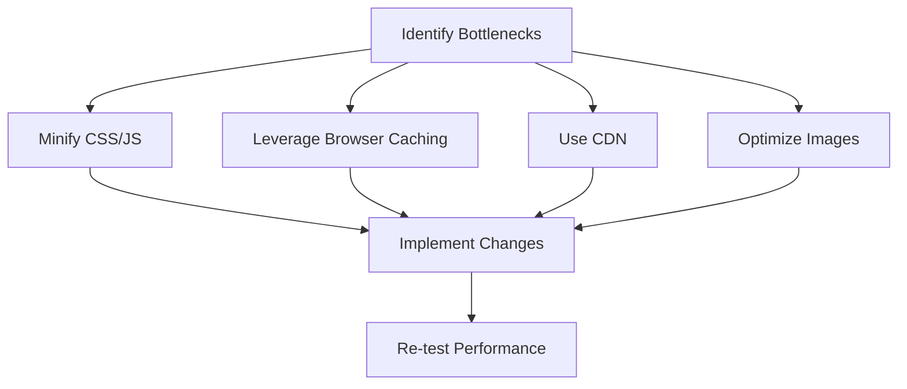

## 14.7 Optimizing Performance

In today's fast-paced digital world, users expect web pages to load quickly and respond seamlessly. Performance optimization is crucial for enhancing user experience, improving search engine rankings, and reducing bounce rates. In this section, we'll explore various techniques to optimize your web page's performance, focusing on minifying files, leveraging browser caching, using content delivery networks (CDNs), and optimizing images. Let's dive in!

### Minifying CSS and JavaScript Files

Minification is the process of removing unnecessary characters from code without affecting its functionality. This includes spaces, comments, and line breaks. Minifying your CSS and JavaScript files can significantly reduce file sizes, leading to faster load times.

#### Why Minify?

- **Reduced File Size**: Smaller files load faster, improving page speed.
- **Improved Performance**: Faster load times enhance user experience and can boost SEO rankings.
- **Bandwidth Savings**: Minified files consume less bandwidth, which is beneficial for users on limited data plans.

#### How to Minify

1. **Online Tools**: Use tools like [Minify](https://www.minifier.org/) or [CSS Minifier](https://cssminifier.com/) to manually minify your files.
2. **Build Tools**: Integrate minification into your build process using tools like Gulp, Webpack, or Grunt.
3. **Code Example**:

```javascript
// Original JavaScript
function greet(name) {
    console.log("Hello, " + name + "!");
}

// Minified JavaScript
function greet(n){console.log("Hello, "+n+"!");}
```

### Leveraging Browser Caching

Browser caching stores static files on a user's device, allowing subsequent visits to load faster by retrieving files from the local cache instead of the server.

#### Benefits of Browser Caching

- **Faster Load Times**: Cached files load instantly, reducing server requests.
- **Reduced Server Load**: Fewer requests mean less strain on your server.
- **Improved User Experience**: Faster pages lead to happier users.

#### Implementing Browser Caching

1. **Set Cache-Control Headers**: Define how long browsers should cache files. Example:

```plaintext
Cache-Control: max-age=31536000
```

2. **Use .htaccess (Apache Servers)**: Add caching rules to your `.htaccess` file.

```plaintext
<IfModule mod_expires.c>
    ExpiresActive On
    ExpiresByType image/jpg "access plus 1 year"
    ExpiresByType image/jpeg "access plus 1 year"
    ExpiresByType image/gif "access plus 1 year"
    ExpiresByType image/png "access plus 1 year"
    ExpiresByType text/css "access plus 1 month"
    ExpiresByType application/javascript "access plus 1 month"
</IfModule>
```

### Using Content Delivery Networks (CDNs)

CDNs distribute your content across multiple servers worldwide, ensuring users access the nearest server for faster load times.

#### Advantages of CDNs

- **Reduced Latency**: Content is delivered from the closest server, minimizing delay.
- **Increased Availability**: CDNs provide redundancy, ensuring your site stays online.
- **Scalability**: Handle traffic spikes without performance degradation.

#### Setting Up a CDN

1. **Choose a CDN Provider**: Popular options include Cloudflare, Amazon CloudFront, and Akamai.
2. **Configure Your Website**: Update your DNS settings to point to the CDN and configure your server to work with the CDN.

### Optimizing Images

Images often account for the largest portion of a web page's load time. Optimizing images can drastically improve performance.

#### Techniques for Image Optimization

1. **Compression**: Reduce file size without losing quality. Tools like [TinyPNG](https://tinypng.com/) and [ImageOptim](https://imageoptim.com/) are great for this.
2. **Correct Formats**: Use appropriate formats for different types of images. JPEG for photographs, PNG for images with transparency, and SVG for scalable graphics.
3. **Responsive Images**: Serve different image sizes based on the user's device using the `srcset` attribute.

#### Code Example

```html

```

### Auditing Performance Regularly

Regular performance audits help identify bottlenecks and areas for improvement. Use tools like Google PageSpeed Insights, Lighthouse, or WebPageTest to analyze your site's performance.

#### Steps for Performance Auditing

1. **Run Audits**: Use tools to get a detailed report on your site's performance.
2. **Analyze Results**: Identify areas that need improvement, such as large images or unoptimized scripts.
3. **Implement Changes**: Apply recommended optimizations and re-test to measure improvements.

### Try It Yourself

Experiment with the techniques discussed by applying them to a sample web page. Minify your CSS and JavaScript, set up browser caching, use a CDN, and optimize your images. Observe the impact on load times and responsiveness.

### Visual Aids

Below is a flowchart illustrating the process of optimizing web performance, from identifying bottlenecks to implementing solutions.



### Key Takeaways

- Minifying CSS and JavaScript reduces file size and improves load times.
- Leveraging browser caching speeds up subsequent visits by storing files locally.
- CDNs enhance performance by delivering content from the nearest server.
- Optimizing images through compression and correct formats is crucial for fast load times.
- Regular performance audits help maintain optimal performance.

### References and Links

- [MDN Web Docs on Minification](https://developer.mozilla.org/en-US/docs/Glossary/Minification)
- [Google PageSpeed Insights](https://developers.google.com/speed/pagespeed/insights/)
- [WebPageTest](https://www.webpagetest.org/)
- [TinyPNG for Image Compression](https://tinypng.com/)

## Quiz Time!



### What is the primary benefit of minifying CSS and JavaScript files?

- [x] Reduced file size and faster load times
- [ ] Improved readability of code
- [ ] Enhanced security
- [ ] Increased server load

> **Explanation:** Minifying files reduces their size, leading to faster load times and improved performance.

### How does browser caching improve performance?

- [x] By storing static files locally for faster access
- [ ] By increasing server requests
- [ ] By compressing files on the server
- [ ] By reducing the number of images

> **Explanation:** Browser caching stores files on the user's device, reducing the need to fetch them from the server on subsequent visits.

### What is a CDN?

- [x] A network of servers that deliver content based on user location
- [ ] A tool for compressing images
- [ ] A type of web browser
- [ ] A JavaScript library

> **Explanation:** A CDN is a network of servers that deliver content from the closest server to the user, reducing latency.

### Which image format is best for photographs?

- [x] JPEG
- [ ] PNG
- [ ] SVG
- [ ] GIF

> **Explanation:** JPEG is best for photographs due to its compression capabilities, which reduce file size while maintaining quality.

### What tool can you use to audit your web page's performance?

- [x] Google PageSpeed Insights
- [ ] Microsoft Word
- [ ] Adobe Photoshop
- [ ] Notepad

> **Explanation:** Google PageSpeed Insights is a tool that provides detailed performance reports and optimization suggestions.

### What is the purpose of the `srcset` attribute in an `` tag?

- [x] To serve different image sizes based on device
- [ ] To add a caption to the image
- [ ] To link to an external stylesheet
- [ ] To change the image format

> **Explanation:** The `srcset` attribute allows you to specify different image sizes for different devices, improving responsiveness.

### Which of the following is NOT a benefit of using a CDN?

- [ ] Reduced latency
- [ ] Increased availability
- [ ] Scalability
- [x] Increased file size

> **Explanation:** CDNs reduce latency, increase availability, and provide scalability, but they do not increase file size.

### What is the role of Cache-Control headers?

- [x] To define how long browsers should cache files
- [ ] To compress files on the server
- [ ] To minify JavaScript
- [ ] To optimize images

> **Explanation:** Cache-Control headers specify how long browsers should cache files, improving load times on subsequent visits.

### Why is it important to regularly audit your web page's performance?

- [x] To identify and fix performance bottlenecks
- [ ] To increase server load
- [ ] To reduce code readability
- [ ] To add more images

> **Explanation:** Regular audits help identify performance issues and areas for improvement, ensuring optimal performance.

### True or False: Minifying files can affect their functionality.

- [ ] True
- [x] False

> **Explanation:** Minifying files removes unnecessary characters without affecting functionality, improving performance without altering behavior.


