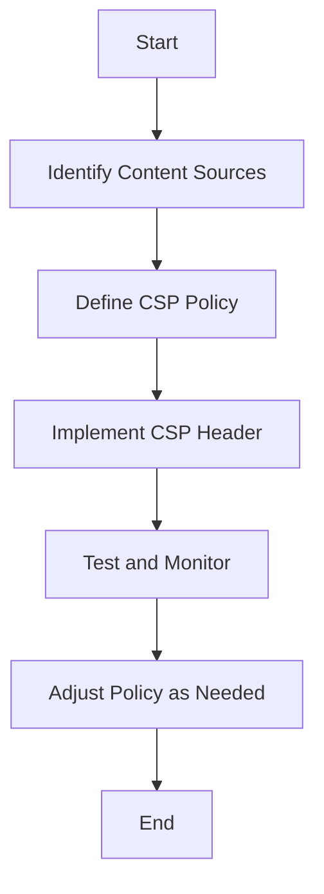

## 14.8 Security Considerations

In today's digital landscape, ensuring the security of your web applications is paramount. As you embark on creating your first web page with JavaScript, understanding and implementing security best practices will help protect your application from common vulnerabilities. This section will introduce you to some of the most prevalent security threats and provide actionable steps to safeguard your web applications.

### Understanding Common Security Threats

Before diving into best practices, it's crucial to understand the types of security threats that can affect web applications. Here are some of the most common:

#### 1. Cross-Site Scripting (XSS)

Cross-Site Scripting (XSS) is a vulnerability that allows attackers to inject malicious scripts into web pages viewed by other users. These scripts can steal user data, such as cookies, session tokens, or even manipulate the content of the page.

**Example of XSS Attack:**

```html
<!-- A vulnerable comment section -->
<form method="post" action="/submit-comment">
  <textarea name="comment"></textarea>
  <button type="submit">Submit</button>
</form>
```

If the application does not properly sanitize user input, an attacker could submit a comment like:

```html
<script>alert('XSS Attack!');</script>
```

When another user views this comment, the script executes, potentially compromising their data.

#### 2. Cross-Site Request Forgery (CSRF)

Cross-Site Request Forgery (CSRF) tricks a user into performing actions they did not intend to perform. This is often done by exploiting the user's authenticated session with a trusted site.

**Example of CSRF Attack:**

An attacker could create a malicious link that, when clicked by a logged-in user, performs an unwanted action on their behalf, such as changing their email address or making a purchase.

#### 3. Injection Attacks

Injection attacks occur when untrusted data is sent to an interpreter as part of a command or query. The most common type is SQL injection, where attackers can manipulate a database query to access unauthorized data.

**Example of SQL Injection:**

```javascript
// Vulnerable code
const userId = req.query.id;
const query = `SELECT * FROM users WHERE id = ${userId}`;

// If userId is set to '1; DROP TABLE users;', the query becomes:
// SELECT * FROM users WHERE id = 1; DROP TABLE users;
```

### Best Practices for Web Security

Now that we have an understanding of common threats, let's explore best practices to mitigate these risks.

#### Validating and Sanitizing User Input

One of the most effective ways to prevent XSS and injection attacks is by validating and sanitizing user input.

- **Validation** ensures that the input conforms to expected formats and types. For example, if a field expects a number, ensure that the input is numeric.
- **Sanitization** involves cleaning the input to remove any potentially harmful code.

**Example of Input Validation and Sanitization:**

```javascript
// Using a library like DOMPurify for sanitization
const DOMPurify = require('dompurify');

// Function to sanitize user input
function sanitizeInput(input) {
  return DOMPurify.sanitize(input);
}

// Example usage
const userInput = '<script>alert("XSS")</script>';
const safeInput = sanitizeInput(userInput);
console.log(safeInput); // Outputs: ""
```

#### Avoiding the Use of `eval()` and Other Risky Functions

The `eval()` function in JavaScript executes a string as code, which can be extremely dangerous if the string contains user input. Avoid using `eval()` and similar functions like `Function()` constructor, `setTimeout()`, and `setInterval()` with string arguments.

**Example of Risky `eval()` Usage:**

```javascript
// Dangerous usage of eval
const userCode = "alert('Hello, world!')";
eval(userCode); // Executes the alert

// Instead, use safer alternatives
const safeFunction = new Function('console.log("Hello, safe world!")');
safeFunction();
```

#### Implementing Content Security Policy (CSP) Headers

Content Security Policy (CSP) is a security feature that helps prevent XSS attacks by specifying which content sources are trusted. By implementing CSP headers, you can control which scripts, styles, and other resources can be loaded by your web page.

**Example of a Basic CSP Header:**

```http
Content-Security-Policy: default-src 'self'; script-src 'self' https://apis.google.com
```

This policy allows scripts to be loaded only from the same origin (`'self'`) and from `https://apis.google.com`.

#### Secure Practices for Handling Data and API Keys

When handling sensitive data and API keys, it's essential to follow secure practices to prevent unauthorized access.

- **Environment Variables:** Store API keys and sensitive data in environment variables instead of hardcoding them in your application.
- **HTTPS:** Always use HTTPS to encrypt data in transit, protecting it from eavesdropping and man-in-the-middle attacks.
- **Access Controls:** Implement proper access controls to ensure that only authorized users can access certain data or perform specific actions.

**Example of Using Environment Variables:**

```javascript
// Accessing an API key stored in an environment variable
const apiKey = process.env.API_KEY;

// Using the API key in a request
fetch(`https://api.example.com/data?api_key=${apiKey}`)
  .then(response => response.json())
  .then(data => console.log(data));
```

#### Staying Informed About Security Updates

The security landscape is constantly evolving, with new vulnerabilities and attack vectors emerging regularly. Staying informed about security updates and best practices is crucial for maintaining a secure web application.

- **Follow Security Blogs:** Subscribe to security blogs and newsletters to stay updated on the latest threats and solutions.
- **Update Dependencies:** Regularly update your libraries and frameworks to ensure you have the latest security patches.
- **Participate in Security Communities:** Engage with security communities to learn from others and share your knowledge.

### Visual Aids

To help visualize the concepts discussed, let's look at a flowchart demonstrating the process of implementing a Content Security Policy (CSP).



**Description:** This flowchart outlines the steps involved in implementing a Content Security Policy (CSP) to enhance web security.

### Try It Yourself

Now that you understand the importance of web security and some best practices, try implementing these concepts in your own projects. Here are a few exercises to get you started:

1. **Sanitize User Input:** Use a library like DOMPurify to sanitize user input in a simple form submission.
2. **Implement CSP:** Define and implement a basic Content Security Policy for a sample web page.
3. **Avoid `eval()`:** Refactor a piece of code that uses `eval()` to use safer alternatives.

### Key Takeaways

- **Understand Common Threats:** Familiarize yourself with common security threats like XSS, CSRF, and injection attacks.
- **Validate and Sanitize Input:** Always validate and sanitize user input to prevent malicious code execution.
- **Avoid Risky Functions:** Steer clear of using functions like `eval()` that can execute arbitrary code.
- **Implement CSP:** Use Content Security Policy headers to control which resources can be loaded by your web page.
- **Handle Data Securely:** Use environment variables for sensitive data and always use HTTPS.
- **Stay Informed:** Keep up with the latest security updates and best practices to protect your web applications.

By following these security considerations, you'll be well on your way to building secure and robust web applications. Remember, security is an ongoing process, and staying vigilant is key to protecting your users and your application.

## Quiz Time!



### What is a common vulnerability that allows attackers to inject malicious scripts into web pages?

- [x] Cross-Site Scripting (XSS)
- [ ] Cross-Site Request Forgery (CSRF)
- [ ] SQL Injection
- [ ] Man-in-the-Middle Attack

> **Explanation:** Cross-Site Scripting (XSS) allows attackers to inject malicious scripts into web pages viewed by other users.

### Which function in JavaScript should be avoided due to its ability to execute arbitrary code?

- [x] eval()
- [ ] parseInt()
- [ ] JSON.stringify()
- [ ] Math.random()

> **Explanation:** The `eval()` function should be avoided as it can execute arbitrary code, posing a security risk.

### What is the purpose of a Content Security Policy (CSP)?

- [x] To specify which content sources are trusted
- [ ] To encrypt data in transit
- [ ] To validate user input
- [ ] To store API keys securely

> **Explanation:** A Content Security Policy (CSP) specifies which content sources are trusted, helping to prevent XSS attacks.

### How can sensitive data like API keys be securely stored in a web application?

- [x] Using environment variables
- [ ] Hardcoding them in the application
- [ ] Storing them in cookies
- [ ] Embedding them in HTML comments

> **Explanation:** Sensitive data like API keys should be stored in environment variables to prevent unauthorized access.

### What is a common attack that tricks a user into performing actions they did not intend to perform?

- [x] Cross-Site Request Forgery (CSRF)
- [ ] Cross-Site Scripting (XSS)
- [ ] SQL Injection
- [ ] Phishing

> **Explanation:** Cross-Site Request Forgery (CSRF) tricks a user into performing actions they did not intend to perform.

### Which of the following is a best practice for handling user input?

- [x] Validating and sanitizing input
- [ ] Using eval() to process input
- [ ] Storing input in cookies
- [ ] Ignoring input validation

> **Explanation:** Validating and sanitizing input is a best practice to prevent malicious code execution.

### What is a key benefit of using HTTPS for web applications?

- [x] Encrypts data in transit
- [ ] Speeds up page load times
- [ ] Increases search engine rankings
- [ ] Reduces server load

> **Explanation:** HTTPS encrypts data in transit, protecting it from eavesdropping and man-in-the-middle attacks.

### Which of the following is NOT a recommended practice for web security?

- [ ] Regularly updating dependencies
- [x] Hardcoding sensitive data
- [ ] Implementing access controls
- [ ] Following security blogs

> **Explanation:** Hardcoding sensitive data is not recommended as it can lead to unauthorized access.

### What is SQL Injection?

- [x] A type of attack where untrusted data is sent to an interpreter as part of a command or query
- [ ] A method for encrypting SQL queries
- [ ] A technique for optimizing database performance
- [ ] A way to validate user input

> **Explanation:** SQL Injection is a type of attack where untrusted data is sent to an interpreter as part of a command or query.

### True or False: Staying informed about security updates is unnecessary once your web application is deployed.

- [ ] True
- [x] False

> **Explanation:** Staying informed about security updates is crucial even after deployment to protect against new vulnerabilities.


